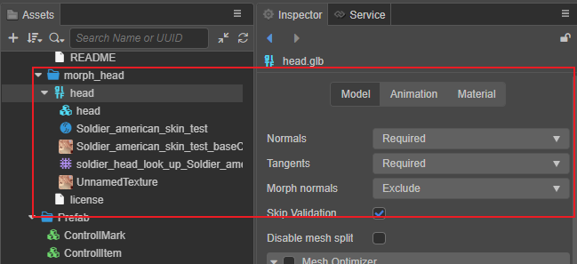

# 变形动画（Morph）

[^1]

变形动画是一种通过对模型顶点进行变形，从而实现动画效果的技术。通常在处理角色面部表情变化时，会使用变形动画。

## 资源导入

通常变形动画由外部工具（3DMax、Blender、Maya 等）制作，并导入引擎使用。导入方式请参考 [模型资源 - 模型导入](../asset/model/mesh.md#%E6%A8%A1%E5%9E%8B%E5%AF%BC%E5%85%A5)。



## 接口和说明

如要使用变形动画，请确保导入的资源拥有中变形动画数据。这些数据存储在网格数据中，可通过下列代码获取：

```ts
const meshRenderer = this.node.getComponent(MeshRenderer)!;
const morph = meshRenderer.mesh.struct.morph;
```

如果要改变变形动画的状态，可通过 [setWeight](%__APIDOC__%/zh/class/MeshRenderer?id=setWeight) 可以修改动画的权重。代码示例如下：

```ts
const meshRenderer = this.node.getComponent(MeshRenderer);
meshRenderer.setWeight(weight, subMeshIndex, shapIndex);
```

其接口和参数说明如下：

| 参数 | 类型 | 说明 |
| :-- | :-- | :-- |
| weight | number | 变形的权重
| subMeshIndex | number | 子网格的索引 |
| shapIndex | number | 子网格的变形索引 |

通过 [getWeight](%__APIDOC__%/zh/class/MeshRenderer?id=getWeight) 可以获取外形的权重，以及通过 [setWeights](__APIDOC__/zh/class/MeshRenderer?id=setWeights) 可以同时改变多个子网格的权重。

更多接口说明请参考 [MeshRenderer](%__APIDOC__%/zh/class/MeshRenderer?id=setWeight)。

## 着色器

当检测到网格资源内持有变形数据时，引擎会重设着色器 `CC_USE_MORPH` 的值为 `true`。如需自定义着色器，请确保着色持有 `CC_USE_MORPH` 预编译宏定义。

## 程序化使用范例

使用方式可参考范例 **Morph**（[GitHub](https://github.com/cocos/cocos-test-projects/tree/v3.8/assets/cases/animation/morph) | [Gitee](https://gitee.com/mirrors_cocos-creator/test-cases-3d/tree/v3.8/assets/cases/animation/morph)）。

[^1]: 模型来自 [https://sketchfab.com/](https://sketchfab.com/3d-models/head-expressions-86e58ee1bda5406480e30c796e1a2df4)
