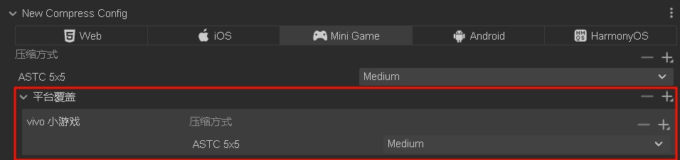

# 压缩纹理

Cocos Creator 可以直接在编辑器中设置纹理需要的压缩方式，然后在项目发布时自动对纹理进行压缩。支持同一平台同时导出多种图片格式，引擎将根据设备对压缩纹理格式的支持情况加载合适的压缩纹理。

## 压缩纹理的优势

* 对于 png、jpg、webp 等压缩纹理
    - 通过配置压缩纹理能够在构建项目时压缩纹理像素数据减少资源体积，提高游戏的资源下载速度。
* 对于 astc、etc1、etc2、pvrtc 等 GPU 压缩纹理
    - 通过配置压缩纹理能够在构建项目时将纹理像素数据转化为GPU专用的压缩格式，这些格式可以直接在GPU内存中使用，无需运行时解压，从而显著减少内存占用、降低带宽需求，提高游戏的渲染性能和加载速度。

> **注意**：
> * png、jpg、webp 等非 GPU 压缩纹理格式的图片资源，在压缩图片质量后并不能减少解码图片资源的时间以及减少游戏的内存。
> * 压缩 png、jpg、webp 等格式图片使用的是 [sharp](https://github.com/lovell/sharp) 开源库，它的压缩率稍低于 [tinypng](https://tinypng.com/) 并且可能出现压缩后图片更大的情况，如果你需要优化此问题，建议使用 [自定义纹理压缩](../editor/publish/custom-build-plugin.md#自定义纹理压缩处理) 自行解决此问题。

## 压缩纹理支持

Cocos Creator 支持加载多种格式的图片（具体见下表）。

| 图片格式 | Android | iOS | 小游戏 | Web  | Windows | Mac
| :------ | :------ | :------ | :----- | :------ | :----- | :------ |
| PNG | 支持 | 支持   | 支持 | 支持 | 支持 | 支持 |
| JPG | 支持 | 支持 | 支持 | 支持 | 支持 | 支持 |
| WEBP | Android 4.0 以上原生支持，其他版本可以使用 [解析库](https://github.com/alexey-pelykh/webp-android-backport) | 可以使用 [解析库](https://github.com/carsonmcdonald/WebP-iOS-example) | 支持 | [部分支持](https://caniuse.com/#feat=webp) | 不支持 | 不支持 |
| PVR | 不支持 | 支持 | 支持 iOS 设备 | 支持 iOS 设备 | 不支持 | 不支持 |
| ETC1 | 支持 | 不支持 | 支持 Android 设备 | 支持 Android 设备 | 不支持 | 不支持 |
| ETC2 | 部分支持，取决于手机硬件 | 不支持 | 不支持 | 支持部分 Android 设备 | 不支持 | 不支持 |
| ASTC | 支持(Android 5.0+)  | 支持(iOS 9.0+/iPhone6+) | 微信、抖音、阿里、淘宝等平台支持，详情请看[各平台压缩纹理支持详情](#各移动平台压缩纹理支持详情)。注：开发者工具不支持，需真机调试 | 部分支持 | 不支持 | 不支持 |

### 各移动平台压缩纹理支持详情

除全平台支持的 `JPG` 和 `PNG` 外，其他纹理压缩格式的支持情况如下：

| 平台名称          | 支持的压缩格式 |
| :---------------- | :------------------- |
| Web Mobile        | ASTC / ETC1 / ETC2 / PVR / WEBP |
| WeChat Mini Game  | ASTC / ETC1 / ETC2 / PVR    |
| ByteDance Mini Game | ASTC / ETC1 / ETC2 / PVR  |
| AliPay Mini Game  | ASTC / ETC1 / PVR           |
| TaoBao Mini Game  | ASTC / ETC1 / PVR           |
| OPPO Mini Game    | ETC1                        |
| vivo Mini Game    | ETC1 / ASTC                 |
| Huawei Quick Game | ETC1                        |
| Xiaomi Quick Game | ETC1                        |
| iOS               | ASTC / ETC1 / ETC2 / PVR / WEBP |
| Android / Huawei AGC | ASTC / ETC1 / ETC2 / WEBP |

**注意**：目前小游戏平台的通用配置中添加 astc 压缩纹理暂时不支持 vivo 小游戏平台，但是可以使用 [平台覆盖配置](#平台覆盖配置) 让 vivo 小游戏平台也能打包出 astc 压缩纹理。

## 关于 ASTC

对于需要 GPU 压缩纹理格式的项目，推荐使用 ASTC 压缩格式，因为它压缩率高并且质量也更好，同时还支持 HDR 贴图。ASTC 于 2012 年发布，距今已经 12 年，在移动端已接近 100% 的支持率。

对于画质要求较高的游戏，可以选择 2D 元素、UI 使用 astc 5x5，模型纹理使用 astc 6x6。

对于画质要求较低的游戏，可以选择 2D 元素、UI 使用 6x6，模型纹理使用 8x8。

## 压缩纹理配置

在未配置压缩纹理的情况下项目构建时输出的是原始图片，如果需要对项目中的图片资源或者自动图集产生的大图进行压缩，可以在 **资源管理器** 中选中这张图片或自动图集，然后在 **属性检查器** 中勾选 `useCompressTexture`，再在 `presetId` 中选择图片的纹理压缩预设，设置完成后点击右上角的绿色打钩按钮，之后项目构建后该图片资源就会变成压缩纹理资源。

配置压缩纹理预设时默认使用平台通用配置，此配置会根据构建打包的平台是否支持配置中的压缩纹理格式而停止生成此格式的压缩纹理。

`presetId` 中提供了编辑器的默认压缩纹理预设，不支持编辑。若需要自定义预设，则点击 `presetId` 旁边的 **编辑预设** 按钮即可前往 [项目设置 -> 压缩纹理](../editor/project/index.md#压缩纹理) 面板进行设置。

图片资源上的压缩纹理选项将会存储在资源 meta 文件内，其中 `presetId` 是选择的压缩纹理预设的 ID。图片较多的项目可以通过插件或者脚本的方式批量管理图片压缩所使用的 `presetId`。

**注意**：
配置了压缩纹理后，只有对应格式的图片会在构建时生成，若有些图片格式在部分设备上不支持就会导致显示异常。为避免该问题，在添加纹理压缩预设时，请额外选择一些通用图片格式（例如 PNG、JPG）作为默认图。

## 平台覆盖配置
在配置小游戏平台的压缩纹理预设时，如果开发者需要忽视内部规则确保构建时生成所配置的压缩纹理资源，则需要添加平台覆盖配置。

## 压缩纹理详解

Cocos Creator 3.0 在构建图片的时候，会查找当前图片是否进行了压缩纹理的配置，如果没有，则最后按原图输出。

如果查找到了压缩纹理的配置，那么会按照找到的配置对图片进行纹理压缩。项目设置里压缩纹理配置是按照平台大类划分的，具体到实际平台的支持程度会有一些差异。构建将会根据 **实际构建平台** 以及当前 **图片纹理的透明通道** 情况来对配置的纹理格式做一定的剔除和优先级选择，关于这块规则可以参考下文的示例来理解。

这些生成的图片不会都被加载到引擎中，引擎会根据 [macro.SUPPORT_TEXTURE_FORMATS](%__APIDOC__%/zh/interface/Macro?id=SUPPORT_TEXTURE_FORMATS) 中的配置来选择加载合适格式的图片。`macro.SUPPORT_TEXTURE_FORMATS` 列举了当前平台支持的所有图片格式，引擎加载图片时会从生成的图片中找到在这个列表中 **优先级靠前**（即排列靠前）的格式来加载。

开发者可以通过修改 `macro.SUPPORT_TEXTURE_FORMATS` 来自定义平台的图片资源支持情况以及加载顺序的优先级。

## 智能剔除

### 示例一

如上图所示，对于 MiniGame 平台的压缩纹理预设，假如 **构建的是华为快游戏这类仅在安卓设备上运行的，构建时将不会打包出 PVR 的纹理格式**。更多的平台剔除细则可以参考文末的 [各平台压缩纹理支持详情](#各移动平台压缩纹理支持详情)。

### 示例二

在上面的示例图中，ETC1 和 PVR 类型都 **同时配置了 RGB 和 RGBA 两种类型的纹理格式，这种情况下构建将会根据当前图片的是否带有透明通道来优先选择其中一种格式**。示例图中的图片是带透明通道的，则此时构建将只会打包出带有 REGA 类型的压缩纹理格式。当然这种剔除只有同时存在时才会，假如配置里只有 RGB 的图片格式，即便当前图片是带透明通道的也会正常打包出来。

## 自定义构建纹理压缩处理

纹理压缩目前是在构建后生效，编辑器自带了一套处理工具。若需要自定义压缩工具，请参考 [自定义纹理压缩](../editor/publish/custom-build-plugin.md#%E8%87%AA%E5%AE%9A%E4%B9%89%E7%BA%B9%E7%90%86%E5%8E%8B%E7%BC%A9%E5%A4%84%E7%90%86)。
