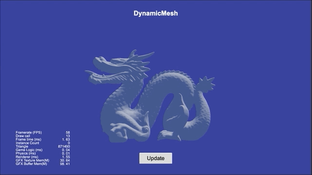

# 程序化创建网格

当由 DCC（Digital Content Creation）软件制作或引擎内的地形编辑器制作的模型无法满足需求时，可以通过 API 来创建网格。如需要在运行时创建某种可以生长的蛇、动态编辑模型或实现某些曲面，都可以通过程序化来创建网格。

## 创建网格

引擎支持两种网格：**静态网格** 和 **动态网格**，适用于不同的场景，开发者可按需使用。

- 静态网格，通过 `utils.MeshUtils.createMesh` 创建，一旦创建成功，网格内的几何体不可编辑的。
- 动态网格：通过 `utils.MeshUtils.createDynamicMesh` 创建，创建成功后，网格内的几何体仍然可以修改。

返回值为 `Mesh` 组件，因此我们方便的将其赋值给 `MeshRenderer` 的 `mesh` 属性，如此即可将其显示在屏幕上。

## API

API 请参考 [MeshUtils](__APIDOC__/zh/class/utils.MeshUtils)。

## 范例

动态网格的范例请参考 [GitHub](https://github.com/cocos/cocos-test-projects/tree/v3.8)。
