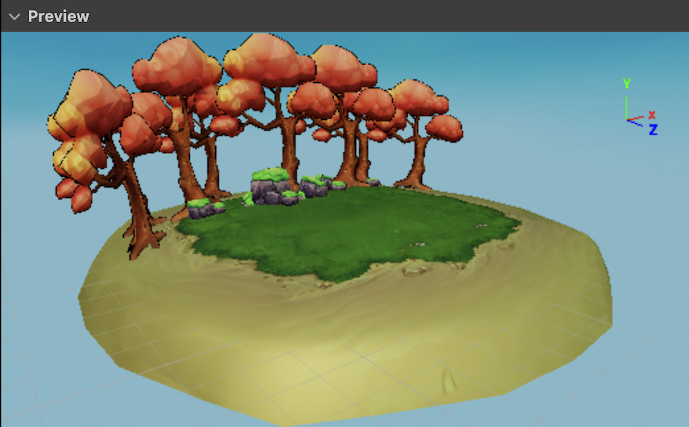

# 预制件（Prefab）

预制件用于存储一些可以复用的场景对象，它可以包含节点、组件以及组件上的数据。由预制件生成的实例既可以继承模板的数据，又可以有自己定制化的数据修改。

## 基础概念

| 名称  | 说明  | 示例 |
| :--- | :--- | :--- |
| 预制件资源      | 在 **资源管理器** 中的预制件资源，是预制件的序列化文件。|  |
| 预制件实例      | 预制件资源被拖拽到 **层级管理器** 中就会生成一个预制件实例，它的根节点目前标记为暗绿色，它的子节点为亮绿色 |  |
| 预制件编辑模式   | 双击预制件资源，会进入预制件的编辑模式，此时所有的非嵌套预制件节点都显示为亮绿色。可点击 **场景编辑器** 左上方的按钮来 **保存** 修改或者 **关闭** 编辑模式 |  |
| 嵌套的预制件实例 | 一个预制件资源中的某个子节点是另一个预制件资源的实例，则这个子预制件实例就是一个嵌套的预制件实例 |  |

## 创建预制件

创建预制件有两种方法：

1. 在场景中将节点编辑好之后，直接将节点从 **层级管理器** 拖到 **资源管理器** 中即可完成预制件资源的创建。

2. 点击 **资源管理器** 左上方的 **+** 按钮，或者点击面板空白处，然后选择 **Node Prefab** 即可。（v3.1.1 新增）

    

创建完成后，原节点自动变为该预制件的实例，根节点呈现 **亮绿色**，非嵌套预制件子节点呈现 **暗绿色**。

## v3.4.1 预制体更新说明

在 v3.4.1 中我们对预制体资源增加了 **Persistent** 选项。该选项目前为引擎预留，开发者不必关心。其说明如下：

| 属性  | 说明 | 默认值 | 可选项 |
| :--- | :--- | :--- | :--- |
| **Persistent** | 标记该预制体是否需要同步 | **false** | true, false |

## 预览

在 v3.8.5 中，我们在 Prefab 的属性查看器面板中，添加了预览支持。用户选中某个预制体后，就可以在面板中看到 Prefab 的渲染内容，能够极大地提升资源检查效率。

## 使用预制件

将预制件资源从 **资源管理器** 拖拽到 **层级管理器** 或 **场景编辑器**，即可在场景中生成一个预制件的实例。 
场景中的预制件实例对象，数据源来自预制件资源的反序列化，所以它的数据默认同步了预制件资源，如果对预制件实例中的各项属性进行修改，修改的数据会被存储在预制件实例中，所以不会影响到预制件资源和它生成的其它预制件实例的数据。

## 进入预制件编辑模式

在 **资源管理器** 中双击预制件资源可从场景编辑模式切换到预制件编辑模式。

此时可以在编辑器中编辑预制件资源，编辑完成之后，点击场景编辑器中的 **保存** 按钮即可保存编辑后的预制件资源，之后点击 **关闭** 按钮即可返回场景编辑模式。

> **注意**：请尽量避免多人同时修改同一个 Prefab 资源，否则可能会导致冲突，且无法通过 `git` 合并解决冲突。

## 预制件节点的状态

预制件节点在 **属性检查器** 中呈现 **绿色** 时表示与资源关联正常；呈现 **红色** 则表示关联的资源丢失。

## 场景中编辑预制件节点

### 通用操作

在 **层级管理器** 中选中预制件节点，**属性检查器** 的顶部便会出现几个可操作的按钮：

| 按钮图标  | 说明 |
| :--- | :--- |
|  | 还原为普通节点。预制件节点可变为普通节点，即完全脱离和资源的关系。还可以通过点击 Creator 顶部菜单栏中的 **节点 -> 取消关联当前的 Prefab 资源** 来实现。v3.4 支持批量取消关联。 |
|  | 定位资源。便于快速在 **资源管理器** 中定位到预制件资源。 |
|  | 从资源还原。将当前预制件实例的数据还原为预制件资源中的数据，其中名字、位置和旋转不会被还原为预制件资源中的数据。 |
|    | 更新到资源。将当前预制件实例的所有数据更新到所关联的预制件资源中。 |

### 新增节点

在预制件实例下增加的新节点，在节点名字的右下角会有一个 **+** 标志，它的数据存储在预制件的实例下，所以不会影响关联的预制件资源的数据。

### 新增组件

在预制件实例下增加的新组件，在组件名字的后面会有一个 **+** 标志，它的数据存储在预制件的实例下，所以不会影响关联的预制件资源的数据。

### 删除组件

在预制件实例下删除 **非预制件实例下新增的组件**，会在 **属性检查器** 上增加一条删除的组件的数据，它的数据存储在预制件的实例下，所以不会影响关联的预制件资源的数据。

同时会在这条数据后面出现以下两个按钮：

| 按钮图标  | 功能说明 |
| :--- | :--- |
|  | 还原该删除的组件 |
|    | 将该删除的组件在预制件资源中同步删除 |

## 目前的一些限制

- 不允许在预制件实例中删除从预制件资源中创建的节点
- 不允许在预制件实例中更改从预制件资源中创建的节点的层级关系
- 不允许预制件嵌套自己
