# 瓦片图资源（TiledMap）
## 制作瓦片贴图需要的素材
一般需要制作成图集，可以使用[TexturePacker](https://www.codeandweb.com/texturepacker)工具。
- 把素材添加到工具中，如下图：
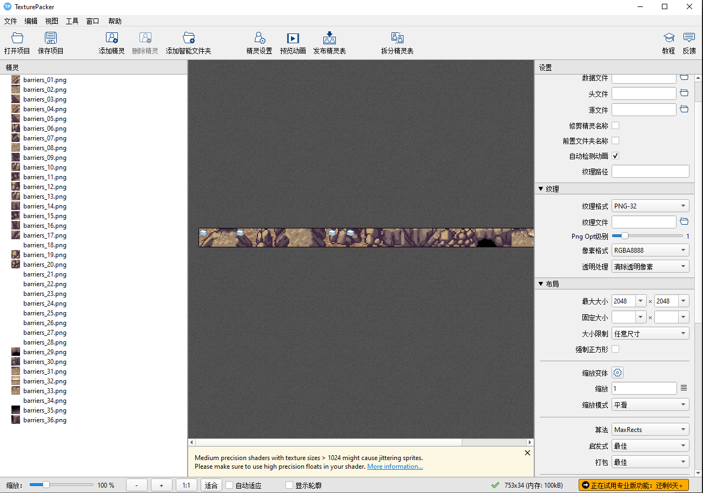
- 整理导出的图集布局，并设置
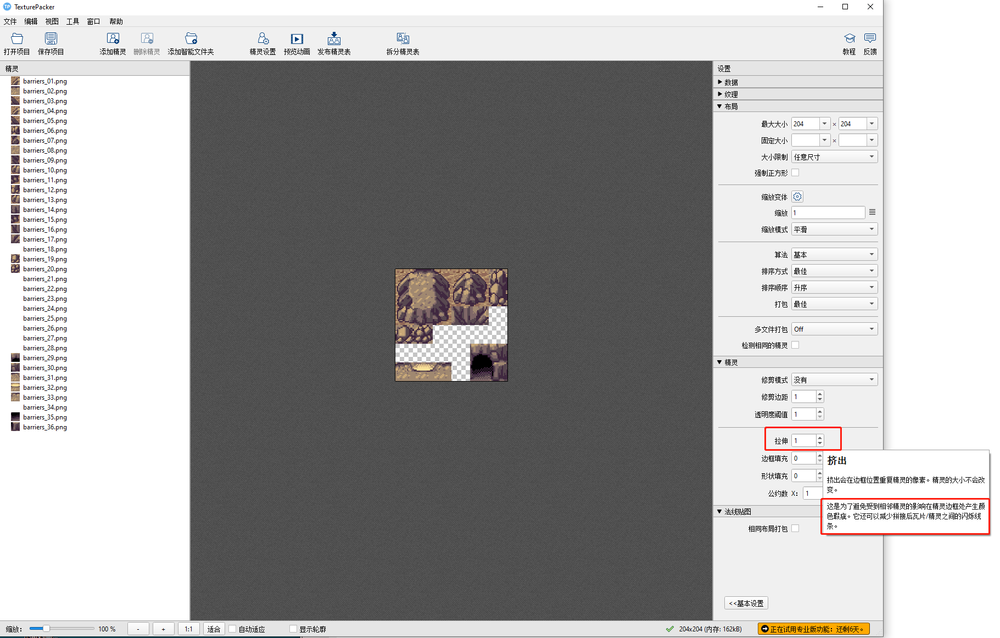
**这里需要拉伸1像素，因为相邻的两个纹理如果不拉伸一个像素，使用的时候会出现边缘异常**
- 发布精灵设置保存路径即可
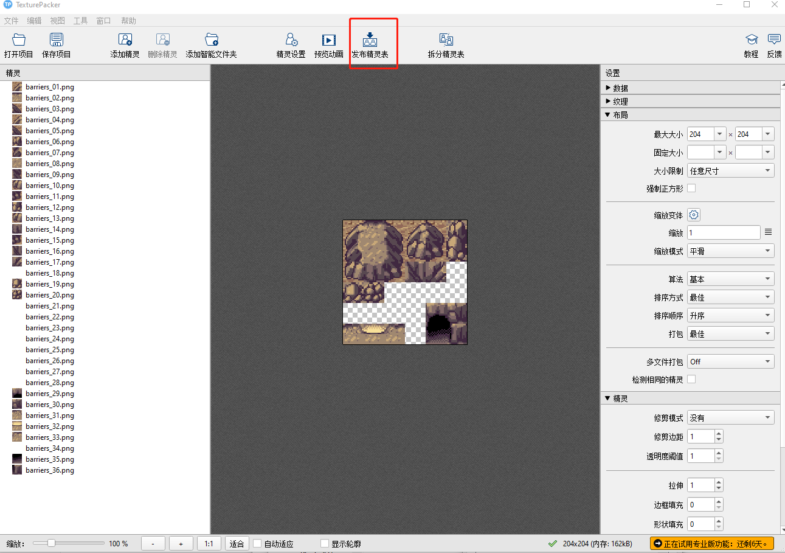

## 使用tiled创建与编辑地图
瓦片图资源是由 [Tiled 编辑器](https://www.mapeditor.org/) 所导出的数据格式。

| Creator 版本  | Tiled 版本 |
| :----------  | :-------- |
| v3.0 及以上   | v1.4   |
| v2.2 及以上   | v1.2.0 |
| v2.1 及以下   | v1.0.0 |

- 创建地图块

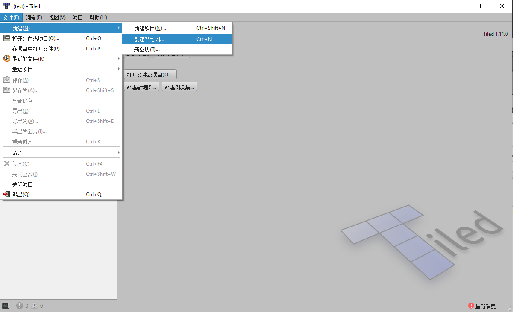
- 设置地图块大小

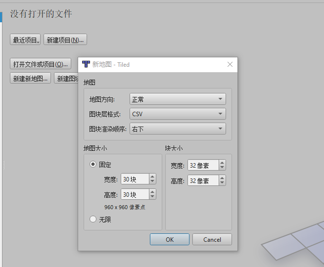
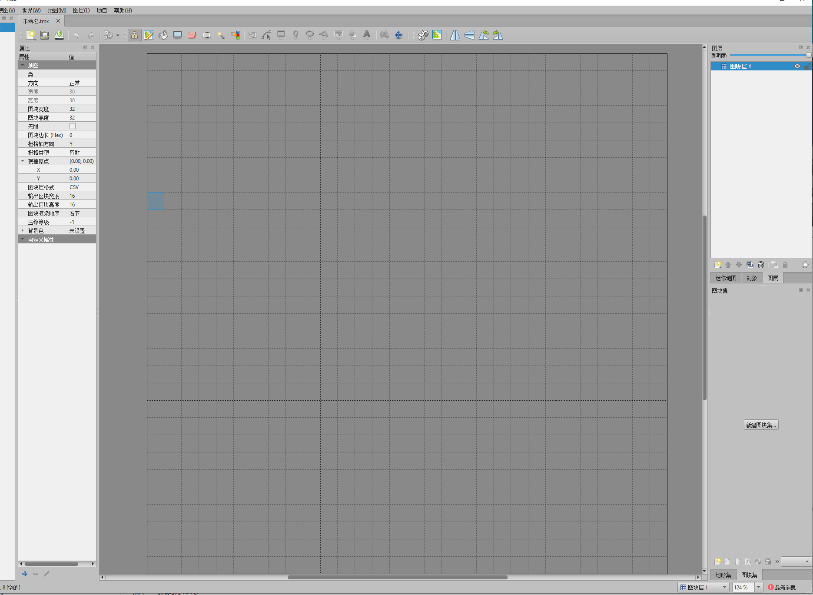

- 新建图集块

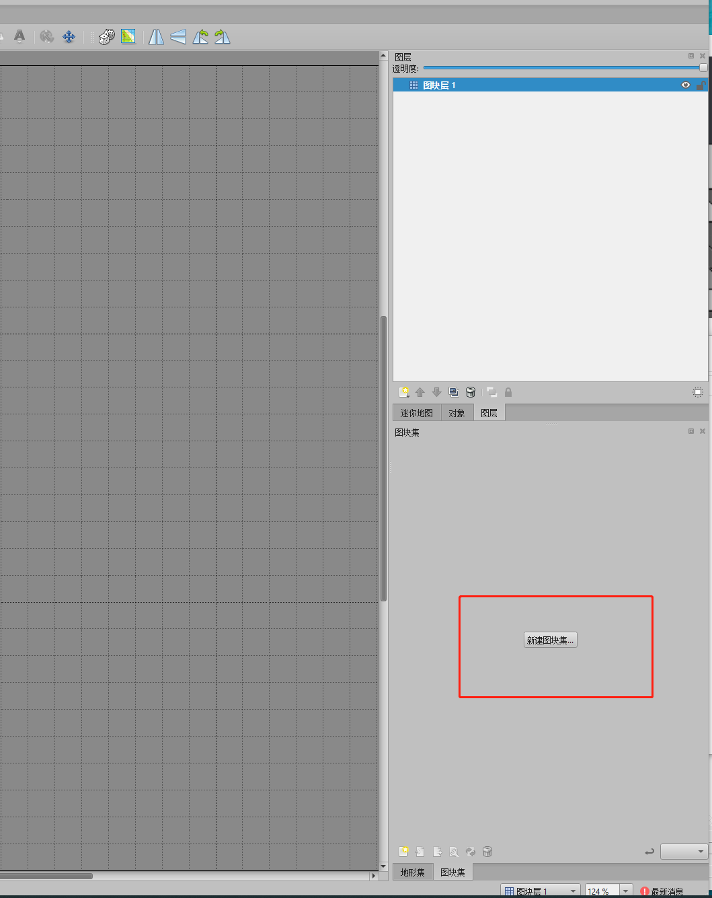

- 选择使用上面texturepacker制作的图集

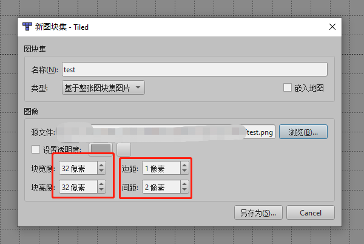

**这里需要选择的是拉伸后的大小**

- 编辑图集
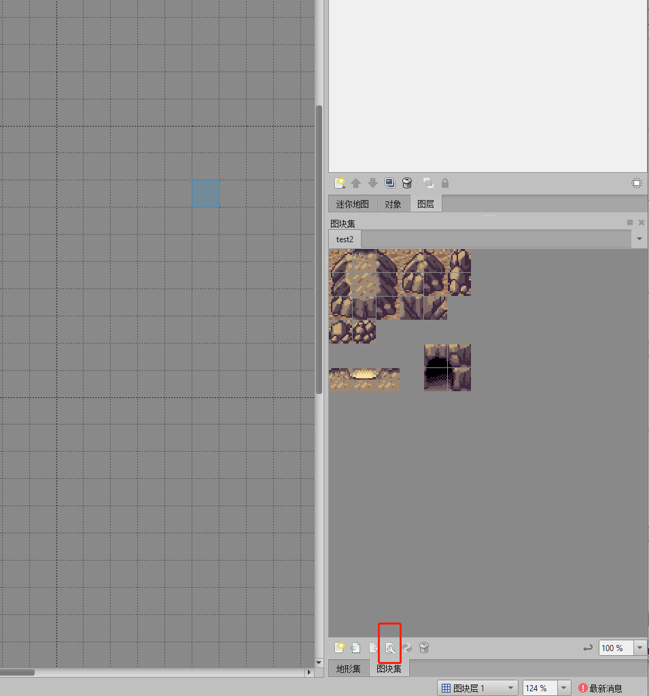
- 设置偏移，因为使用texturepacker之后，图集是偏移过的，因此需要进行偏移。
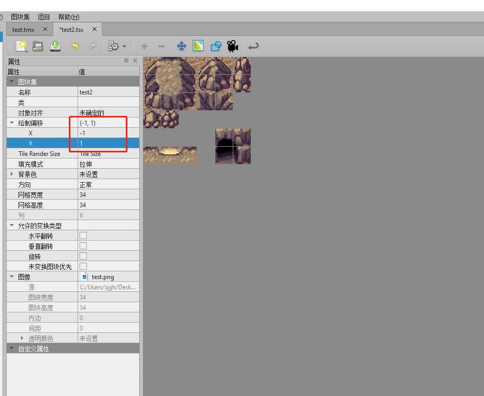

- 绘制，因为偏移过的，所以绘制时，上下左右都超出1像素是正常的，例如下图
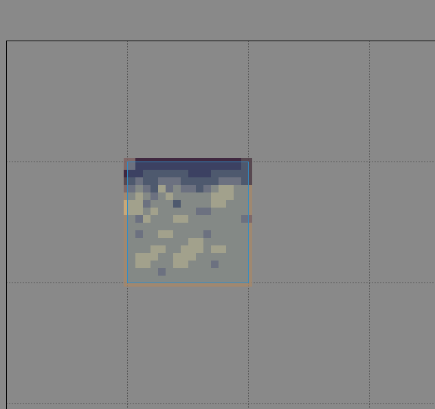

- 完成地图，如下图：
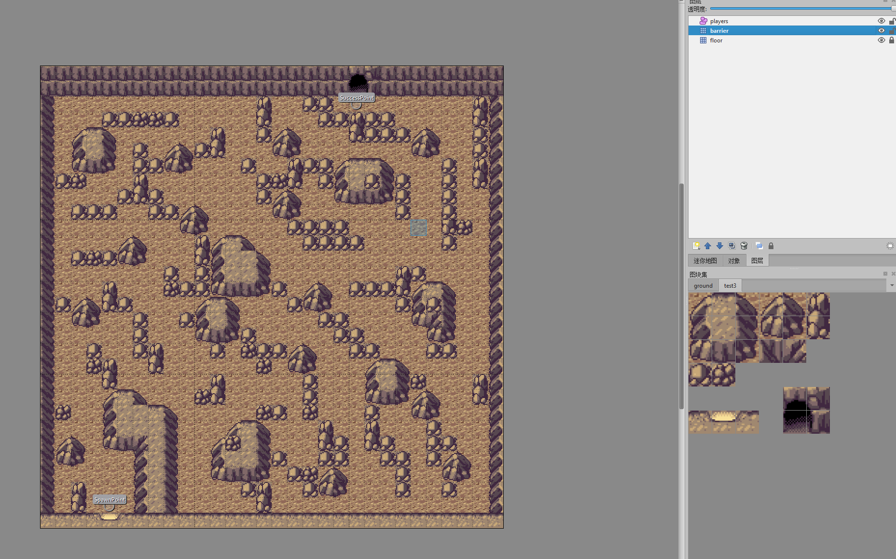

- 保存tmx文件

## 导入地图资源

地图所需资源有：

- `.tmx` 地图数据
- `.png` 图集纹理
- `.tsx` tileset 数据配置文件（部分 tmx 文件需要）

    

## 创建瓦片图资源

从 **资源管理器** 里将地图资源拖动到已创建 TiledMap 组件的 Tmx File 属性中：

## 在项目中的存放

为了提高资源管理效率，建议将导入的 `tmx`、`tsx` 和 `png` 文件存放在单独的目录下，不要和其他资源混在一起。需要注意的是要把 `tmx` 文件和 `tsx` 文件放在同一目录管理，否则可能会导致资源无法被正确加载。

### 注意事项
如果在texturepacker不设置拉伸，则效果会有偏差。如下图：
不使用拉伸，效果如下图：

使用拉伸，效果如下图：
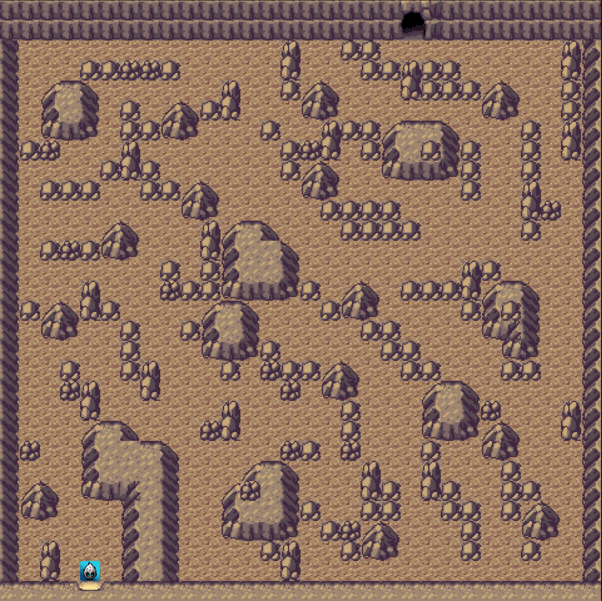