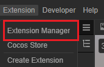
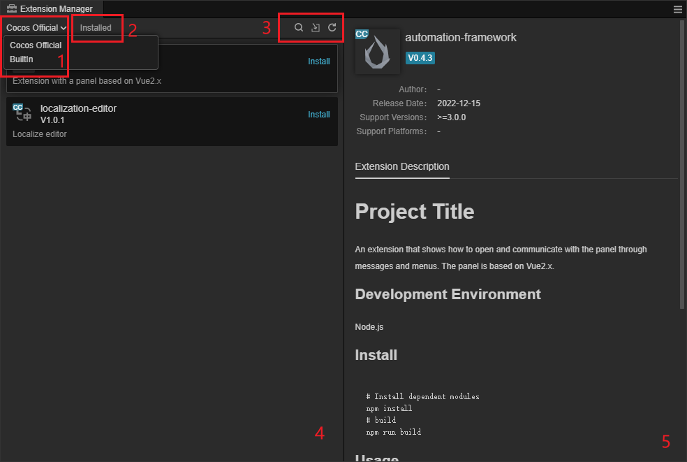

# 扩展管理器面板

**扩展管理器** 用于管理编辑器内的扩展。点击 Cocos Creator 顶部菜单栏中的 **扩展 -> 扩展管理器** 即可打开：

扩展管理器面板如下：

其相关功能说明如下：

1. 扩展类型，分为 **Cocos 官方** 以及 **内置**，通过下拉菜单选择。
2. 已安装，点击后展示目前已安装的扩展。
3. 从左到右依次为 **搜索**、**导入** 和 **刷新**
    - **搜索**：点击后可在下图所示的输入框内通过关键字查找当前项目内的扩展：
        
    - **导入**：点击后通过 zip 压缩文件导入新的扩展
    - **刷新**： 刷新当前所有扩展的状态
4. 扩展列表：

    

    对于每一个扩展，左侧显示的是扩展名称、图标、版本号以及描述。
    右侧的按钮分别为：
      - **打开扩展所在目录**
      - **删除** 该扩展
      - **启用/禁用** 该扩展
    内置和官方扩展无法删除和禁用，部分按钮需要将鼠标移动到该条目才可见。
5. 扩展的详细信息
