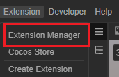
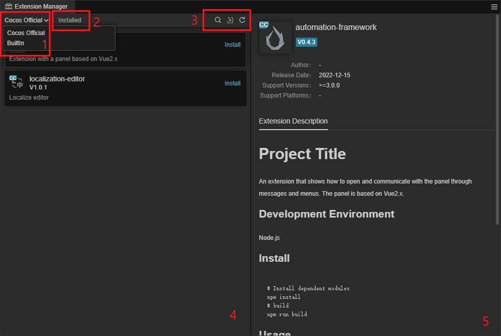
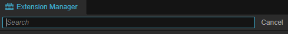

# 扩展管理器面板

**扩展管理器** 用于管理编辑器内的扩展。点击 Cocos Creator 顶部菜单栏中的 **扩展 -> 扩展管理器** 即可打开：



扩展管理器面板如下：



## 相关功能说明

1. 扩展类型，分为 **Cocos 官方** 以及 **内置**，通过下拉菜单选择。
2. 已安装，点击后展示目前已安装的扩展。
3. 从左到右依次为 **搜索**、**导入** 和 **刷新**
    - **搜索**：点击后可在下图所示的输入框内通过关键字查找当前项目内的扩展：
        
    - **导入**：点击后通过 zip 压缩文件导入新的扩展
    - **刷新**： 刷新当前所有扩展的状态
4. 扩展列表：

    

    对于每一个扩展，左侧显示的是扩展名称、图标、版本号以及描述。
    右侧的按钮分别为：
      - **打开扩展所在目录**
      - **删除** 该扩展
      - **启用/禁用** 该扩展
    内置和官方扩展无法删除和禁用，部分按钮需要将鼠标移动到该条目才可见。
5. 扩展的详细信息

## 导入方式

- **导入扩展文件夹**：选择这种导入方式，需要将扩展拷贝到项目的 extensions 目录。
- **开发者导入**：选择这种导入方式后，扩展会以软链方式被引用，不需要拷贝到 extensions 目录，方便开发者进行项目管理。

## 手动配置按编辑器版本共享的扩展

在 Cocos Creator **3.8.6、3.8.8** 中，可以将扩展放在用户目录下的版本目录中，供本机使用**相同编辑器版本**的多个项目共用。扩展按编辑器的完整版本号存放，例如 `3.8.6` 和 `3.8.8` 使用各自的目录。

3.7 时期关于“弃用全局插件”的说明针对的是旧的全局扩展目录 `.CocosCreator/extensions`。下面的 `builtin-extensions` 版本目录属于另一条加载路径，不表示扩展管理器恢复了旧的全局安装选项。

> **注意**：`builtin-extensions` 同时用于存放内置扩展的更新。手动添加自定义扩展时，请使用独立的扩展文件夹和包名，不要覆盖已有的内置扩展。此方式需要自行管理安装和版本，不会自动将扩展登记为项目依赖。其他编辑器版本应先确认加载行为后再使用。

### 目录与安装步骤

共享扩展目录为 `<用户主目录>/.CocosCreator/builtin-extensions/<编辑器完整版本号>/`。例如，macOS 上使用 Creator 3.8.6 时，目录为：

```text
/Users/<用户名>/.CocosCreator/builtin-extensions/3.8.6/
```

1. 关闭需要使用该扩展的编辑器。
2. 打开对应编辑器版本的共享目录；目录不存在时可手动创建。
3. 将完整的扩展文件夹放入该目录，确保 `package.json` 位于扩展文件夹的根目录，例如：

    ```text
    .CocosCreator/
    └── builtin-extensions/
        └── 3.8.6/
            └── my-extension/
                ├── package.json
                └── ...
    ```

4. 重新打开使用该编辑器版本的项目，检查扩展是否加载，以及其提供的菜单或功能是否可用。

### 使用范围

- **版本隔离**：`3.8.6` 目录中的扩展供本机使用 Creator `3.8.6` 的项目共用。切换到 `3.8.8` 等其他版本时，需要在对应目录中另行安装，并确认扩展与该版本兼容。
- **项目分发**：共享目录位于项目之外，不会随项目仓库一起分发。团队成员或其他电脑需要单独安装相应扩展；需要随项目交付的扩展可使用项目的 `extensions` 目录。
- **开发调试**：需要让多个项目引用同一份开发中的扩展源码时，可使用上面的 **开发者导入**，在各项目中建立指向共享源码目录的软链接。
- **避免重复安装**：同一个项目使用某个扩展时，避免同时在项目目录和共享目录放置同名扩展的不同版本，以免难以判断实际加载的版本。
