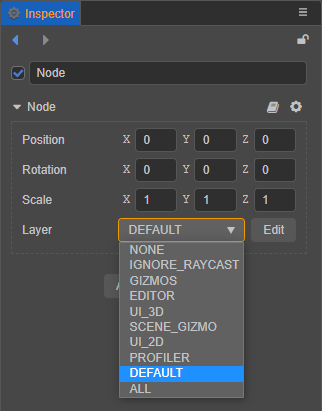
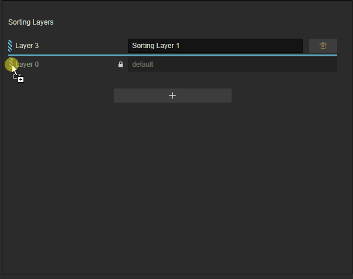
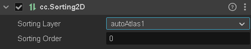
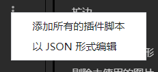
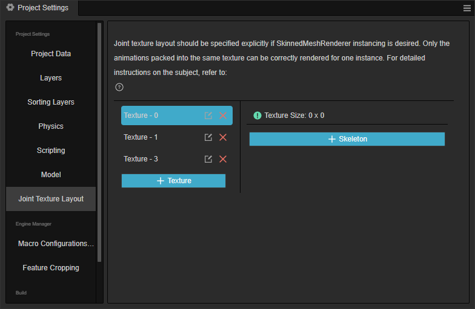
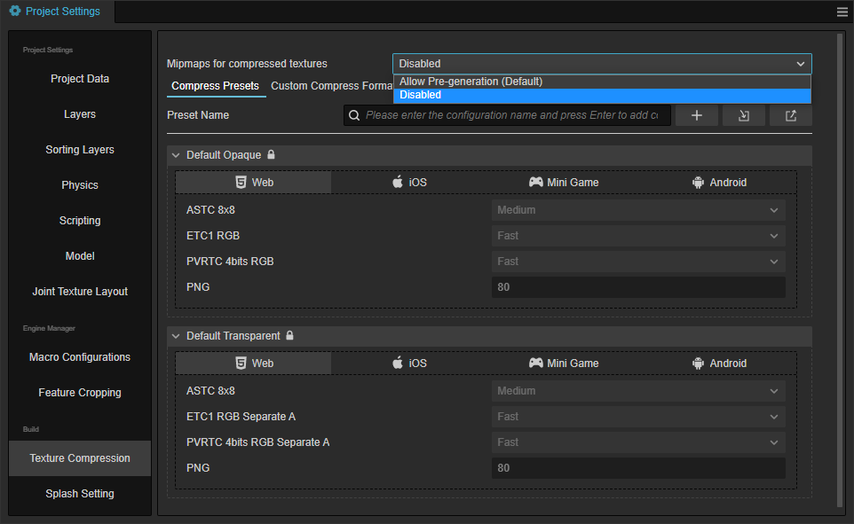

# 项目设置

**项目设置** 面板通过点击编辑器主菜单栏中的 **项目 -> 项目设置** 即可打开，主要用于设置特定项目的相关配置项。这些设置会保存在项目的 `settings/packages` 文件夹中。如果需要在不同开发者之间同步项目设置，请将 `settings` 目录加入到版本控制。

**项目设置** 由几个不同的分页组成，包括 **项目数据**、**Layers**、**物理**、**脚本**、**Macro Config**、**功能裁剪** 和 **纹理压缩**。修改设置之后 **项目设置** 面板会自动保存修改。

## 项目数据

**项目数据** 分页主要用于设置默认 Canvas、渲染管线等，只对当前项目生效。


### 默认 Canvas 设置

默认 Canvas 设置包括 **设计分辨率** 和 **适配屏幕宽度/高度**，用于规定在新建场景或 Canvas 组件时，Canvas 中默认的设计分辨率数值，以及 `Fit Height` 和 `Fit Width`。详情请参考 [多分辨率适配方案](../../ui-system/components/engine/multi-resolution.md)。

### 高画质模式

在使用 Cocos Dashboard 通过默认的模板 3D HQ 创建工程时，默认开启阴影与光照等相关设置以达到更高质量的渲染效果，省去了手动开启场景、物体、灯光等多重阴影和光照的设置过程。
这个高画质模式就是模板功能的切换开关。

### 渲染管线

渲染管线用于控制场景的渲染流程，目前内置的渲染管线包括 **builtin-forward** (前向渲染管线) 和 **builtin-deferred** (延迟渲染管线)，详情请参考 [内置渲染管线](../../render-pipeline/builtin-pipeline.md)。

## Layers


- Layers 能让相机渲染部分场景，让灯光照亮部分场景。
- 可自定义 0 到 19 个 Layers，清空输入框则删除原先的设置。
- 后 12 个 Layers 是引擎内置的，不可修改。
- 目前使用到 Layer 的位置包括：

  1. Node 节点在 **属性检查器** 中的 [Layer 属性](../../concepts/scene/node-component.md#%E8%AE%BE%E7%BD%AE%E8%8A%82%E7%82%B9%E7%9A%84%E5%8F%AF%E8%A7%81%E6%80%A7)。

      

  2. Camera 节点在 **属性检查器** 中的 Visibility 属性，节点的 Layer 属性匹配相机的 Visibility 属性。只有当节点设置的 Layer 属性包含在相机的 Visibility 中时，节点才可以被相机看见。更多说明可以参考 [Camera 组件](./../components/camera-component.md)。

      

<!-- native 引擎设置的修改主要影响的是构建原生项目时使用 cocos2dx 引擎模板，修改后可以实时生效。 -->

## 排序图层


自定义 2D UI 以及 3D 物体的渲染排序。

* 操作说明
    - 点击右侧的删除按钮可以删掉对应的图层。
    - 除 `default` 图层不可编辑外，其他图层都可以手动编辑名称。
    - 点击加号可以添加不同的图层。
    - 使用鼠标拖拽排序图层左侧的灰色条纹状按钮可以手动对图层进行排序。

    

* **(2D UI 渲染排序)** 添加渲染层级后，在任意 2D 渲染组件的节点上添加 [Sorting2D](../../engine/rendering/sorting-2d.md) 组件并设置排序图层与图层内排序，即可自定义 2D UI 的渲染顺序。


* **(3D 物体渲染排序)** 添加渲染层级后，在任意拥有 MeshRenderer 或者 SpriteRenderer 组件的节点上添加 [Sorting](../../engine/rendering/sorting.md) 组件并设置排序图层与图层内排序，即可自定义 3D 物体的渲染顺序。


## 物理


用于配置物理的各项参数，详情请参考 [物理配置](physics-configs.md)。

## 脚本


- **符合规范的类字段**：当开启时，将使用 Define 语义实现类字段，否则，将使用 Set 语义实现类字段。

- **允许声明类字段**：当开启时，在 TypeScript 脚本中将允许使用 declare 关键字来声明类字段。当字段以 declare 声明且未指定显式的初始化式时，将依照规范初始化为 undefined。

- **启用宽松模式**：启用宽松模式进行脚本编译。

- **导入映射**：该项用于控制 TypeScript/JavaScript 的导入行为，详情请参考 [Import Map](../../scripting/modules/import-map.md)。

- **用于预览的浏览器列表**：设置在预览时 TypeScript/JavaScript 代码编译的浏览器列表文件。
  > **示例**：
  > 比如我们在预览的时候，async/await是使用的polyfill。但我们希望不使用polyfill，
  > 那么我们可以在项目根目录下创建一个 previewbrowserlist.txt 文件，内容为 chrome 80
  > 然后在项目设置 -> 脚本 -> 用于预览的浏览器列表 -> 选择 previewbrowserlist.txt 这个文件。
  > 重启编辑器 或者 重启 脚本编译进程。 对于async/await的profill就没有了。 

- **导出条件**：为条件化导出模块指定解析条件，详情可参考 [条件性导出](../../scripting/modules/spec.md#%E6%9D%A1%E4%BB%B6%E6%80%A7%E5%AF%BC%E5%87%BA)。

### 插件脚本排序

关于插件脚本的部分介绍，可以参见文档 [插件脚本](../../scripting/external-scripts.md)


当部分插件脚本之间有一定的优先加载顺序时，可以在此处添加排序。（仅需添加有优先顺序的插件脚本即可）

**操作方式**：

- 点击 `+` 按钮，可以添加项目内已被识别但未被添加的插件脚本
- 单击选中插件脚本后点击 `-` 按钮可以删除选中的插件脚本
- 点击 `┇` 按钮，可以展开菜单，选择`添加所有插件脚本`或者`以 JSON 形式编辑`。

    

    其中以 JSON 形式编辑主要是为了方便希望直接编辑数据的用户，此处仅提供了简单的转换，请自行做好数据的检查、格式的验证，不合法的 JSON 格式将无法被提交保存。

    

## 模型


- [智能材质转换](../../importer/materials/fbx-materials.md)：启用后，引擎会根据导出模型在原有 DCC 软件内的材质，将其导出为引擎支持的材质。

## 骨骼贴图布局设置



配置项目内的骨骼贴图布局。请参考 [骨骼贴图布局设置](../../animation/joint-texture-layout.md)。

## Macro Config（引擎宏配置）

**引擎宏设置** 提供了修改宏配置的快捷方式，配置的宏将会在预览、构建时生效，同时也会跟随自定义引擎的配置更新当前宏配置的默认值。


- **ENABLE_TILEDMAP_CULLING**：是否开启 TiledMap 的自动裁减功能，默认开启。需要注意的是 TiledMap 如果设置了 `skew` 和 `rotation` 的话，建议手动关闭该项，否则会导致渲染出错。

- **TOUCH_TIMEOUT**：用于甄别一个触点对象是否已经失效并且可以被移除的延时时长。开发者可通过修改这个值来获得想要的效果，默认值是 5000 毫秒。详情请参考 API 文档 [TOUCH_TIMEOUT](%__APIDOC__%/zh/interface/Macro?id=TOUCH_TIMEOUT)。

- **ENABLE_TRANSPARENT_CANVAS**：用于设置 Canvas 背景是否支持 Alpha 通道，默认不开启支持。

    - 若希望 Canvas 背景是透明的，并显示背后的其他 DOM 元素，便可开启该项。

    - 若关闭该项，则会有更高的性能表现。

- **ENABLE_WEBGL_ANTIALIAS**：是否开启 WebGL 的抗锯齿配置，默认开启。这个配置只影响 WebGL 后端，对应在创建 WebGL Context 时是否传入抗锯齿选项（仅适用于前向渲染管线）。

- **ENABLE_ANTIALIAS_FXAA**：用于开启 FXAA 抗锯齿（仅适用于经典延迟渲染管线，要自定义FXAA功能请参考[可定制渲染管线](../../render-pipeline/custom-pipeline.md)。

- **ENABLE_BLOOM**：用于开启 BLOOM 后处理特效（仅适用于经典延迟管线，要自定义Bloom功能请参考[可定制渲染管线](../../render-pipeline/custom-pipeline.md)。

- **CLEANUP_IMAGE_CACHE**：是否在将贴图上传至 GPU 之后删除原始图片缓存，删除之后图片将无法进行 [动态合图](../../advanced-topics/dynamic-atlas.md)。该项默认不开启。

- **ENABLE_MULTI_TOUCH**：是否开启多点触摸，默认开启。

- **MAX_LABEL_CANVAS_POOL_SIZE**：设置 Label 使用的 Canvas 对象池的最大数量，请根据项目同场景的 Label 数量进行调整。

- **ENABLE_WEBGL_HIGHP_STRUCT_VALUES**（v3.4.1 新增）：在带有 WebGL 后端的 Android 平台上，片元着色器中定义的结构体内部变量使用的是 mediump 精度，可能会导致一些需要高精度的数据（如位置信息）计算出现错误结果。可以通过勾选该项开启 WebGL 使用 highp 精度计算变量来避免该问题。

    - 若开启该项，在片元着色器代码中需要使用 `HIGHP_VALUE_STRUCT_DEFINE` 宏来定义结构体变量，使用 `HIGHP_VALUE_TO_STRUCT_DEFINED` 和 `HIGHP_VALUE_FROM_STRUCT_DEFINED` 在结构体变量和非结构体变量之间赋值。

    - 关于上述宏调用的具体信息与代码，详情请参考 **packing.chunk**（[GitHub](https://github.com/cocos/cocos-engine/blob/v3.8.0/editor/assets/chunks/common/data/packing.chunk#L40) | [Gitee](https://gitee.com/mirrors_cocos-creator/engine/blob/v3.8.0/editor/assets/chunks/common/data/packing.chunk#L40)）。

- **BATCHER2D_MEM_INCREMENT**（v3.4.1 新增）：该项会影响每个 MeshBuffer 可容纳的最大顶点数量，默认值为 144KB，数量与值之间的转换关系请参考 [MeshBuffer 合批说明](../../ui-system/components/engine/ui-batch.md#meshbuffer-%E5%90%88%E6%89%B9%E8%AF%B4%E6%98%8E)。

- **Custom Macro**：用于自定义宏配置，为当前项目脚本提供一个宏标记的功能，便于可视化配置。点击下方的 **+** 按钮即可添加新的宏配置，将鼠标悬浮在已添加的宏配置上，左侧会显示 **删除** 和 **修改** 按钮，分别用于删除/重命名当前宏配置。

  

更多关于引擎宏模块的具体信息与代码可以参考 **Engine Macro**（[GitHub](https://github.com/cocos/cocos-engine/blob/3d/cocos/core/platform/macro.ts#L824) | [Gitee](https://gitee.com/mirrors_cocos-creator/engine/blob/3d/cocos/core/platform/macro.ts#L824)）。

## 功能裁剪

**功能裁剪** 分页主要是针对发布游戏时引擎中使用的模块进行裁剪，达到减小发布版引擎包体的效果。列表中未选中的模块在打包、预览时将会被裁剪掉。建议打包后进行完整的测试，避免场景和脚本中使用到了被裁剪掉的模块。


## 压缩纹理

与 Cocos Creator 2.x 不同，Cocos Creator 3.0 的压缩纹理是在 **项目设置** 中配置预设，然后在 **属性检查器** 中选择图片资源的预设方式。旧版本的项目在升级到 v3.0 后，编辑器会自动扫描项目中所有的压缩纹理配置情况，整理出几个预设，由于是自动扫描的，所以预设名称可能不匹配项目，可以自行在此处修改。

### 纹理压缩预设



该分页主要用于添加压缩纹理预设配置，可添加多个，每个压缩纹理配置允许针对不同的平台制定配置细则。添加完成后，在 **层级管理器** 中选中图片资源，就可以在 **属性检查器** 中快速添加压缩纹理预设。同时也可以在该分页中直接修改预设来达到批量更新压缩纹理配置的使用需求。

目前配置压缩纹理支持以下平台：

1. Web：包括 Web-Mobile 和 Web-Desktop 两个平台
2. iOS
3. Mini Game: 包括目前 Creator 支持的所有小游戏平台，比如微信小游戏、华为快游戏等
4. Android

各平台对纹理压缩的支持情况，详情请参考 [压缩纹理](../../asset/compress-texture.md)。

### 属性

- **Mipmaps for compressed textures**: 对压缩的贴图实现预生成 Mipmap，可选项： **Allow Pre-generation（default）** 预生成；**Disabled** 禁用
    - 如项目是从 v3.7 之前的版本升级而来，则此选项默认关闭
    - 开启后生成多张图片，会影响到包大小，请根据需求选择
    - 如果用户使用的 texture 纹理勾选了 generate mip maps，需要生成贴图的 mipmaps 又勾选了纹理压缩配置了一些需要第三方工具压缩处理的格式比如 pvr etc 等，则需要在项目设置开启此选项。开启后，构建将会生成对应格式压缩过的 mipmaps 供运行时使用

#### 添加/删除纹理压缩预设

在上方的输入框中输入压缩纹理预设名称，点击 Enter 键或者右侧的加号按钮即可添加一个预设。另外两个按钮是用于导入/导出压缩纹理预设，详情请参考下文介绍。


添加完压缩纹理后，如需删除可以直接将鼠标移到预设名称上，点击右侧的删除按钮即可。


> **注意**：面板中内置的 **default** 和 **transparent** 这两个预设不可修改/删除。

#### 添加/删除纹理压缩格式

选择平台，然后点击 **Add Format** 按钮，选择需要的纹理格式，再配置好对应的质量等级即可，目前同类型的图片格式只能添加一次。


如需删除，将鼠标移至纹理格式上方，点击右侧的红色删除按钮即可。


#### 修改压缩纹理预设名称

压缩纹理预设的名称仅仅是作为 **显示** 使用，在添加压缩纹理预设时，就会随机生成 uuid 作为该预设的 ID，因而直接修改预设名称并不会影响图片资源处对预设的引用。


#### 导出/导入压缩纹理预设

压缩纹理配置页面允许导入/导出压缩纹理预设，以便更好地跨项目复用配置，也可以自行在外部编辑好压缩纹理预设再导入到编辑器。

大部分情况下直接导入导出即可，如果需要自行编写压缩纹理配置，请参考下方接口定义与范例：

**接口定义**：

```ts
type IConfigGroups = Record<ITextureCompressPlatform, IConfigGroupsInfo>;
type ITextureCompressPlatform = 'miniGame' | 'web' | 'ios' | 'android' | 'pc';
type ITextureCompressType =
    | 'jpg'
    | 'png'
    | 'webp'
    | 'pvrtc_4bits_rgb'
    | 'pvrtc_4bits_rgba'
    | 'pvrtc_4bits_rgb_a'
    | 'pvrtc_2bits_rgb'
    | 'pvrtc_2bits_rgba'
    | 'pvrtc_2bits_rgb_a'
    | 'etc1_rgb'
    | 'etc1_rgb_a'
    | 'etc2_rgb'
    | 'etc2_rgba'
    | 'astc_4x4'
    | 'astc_5x5'
    | 'astc_6x6'
    | 'astc_8x8'
    | 'astc_10x5'
    | 'astc_10x10'
    | 'astc_12x12';
type IConfigGroupsInfo = Record<ITextureCompressType, IQuality>
interface ICompressPresetItem {
    name: string;
    options: IConfigGroups;
}
```

**示例参考**：

```json
{
    "default": {
        "name": "default",
        "options": {
            "miniGame": {
                "etc1_rgb": "fast",
                "pvrtc_4bits_rgb": "fast"
            },
            "android": {
                "astc_8x8": "-medium",
                "etc1_rgb": "fast"
            },
            "ios": {
                "astc_8x8": "-medium",
                "pvrtc_4bits_rgb": "fast"
            },
            "web": {
                "astc_8x8": "-medium",
                "etc1_rgb": "fast",
                "pvrtc_4bits_rgb": "fast"
            },
        }
    },
    "transparent": {
        "name": "transparent",
        "options": {
            "miniGame": {
                "etc1_rgb_a": "fast",
                "pvrtc_4bits_rgb_a": "fast"
            },
            "android": {
                "astc_8x8": "-medium",
                "etc1_rgb_a": "fast"
            },
            "ios": {
                "astc_8x8": "-medium",
                "pvrtc_4bits_rgb_a": "fast"
            },
            "web": {
                "astc_8x8": "-medium",
                "etc1_rgb_a": "fast",
                "pvrtc_4bits_rgb_a": "fast"
            },
        }
    }
}
```

### 自定义纹理压缩行为

自 v3.5.0 起，为了方便用户定制纹理压缩工具以及一些自定义参数、加密等等处理，支持了自定义纹理压缩方式的页面。界面交互与纹理压缩预设类似。


#### 配置方式

- **压缩格式**：指定当前压缩方式的处理格式类型，选择不同的格式质量选项会与之保持一致，同时如果自定义压缩方式处理失败会自动回退到编辑器原有格式的压缩方案；
- **覆盖原格式**：勾选后，将会自动覆盖已有纹理压缩预设内的原始压缩格式，原始配置名旁会出现自定义压缩方式名称的标识，同一个格式只能被一个自定义压缩方式覆盖；

    

- **压缩工具**:
    - **程序**： 指定实际需要调用的压缩库地址；
    - **命令行参数**：配置调用程序需要传递的参数，其中构建纹理压缩默认会传递的参数字段名可以通过参数输入框右侧的控件来快捷加入，目前默认会传递 `src, dest, quality` 字段。

    

自定义压缩方式添加完成后，纹理压缩预设的 **添加压缩方式** 菜单中将会新增此配置，可以直接在预设里添加。


#### 构建阶段效果

配置为自定义纹理格式后，将会打印 `custom-compress` 字样，并附上对应的命令行参数信息等。


## 插屏设置

插屏设置是在游戏开始时，显示引擎的 LOGO 或开发者自定义的 LOGO 的功能。


- **最小显示时间**：显示插屏的最小时间（毫秒），最低为 500 毫秒
- **自定义图片显示比例**：图片的放大比例，最低为 100%
- **插屏预览**：如果你想改变闪屏图像，将鼠标悬停在预览窗口，然后点击'+'按钮，然后选择一个新的图像路径。

如果你想禁用闪屏，请参考 [构建选项介绍](../publish/build-options.md) 详情。

> **注意**：
> 1. 在构建选项中选择不同的构建平台后，再次调整插屏规则可以实现不同平台插屏的多样性
> 2. 插屏只会在打包后生效，预览时不会生效
> 3. 部分国家和地区未开放完整的插屏功能，若对您造成不便，我们深表歉意。

## Bundle 配置


Bundle 配置，可以让用户针对性的对不同的平台配置自己的 Bundle 方案，举一些例子，如：区分普通素材的和高清素材，针对不同的商店，等等。请参考 [Asset Bundle](../../asset/bundle.md)。

目前 Cocos Creator 支持发布的平台主要为三类：原生平台、Web 以及小游戏。

点击不同平台的按钮可以修改不同平台的配置。


通过 Bundle 配置面板右上角的菜单，可以选择 **新建配置**、**导入配置** 或 **导出配置**。


- **新建配置**：新建一个 Bundle 配置，新建后开发者可以在 Bundle 中修改配置。

    

    选中任何配置的 Bundle，在 **平台设置** 选项中的下拉菜单中选择需要的配置。

    > 不同的 Bundle 可以采用不同的配置。

- **导入配置**：从外界导入已导出的 JSON 文件格式的 Bundle 配置
- **导出配置**：将配置导出为 JSON 可供其他项目使用

对于新增的配置，可以通过点击右侧的按钮 **复制配置**、**复制 ID**、**重命名** 和 **删除**。


### 平台覆盖

目前 Cocos Creator 支持多种平台发布，在各平台发布时，可以选择新增配置覆盖当前已经配置的平台选项。

点击 **平台覆盖** 右侧的 “+” 号，选择目标平台。


根据需要选择新的平台之后，这些新平台的配置将覆盖之前的通用配置。

## 自定义项目设置面板

Creator 支持在 **项目设置** 右侧添加自定义功能页，详情请参考 [自定义项目设置面板](../../editor/extension/contributions-project.md)。
