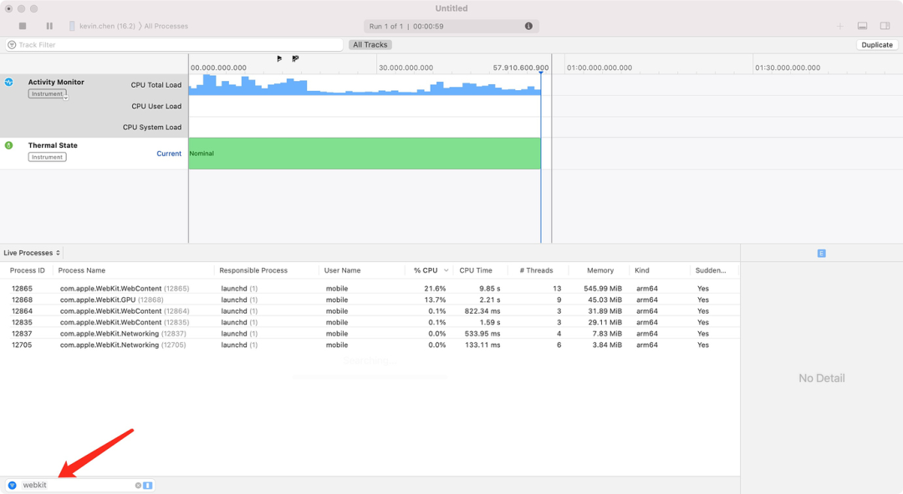
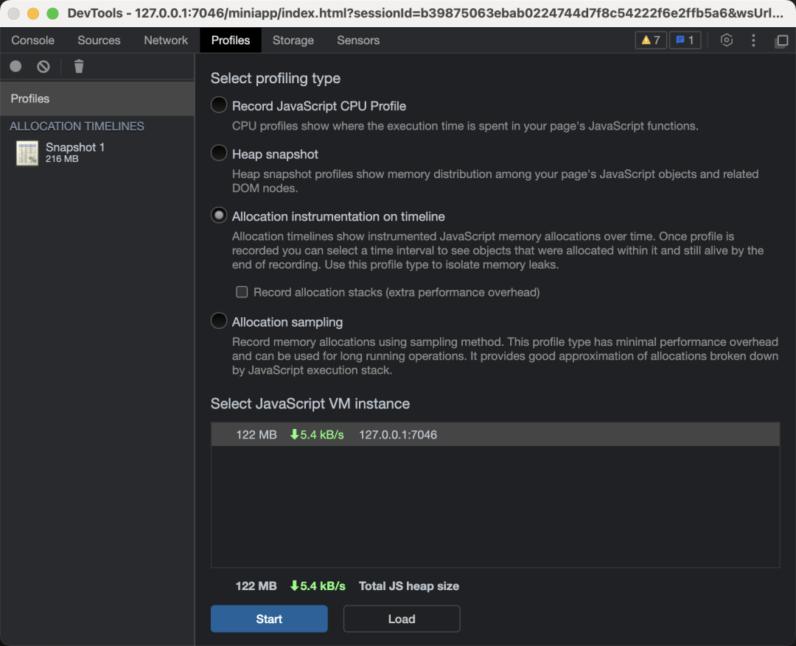
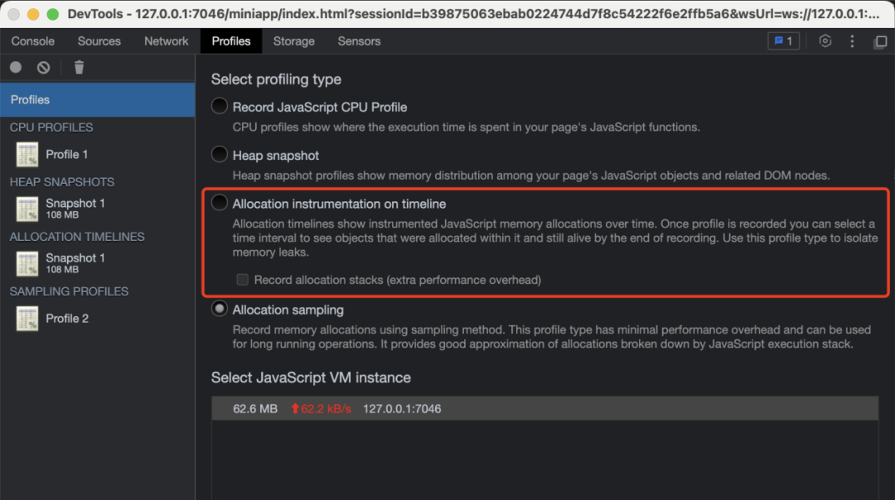
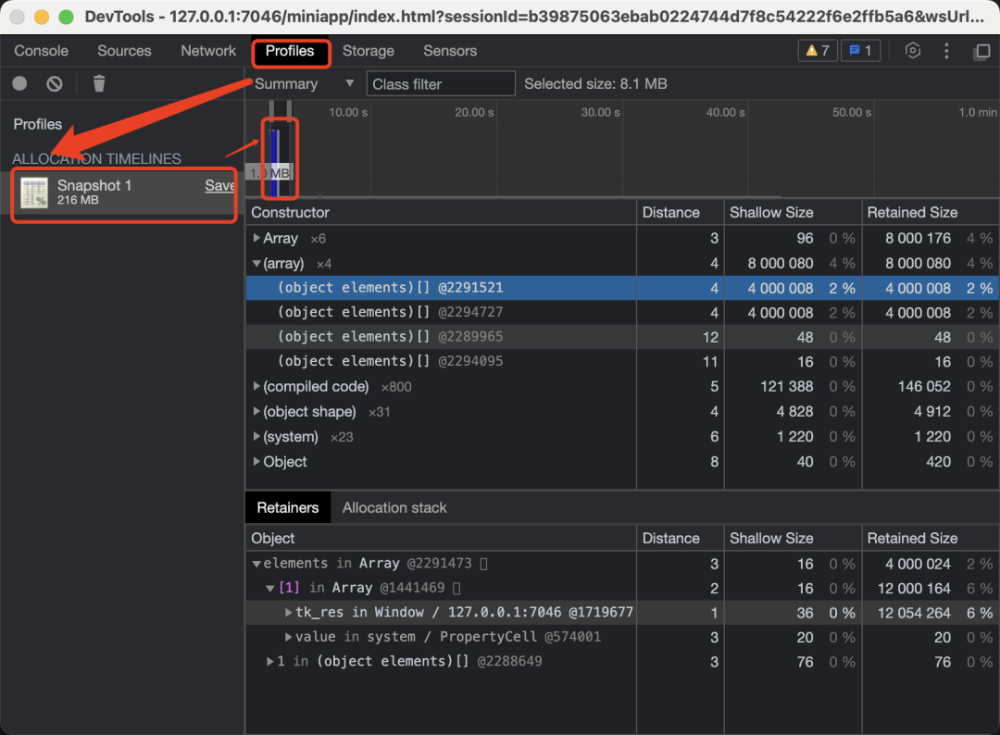
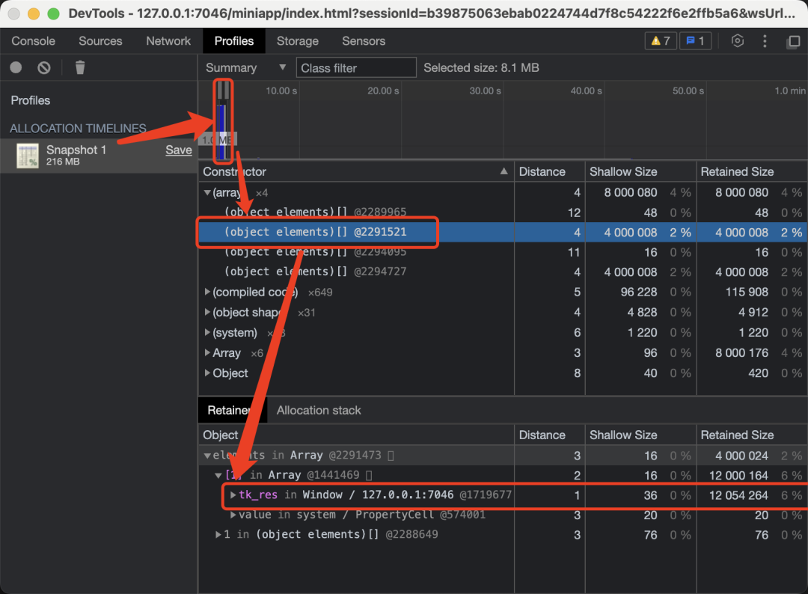

# IOS 抖音小游戏内存与性能优化指南

## 前言

由于 iOS 端的性能表现一直差强人意。 同样的程序版本，与有 JIT 加速的 Android 比起来，相差甚远。抖音小游戏提供的高性能模式，使得在 iOS 上的小游戏，也能拥有 JIT 能力，大幅度提升运行性能。

## 性能数据

从内测阶段的数据来看，接入高性能模式后，小游戏的 80 分位 FPS 有平均 69.01% 的提升（32.53 -> 54.98）。从原理上来说，高性能模式大幅提升了 JS 代码的运行效率，因此 CPU 压力较大的游戏，在接入高性能模式后会有较为明显的性能提升。 

> 因为内存问题在 Android 端表现良好，在 iOS 端反馈较多，所以本文仅对 iOS 端内存优化做介绍。

### 苹果手机运行内存限制

#### 有关高性能模式的介绍以及使用方法请详细阅读抖音小游戏开发文档 [高性能模式](https://developer.open-douyin.com/docs/resource/zh-CN/mini-game/develop/guide/performance-optimization/runtime-performance/high-performance-mode)。

1. 高性能模式下，游戏将拥有更好的渲染性能和表现，但是它对游戏的内存要求更加严格。

2. 在高性能模式下，小游戏运行于浏览器内核环境，所以兼容性、内存消耗、稳定性等方面需要单独进行测试，不能复用普通模式的测试结果。

3. 在 iOS 设备中，iphone 6s/7/8 等 2G RAM 机型的内存限制为 1G，iphone 7P/8P/iPhoneX/XR/XSAMX/11 等 3G RAM 机型的内存限制为 1.4G，一旦应用程序的内存占用超过这个阀值，就会被系统杀掉进程。因此开发者务必保证内存峰值不超过该数值。

4. 如果游戏没做好内存优化，不建议开启高性能模式，否则在 iOS 低端机容易出现内存异常退出的情况，如有内存问题，可参考本文的内存优化技巧，充分优化内存。

#### 如何打开高性能模式。
1. 在 game.json 中，配置 enableIOSHighPerformanceMode 为 true 即可打开高性能模式。目前局域网预览尚不支持高性能模式，请在预览时不要勾选「开启局域网快速预览」选项。

  ```json
  {
    "deviceOrientation": "portrait",
    "enableIOSHighPerformanceMode": true
  }
  ```
2. 如何确认是否已经打开高性能模式：
  * 高性能模式下可通过访问 GameGlobal.isIOSHighPerformanceMode 判断是否为高性能模式，高性能模式下该变量为 true，普通模式下为 undefined。
  * 通过 vConsole 的颜色进行判断，普通模式下 vConsole 为绿色，高性能模式下 vConsole 为蓝色。

## 运行时内存结构


从上图中可以看到，运行时内存一共由 6 个部分组成。

### JavaScript Heap

在高性能模式下，小游戏运行于浏览器内核环境，因此 JavaScript Heap 包含游戏逻辑代码内存。 通常我们可以打包 web-mobile 端，使用 Mac 平台的 Safari 浏览器的调试工具来远程调试手机 safari 的内存情况。 需要注意的是 JavaScript Heap 通常无法看出具体物理内存使用。

### WASM 资源

为了提高 JS 模块的执行性能，比如物理引擎的计算，我们会将一些 C++ 代码直接编译成 WASM 代码片段来达到优化性能的需求。 比如 Cocos Creator 部分引用的第三方物理库就是 WASM 版本。

### 基础库和 Canvas

基础库可以理解为抖音小游戏的黑盒环境暴露的 API 封装，可以防止将浏览器内核环境 API 暴露给开发者，实际测试基础库内存占用在 65M 左右。小游戏环境第一个创建的 Canvas 是主 Canvas，也是唯一可以将渲染表面同步到主界面的 Canvas，即呈现我们游戏的渲染表现。Canvas 的内存占用跟 Canvas 的宽高大小成正比。

### 音频文件

音频文件内存是指加载到内存的音频实例。

### GPU 资源

比如顶点数据缓存，索引数据缓存，纹理缓存和渲染表面缓存等等。

## 内存问题诊断

下面给大家介绍一些常用的 iOS 内存诊断工具，它们可以辅助我们快速定位内存问题，找出解决办法。

### 常用 iOS 设备内存查看工具

- Xcode 自带的 Instrument 分析工具
- Perfdog 工具
- 抖音开发者工具

> **注意**：iOS 端小游戏的进程名称在不同模式下有区别。
> - 高性能模式：含有 WebContent
> - 普通模式：含有 Aweme

### XCode Instruments


XCode Instruments 是 XCode 自带的应用程序运行时分析工具，它同样适用于抖音小游戏进程。

使用 Activity Monitor，选择对应的设备 all processes 捕捉，等进程列表刷新后，输入 webkit 进行过滤，即可看到所有进程的 CPU 与内存情况.



### Perfdog

Perfdog（性能狗）是一个 iOS/Android/PC/ 主机平台的性能测试和分析工具，具体使用方式请参考:

[https://perfdog.qq.com/](https://perfdog.qq.com/)

选择对应的设置-进程名，即可看到相关性能数据。

### 抖音开发者工具

* [性能测试工具](https://developer.open-douyin.com/docs/resource/zh-CN/mini-game/develop/guide/performance-optimization/performance-testing-tools)

备注：只能在真机上使用

* 主要使用开发者工具自带的调试器来跟踪内存数据，进入调试开发者工具界面，将 【Profiles】勾选.主要有四个功能：
1. Record JavaScript CPU Profile:主要用于查看函数运行的时间 
2. Heap snapshot: 构造函数自身占用内容以及直接或者间接引用对象的大小 
3. Allocation instrumentation on timeline: 主要使用 JS Heap 的峰值曲线，用于观察内存增长变化 
4. Allocation sampling: 可以查看JavaScript执行栈细分的内存分配近似值. 

备注：此四个功能只能在抖音开发者工具的IDE上使用

* 抖音开发者工具主要使用它的调试器来跟踪内存数据，操作流程如下：
1. 进入调试开发者工具界面
2. 将 【Profiles】勾选，然后刷新游戏
3. 点击下图左上角的小圆圈按钮开始录制
4. 结束录制后，就会显示下图界面



当我们要确定某块 JS 内存的来源与释放情况，就需要用到下面的内存泄漏检测工具 - **实时内存诊断**。



具体操作步骤如下：

1. 点击左上角的小圆圈按钮，会进入下面的录制按钮，柱状图的出现表示某个内存块的创建，消失标识内存块被释放。左上角的垃圾桶按钮是主动触发 JS 引擎的 GC 的按钮，点击后可以加快内存回收速度。



1. 再次点击左上角的红色小圆圈按钮结束录制，这时候我们可以选中蓝色区域，然后会显示该内存块包含的对象，这些是在内存中未被释放的资源，选中某个对象后，可以在 Retainers 界面看到对象的内存引用关系。到这里你可以根据代码层的逻辑关系来推理内存对象是否应该被释放，从而确认是否内存泄露。



## 内存优化技巧

常见抖音小游戏项目的内存由下面几个部分组成：
1. 小游戏基础库
2. 引擎脚本内存
3. 业务脚本内存
4. 音频内存
5. 字体内存
6. 图片内存
7. Canvas 内存

知道了内存组成部分后，我们就可以针对不同的部分做一些优化。

以 iOS 为例，常用的内存优化技巧如下：
1. 小游戏通常基础库的内存 ~= 65M，常驻内存，不可优化。

2. 引擎内存占用加载是确定的，由于引擎加载会初始化渲染器，所以通常主 Canvas 内存占用也在这个时候确定，这块内存占用可以通过配置渲染分辨率的倍数来优化。运行时根据引擎模块需要，会动态增加一些缓存内存，开发者可以根据功能需要通过编辑器项目设置里面的功能裁剪来减少引擎内存占用。

3. 脚本内存包含引擎和业务代码、配置表数据, 根据游戏的开发体量，业务代码和配置表数据内存会有几百 M 的大小，只能用户自己做优化。

4. 单个双通道的音频实例可能在 20M 左右，音频播放完后做释放会减少这块内存损耗，也可以精简成单通道音频减少内存。

5. 在国内，一般使用的是中文字体，加载后内存占用至少大于 10M，所以尽量使用系统字，使用应用内部的共享资源。如果开发条件允许的情况下，可以使用 Bitmap 字体和 SDF 字体渲染。

6. 图片内存是常用资源，根据加载需要，可以选择填充纹理后释放，或者缓存于内存中以便下次重新填充纹理。在iOS端上建议使用 astc 压缩纹理格式，同时禁用动态合批，这样可以释放 image 资源内存。压缩纹理本身也比 png 的内存占用小超过50%，但是 astc 的文件大小会比 png 大，所以会增加包体大小。通常为了减少首包大小，尽量将图片资源放到小游戏分包或者远程分包。

7. TTF 字体文本渲染时会创建 Canvas 对象，Canvas 对象使用完会被回收到缓存池中，文本渲染的字号越多， 缓存池就越大，目前引擎没有提供回收机制，必要时可以修改引擎来释放 Canvas 缓存池。如果游戏运行内存占用比较高，可以使用 Bitmap 字体替代 TTF 字体。

8. 还有其他的 JS 内存对象，比如 JSON 文件的释放，根据引擎提供的能力按需释放。

9. 合理使用对象池，建议设置一个最大数量阈值避免创建过多的对象。

10. 按需勾选引擎模块，如果有必要可以定制引擎深入优化引擎内存。

11. 3D 游戏尽量简化模型。

## 参考文章

1. [抖音小程序性能优化](https://developer.open-douyin.com/docs/resource/zh-CN/mini-app/develop/tutorial/experience-optimization/overview)

2. [抖音启动场景上报分析](https://developer.open-douyin.com/docs/resource/zh-CN/mini-game/develop/guide/performance-optimization/startup-performance/startup-scene-analysis)

3. [普通小游戏高性能模式](https://developer.open-douyin.com/docs/resource/zh-CN/mini-game/develop/guide/performance-optimization/runtime-performance/high-performance-mode)

4. [抖音IDE使用技巧](https://developer.open-douyin.com/school/course/243)