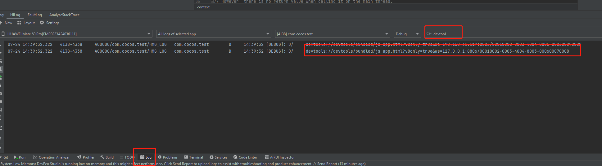
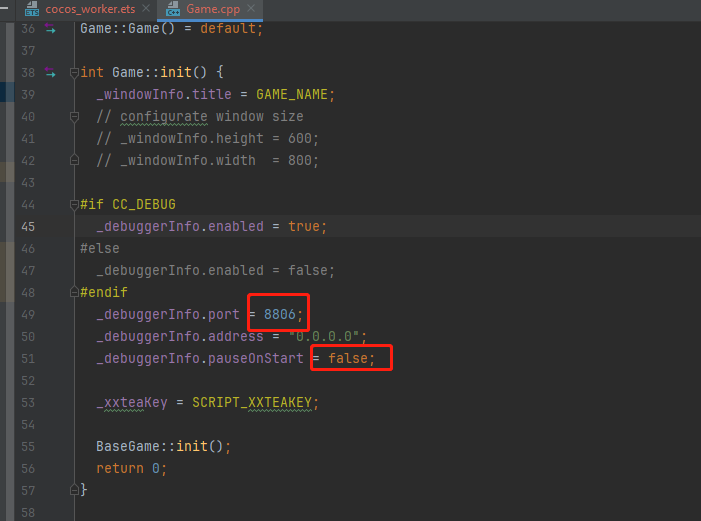
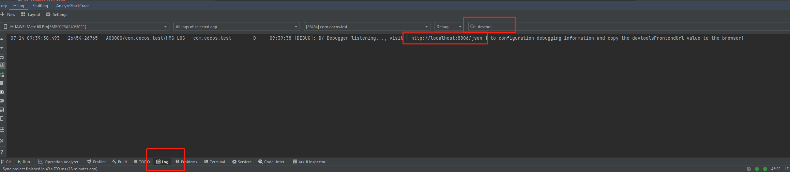
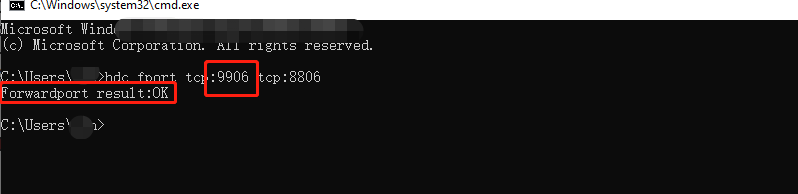
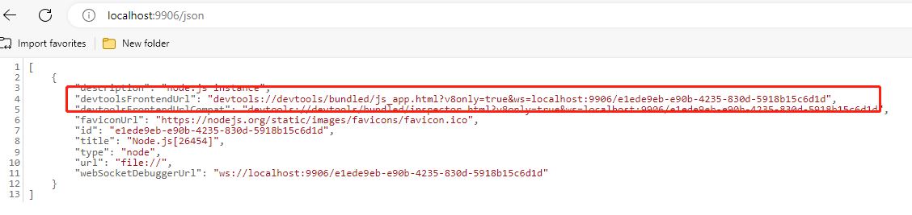
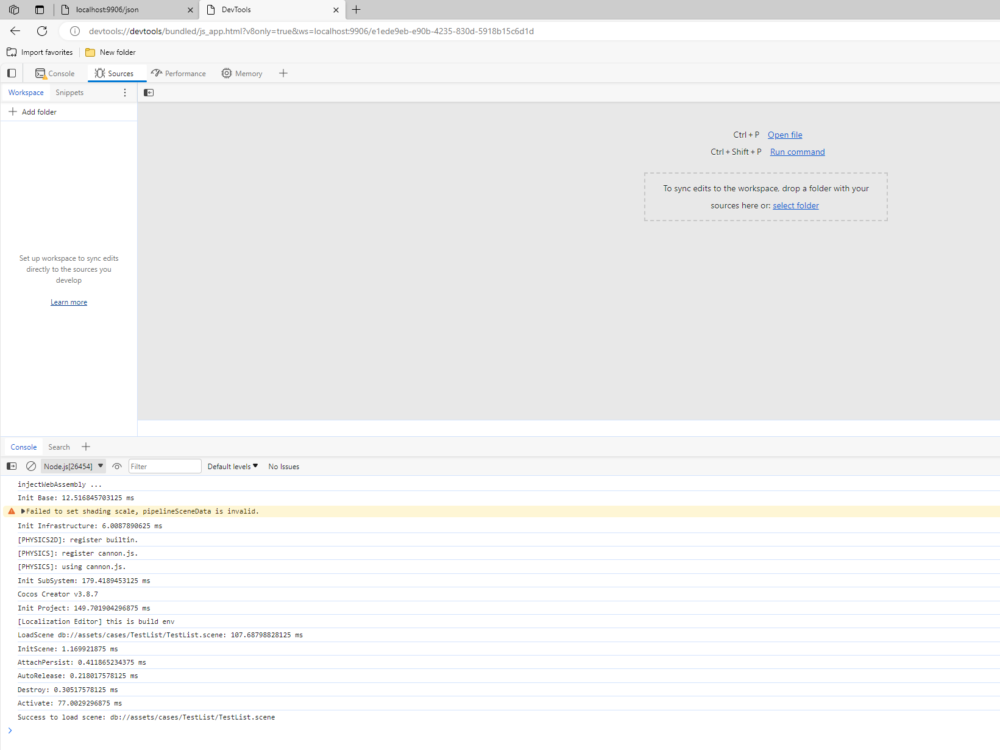

# 原生平台 JavaScript 调试

游戏发布到原生平台后，由于运行环境不同，可能会出现在浏览器预览时无法重现的 Bug，这时我们就必须直接在原生平台下进行调试。Cocos Creator 可以很方便地对原生平台中的 JavaScript 进行远程调试。

## iOS 和 Android 真机调试

如果游戏只有在真机上才能运行，那就必须用真机对打包后的游戏进行调试。调试步骤如下：

- 确保 Android/iOS 设备与 Windows 或者 Mac 在同一个局域网中。注意在调试过程中请勿开启代理，否则可能导致无法正常调试。
- 在 Creator 的 **构建发布** 面板选择 Android/iOS 平台、Debug 模式，构建编译运行工程（iOS 平台建议通过 Xcode 连接真机进行编译运行）。
- 用 Chrome 浏览器打开地址：`devtools://devtools/bundled/js_app.html?v8only=true&ws=设备的本地 IP:43086/00010002-0003-4004-8005-000600070008` 即可进行调试。

  

>如果端口被占用，端口会做+1自增处理，若连接不上，请查看 App 启动时控制台打印的端口号。
>构建时，建议勾选 Debug, Source Maps 选项，这样对应的 js 代码显示才是展开的。

## HarmonyOS Next 平台调试
### 使用 V8 引擎
与 IOS 和 Android 类似
1. 编译工程，运行工程，搜索日志：



2. 把这个链接拷贝到浏览器中运行即可。

### 使用 JSVM 引擎
1. 在 项目工程目录/native/engine/common/Classes/Game.cpp 中配置调试信息：
 
 
 port : 配置端口号（这个配置的是端测端口）

 pauseOnStart : 等待连接调试开始


2. 编译工程，运行工程，搜索日志：



3. 检查端侧端口是否打开成功。hdc shell "netstat -anp | grep 8806"。结果为8806端口（注意端口号，是与步骤1中的端口号一致）状态为“LISTEN"即可，如果2、3正常的话，可以忽略这个步骤。


4. 转发端口。hdc fport tcp:9906 tcp:8806。转发开发者个人计算机侧端口9906到端侧端口8806。结果为"Forwardport result:OK"即可，个人计算机侧端口可以与端侧端口不一样，默认是个人计算机侧端口与端侧端口一样。
（建议使用个人计算机测与端侧端口一致，也就是都写8806，这里只是为了演示不一样的情况）


5. 获取端口连接信息，在chrome浏览器地址栏输入"localhost:9906/json"(这里的端口是个人计算机侧端口，如果使用的和端侧端口一样，可以拷贝步骤2的日志连接)，回车。


6. 拷贝"devtoolsFrontendUrl"字段url内容到地址栏，回车，进入DevTools源码页，将看到在应用中通过OH_JSVM_RunScript执行的JS源码，此时暂停在第一行JS源码处。(注："devtoolsFrontendUrl"字段url只支持使用Chrome、Edge浏览器打开，不支持使用Firefox、Safari等浏览器打开。)



*注意： 每次重新运行之后，需要重新拷贝devtoolsFrontendUrl字段，因为devtoolsFrontendUrl字段每次重新运行后不一样*
### NAPI 暂不支持调试

## Windows 平台及 Mac 平台调试

在 Windows 平台及 Mac 平台下调试游戏，步骤与真机调试类似，将工程用 IDE 编译运行之后，此时便可进行调试。步骤如下：

- 用 IDE 将打包好的工程编译并运行（Windows 平台请使用 Visual Studio，Mac 平台请使用 Xcode）
- 在游戏运行时打开 Chrome 浏览器，输入地址：`devtools://devtools/bundled/js_app.html?v8only=true&ws=127.0.0.1:6086/00010002-0003-4004-8005-000600070008` 即可进行调试。

   

>如果端口被占用，端口会做+1自增处理，若连接不上，请查看 App 启动时控制台打印的端口号。

## 使用 `lldb` 查看当前的 JS 调用栈

通过在 C++ 中断点我们能很便捷地看到 C++ 的调用栈，但并不能同时看到 JS 的调用栈，这个割裂的过程常常会破坏调试的体验。而 `lldb` 提供的功能支持在调试过程中进行很多的操作，包括查看调用栈。

**Xcode** 和 **Android Studio** 都默认使用 `lldb` 作为调试器。详情可参考文档 [LLDB 指南](https://lldb.llvm.org/use/tutorial.html)。

### `lldb` 的全局配置

`lldb` 在启动的时候会加载 `~/.lldbinit`，例如下面的配置：

`~ % cat ~/.lldbinit`

```
target stop-hook add 
po se::ScriptEngine::getInstance()->getCurrentStackTrace()
DONE
```

设置了 **每次断点** 后的行为，执行以下代码输出 JS 调用栈的信息：

```txt
po se::ScriptEngine::getInstance()->getCurrentStackTrace()
```

关于 `target stop-hook` 的用法，详情可参考文档：<https://lldb.llvm.org/use/map.html#examining-variables>

但这种方法也存在着明显的缺陷：会对 **所有项目** 生效，若其他项目不存在相应符号，就会导致出现报错。

### 在 Xcode 配置 `lldb`

#### Xcode 在断点中编辑 action（只对具体的断点触发）


在 **Debugger Command** 中输入命令：

```txt
po se::ScriptEngine::getInstance()->getCurrentStackTrace()
```

关于 `target stop-hook` 的用法，详情可参考文档：<https://lldb.llvm.org/use/map.html#evaluating-expressions>

#### 设置 stop hook

断点触发后，需要在 lldb console 中增加回调。可以针对具体的断点进行更多的调用：


同上，也可以执行以下代码查看调用栈：

```txt
po se::ScriptEngine::getInstance()->getCurrentStackTrace()
```

### 在 Android Studio 配置 `lldb`

在 **Android Studio** 的 **Run -> Debug Configuration -> Debugger** 界面进行类似的配置：


Android Studio 也提供了和 Xcode 类似的 `lldb console`。

## 进阶调试指南

如果需要在 Release 模式下调试，或者需要调试定制后的原生引擎，可参考更详细的 [JSB 2.0 使用指南：远程调试与 Profile](../../advanced-topics/JSB2.0-learning.md)。
