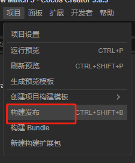
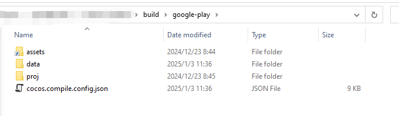
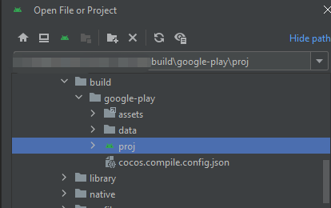

# Google Play构建示例

本文将演示 Cocos Creator 项目发布为 Google Play 应用程序的流程。

请准备一个至少含有一个场景的 Cocos Creator 项目。

## 发布环境搭建

要想发布 Google Play 原生应用，需要安装 Android Studio 开发环境，以及特定版本的 JDK（或者 OpenSDK），Android SDK 和 NDK 等。详情请参考 [配置 Android 原生开发环境](../setup-native-development.md)。

## 发布流程

接下来，在 Cocos Creator 找到 **项目** 菜单，点击 **构建发布** 按钮，弹出 **构建发布** 面板。

### 创建发布任务

1. 选择 **项目** -> **构建** 菜单，打开构建面板

    

2. 点击面板上的 **新建构建任务** 选项：

    

3. 选择构建平台为 Google Play

    

4. 选择至少一个场景作为应用载入的首场景，当仅有一个场景时会被默认添加：

    

5. 启用 ADPF (可选) 

    

6. 参考 [Android 平台构建选项 - 渲染后端](../native-options.md#%E6%B8%B2%E6%9F%93%E5%90%8E%E7%AB%AF) 选择渲染后端

    

7. 填入包名

    

    > 名称规范请参考 [应用 ID 名称](../native-options.md#%E5%BA%94%E7%94%A8-id-%E5%90%8D%E7%A7%B0)

8. 更换应用 icon (可选)

    

9. 选择 Target API Level

    

    > 如果没有下拉框，请检查上面的 **配置 SDK 和 NDK** 是否正确。

10. 开启 Google Play Instant (可选)

    
    
11. 开启 Google Play Billing 功能

    

    > 不勾选这个无法使用Google Play Billing接口

其他选项请参考 [Android 平台构建选项](../native-options.md#android-%E5%B9%B3%E5%8F%B0%E6%9E%84%E5%BB%BA%E9%80%89%E9%A1%B9) 进行配置。

### 构建与发布

1. 构建：点击下方的 **构建** 按钮会创建一个新的构建任务并开始构建

    

2. 等待构建完成

    

#### 通过 creator 生成 aab 包
1. 点击 **生成** 

    

2. 等待生成完成

    

3. 点击下面的按钮打开生成好的工程：

    

4. 找到 publish 目录
    
    

5. 找已生成的aab包
    
    

#### 通过 Android Studio 生成 aab 包
1. 找到工程对应的目录

    

2. 打开 Android Studio 的菜单：

    

3. 打开已经构建好的项目，`{项目路径}/build/google-play/proj`：

    

4. 使用 Android Studio 构建 aab

    打开 Android Studio 后，会花一段时间进行准备工作，待 Android Studio 将项目准备完成后，即可打包 APK。准备过程可能会耗时较久，如果长时间无响应，请检查网络，或者切换到其他镜像。此时如果您需要中断目前的后台任务，可参考下列关闭方法：

    > Android Studio 有后台任务时，可以点击窗口下方的后台任务栏：
    >
    > 
    >
    > 在弹出窗中点击右侧的 × 以结束后台任务：
    >
    > 

5. 打开 **Build** 菜单选择 **Build Bundle(s)**：

    

6. 发布成功后可以在 proj/build 目录内找到 Debug 版本的 APK：

    

## 其他
其他基本与 android 一致，可以参考[安卓构建示例](../android/build-example-android.md)

## Google Play Billing
[Google Play Billing 使用文档](./google-play-game-services.md)

## Google Play 游戏服务
[Google Play Game Services 使用文档](./google-play-game-services.md)