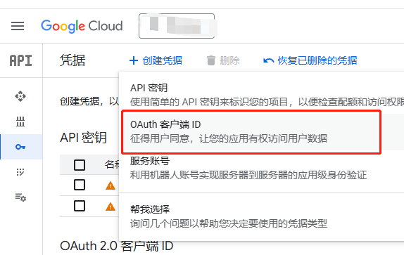
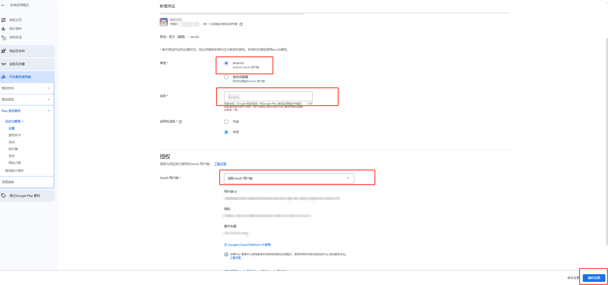
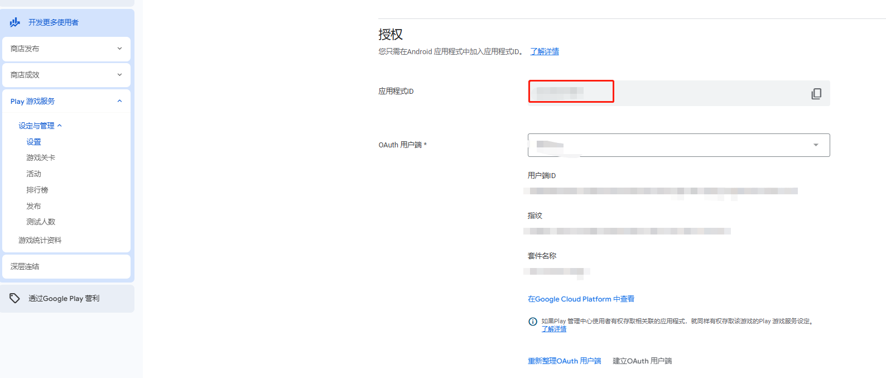
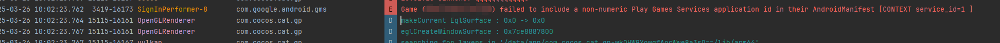
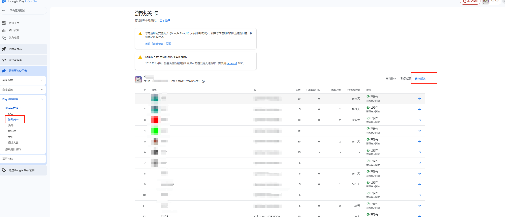
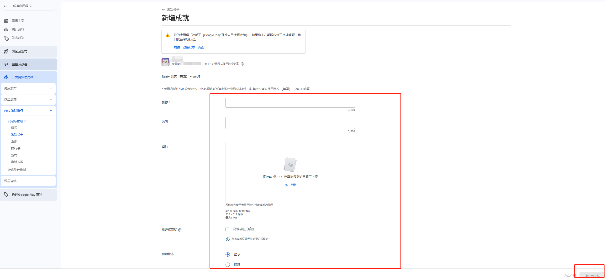
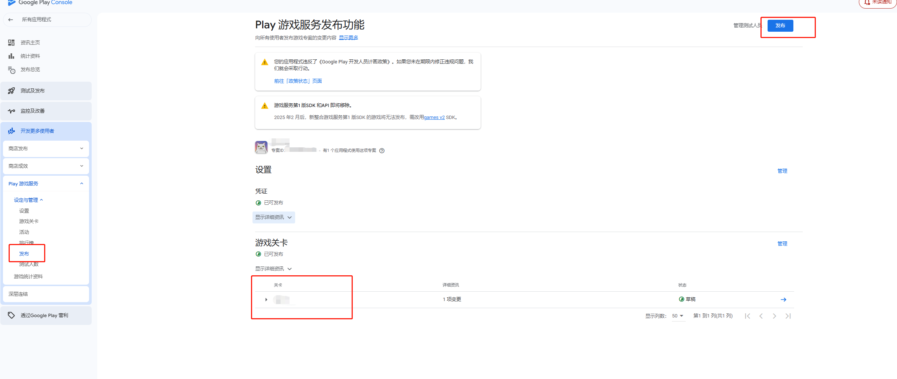

# Google Play 构建示例

本文需要在Google Play平台才可以使用。参考[发布 Google Play 示例](editor/publish/google-play/build-example-google-play.md)


### 自动登录
当玩家启动启用了自动登录功能的游戏时，他们无需与登录提示互动即可登录游戏。玩家可以在 Google Play 游戏应用中或在游戏中显示的初始登录提示中启用自动登录功能。

#### Google Cloud 后台配置

- 创建凭据



需要在 Google Cloud 创建 OAuth 客户端 ID ，才能在 Google Console 里配置凭证里可以看到。

### Google Play Console 后台配置
[参考文档](https://developer.android.com/games/pgs/console/setup?hl=zh-cn#add_your_game_to_the)

1. 新增凭证

2. 填入凭证信息

3. 创建成功即可

红框选中的应用程式ID，就是下面需要填写的应用 id
4. 构建google play平台后，需要用户配置应用id。

如果是英文的应用，配置英文:

如果是中文的应用，配置为中文:


也可以同时配置中文和英文

如果没有配置，会有如下错误：



#### 使用实例
1. 初始化 SDK：
``` typescript
import { google } from 'cc';
// 初始化 Play 游戏 SDK
google.play.PlayGamesSdk.initialize();
```

2. 获取登录结果
``` typescript
    gameSignInClient.isAuthenticated().addOnCompleteListener({
        onComplete: (isAuthenticatedTask: google.play.Task<jsb.AuthenticationResult>) => {
            const isAuthenticated =
                (isAuthenticatedTask.isSuccessful() &&
                isAuthenticatedTask.getResult().isAuthenticated());
            if (isAuthenticated) {
                // Continue with Play Games Services
            } else {
                // Disable your integration with Play Games Services or show a
                // login button to ask  players to sign-in. Clicking it should
                // call GamesSignInClient.signIn().
            }
        },
    });
```

### 成就
成就是在游戏中提高用户互动度的绝佳方式。您可以在游戏中实现成就功能，以鼓励玩家尝试其通常不使用的功能，或者在游戏中运用完全不同的玩法。通过成就功能，玩家还可以相互比较游戏进度，轻松开展趣味性竞争。

#### google 后台配置
1. 创建成就

2. 填写成就信息

3. 发布成就信息


使用实例：
1. 显示成就:
``` typescript
import { google } from 'cc';
// 显示默认成就界面
google.play.PlayGames.getAchievementsClient().showAchievements();
```
显示效果如下图：


2. 解锁成就：
``` typescript
import { google } from 'cc';
google.play.PlayGames.getAchievementsClient().unlock("achievementId");
```

如果成就属于增量类型（即需要执行几个步骤才能解锁），请改为调用 AchievementsClient.increment()
``` typescript
import { google } from 'cc';
google.play.PlayGames.getAchievementsClient().increment("achievementId", 1);
```
完成的步骤达到要求后，Google Play 游戏服务便会自动解锁成就。

3. 加载所有成就信息：

``` typescript
    import { google } from 'cc';
    const achievementsClient = google.play.PlayGames.getAchievementsClient();
    achievementsClient.load(false).addOnSuccessListener({
        onSuccess: (data: google.play.AnnotatedData) => {
            this.addLog("isStale : " + data.isStale());
            const achievements = data.get();
            for(let i = 0; i < achievements.getCount(); ++i) {
                str += `getCurrentSteps : ${achievements.get(i).getCurrentSteps()}\n`;
                str += `getState : ${achievements.get(i).getState()}\n`;
                str += `getTotalSteps : ${achievements.get(i).getTotalSteps()}\n`;
                str += `getType : ${achievements.get(i).getType()}\n`;
                str += `getLastUpdatedTimestamp : ${achievements.get(i).getLastUpdatedTimestamp()}\n`;
                str += `getXpValue : ${achievements.get(i).getXpValue()}\n`;
                str += `getAchievementId : ${achievements.get(i).getAchievementId()}\n`;
                str += `getDescription : ${achievements.get(i).getDescription()}\n`;
                str += `getFormattedCurrentSteps : ${achievements.get(i).getFormattedCurrentSteps()}\n`;
                str += `getFormattedTotalSteps : ${achievements.get(i).getFormattedTotalSteps()}\n`;
                str += `getName : ${achievements.get(i).getName()}\n`;
                str += `getRevealedImageUrl : ${achievements.get(i).getRevealedImageUrl()}\n`;
                str += `getUnlockedImageUrl : ${achievements.get(i).getUnlockedImageUrl()}\n\n`;
            }
            console.log(str);
        } 
    });
```


4. 显示隐藏成就：
``` typescript
import { google } from 'cc';
google.play.PlayGames.getAchievementsClient().reveal();
```

### Recall Api
若要使用正确的信息与 Google 的服务器进行通信，您需向客户端 SDK 请求 Recall 会话 ID，并将该 ID 发送到游戏服务器。
``` typescript
    const recallClient = google.play.PlayGames.getRecallClient();
    recallClient.requestRecallAccess().addOnSuccessListener({
        onSuccess: (recallAccess: google.play.RecallAccess) => {
            const recallSessionId = recallAccess.getSessionId();
            // Send the recallSessionId to your game server
        }
    })
```
