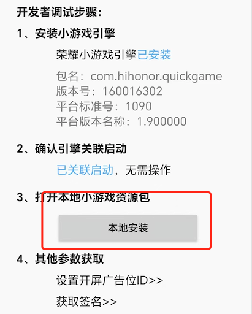

# 发布到荣耀小游戏

Cocos Creator 从 v3.8.6 开始支持将游戏发布到 **荣耀小游戏**。

## 准备工作

- 参考 [荣耀小游戏接入指南](https://developer.honor.com/cn/docs/game_center/guides/miniGame/miniGameGuidelines)，在荣耀开放平台完成开发者入驻流程和应用创建。

- 下载 [荣耀小游戏调试器](https://developer.honor.com/cn/docs/game_center/guides/miniGame/miniGameGuidelines#开发+调试指引)，可安装到荣耀手机设备进行小游戏调试。

## 发布流程

使用 Cocos Creator 打开需要发布的项目工程，从 **菜单栏 -> 项目** 中打开 **构建发布** 面板，**发布平台** 选择 **荣耀小游戏**。


通用构建选项的设置请参考 [通用构建选项](build-options.md)，荣耀小游戏特有的构建选项如下：


| 构建选项 | 可选 | 说明 | 字段名（用于命令行发布） |
| :------ | :--- | :--- | :--- |
| 游戏包名 | 必填项 | 游戏包名，根据开发者的需求进行填写，例如 `com.example.demo`。| `package` |
| 桌面图标 | 必填项 | 点击输入框后面的放大镜图标按钮选择所需的图标。构建时，图标将会被构建到荣耀小游戏的工程中。桌面图标建议使用 **png** 图片。 | `icon` |
| 游戏版本名称 | 必填项 | 游戏版本名称是真实的版本，如：1.0.0 | `versionName` |
| 游戏版本号 | 必填项 | **游戏版本号** 与 **游戏版本名称** 不同，**游戏版本号** 主要用于区别版本更新。每次提交审核时游戏版本号都要比上次提交审核的值至少 +1，一定不能等于或者小于上次提交审核的值，建议每次提交审核时游戏版本号递归 +1。<br>**注意**：**游戏版本号** 必须为正整数。 | `versionCode` |
| 支持的最小平台版本号 | 必填项 | 用于兼容性检查，避免上线后在低版本平台运行导致不兼容。 | `minPlatformVersion` |
| 屏幕方向 | 必填项 | 设备方向，可选值包括 `landscape` 和 `portrait`。构建时会写入到发布包目录下的 `manifest.json` 中。| `orientation` |
| 使用调试密钥库 | - | 若勾选该项，表示构建 rpk 包时默认使用的是 Creator 自带的证书，仅用于 **调试** 时使用。若 rpk 包要用于提交审核，则构建时不要勾选该项。<br> 若不勾选该项，则需要手动配置签名证书。| `useDebugKey` |
| **certificate.pem 路径**<br>**private.pem 路径** | - | 如果不勾选 **密钥库**，则需要配置签名文件 **certificate.pem 路径** 和 **private.pem 路径**，此时构建后生成的是可以 **直接发布** 的 rpk 包。开发者可通过输入框右边的放大镜图标按钮来配置两个签名文件，或者也可以参考下方的 **生成签名文件**。 | `privatePemPath`、`certificatePemPath` |

- 生成签名文件

    有以下两种方式可以生成签名文件：

    - 通过 **构建发布** 面板 **certificate.pem 路径** 后的 **新建** 按钮生成

    - 通过命令行生成 release 签名

        用户需要通过 openssl 命令等工具生成签名文件 private.pem、certificate.pem。

        ```bash
        # 通过 openssl 命令工具生成签名文件
        openssl req -newkey rsa:2048 -nodes -keyout private.pem -x509 -days 3650 -out certificate.pem
        ```

        > **注意**：openssl 工具在 linux 或 Mac 环境下可在终端直接打开。而在 Windows 环境下则需要安装 openssl 工具并且配置系统环境变量，配置完成后需重启 Creator。

### 构建

**构建发布** 面板的构建选项设置完成后，点击 **构建并生成** 按钮。<br>
完成后点击 **构建任务** 左下角的文件夹图标按钮打开项目发布包，可以看到在默认发布路径 `build` 目录下生成了 `honor-mini-game`（以具体的构建任务名为准）文件夹，该文件夹就是导出的荣耀小游戏工程目录和 rpk，rpk 包在 `build/honor-mini-game/dist` 目录下。


若需要修改生成的 rpk 包，在修改完成后点击 **构建任务** 右下角的 **生成** 按钮，即可在不重新构建的情况下重新生成 rpk 包。

## 运行 rpk

有以下两种方式可将 rpk 运行到手机上：

- **方法一**：
    在 **构建发布** 面板点击 **运行** 按钮，等待二维码界面生成

    

    然后在荣耀设备上打开之前已经安装完成的 **荣耀调试器**，点击**扫码体验**按钮，直接扫描二维码即可打开 rpk。

    

- **方法二**：

    将构建生成的小游戏 rpk 文件（位于打包出的小游戏工程目录下的 dist 目录中）拷贝到手机的内部存储目录下。

    在荣耀设备上打开之前已经安装完成的 **荣耀小游戏调试器**，点击 **本地安装**，然后从手机内部存储目录中找到 rpk 文件，选择打开即可。

    

## 荣耀小游戏环境的资源管理

荣耀小游戏与微信小游戏类似，都存在着包体限制。荣耀小游戏的主包包体限制是 **5MB**，超过的部分必须通过网络请求下载。

当包体过大时，可在 **构建发布** 面板配置 **资源服务器地址** 选项，将低加载优先级的资源上传到远程服务器，详情请参考 [上传资源到远程服务器](../../asset/cache-manager.md)。

游戏启动之后引擎会自动下载远程服务器地址中的资源，资源下载后引擎的缓存管理器会记录资源的保存路径，用于在缓存空间不足时自动删除部分缓存的游戏资源。请参考 [缓存管理器](../../asset/cache-manager.md)。

## 参考链接

- [荣耀小游戏接入文档](https://developer.honor.com/cn/docs/game_center/guides/miniGame/miniGameGuidelines)
- [荣耀小游戏调试器下载](https://developer.honor.com/cn/docs/game_center/guides/miniGame/miniGameGuidelines#开发+调试指引)