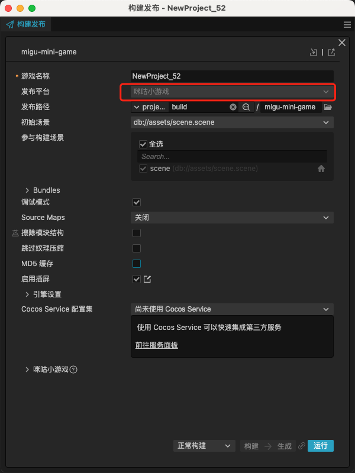
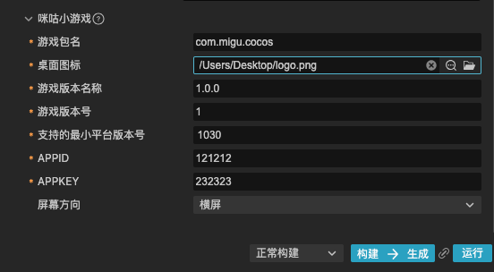
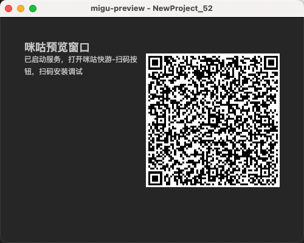
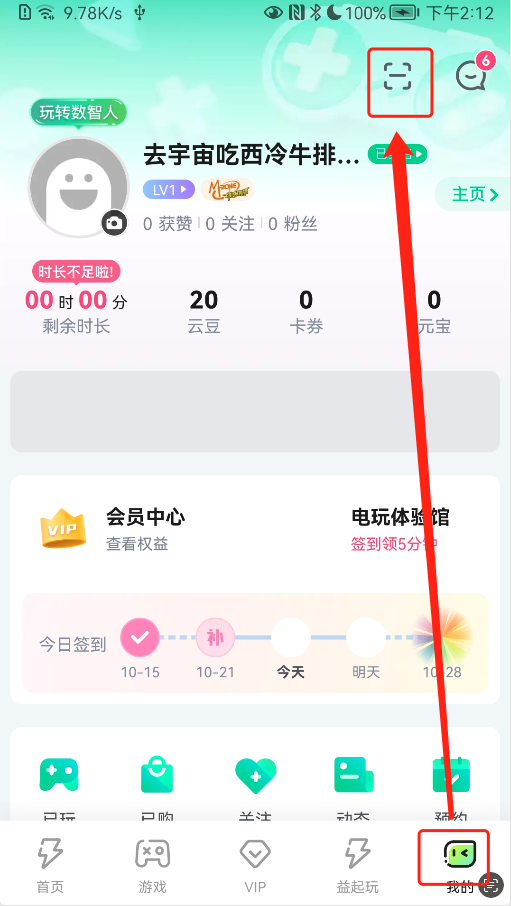

# 发布到咪咕小游戏

Cocos Creator 从 v3.8.5 开始支持将游戏发布到 **咪咕小游戏**。

## 准备工作

- 参考 [咪咕小游戏接入指南](https://open.migufun.com/document/detail?id=640)，在咪咕开放平台完成开发者入驻流程和应用创建。

- 下载 [咪咕快游](https://g.migufun.com/cocosdebugtool)，并安装到手机设备上。

- 咪咕快游最低版本为 Android 5.0。

## 发布流程

使用 Cocos Creator 打开需要发布的项目工程，从 **菜单栏 -> 项目** 中打开 **构建发布** 面板，**发布平台** 选择 **咪咕小游戏**。

通用构建选项的设置请参考 [通用构建选项](build-options.md)，咪咕小游戏特有的构建选项如下：

| 构建选项 | 可选 | 说明 | 字段名（用于命令行发布） |
| :------ | :--- | :--- | :--- |
| 游戏包名 | 必填项 | 游戏包名，根据开发者的需求进行填写，例如 `com.example.demo`。| `package` |
| 桌面图标 | 必填项 | 点击输入框后面的放大镜图标按钮选择所需的图标。构建时，图标将会被构建到咪咕小游戏的工程中。桌面图标建议使用 **png** 图片。 | `icon` |
| 游戏版本名称 | 必填项 | 游戏版本名称是真实的版本，如：1.0.0 | `versionName` |
| 游戏版本号 | 必填项 | **游戏版本号** 与 **游戏版本名称** 不同，**游戏版本号** 主要用于区别版本更新。每次提交审核时游戏版本号都要比上次提交审核的值至少 +1，一定不能等于或者小于上次提交审核的值，建议每次提交审核时游戏版本号递归 +1。 **注意**：**游戏版本号** 必须为正整数。 | `versionCode` |
| 支持的最小平台版本号 | 必填项 | 用于兼容性检查，避免上线后在低版本平台运行导致不兼容。具体填写的值可通过点击 [更新记录](https://open.migufun.com/document/detail?id=640) 来查看最新的 咪咕小游戏 引擎版本号。 | `minPlatformVersion` |
| APPID | 必填项 | 咪咕开放合作平台上为内容分配的 ID。构建时会写入到发布包目录下的 `manifest.json` 中。| `appId` |
| APPKEY | 必填项 | 咪咕开放合作平台上为内容分配的 Key。构建时会写入到发布包目录下的 `manifest.json` 中。| `appKey` |
| 屏幕方向 | 必填项 | 设备方向，可选值包括 `landscape` 和 `portrait`。构建时会写入到发布包目录下的 `manifest.json` 中。| `orientation` |

### 构建

**构建发布** 面板的构建选项设置完成后，点击 **构建并生成** 按钮。 
完成后点击 **构建任务** 左下角的文件夹图标按钮打开项目发布包，可以看到在默认发布路径 `build` 目录下生成了 `migu-mini-game`（以具体的构建任务名为准）文件夹，该文件夹就是导出的咪咕快游戏工程目录和 rpk，rpk 包在 `build/migu-mini-game/dist` 目录下。

若需要修改生成的 rpk 包，在修改完成后点击 **构建任务** 右下角的 **生成** 按钮，即可在不重新构建的情况下重新生成 rpk 包。

## 运行 rpk

在 **构建发布** 面板点击 **运行** 按钮，等待二维码界面生成

然后在 Android 设备上打开之前已经安装完成的 **咪咕快游**，在**我的**页面右上角点击**扫码**按钮，直接扫描二维码即可打开 rpk。

## 咪咕小游戏环境的资源管理

咪咕小游戏与微信小游戏类似，都存在着包体限制。咪咕小游戏的主包包体限制是 **5MB**，超过的部分必须通过网络请求下载。

当包体过大时，可在 **构建发布** 面板配置 **资源服务器地址** 选项，将低加载优先级的资源上传到远程服务器，详情请参考 [上传资源到远程服务器](../../asset/cache-manager.md)。

游戏启动之后引擎会自动下载远程服务器地址中的资源，资源下载后引擎的缓存管理器会记录资源的保存路径，用于在缓存空间不足时自动删除部分缓存的游戏资源。请参考 [缓存管理器](../../asset/cache-manager.md)。

## 参考链接

- [咪咕小游戏开发文档](https://open.migufun.com/document/detail?id=640)
- [咪咕快游下载](https://g.migufun.com/cocosdebugtool)