# 发布到 HarmonyOS Next

自 Cocos Creator v3.8.5 起，支持发布到 HarmonyOS Next 平台。

> 1. Cocos Creator 3.8.6 对 HarmonyOS Next 性能、功耗做了深度优化
> 2. Cocos Creator 3.8.7 对原生通信做了调整，更易使用。适配了鼠标键盘，支持鸿蒙PC。

## 准备工作

### 安装 Cocos Creator

1. Cocos Creator 下载传送门（版本>=3.8.5）：[Cocos Creator](https://www.cocos.com/creator-download)

### 安装 DevEco Studio

1. 进入 [DevEco Studio IDE](https://developer.huawei.com/consumer/cn/download/) 下载页面（需要登录华为开发者账号），选择对应平台的版本，点击右边的下载按钮，如下图：

    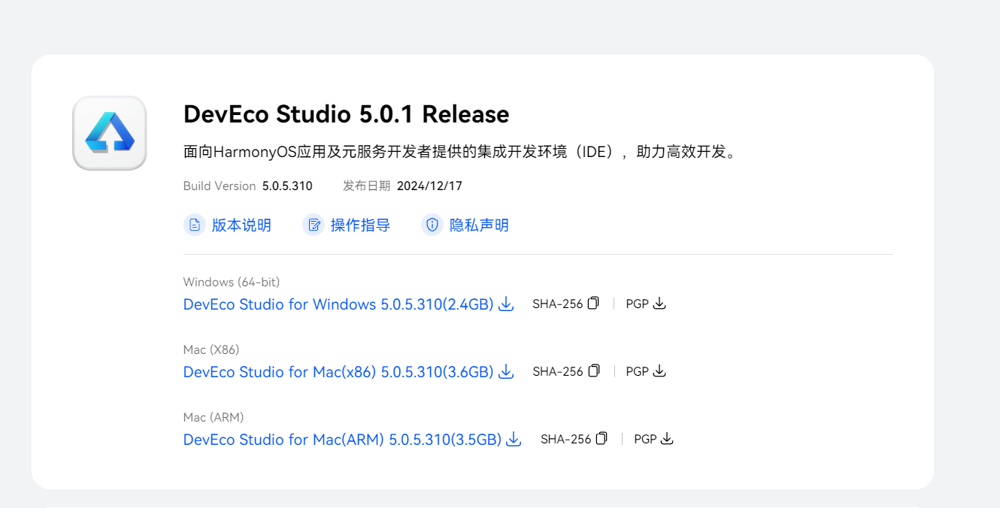

2. 解压目录，双击 deveco-studio-5.0.5.310.exe 进行安装，点击 Next，如下图：

    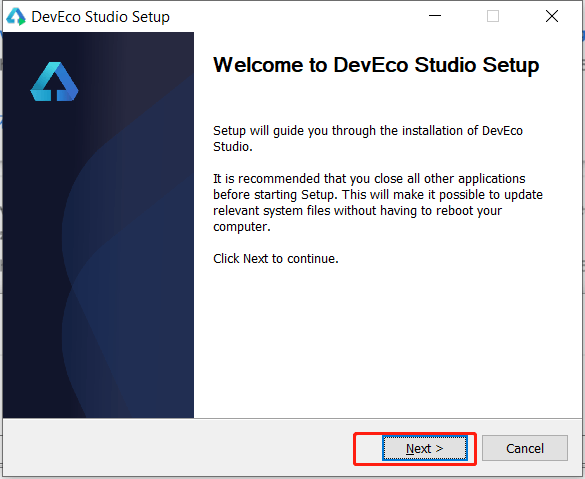

3. 选择安装路径，点 Next，如下图：

    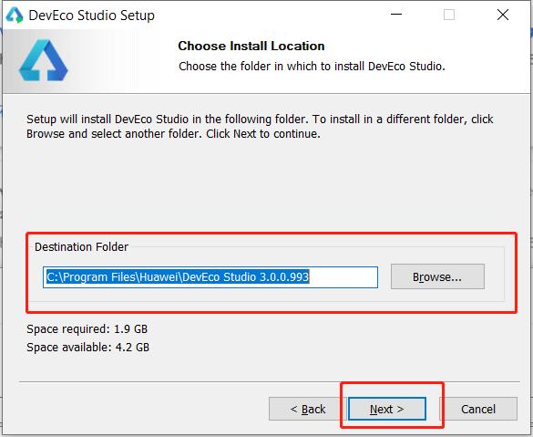

4. 根据需求配置，点击 Next，如下图:

    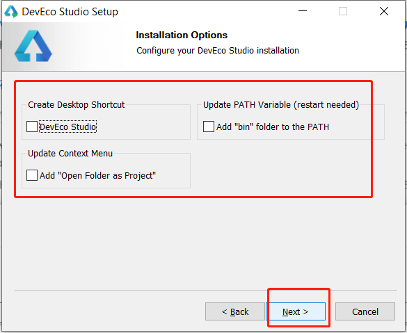

5. 点击安装，如下图：

    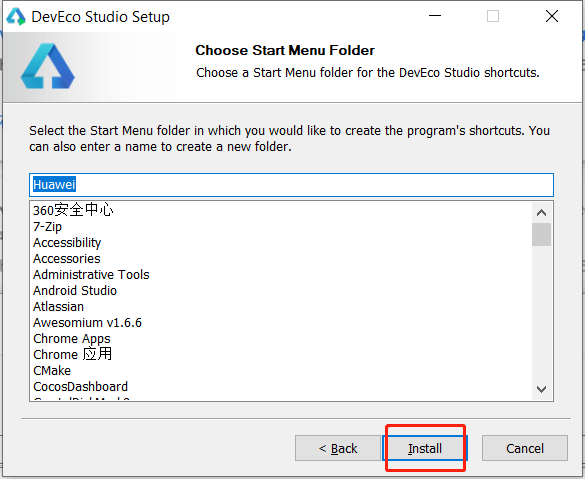

6. 等待安装，如下图：

    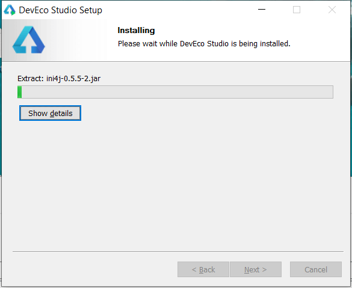

7. 安装完成，如下图：

    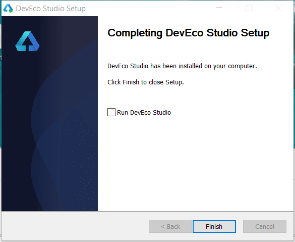


### Creator 构建 HarmonyOS Next工程

1. 使用 Cocos Creator 打开一个项目，以下以 [cocos-test-projects](https://github.com/cocos/cocos-test-projects/tree/v3.8) 为例，如下图：

    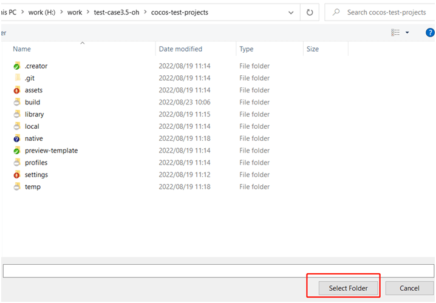


2. 选择标题栏中的 Project-\>Build，也可以使用 Ctrl+Shift+B 的快捷键，如下图：

    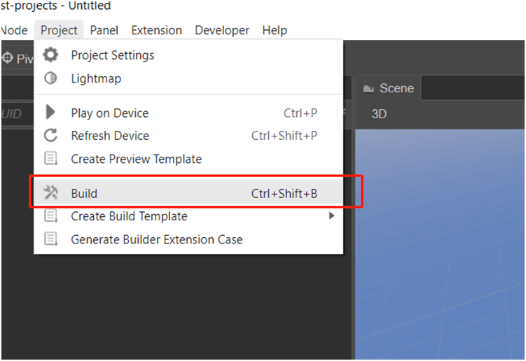

3. 点击新建任务，如下图：

    

4. 选择 HarmonyOS Next

    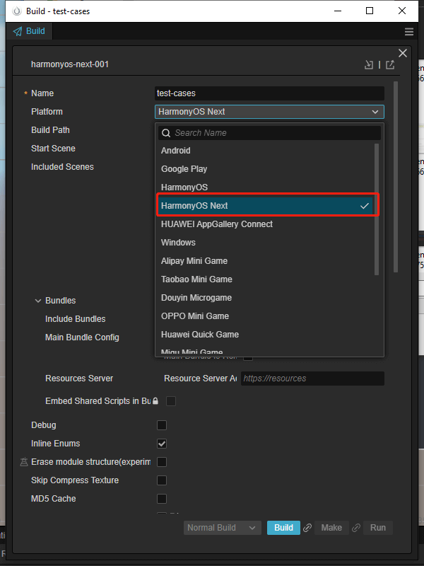


5. 配置工程名称、配置开始场景与包含的其他场景，配置 Debug/Release，如下图：

    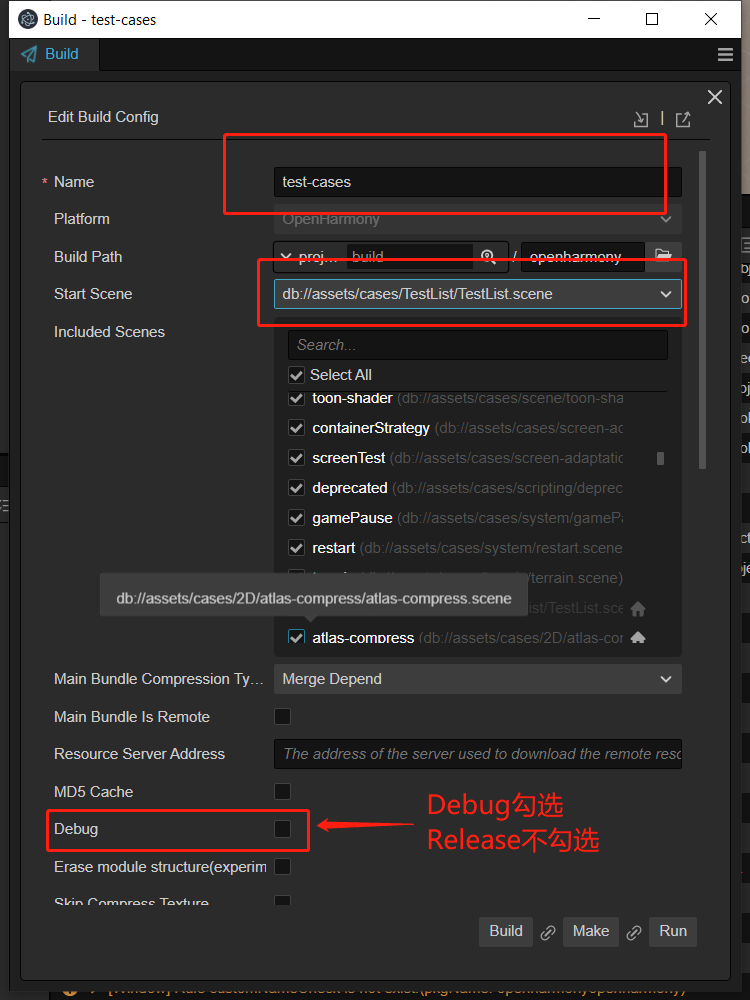

6. 配置 Javascript 引擎，目前支持V8、Ark、JSVM，如下图：

    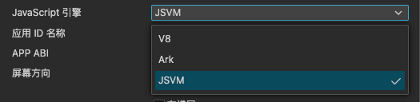

    > **注意**：建议使用 JSVM 以获得最优的游戏性能。

7. 目前 Make 与 Run 功能还未实现，请使用 DevEco Studio 打开工程
    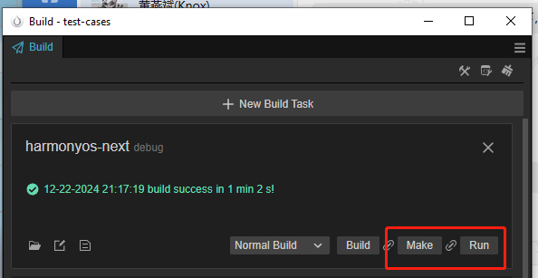

### DevEco Studio 编译运行

1. 使用[DevEcoStudio](https://developer.harmonyos.com/cn/develop/deveco-studio#download)，打开工程，如下图：

    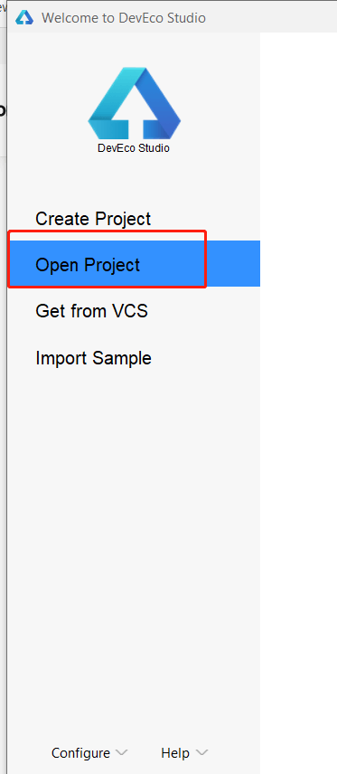
2. 找到工程目录（native/engine/harmonyos-next）并点击打开，如下图（下图是以[cocos-test-projects](https://github.com/cocos/cocos-test-projects)为例）：

    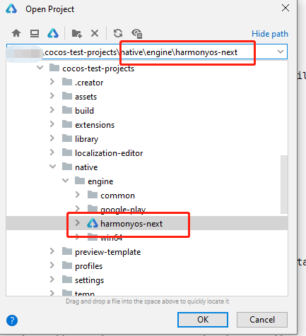

3. 配置签名，如下图：

    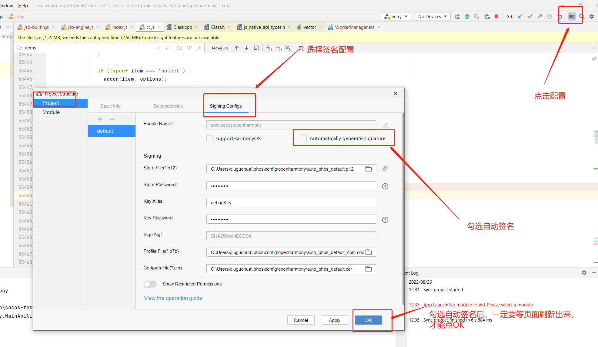

4. 插入设备，点击运行，如下图：

    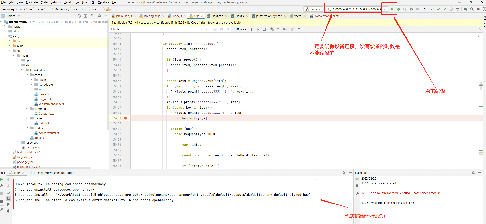

执行成功之后，就能看到效果了。

**注意：如果出现安装失败，可能是以下几种原因导致的。**

> 1. 包名冲突，请卸载之前安装的包，或者修改自己的 App 包名。
> 2. 签名失效，请进入 File -> Project Structure -> Signing Configs 配置签名
> 3. 签名更新，由于配置的自动签名，有可能签名会变，请卸载之前安装的 App 再启动即可。

## 原生工程目录

发布成功后，项目目录内容如下：

- **AppScope/app.json5**：应用的全局配置信息。
- **entry/src/main/**：应用的主模块，编译构建生成一个 HAP 包。
  - **cpp/**：存放 so 包导出的接口描述文件和依赖配置文件，比如 libcocos.so。
  - **ets/**：存放 ArkTS/TS 相关文件。
    - **cocos/oh-adapter/sys-ability-polyfill.js**：一些系统接口的Ark调用方法。
    - **cocos/WorkerManager.ets**：worker 管理类。
    - **common/PortProxy.ts**：worker 代理类，用于主线程和 worker 线程通信。
    - **components/**：Videoplayer、Webview、Editbox 的 ArkTS 实现。
    - **entryability/EntryAbility.ts**：ability，程序入口，管理 ability 生命周期和窗口。
    - **pages/index.ets**：page 页面用于渲染页面，初始化 worker，系统接口的调用通常在此调用。
  - **workers/cocos_worker.ts**：worker 线程文件，通过 worker 接收主线程消息。
  - **resources/**：resources 文件夹，存放 cocos 游戏 js 文件和资源。
  - **module.json5**：应用配置文件，包括权限、旋转属性、启动设置等。
- **entry/build-profile.json5**：应用级配置信息，包括签名、产品配置等。
- **hvigorfile.ts**：应用级编译构建任务脚本。
- **oh-package.json5**：工程级依赖配置文件，用于存放依赖库的信息。

## JSVM、V8、ArkTS 的选择

> 推荐使用 JSVM!

由于历史原因，目前支持 JSVM、V8、ArkTS 三种脚本机制，区别如下：
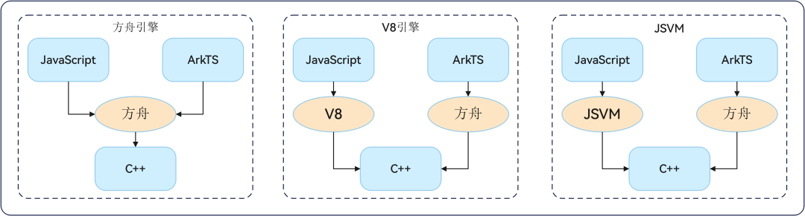

1. 不管如何选择， 项目中的 ArkTS 代码均在方舟引擎环境中执行。
2. 选择 Ark 后，引擎中的 TS/JS 代码在方舟引擎环境中执行。
3. 选择 V8 后，引擎中的 TS/JS 代码在 V8 虚拟机中执行。
4. 选择 JSVM 后，引擎中的 TS/JS 代码在 JSVM 中执行。

不同的选择，也影响 JIT和热更新功能

| 引擎    |  JIT   |  热更新   |
| --- | --- | --- |
|  JSVM   |  支持   |   支持  |
|  V8   |   不支持  |  支持   |
|  Ark   |   暂不支持  |  暂不支持   |

因此， JSVM 是综合来看的最佳选择。

## Cocos 与 HarmonyOS Next 原生通信

详细的通信机制，请参考 [基于反射机制实现 JavaScript 与 HarmonyOS Next 系统原生通信](../../advanced-topics/arkts-reflection.md)。

## 几个注意事项

另外，因为 HarmonyOS Next 还在不断完善当中，因此有些已知问题。这些问题都会在后续的版本解决。

- Ark 不支持 Restart，JSVM 与 V8 是支持的。
- 编译失败时，可能是内存不足导致，退出部分应用，重新 build 试试；
    >>
    >> 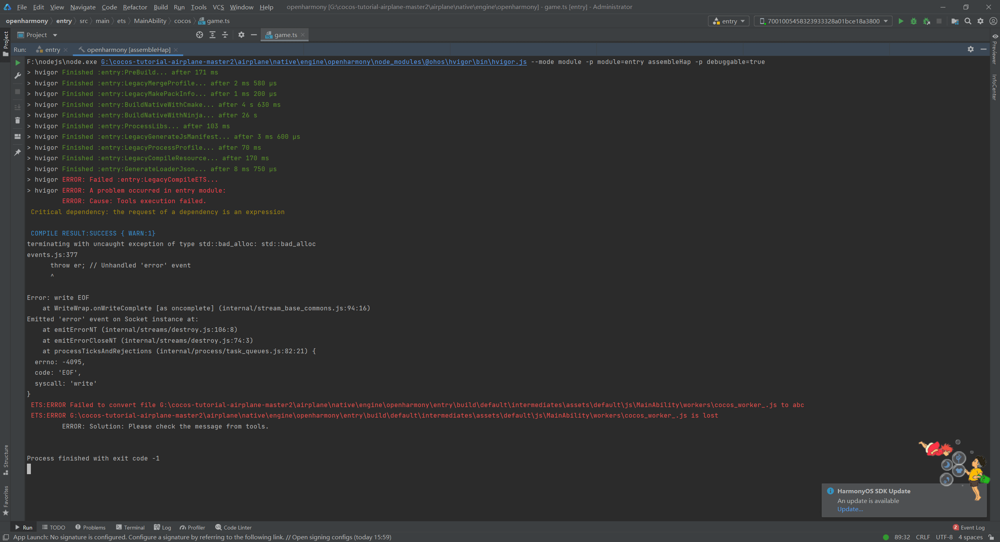
- 更新IDE，编译报错,如下图：
   >> 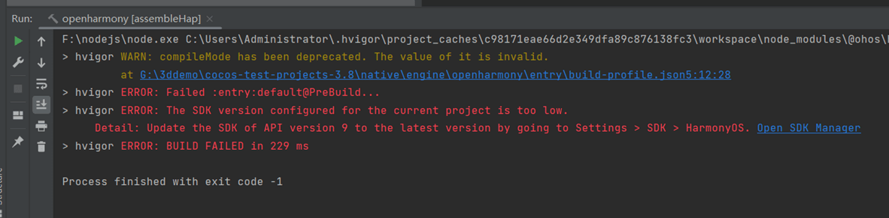
- Mac 版 IDE 编译报错，报错信息为:

    ```txt
    npm ERR! Your cache folder contains root-owned files, due to a bug in
    npm ERR! previous versions of npm which has since been addressed.
    ```

    解决方法:

    在设备终端中执行命令 `sudo chown -R 502:20 "/Users/修改为你的设备用户名/.npm"`，之后重新编译项目
