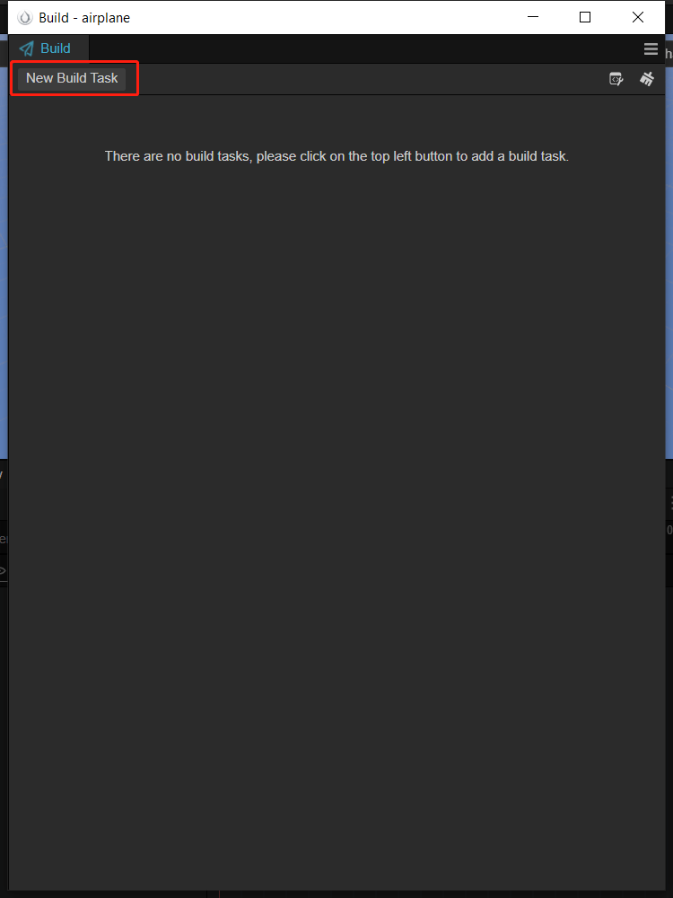

# 发布到 HarmonyOS Next

自 Cocos Creator v3.8 起，支持发布到 HarmonyOS Next 平台。

## 支持情况

| 引擎版本 | HarmonyOS Next 版本 | 说明 |
| :-- | :-- | :-- |
| v3.6.1 ~ v3.7.3 | OpenHarmony 3.2 beta | 该版本在社区公测，因此无法从 Dashboard 直接下载，开发者请从 [社区下载](https://forum.cocos.org/t/topic/141299) |
| v3.8 | OpenHarmony 3.2，OpenHarmony 4.0 | 正式版，开发者可以选择从 Dashboard 中直接下载该编辑器版本。 |
| v3.8.3 | HarmonyOS Next | 正式版，开发者可以选择从 Dashboard 中直接下载该编辑器版本。 |

如果您使用的引擎版本低于 v3.8，我们建议您升级到 v3.8 方便发布正式版。

## 准备工作
### 安装最新的Creator
1. Cocos Creator 下载传送门（版本>=3.8.5）：[Cocos Creator](https://www.cocos.com/creator-download)

### 安装 DevEco Studio

1. 下载最新的 IDE，下载对应平台的 IDE，点击右边的下载按钮，如下图：

    

2. 解压目录，双击 deveco-studio-5.0.5.310.exe 进行安装，点击 next，如下图：

    

3. 选择安装路径，点 next，如下图：

    

4. 根据需求配置，点击 next，如下图:

    

5. 点击安装，如下图：

    

6. 等待安装，如下图：

    

7. 安装完成，如下图：

    

8. 启动DevEco Studio，如下图:

    

9. 首次会提示设置源，默认应该就可以，如下图:

    

10. 首次安装需要安装 Node.js，如果之前安装有 Node.js，选择本地的 Node.js 即可，但是有版本要求，Node.js 的版本必须大于 v14.19.1和小于 v15.0.0。npm 的版本要求大于 6.14.16 和小于 7.0.0。如下图：

    

11. 这里选择下载新的 Node.js 为例，如下图:

    

12. 等待下载完成，然后点击 Finish 按钮，如下图：

    

13. 确认版本信息，点击 next，如下图：

    

14. 选择 Accept 之后，选择 Next，如下图：

    

15. 等待下载完成，之后点击 Finish 即可，如下图：

    

### Creator构建HarmonyOS Next工程
1. 选择工程的目录，以下以 [cocos-test-projects](https://github.com/cocos/cocos-test-projects/tree/v3.8) 为例，如下图：

    

2. 登录开发者账号，如下图：

    

3. 根据创建游戏，增加游戏逻辑等

4. 制作完成之后，选择构建，选择标题栏中的 Project-\>Build，也可以使用 Ctrl+Shift+B 的快捷键，如下图：

    

5. 点击新建任务，如下图：

    

6. 选择 HarmonyOS Next

    

7. 配置工程名称、配置开始场景与包含的其他场景，配置Debug/Release，点击 build，如下图：

    

8. 目前Make与Run功能还未实现，请使用DevEco打开工程
    


## HarmonyOS Next系统接口与Cocos交互
目前cocos与ark是分两个线程的，一个是UI线程，跑的是ark引擎，另一个是worker线程，可以跑ark/v8引擎。所以这里要分两种情况：
### cocos使用ark 引擎
这样globalThis与cocos的globalThis是一致的，也就是说给globalThis赋值，在cocos上可以直接使用globalThis获取。
参考实现(构建HarmonyOS Next工程，使用deveco打开工程，查看：entry/src/main/ets/cocos/oh-adapter/sys-ability-polyfill文件的实现)：
```
globalThis.getSystemLanguage = function () {
  return i18n.getSystemLanguage();
}

在cocos上，可以直接使用
globalThis.getSystemLanguage();
```

但是并不是所有的接口都可以这样封装，由于部分HarmonyOS Next的系统接口是只能在UI线程上使用的，例如tts与asr等接口；还有些UI操作相关的接口，例如editbox，video等。

这样必须使用进程间的通信机制来完成

cocos封装了一个类，名为ProxyPort类，这个是个公共类，同时可以在ui线程与worker线程上使用。可以通过使用proxyport接口互相发送消息。例如，在ui线程上（即ets布局文件与ability等文件）使用：
```
// entry/src/main/ets/pages/index.ets文件
// 监听从worker上发送的消息，即cocos发送的消息；
this.workPort.on('createWebview', (param: number)=> {
    this.webViewArray.push(new WebViewInfo(0, 0, 0, 0, param));
    this.webViewIndexMap.set(param, this.webViewArray.length - 1);
});

// entry/src/main/ets/components/CocosVideoPlayer.ets文件
// 在UI线程上，把事件派发给worker线程（即cocos）。
this.workPort?.postMessage("onVideoEvent", {
    videoTag: this.videoInfo.viewTag as number,
    videoEvent: EventType.PLAYING as EventType
} as param);

// entry/src/main/ets/workers/cocos_worker.ts 文件
// 在worker线程（即cocos）上，接收来着ui线程发送的消息
// 这里相当于中转，对游戏来说是只关心回调。
uiPort.on("onVideoEvent", (param) => {
  // @ts-ignore
  if (globalThis.oh && typeof globalThis.oh.onVideoEvent === "function") {
    // @ts-ignore 
    // 回调至业务代码
    globalThis.oh.onVideoEvent(msg.param.videoTag, msg.param.videoEvent, msg.param.args);
  }
});

```

### cocos使用V8引擎
使用V8，则不能使用globalThis来进行互相调用，因为globalThis已经是两个不同的东西；
因此需要交互的话，需要通过native进行绑定。

绑定分为两个部分：
- ark通过napi接口与native进行绑定；
- V8通过接口绑定到native

这样就可以在native里进行互相调用；
例如：
```
// entry/src/main/ets/cocos/oh-adapter/sys-ability-polyfill文件的实现
globalThis.getSystemLanguage = function () {
  return i18n.getSystemLanguage();
}

```

在native里：

```
// getCurrentLanguageCode是js上的jsb.__getCurrentLanguageCode的实现
std::string System::getCurrentLanguageCode() const {
    // 通过napi调用ark引擎上的getSystemLanguage接口
    auto ret = NapiHelper::napiCallFunction("getSystemLanguage");
    if (!ret.IsString()) {
        return {};
    }
    auto str = ret.As<Napi::String>().Utf8Value();
    std::string::size_type pos = str.find('-');
    if(pos != std::string::npos) {
        str = str.substr(0, pos);
    }
    return str;
}
```


## 几个注意事项
另外，因为 HarmonyOS Next 还在不断完善当中，因此有些已知问题。这些问题都会在后续的版本解决。
1. 目前已知问题是：
    - restart 目前还未有方案；
    - 编译失败时，可能是内存不足导致，退出部分应用，重新 build 试试；
        >>
        >> 
    - 更新IDE，编译报错,如下图：
       >> 


