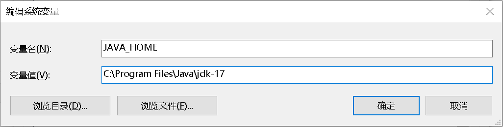
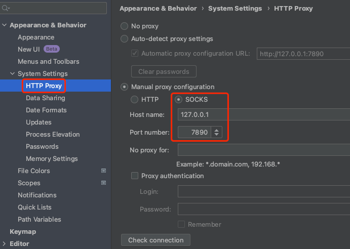

# 安装配置原生开发环境

Cocos Creator 支持将项目构建为符合不同平台规范的原生应用工程。在开始构建发布原生应用之前，开发者需要先配置好相关的原生开发环境。

### 下载 Java SDK（JDK）

编译 Android 工程需要运行设备上有完整的 Java SDK 工具，请到以下地址下载与设备操作系统和架构匹配的安装包：

[JDK Development Kit 17.0.7 downloads](https://www.oracle.com/java/technologies/downloads/#java17)

通常 Windows 系统设备安装完 JDK 之后，还需要在环境变量中添加 `JAVA_HOME` 系统变量。通过 `右键点击我的电脑 -> 选择属性 -> 打开高级系统设置 -> 环境变量` 等步骤查看和修改环境变量。需要添加的变量名与值如下图所示(变量值为 JDK 安装路径)，添加之后重启电脑即可生效。



在 Mac 终端或者 Windows 命令行工具中输入下方命令行验证 Java 环境是否配置成功，若执行后能够显示版本信息则表示安装成功。

```
java -version
```

如果系统中使用的是 JRE，则需要安装 [JAVA SE 运行环境](http://www.oracle.com/technetwork/java/javase/downloads/index.html)。

> **注意**：[OpenJDK](https://openjdk.org/) 和 JDK 仅是开源协议不同，功能和配置方法没有本质区别。

## 下载 Android Studio

不同版本的 CocosCreator 引擎通常兼容不同版本的 Android Studio。用户可以根据下方版本推荐信息，前往 [Android Studio 历史版本](https://developer.android.com/studio/archive?hl=zh-cn) 下载对应的 IDE。

| CocosCreator 引擎版本范围 |   Android Studio 推荐使用版本
| :-------------- | :----------- |
| v2.4.12 及以上 或 v3.8.0 及以上 | 2022.2.1 或 2022.3.1
| v2.4.11 及以下 或 v3.0.0 ~ 3.7.4 | 2020.3.1 或更早的版本

## 下载 Android 平台所需的 SDK 和 NDK

安装 Android Studio 完成后，参考官方文档，打开 SDK Manager：[SDK Manager 使用说明](https://developer.android.google.cn/studio/intro/update.html#sdk-manager)。

1. 在 SDK Platforms 分页栏，勾选你希望安装的 API Level，推荐选择主流 API Level 26（8.0）、API Level 28（9.0）等。
    * [查看 API Level 对应的 Android 系统版本](https://developer.android.google.cn/tools/releases/platforms)
    * [查看引擎支持的最低系统版本](../../advanced-topics/supported-versions.md)
2. 记住此时窗口上的 **Android SDK Location** 路径，后续将用于在 Cocos Creator 编辑器中配置 SDK 与 NDK 路径。
3. 打开 SDK Tools 分页栏，在安装所需工具前，需要勾选右下角的 **Show Package Details** 显示不同版本的工具。
4. 在 **Android SDK Build-Tools** 里，选择最新的 build tools 版本。
5. 勾选 **Android SDK Platform-Tools** 和 **CMake**，如需安装 Android 支持库，请参考 [官方文档 — 支持库设置](https://developer.android.google.cn/topic/libraries/support-library/setup)。
6. 勾选需要下载的 **NDK** 版本。推荐选择 **r21 ~ 23** 范围的版本避免意外的适配错误。
7. 点击 **Apply** 之后进行安装，后续如果需要删除已安装的工具，也可以在此处进行。

    

### 无法下载 SDK 或 NDK 的解决方案
因为网络安全的原因，有时候国内用户下载 Google 服务器上的软件工具会出现下载失败或者下载速度慢的问题，可以尝试以下方法：

* 在 Android Studio 中配置 HTTP 代理：

    **自动配置代理**：根据菜单路径 `Setting -> Appearance & Behavior -> System Settings` 打开 HTTP Proxy 页面，勾选 Auto-detect proxy settings，填入镜像源后点击 Apply 即可。

    

    **可选的镜像源**：安卓 SDK 以及 Gradle 都会有一些镜像源用于帮助您解决无法从官网下载的问题，镜像源存在更新滞后以及失效的可能性，如果无法解决问题则用户需要自行寻找有效镜像源。

    | 镜像源 | 地址 |
    | :--- | :--- |
    | 腾讯 | <https://mirrors.cloud.tencent.com/AndroidSDK/> |
    | 阿里云 | <https://mirrors.aliyun.com/android.googlesource.com/> |

* 在 Android Studio 中配置 VPN 代理：

    **手动配置代理**：根据菜单路径 `Setting -> Appearance & Behavior -> System Settings` 打开 HTTP Proxy 页面，勾选 Manual proxy configuration，填入你的本地 VPN IP 地址与端口，点击 Apply 即可：

    

    > 注意：如果遇到开启 VNP 代理后反而下载速度慢的问题，请关闭 VPN 代理配置。

* 手动下载 NDK 并为项目配置 NDK 路径：
    
    **手动下载**：在 [NDK 历史版本](https://github.com/android/ndk/wiki/Unsupported-Downloads) 找到所需版本下载。（可能需要开启 VPN 代理）下载并解压到本地目录后，在 Cocos Creator 编辑器中配置 NDK 路径。

    

## 安装 Windows 与 Mac/iOS 的发布环境

- Windows 下需要安装 [Visual Studio 2019/2022 社区版](https://www.visualstudio.com/downloads/download-visual-studio-vs)。在安装 Visual Studio 时，请勾选 **使用 C++ 的桌面开发** 和 **使用 C++ 的游戏开发** 两个模块。
- Visual Studio 安装后可用于构建发布 Windows 平台游戏。

  > **注意**：安装 Visual Studio 时请勿勾选 **使用 C++ 的游戏开发** 模块中的 **Cocos** 选项。

- Mac 下需要安装 Xcode 14 及以上版本，[前往下载](https://apps.apple.com/us/app/xcode/id497799835)。
- XCode 安装后可用于构建发布 Mac & iOS 平台游戏。

## 配置安卓工程构建发布环境路径

原生项目构建与编译环境安装成功后，需要到 Cocos Creator 编辑器中配置开发环境路径，不需要编译 Android 平台的话这里可以跳过。<br>
在主菜单中选择 **Cocos Creator -> 设置**，打开 **偏好设置** 面板，我们需要在 **程序管理器** 页面中配置 Android SDK 与 NDK 的路径：

- **Android SDK**：填入已安装 SDK 的 `Android SDK Location` 路径（Android SDK 的目录下应该包含 `build-tools`、`platforms` 等文件夹）

- **Android NDK**：根据已安装 SDK 的 `Android SDK Location` 路径，在其中找到 ndk 文件夹。ndk 文件夹存放用户选择下载的不同版本 NDK。在 **程序管理器** 的 `安卓 NDK` 一栏填入你下载的 NDK 版本的路径

  > **注意**：新版本 Android Studio 的 NDK 可下载多版本并存放在 ndk 目录下，但是老版本 Android Studio 只能下载一个版本的 NDK 存在 `ndk-bundle` 文件夹中。

    

> **注意**：这里的配置会在编译 **原生工程** 的时候生效。如果没有生效（一些 Mac 机器有可能出现这个情况），可能需要您尝试到 **系统环境变量** 设置这些值：`NDK_ROOT`、`ANDROID_SDK_ROOT`。

## 注意事项

在之前的版本中收到了很多原生打包的问题反馈，这里补充一些可能的问题原因。

1. 包名问题

    检查 **构建发布** 面板中的包名，具体命名规范请参考相应原生平台中的 [构建选项说明](./native-options.md#%E6%9E%84%E5%BB%BA%E9%80%89%E9%A1%B9)。

2. Android 编译成功，但运行时提示 `dlopen failed: cannot locate symbol "xxxx" referenced by "libcocos.so"...`

    请检查 NDK 和 Android SDK 的架构和版本是否和测试用的 Android 系统相对应，另外可以尝试使用本文所用的 NDK 和 Android SDK 版本来测试。

3. JDK 版本问题

    升级 Android Studio 和 Gradle 的版本后，需要将 JDK 版本升级到 17 或其指定版本。这样可以确保你的开发环境与最新的 Android Studio 和 Gradle 版本兼容。

最后，如果依然打包失败，请附上详细的复现步骤及报错信息通过 [论坛](https://forum.cocos.org/c/58) 反馈给我们。
