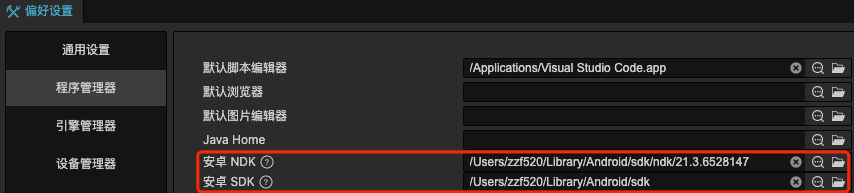

# 安装配置原生开发环境

Cocos Creator 可以跨平台发布多个平台的原生应用，在使用 Cocos Creator 打包发布到原生平台之前，我们需要先配置好相关的原生开发环境。

本文档提供了特定的开发环境要求，我们对这些指定环境的运行进行了验证和保证。然而，请注意，我们无法确保在除指定环境之外的其他环境下能够完全运行。如果您在非指定环境下遇到任何问题，请不要犹豫，欢迎您到我们的论坛或支持渠道进行反馈。我们的社区将竭诚帮助您解决问题，并收集相关反馈以改进我们的文档和工具。

## Android 平台相关依赖

要发布到 Android 平台，需要安装以下全部开发环境依赖。如果不需要发布到 Android 平台或者操作系统上已经有完整的 Android 开发环境，可以跳过这部分内容。

### 下载 Java SDK（JDK）

编译 Android 工程需要本地电脑上有完整的 Java SDK 工具，请到以下地址下载：

[JDK Development Kit 17.0.7 downloads](https://www.oracle.com/java/technologies/downloads/#java17)


下载时注意选择和本机匹配的操作系统和架构，下载完成后运行安装程序即可。

安装后请检查 JAVA 环境，在 Mac 终端或者 Windows 命令行工具中输入下面代码来查看：

```
java -version
```

显示为 JAVA SE 则没有问题，如果系统中使用的是 JRE，则需要安装 [JAVA SE 运行环境](http://www.oracle.com/technetwork/java/javase/downloads/index.html)。

如果是 Windows 系统，请确认你的环境变量中包含 `JAVA_HOME`。可以通过右键点击我的电脑，选择属性，打开高级选项卡中来查看和修改环境变量。修改完成后 Windows 平台可能需要重启电脑才会生效。参考 [如何设置或更改 JAVA 系统环境变量](https://www.java.com/zh_CN/download/help/path.xml)

### 下载安装 Android Studio

Cocos Creator 需要使用 **Android Studio Flamingo | 2022.2.1** 作为安卓平台的构建工具，并在 Android Studio 中下载所需的 SDK 和 NDK 包。首先请 [安装 Android Studio](https://developer.android.com/studio)。

### 下载发布 Android 平台所需的 SDK 和 NDK

安装 Android Studio 完成后，参考官方文档，打开 SDK Manager：[SDK Manager 使用说明](https://developer.android.google.cn/studio/intro/update.html#sdk-manager)。

1. 在 SDK Platforms 分页栏，勾选你希望安装的 API Level，也就是支持安卓系统的版本，推荐选择主流 API Level 26（8.0）、API Level 28（9.0）等。
2. 在 SDK Tools 分页栏，首先勾选右下角的 **Show Package Details**，显示分版本的工具选择。
3. 在 **Android SDK Build-Tools** 里，选择最新的 build tools 版本。
4. 勾选 **Android SDK Platform-Tools** 和 **CMake**，如需安装 Android 支持库，请参考 [官方文档 — 支持库设置](https://developer.android.google.cn/topic/libraries/support-library/setup)。
5. 勾选 **NDK**，推荐使用版本为 **r21~23**。
6. 记住窗口上方所示的 **Android SDK Location** 指示的目录，稍后我们需要在 Cocos Creator 编辑器中填写这个 SDK 所在位置。
7. 点击 **OK**，根据提示完成安装。


## 安装 C++ 编译环境

请安装以下运行环境：

- Windows 下需要安装 [Visual Studio 2019/2022 社区版](https://www.visualstudio.com/downloads/download-visual-studio-vs)。在安装 Visual Studio 时，请勾选 **使用 C++ 的桌面开发** 和 **使用 C++ 的游戏开发** 两个模块。

  > **注意**：在 **使用 C++ 的游戏开发** 模块中有一个 **Cocos** 选项，请勿勾选。

- Mac 下需要安装 Xcode 14.3 和命令行工具，[下载页](https://developer.apple.com/xcode/download/)。

## 配置原生发布环境路径

下载安装好开发环境依赖后，回到 Cocos Creator 中配置构建发布原生平台的环境路径。在主菜单中选择 **Cocos Creator/File -> 偏好设置**，打开 **偏好设置** 面板，我们需要在 **外部程序** 栏中配置以下两个路径：



- **Android NDK**：选择刚才在 Android Studio 中的 `Android SDK Location` 路径下的 `ndk-bundle` 文件夹（NDK 是其根目录），不需要编译 Android 平台的话这里可以跳过。

  > **注意**：新版本 Android Studio 的 NDK 可下载多版本，之前的 `ndk-bundle` 文件名更改为 `ndk`，可在 `ndk` 目录下根据需要选择具体版本的 NDK。

- **Android SDK**：选择刚才在 Android Studio 的 SDK Manager 中记下的 `Android SDK Location` 路径（Android SDK 的目录下应该包含 `build-tools`、`platforms` 等文件夹），不需要编译 Android 平台的话这里可以跳过。

配置完成后会自动保存。

> **注意**：这里的配置会在编译 **原生工程** 的时候生效。如果没有生效（一些 Mac 机器有可能出现这个情况），可能需要您尝试到 **系统环境变量** 设置这些值：`NDK_ROOT`、`ANDROID_SDK_ROOT`。

## 注意事项

在之前的版本中收到了很多原生打包的问题反馈，这里补充一些可能的问题原因。

1. 包名问题

    检查 **构建发布** 面板中的包名，具体命名规范请参考相应原生平台中的 [构建选项说明](./native-options.md#%E6%9E%84%E5%BB%BA%E9%80%89%E9%A1%B9)。

2. Android 编译成功，但运行时提示 `dlopen failed: cannot locate symbol "xxxx" referenced by "libcocos.so"...`

    请检查 NDK 和 Android SDK 的架构和版本是否和测试用的 Android 系统相对应，另外可以尝试使用本文所用的 NDK 和 Android SDK 版本来测试。

3. JDK 版本问题

    升级 Android Studio 和 Gradle 的版本后，需要将 JDK 版本升级到 17 或其指定版本。这样可以确保你的开发环境与最新的 Android Studio 和 Gradle 版本兼容。

最后，如果依然打包失败，请附上详细的复现步骤及报错信息通过 [论坛](https://forum.cocos.org/c/58) 反馈给我们。
