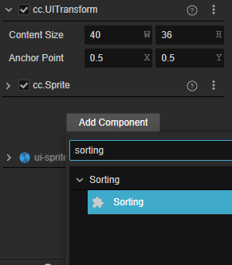
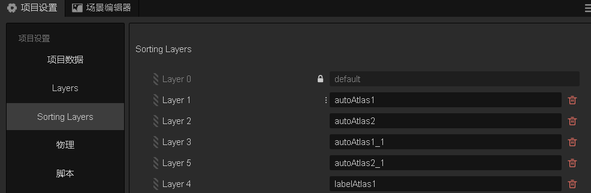
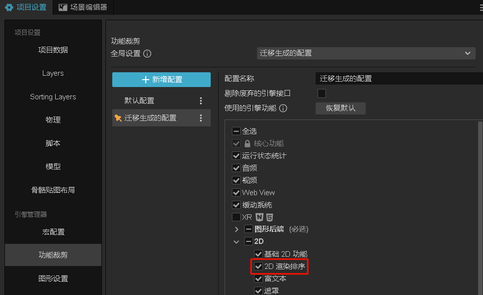
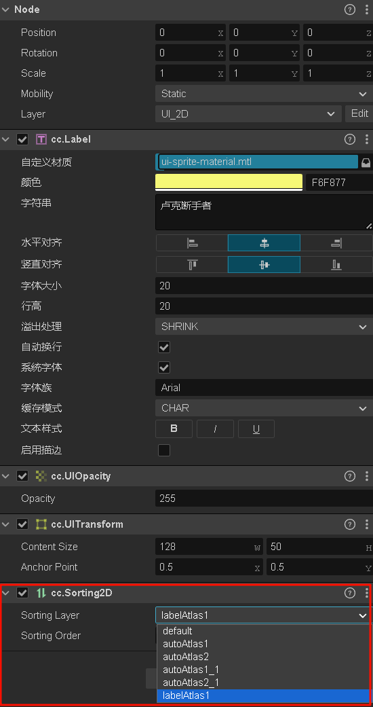

# 2D 渲染排序组件

使用 Sorting2D 组件可以在不影响节点的原有层级关系时自定义 2D 渲染对象的渲染顺序，可以用于解决因为相邻渲染对象使用不同材质而导致的 DrawCall 增加问题。


在 **属性检查器** 内点击 **添加组件** 按钮选择 **Sorting** 即可添加。



## Sorting2D 属性介绍

| 属性 |   功能说明
| :-------------- | :----------- |
| sortingLayer | 设置渲染对象的排序层级 [**修改项目的排序层级配置**](../../editor/project/index.md#排序图层)，层级越低的越先渲染。默认层级为 Default。
| sortingOrder | 设置渲染对象在排序层级下的顺序。如果排序层级相同，则数值越小的越先渲染。如果数值相同，则按照节点层级越低越先渲染。

**注意**：当 2D 节点树递归收集渲染元素的过程中遇到 Mask 渲染器，会使用自定义排序规则渲染已记录的 2D UI，并重置渲染状态、重新收集渲染元素，等到收集完成时再继续使用自定义排序规则渲染其余 2D UI。

## 优化示例

1. 在项目中配置排序层级

    

2. 勾选 `项目设置 -> 功能裁剪` 中的 `2D 渲染排序` 模块

    

3. 给 2D UI 节点添加 Sorting2D 组件，并设置排序层级和顺序。

    

3. 构建项目，运行并查看优化效果

    * 优化前
    

    * 优化后
    

## 在代码中修改 Sorting2D 组件的排序层级和顺序

```typescript
import { _decorator, Component, find, Node, settings, Sorting2D } from 'cc';
const { ccclass, property } = _decorator;

const sortingLayers = settings.querySettings("engine", "sortingLayers");
const default_layer = sortingLayers[0].value;
const autoAtlas_1_layer = sortingLayers[1].value;
const autoAtlas_2_layer = sortingLayers[2].value;
const autoAtlas_1_1_layer = sortingLayers[3].value;
const label_layer = sortingLayers[4].value;

@ccclass('NewComponent')
export class NewComponent extends Component {

    start() {
        var testNode = find("Canvas/test");
        if (testNode) {
            this.changeUISortingLayer(testNode, autoAtlas_1_layer, 0);
        }
    }

    changeUISortingLayer(sortingNode: Node, sortingLayer: number, sortingOrder?: number) {
        if (sortingNode.getComponent(Sorting2D)) {
            sortingNode.getComponent(Sorting2D).sortingLayer = sortingLayer;
            if (sortingOrder !== undefined) {
                sortingNode.getComponent(Sorting2D).sortingOrder = sortingOrder;
            }
        }
    }
}
```

## API 参考与使用范例

[Sorting2D API](https://docs.cocos.com/creator/3.8/api/zh/class/Sorting2D)

[Sorting2D Demo](https://github.com/cocos/cocos-test-projects/tree/v3.8.7/assets/cases/ui/other/sorting2D)