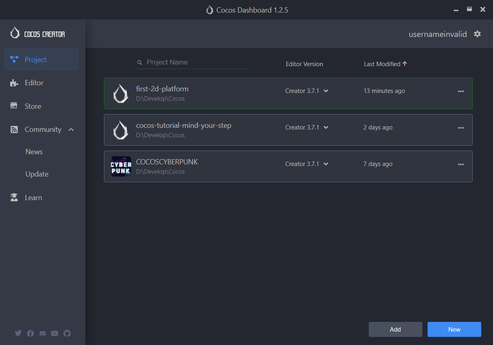
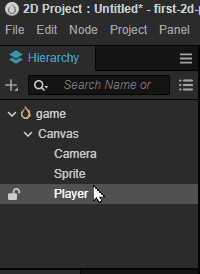
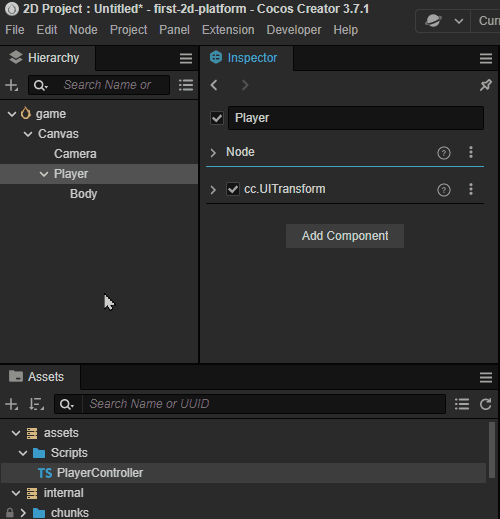
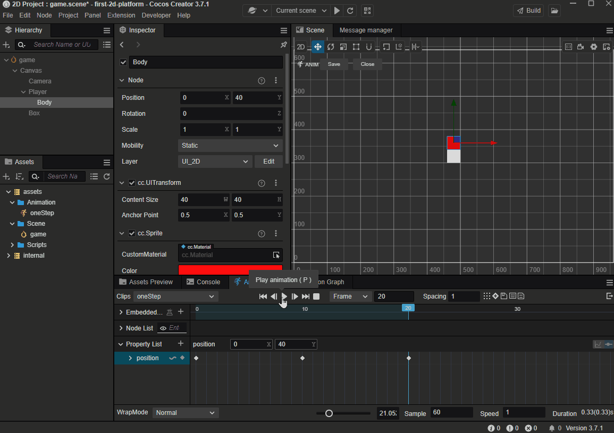
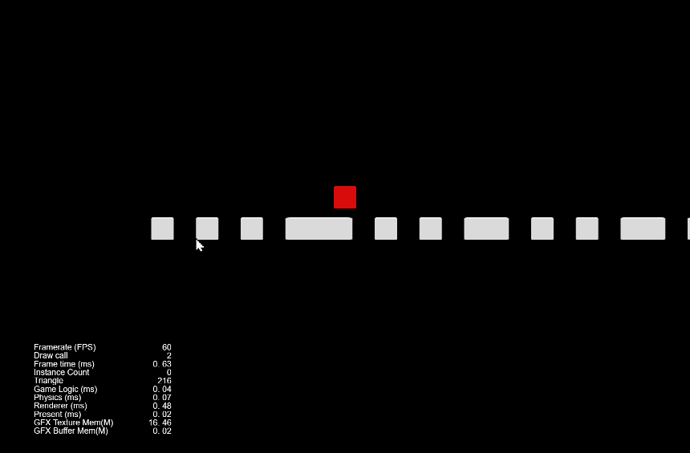
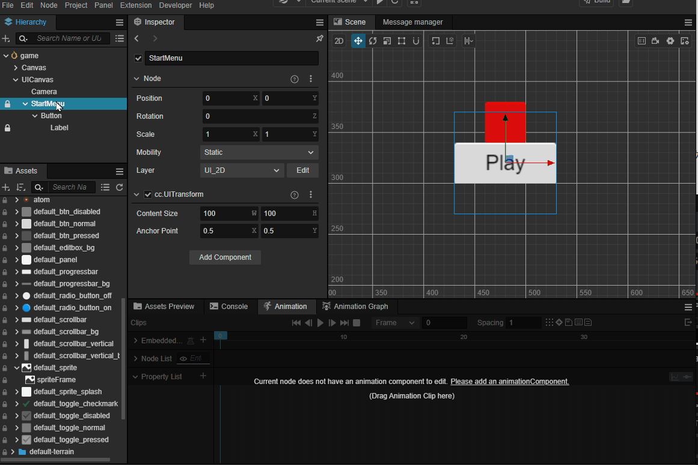
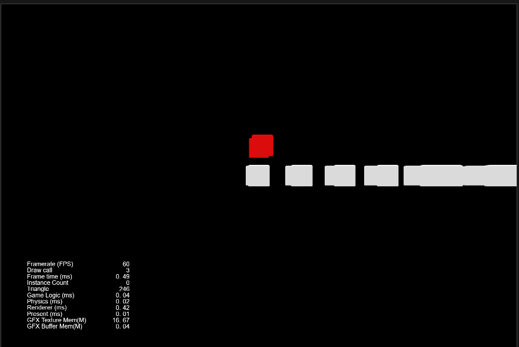
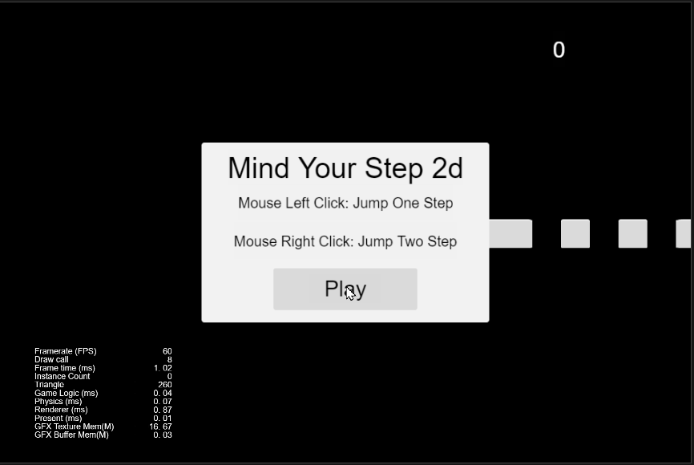

# 快速上手：制作第一个 2D 游戏

平台跳跃类游戏是非常常见且热门的游戏类型，从最初的红白机到现代用复杂的 3D 技术制作，平台跳跃在各种游戏平台上层出不穷。

本节我们将使用 Cocos Creator 的 2D 特性，制作一款简单的平台跳跃类游戏。

## 搭建环境

### 下载编辑器

访问 [Cocos Creator 官网](https://www.cocos.com/creator-download) 下载最新的 Cocos Dashboard 即可以对引擎的版本、项目进行统一的管理，安装完成后打开 Dashboard。



### 安装引擎

通常我们建议使用最新发布的引擎进行开发，以获取更多的特性和支持。


在 **编辑器** 分页中，点击不同版本的安装按钮可安装编辑器。

### 创建工程

通过 **项目** 分页，找到 **新建** 按钮选择新建一个项目。


Cocos Creator 提供不同类型的模板和示例，您可以点击 **模板** 以及 **示例** 的分页来选择不同的项目类型，本节我们选择创建一个空的 2D 项目（Empty(2D)）。

接下来就在上述图片中标红的地方输入你的项目名字就可以了。

这里我输入的是 ：cocos-turtorial-mind-your-step-2d，让我们做一个和 [快速上手：制作第一个 3D 游戏](../first-game/index.md) 一样游戏。

如果您没有阅读 [快速上手：制作第一个 3D 游戏](../first-game-2d/index.md) 也没有关系，本节我们依旧假定您没有使用过 Cocos Creator，让我们从 0 开始学下 Cocos Creator 吧！

## 创建主角

在 2D 游戏中，通常我们会使用图片来作为主角，Cocos Creator 提供了一系列内置的 UI 图片，您可以在 `internal/default_ui/` 这个目录中找到它们，也可以随意的在您的项目中使用。通常我们在制作原型时，会采用这些图片。

在 **层级管理** 中点击右键，可以创建不同的节点类型，请尝试创建一个 Sprite 类型的节点：


接下来我们找到内置的 `default_btn_normal` 资源并将其赋予给 Sprite 的 Sprite Frame 属性


接下来再创建一个 **空的** 的节点，并将其名字命名为 'Player'：


如果您没有在创建时输入节点的名字，仍然有两种修改名字的方式：

- 在 **属性检查器** 上找到节点的名字并修改它
- 在 **层级管理器**  中选中该节点并按下 <kbd>F2</kbd>

我们可以通过拖拽 **层级管理器** 中的节点，来调整节点的父子关系，这里将 Sprite 节点，拖拽到 Player 节点的子级，并修改 Sprite 的名字为 Body。



> **注意**：
> - 层级关系决定了显示的关系，如果随意调整，可能无法被观察到
> - 2D/UI 元素必须在 Canvas 下才可以被看到，请务必确保您的 2D/UI 元素在 Canvas 层级下。

接下来将 Body 节点的 Y 坐标调整到 40:


调整 Body 的颜色，在 **属性检查器** 上找到 **Color** 属性并展开，将颜色调整为红色：


## 创建第一个脚本

通常游戏都是由不同的脚本驱动的，Cocos Creator 使用的是名为 TypeScript 的语言，它是由微软开发，拥有简单易学的语法，强大的类型检测以及广泛的应用。 您可以在网页开发、应用开发以及游戏开发中遇到它的身影。

在 Cocos Creator 中创建脚本是非常简单的，您只需要在 **资源管理器** 窗口上点击右键，选择 **创建** 并点击 **脚本** 项即可。

</img>

通常我们会选择创建一个新的目录来存放这些脚本，接下来我们将创建一个名为 'Scripts' 的目录并新建一个名为 `PlayerController` 的脚本用于控制角色：


这样由引擎模板创建的脚本为组件，它的代码如下：

```ts
import { _decorator, Component, Node } from 'cc';
const { ccclass, property } = _decorator;

@ccclass('PlayerController')
export class PlayerController extends Component {
    start() {

    }

    update(deltaTime: number) {
        
    }
}
```

**组件** 必须要挂载在某个节点上才会生效，因此尝试将 PlayerController 脚本拖拽到 Player 节点的 **属性检查器上**：



> 您也可以点击 **Add Component** 按钮来添加不同的组件。
> 由于 `Node` 这个类名在 TypeScript 内置库内也有同名的类，因此需要注意在导入时需要确保导入的是 `cc` 命名空间下的 `Node`，代码示例如下：
> `import { _decorator, Component, Node } from 'cc'`

## 制作地图

在 2D 游戏里面，地图同样的也可以用图片来代替。实际上，在 2D 游戏里面绝大多数的可见物都可以用图像来描述。这也是 2D 游戏比 3D 游戏简单的地方，所以通常最开始学习时，我们可以考虑从 2D 部分开始。

我们根据上述创建角色 Body 的步骤创建一个地图块，并将其命名为 Box，并使其大小和角色一致。

- 在 **层级管理器** 里面点击右键创建一个新的精灵（Sprite）节点并选择将 **Sprite Frame** 属性配置为 default_btn_normal
- 修改其名字为 Box

    

### 预制体

预制体是引擎的一种特殊资源，它可以将节点作为一种资源持久化的保存在 **资源管理器** 里面，这样就可以复用到其他情景。

制作预制体的方法也比较简单，我们只需找到刚刚制作的 Box 节点，拖拽它到 **资源管理器** 里面。

场景内的 Box 节点，运行游戏之前可以将它删除。


> 一般来说，我们会用不同的目录来存放不同类型的资源，保持您的工程目录干净整洁是非常好的习惯！

### 保存场景

引擎必须要一个场景才可以正常运行，目前我们编辑的场景是未经保存的，在 **资源管理器** 里面创建一个名为 Scene 的目录用于保存场景：


按下 <kbd>Ctrl</kbd> + <kbd>S</kbd>，在首次保存场景时会弹出保存的界面，之后我们输入 game，并将其保存在 Scene 目录下：


此时场景就保存完毕，我们可以在 **资源管理器** 内看到场景资源，以后任何的修改都可以通过按下 <kbd>Ctrl</kbd> + <kbd>S</kbd> 来保存到 game 这个场景内。


此时就可以观察到整个场景的状态，红色用于代表玩家而白色代表地面的地块。


> 记得随时保存你的场景，以避免在断电或不可预知的情况下的内容丢失。

## 完善角色

虽然我们角色已经制作好了，但是它完全不能动起来，也没有任何代码可以驱动它。因此我们接下来将从这两个方
面努力去完善角色。

### 让角色动起来

对于角色，我们的策略是：

- 当前鼠标被按下时，角色开始跳跃
- 当角色跳跃一定的时间后，结束跳跃过程

因此我们可以在脚本中添加一些方法，用于完善角色的行为：

- 监听鼠标输入

    ```ts
    onMouseUp(event: EventMouse) {}
    ```

- 根据步数跳跃：

    ```ts
    jumpByStep(step: number) {}
    ```

- 根据每次的更新来计算角色最新的位置：

    ```ts
    update (deltaTime: number) {}
    ```

接下来我们来完善这些方法：

#### 监听输入

Cocos Creator 支持鼠标、键盘、触摸以及游戏手柄等硬件，并将其封装在了 `input` 这个类里面，我们可以通过如下的代码来监听输入：

```ts
start () {
    input.on(Input.EventType.MOUSE_UP, this.onMouseUp, this);
}
```

> `input` 和 `Input` 是实例和类型的区别。

上述代码将监听鼠标弹起的事件并调用 `onMouseUp` 这个方法。

在 `onMouseUp` 这个方法内，我们通过判断鼠标是左键还是右键被按下，来确定要跳几步：

```ts
onMouseUp(event: EventMouse) {
    if (event.getButton() === 0) {
        this.jumpByStep(1);
    } else if (event.getButton() === 2) {
        this.jumpByStep(2);
    }
}
```

`getButton` 方法会在鼠标左键被按下时返回 0，而右键则是 2。

#### 移动角色

对于大多数游戏角色来说，动起来的概念就是将其位置发生变化，对于匀速移动的物体，它移动后的位置应该是如下描述的：

```txt
P_1 = P_0 + v*t
```

> 也就是 最终位置 = 当前位置 + 平均速度 * 时间间隔

因此我们可以通过计算上一次物体的位置，再加上速度和时间的乘积即可。而时间间隔我们采用 `update` 方法里面的 `deltaTime` 参数。

```ts
update (deltaTime: number) {}
```

> `update` 方法会被引擎以一定的时间间隔调用，比如帧率为 30 每秒时，则每秒会调用 `update` 30 次，这个方法的作用是为了能够通过特定的时间间隔来尽量模拟现实中时间连续的现象。

这里我们整理下角色移动所需要的一些信息：

- 是否开始跳跃： `_startJump`，用于判断角色是否在跳跃状态
- 跳跃步数：一步或者两步 `_jumpStep`，用于记录鼠标的输入，并将其转化为数值。因为我们规定角色最多只能跳两步，那么它可能是 1 或者 2。
- 跳跃时间：`_jumpTime`，这个数值类型的变量用于记录整个跳跃的时长
- 当前的跳跃时间：`_curJumpTime`，每次跳跃前，将这个值置为 0，在更新时进行累计并和 `_jumpTime` 进行对比，如果超过了 `_jumpTime`，那么我们认为角色完成了一次完整的跳跃
- 移动速度：`_curJumpSpeed`，用于记录跳跃时的移动速度
- 当前的位置：`_curPos`，记录和计算角色的当前位置
- 位移： `_deltaPos`，每一帧我们都需要记录下位置和时间间隔的乘积，我们将用它来存储计算结果
- 目标位置：`_targetPos`，最终的落点，我们将在跳跃结束时将角色移动这个位置以确保最终的位置正确，这样可以处理掉某些误差的情况

在 PlayerController 中添加上述的属性：

```ts
private _startJump: boolean = false;
private _jumpStep: number = 0;
private _curJumpTime: number = 0;
private _jumpTime: number = 0.1;
private _curJumpSpeed: number = 0;
private _curPos: Vec3 = new Vec3();
private _deltaPos: Vec3 = new Vec3(0, 0, 0);
private _targetPos: Vec3 = new Vec3();   
```

那么我们要做的事情很容易这么做：

- 在 `jumpByStep` 里面计算出角色要移动所必须的信息
- 在 `update` 里面执行角色运动的行为

那么代码就可以填充为：

```ts
jumpByStep(step: number) {
    if (this._startJump) {
        return;
    }
    this._startJump = true;  // 标记开始跳跃
    this._jumpStep = step; // 跳跃的步数 1 或者 2
    this._curJumpTime = 0; // 重置开始跳跃的时间
    this._curJumpSpeed = this._jumpStep / this._jumpTime; // 根据时间计算出速度
    this.node.getPosition(this._curPos); // 获取角色当前的位置
    Vec3.add(this._targetPos, this._curPos, new Vec3(this._jumpStep, 0, 0));    // 计算出目标位置
}
```

Vec3 是 三维矢量 Vector3 的缩写，这个类会提供三维矢量的存储和一些计算的方法。其中 `Vec3.add` 是它提供的静态方法，用于计算两个向量相加，并将结果存储在第一个参数 `_targetPos` 里面。

不是 2D 游戏吗？为什么要操作 Vector3。虽然我们在编辑器看到的位置信息都是 2D 的但是在引擎中的计算都是实际上以 3D 为基础的，因此在计算是都会采用三维矢量作为运算位置的基础。

接下来将计算在跳跃状态下，角色的移动，非跳跃状态我们什么都不做保持静止就可以：

```ts
update (deltaTime: number) {
    if (this._startJump) {
        this._curJumpTime += deltaTime; // 累计总的跳跃时间
        if (this._curJumpTime > this._jumpTime) { // 当跳跃时间是否结束
            // end 
            this.node.setPosition(this._targetPos); // 强制位置到终点
            this._startJump = false;               // 清理跳跃标记
        } else {
            // tween
            this.node.getPosition(this._curPos); 
            this._deltaPos.x = this._curJumpSpeed * deltaTime; //每一帧根据速度和时间计算位移
            Vec3.add(this._curPos, this._curPos, this._deltaPos); // 应用这个位移
            this.node.setPosition(this._curPos); // 将位移设置给角色
        }
    }
}
```

此时如果点击  已经可以看到角色的运动了。


需要注意一点，在 2D 世界里面，如果位移一个单位，那么这个位置不会很明显，这是因为我们的 Cavans 设定为  960 x 640, 因此横向移动 1 个单位，它相当于移动 Canvas 的 1/960。

因此我们要对移动的单位进行放大，这里可以在 PlayerController 上面添加一个用于记录放大比的常量：

```ts

export const BLOCK_SIZE = 40; // 添加一个放大比

@ccclass("PlayerController")
// 其他代码略
```

注意这里我们添加了一个常量 `BLOCK_SIZE` 并使其等于 40 和角色以及方块的大小一致。

将 `jumpByStep` 修改为：

```ts
jumpByStep(step: number) {
    if (this._startJump) {
        return;
    }
    this._startJump = true;
    this._jumpStep = step;
    this._curJumpTime = 0;
    this._curJumpSpeed = this._jumpStep * BLOCK_SIZE/ this._jumpTime;
    this.node.getPosition(this._curPos);
    Vec3.add(this._targetPos, this._curPos, new Vec3(this._jumpStep* BLOCK_SIZE, 0, 0));    
}
```

再次启动游戏可以看到正常的移动速度了：


此时 `PlayerController` 代码如下：

```ts
import { _decorator, Component, Vec3, EventMouse, input, Input } from "cc";
const { ccclass, property } = _decorator;

export const BLOCK_SIZE = 40;

@ccclass("PlayerController")
export class PlayerController extends Component {

    private _startJump: boolean = false;
    private _jumpStep: number = 0;
    private _curJumpTime: number = 0;
    private _jumpTime: number = 0.1;
    private _curJumpSpeed: number = 0;
    private _curPos: Vec3 = new Vec3();
    private _deltaPos: Vec3 = new Vec3(0, 0, 0);
    private _targetPos: Vec3 = new Vec3();

    start () {
        input.on(Input.EventType.MOUSE_UP, this.onMouseUp, this);
    }

    reset() {
    }   

    onMouseUp(event: EventMouse) {
        if (event.getButton() === 0) {
            this.jumpByStep(1);
        } else if (event.getButton() === 2) {
            this.jumpByStep(2);
        }

    }

    jumpByStep(step: number) {
        if (this._startJump) {
            return;
        }
        this._startJump = true;
        this._jumpStep = step;
        this._curJumpTime = 0;
        this._curJumpSpeed = this._jumpStep * BLOCK_SIZE/ this._jumpTime;
        this.node.getPosition(this._curPos);
        Vec3.add(this._targetPos, this._curPos, new Vec3(this._jumpStep* BLOCK_SIZE, 0, 0));    
    }
   
    update (deltaTime: number) {
        if (this._startJump) {
            this._curJumpTime += deltaTime;
            if (this._curJumpTime > this._jumpTime) {
                // end
                this.node.setPosition(this._targetPos);
                this._startJump = false;              
            } else {
                // tween
                this.node.getPosition(this._curPos);
                this._deltaPos.x = this._curJumpSpeed * deltaTime;
                Vec3.add(this._curPos, this._curPos, this._deltaPos);
                this.node.setPosition(this._curPos);
            }
        }
    }
}
```

### 制作动画

Cocos Creator 支持多种动画效果，比如常见的关键帧动画、Spine 以及龙骨等动画格式。

通常我们在制作 2D 动画时，有几种办法：

- 关键帧动画：通过引擎制作，常用于如 UI 动画、序列帧动画等
- 骨骼动画：通过第三方 2D 动作制作工具导出并使用

本教程中我们会使用关键帧动画来制作角色的跳跃效果。

首先在角色的 Body 节点上，增加一个 Animation 的组件：


在 **资源管理器** 内新建 Animation 的目录，并创建一个名为 oneStep 的动画剪辑。


在 **层级管理器** 里面选中 Body 节点，并将 oneStep 拖拽到 **Clips** 属性上：


在编辑器下方控制台处切换到 **动画** 分页并点击下方的 **进入编辑模式** 按钮：


在动画编辑器里面，可以添加不同的动画轨道。


添加完成 postion 这个轨道以后，就可以添加不同的关键帧，添加方式也比较简单，我们可以在编辑模式下，只要在场景中或者属性检查器内修改物体的位置，此时如果动画轨道上没有关键帧，则会在轨道上添加一个新的关键帧。

这里我们将指向当前帧的指针拖拽到不同位置，并改变物体的位置，此时就会创建新的关键帧。


布局下列的关键帧：

- 0 帧：位置信息为：[0,40]
- 10 帧: 位置信息为：[0,120]
- 20 帧: 位置信息为：[0,40]

> 记得点击 **保存** 按钮对动画剪辑进行保存。

可以通过点击 **播放** 按钮在场景中预览动画。



参考 oneStep 动画的制作过程，制作 twoStep 动画。


### 播放动画

在制作好动画之后，我们可以驱动 PlayerController 来播放动画，播放动画的代码很简单：

```ts
animation.play('oneStep');
```

- animation 是 Body 动画的动画组件的 ‘引用’。
- play 指的是播放动画的方法，它的参数是我们之前创建好的 oneStep 这个动画剪辑，在 Cocos Creator 中，如果要播放对应的动画，必须将该动画配置在 Animation 组件的 Clips 属性内

在 PlayerController 中将如下的代码：

```ts
@property(Animation)
BodyAnim:Animation = null;
```

添加的位置如下：

```ts
@ccclass("PlayerController")
export class PlayerController extends Component {

    @property(Animation)
    BodyAnim:Animation = null;
    ...
}
```

注意：如果发现 Aniamtion 无法拖动或不显示，请检查该文件的 import 段是否已添加 Animation 的导入，代码示例如下：

```ts
import { Animation } from "cc";
```

这里我们给 BodyAnim 添加了一个名为 `@property` 的属性，这样的语法被称为 [装饰器](../../scripting/decorator.md)，这里的 `@property` 可以帮助编辑器，使其将 BodyAnim 在编辑器内视为 Animation 类型。

如果这里代码没有编译通过，请查看是否有 `const { ccclass, property } = _decorator;` 代码，这里的语句将会正确的将 `property` 方法导出，完整的导出如下：

```ts
import { _decorator, Component, Vec3, EventMouse, input, Input, Animation } from "cc";
const { ccclass, property } = _decorator;

```

> **注意**：TypeScript 的内置库和 Cocos Creator 都有名为 Animation 的类，请确保上述代码中 `import { ... } from "cc"` 包含 Animation。

在 `jumpByStep` 方法内，添加如下的代码：

```ts
if (this.BodyAnim) {
    if (step === 1) {
        this.BodyAnim.play('oneStep');
    } else if (step === 2) {
        this.BodyAnim.play('twoStep');
    }
}
```

此时的 `jumpByStep` 看起来是这样的：

```ts
jumpByStep(step: number) {
    if (this._startJump) {
        return;
    }
    this._startJump = true;
    this._jumpStep = step;
    this._curJumpTime = 0;
    this._curJumpSpeed = this._jumpStep * BLOCK_SIZE/ this._jumpTime;
    this.node.getPosition(this._curPos);
    Vec3.add(this._targetPos, this._curPos, new Vec3(this._jumpStep* BLOCK_SIZE, 0, 0));  
    
    if (this.BodyAnim) {
        if (step === 1) {
            this.BodyAnim.play('oneStep');
        } else if (step === 2) {
            this.BodyAnim.play('twoStep');
        }
    }
}
```

回到编辑器，此时可以通过拖拽的方式添加 BodyAnim 到 PlayerController 上：


点击运行游戏，点击鼠标都可以看到角色正常的跳起来：


如果仔细观察的话，现在我们使用的是统一的 `_jumpTime = 0.1`，实际上两个动画的时长并不一致，因此可以看到如上图奇怪的动画效果，可以通过获取动画剪辑的时长来动态调整 `_jumpTime`。
这里举个例子：

```ts
const oneStep = 'oneStep';
const state = this.BodyAnim.getState(oneStep);        
this._jumpTime = state.duration;
```

twoStep 动画和上文代码类似，最终的 `jumpByStep` 方法如下所示：

```ts
jumpByStep(step: number) {
    if (this._startJump) {
        return;
    }
    this._startJump = true;
    this._jumpStep = step;
    this._curJumpTime = 0;

    const clipName = step == 1 ? 'oneStep' : 'twoStep';
    const state = this.BodyAnim.getState(clipName);
    this._jumpTime = state.duration;

    this._curJumpSpeed = this._jumpStep * BLOCK_SIZE/ this._jumpTime;
    this.node.getPosition(this._curPos);
    Vec3.add(this._targetPos, this._curPos, new Vec3(this._jumpStep* BLOCK_SIZE, 0, 0));  
    
    if (this.BodyAnim) {
        if (step === 1) {
            this.BodyAnim.play('oneStep');
        } else if (step === 2) {
            this.BodyAnim.play('twoStep');
        }
    }
}
```

> 这里使用到了三元表达式 `condition ? A:B` 相当于条件满足时调用 A 反之调用 B


## 游戏管理器（GameManager）

在游戏中，我们可以通过手动布置 Box 节点来生成地图，但是这样的话地图就是固定了，为了让每次开始游戏的地图有变化并为玩家提供一些惊喜，可以选择通过动态生成方块的方式来创建地图。

这样我们就需要将生成的过程和结果保存起来，一般情况为了保存游戏的数据，我们需要创建一些类来辅助这类工作。这样的类我们称之为 **Manager** 管理器。

在 **资源管理器** 的 **Scripts** 目录内，点击右键创建新的 TypeScript 组件并将其命名为： **GameManager**。

> 在 Cocos Creator 内创建组件时会同时确定组件内根据模板生成的内容。
> 如果您在不熟悉的情况下输入了错误的名字，可以选择删除再重新创建一个新的文件。
> 如果只是修改文件名，不修改里面的内容，会导致类名与文件名不一致，而无法在 **属性检查器** 内找到对应的类。

创建好 GameManager 之后，我们可以将其挂载在场景内任何一个节点上，但出于清晰的考虑我们一般会选择创建一个同名的节点，并将 GameManager 挂载在它上面：


首先我们需要让 GameManager 知道它应该用哪个资源作为地图块来创建，因此我们可以在代码中添加 `boxPrefab` 来指向我们之前已经创建好的 Box 预制体。

```ts
@property({type: Prefab})
public boxPrefab: Prefab|null = null;
```

> @property 依旧是装饰器的用法，如果你不记得了，可以回到之前角色 **播放动画** 部分。

将上述的代码添加下如下位置：

```ts
import { _decorator, Component, Prefab } from 'cc';
const { ccclass, property } = _decorator;

@ccclass('GameManager')
export class GameManager extends Component {

    @property({type: Prefab})
    public boxPrefab: Prefab|null = null;

    start(){}

    update(dt: number): void {
        
    }
}
```

之后回到编辑器并将 Box 预制体拖拽到 GameManager 上：


我们可以用一个数值类型的数组来存储当前的位置到底是方块还是坑，但实际上有更好的办法，我们声明如下的枚举，用 `BT_NONE` 来表示坑，而 `BT_STONE` 来表示方块，这样的表示会让我们的代码更加的易读。

```ts
enum BlockType{
    BT_NONE,
    BT_STONE,
};
```

在 TypeScript 里面您可以将这个枚举放在类的上面，这样可以确保 GameManager 可以访问它，同时由于没有添加 export 关键字，这意味着这个枚举只有在 GameManager.ts 这个模块内才可以访问。

接下来我们需要生成并记录下地图的生成情况，可以声明如下的成员变量来存储它们，同时如果想要在编辑器里面配置初始化时道路的长度，可以声明一个变量 `roadLength` 来记录：

```ts
import { _decorator, CCInteger, Component, Prefab } from 'cc';
const { ccclass, property } = _decorator;

enum BlockType{
    BT_NONE,
    BT_STONE,
};

@ccclass('GameManager')
export class GameManager extends Component {

    @property({type: Prefab})
    public boxPrefab: Prefab|null = null;
    @property({type: CCInteger})
    public roadLength: number = 50;
    private _road: BlockType[] = [];

    start() {
       
    }  
}
```

> 用数组来存储这些地图数据是很好的主意，因为数组可以进行快速的访问，我们可以通过索引很快查询到某个位置是方块还是坑。

填充地图的流程是这样的：

- 每次生成时，需要将上次的结果清除
- 第一个地块永远是方块，保证角色不会掉下去
- 由于我们的角色可以选择跳 1 个方块或者 2 个方块，和某个戴红帽子穿背带裤家伙比起来太弱鸡了，因此坑最多不应该连续超过 2 个，也就意味着如果前面 1 个地块是坑，那么接下来的地块必须是方块

接下来为 `GameManager` 添加几个方法：
- 引用
    ```ts
    import { _decorator, Component, Prefab, CCInteger, instantiate, Node } from 'cc';
    import { BLOCK_SIZE, PlayerController } from './PlayerController';

    const { ccclass, property } = _decorator;
    
    ...
    ...
    ```
- 生成地图的方法：

    ```ts
    generateRoad() {

        this.node.removeAllChildren();

        this._road = [];
        // startPos
        this._road.push(BlockType.BT_STONE);

        for (let i = 1; i < this.roadLength; i++) {
            if (this._road[i - 1] === BlockType.BT_NONE) {
                this._road.push(BlockType.BT_STONE);
            } else {
                this._road.push(Math.floor(Math.random() * 2));
            }
        }
        
        for (let j = 0; j < this._road.length; j++) {
            let block: Node | null = this.spawnBlockByType(this._road[j]);
            if (block) {
                this.node.addChild(block);
                block.setPosition(j * BLOCK_SIZE, 0, 0);
            }
        }
    }
    ```

    > `Math.floor`： 这个方法是 TypeScript 数学库的方法之一：我们知道 floor 是地板的意思，这表示取这个方法参数的 "地板"，也就是向下取整。
    > `Math.random`：同样 random 也是标准数学库的方法之一，用于随机一个 0 到 1 之间的小数，注意取值范围是 [0, 1)。
    > 所以 `Math.floor(Math.random() * 2)` 这段代码的意思很简单，就是从 [0, 2) 中随机取 1个数并向下取整，得到的结果是 0 或者 1，恰好和 枚举 `BlockType` 中声明的 `BT_NONE` 和 `BT_STONE` 对应。
    > 顺便说一句，在 TypeScript 的枚举中，如果你没有给枚举赋值，那么枚举的值会顺序的从 0 开始分配。

    通过 `spawnBlockByType` 来生成新的方块并将它通过 `setPosition` 方法放置到合适的位置。

    > 在 Cocos Creator 中，设置节点的位置需要使用 `setPosition` 方法或者 `set position` 这样的读取器。

- 根据 `BlockType` 生成方块：

    ```ts
    spawnBlockByType(type: BlockType) {
        if (!this.boxPrefab) {
            return null;
        }

        let block: Node|null = null;
        switch(type) {
            case BlockType.BT_STONE:
                block = instantiate(this.boxPrefab);
                break;
        }

        return block;
    }
    ```

    通过 `BlockType` 来确定是否要真的创建这个方块，当然只在 `type` 为 `BT_STONE` 的时候我们通过 `instantiate` 方法来创建方块，其他情况下，返回一个空值。

    > `instantiate`: 是 Cocos Creator 提供的实例化预制体为节点的方法。当然它不仅能实例化预制体，你甚至可以用它克隆任意类型的对象！

此时如果我们在 `GameManager` 的 `start` 内调用 `generateRoad` 来创建地图：

```ts
start() {
    this.generateRoad()
}  
```

运行游戏后可以观察到地图的生成的情况：


## 相机和卷轴

2D 横版游戏中必须要处理卷轴问题，所谓的卷轴就是相机随着角色的运动而运动，导致看到的场景不太一样的情况。

为了实现卷轴，我们需要允许 Camera 可以移动并不在强制和 Canvas 对齐：

1. 取消 Canvas 节点上 `cc.Canvas` 组件的 **Align Canvas With Screen** 属性
2. 将 Camera 节点拖到 Player 节点上，使其成为子节点


此时运行游戏就可以观察到相机的跟随情况：



## 菜单制作

对于大多数游戏来说，UI 都是比较重要的部分，通过 UI 的提示，可以让玩家知道某些游戏内的信息，让玩家选择不同的游戏策略。

2D 游戏类型下，我们本身有一个名为 Canvas 的节点的，但是这个节点我们将只会拿它来作为角色、地图和游戏逻辑的父节点。因为 Cavans 的相机会移动，如果依然使用 Canvas 的相机，会导致 UI 无法渲染，所以我们必须创建一个新的 Canvas 来作为 UI 的容器。

在 **层级管理器** 中点击右键选择创建一个新的 Canvas 并将其命名为 UICanvas：


在 UICanvas 上点击右键并创建一个空的节点命名为 'StartMenu'，并在 StartMenu 节点下创建一个按钮将其子节点 Label 的 **String** 属性修改为 Play。


之后可以添加一个背景框和一些文本提示用于提示用户游戏的操作是怎么样的：

选中 StartMenu 点击右键创建一个 Sprite，将其名字修改为 Bg，从 **资源管理器** 的 internal 目录内，找到 default_panel 资源并赋予给 Bg 的 **Sprite Frame** 属性，调整 **Type** 为 **SLICED**，并调整好 Bg 的 UITransform 内的 Content Size 属性：



在 StartMenu 下方创建一个名为 Title 的 Label，并修改其属性如下所示：


继续创建一些 Label 用于描述游戏的玩法：


同理添加一个 Label 用于代表角色走了几步，注意 Step 这个 Label 不要作为 StartMenu 的子节点：


接下来我们就可以完善整个游戏逻辑。

## 游戏状态

我们游戏有三种状态，初始化、游戏中、游戏重置或者结算，和下棋类似，大部分游戏都可以粗略分解为这样的三个状态。

因此我们也可以定义这样的枚举来描述游戏状态。

```ts
enum GameState{
    GS_INIT,
    GS_PLAYING,
    GS_END,
};
```

将上述的代码放在枚举 `BlockType` 附近。

这里我们为 GameManager 添加一个 `setCurState` 的方法提供给外界，使其可以用于控制游戏的状态：

```ts
setCurState (value: GameState) {
    switch(value) {
        case GameState.GS_INIT:            
            break;
        case GameState.GS_PLAYING:           
            break;
        case GameState.GS_END:
            break;
    }
}
```

添加一个 `init` 方法用于表示进入到 GS_INIT 时游戏的处理：

```ts
init() {}
```

同时在 `setCurState` 的时候调用它：

```ts
setCurState (value: GameState) {
    switch(value) {
        case GameState.GS_INIT:            
            this.init();
            break;
        case GameState.GS_PLAYING:           
            break;
        case GameState.GS_END:
            break;
    }
}
```

为了在游戏开始时不让用户操作角色，而在游戏进行时让用户操作角色，我们需要动态地开启和关闭角色对鼠标消息的监听。在 `PlayerController` 脚本中做如下修改：

```ts
start () {
    //input.on(Input.EventType.MOUSE_UP, this.onMouseUp, this);
}

setInputActive(active: boolean) {
    if (active) {
        input.on(Input.EventType.MOUSE_UP, this.onMouseUp, this);
    } else {
        input.off(Input.EventType.MOUSE_UP, this.onMouseUp, this);
    }
}
```

此时的 GameManager 看起来是这样的：

```ts
import { _decorator, CCInteger, Component, instantiate, Node, Prefab } from 'cc';
import { BLOCK_SIZE, PlayerController } from './PlayerController';
const { ccclass, property } = _decorator;

enum BlockType{
    BT_NONE,
    BT_STONE,
};

enum GameState{
    GS_INIT,
    GS_PLAYING,
    GS_END,
};

@ccclass('GameManager')
export class GameManager extends Component {

    @property({type: Prefab})
    public boxPrefab: Prefab|null = null;
    @property({type: CCInteger})
    public roadLength: number = 50;
    private _road: BlockType[] = [];

    start() {
        this.setCurState(GameState.GS_INIT); // 第一初始化要在 start 里面调用
    }    

    init() {       
        this.generateRoad();        
    }

    setCurState (value: GameState) {
        switch(value) {
            case GameState.GS_INIT:
                this.init();
                break;
            case GameState.GS_PLAYING:                
                
                break;
            case GameState.GS_END:
                break;
        }
    }

    generateRoad() {

        this.node.removeAllChildren();

        this._road = [];
        // startPos
        this._road.push(BlockType.BT_STONE);

        for (let i = 1; i < this.roadLength; i++) {
            if (this._road[i - 1] === BlockType.BT_NONE) {
                this._road.push(BlockType.BT_STONE);
            } else {
                this._road.push(Math.floor(Math.random() * 2));
            }
        }
        
        for (let j = 0; j < this._road.length; j++) {
            let block: Node | null = this.spawnBlockByType(this._road[j]);
            if (block) {
                this.node.addChild(block);
                block.setPosition(j * BLOCK_SIZE, 0, 0);
            }
        }
    }

    spawnBlockByType(type: BlockType) {
        if (!this.boxPrefab) {
            return null;
        }

        let block: Node | null = null;
        switch (type) {
            case BlockType.BT_STONE:
                block = instantiate(this.boxPrefab);
                break;
        }

        return block;
    }
}
```

接下来我们分析下在每个状态下所需要处理的事情：

- GS_INIT：状态下需要初始化地图、将角色放回到初始点、显示游戏的UI，因此在属性中下列属性：

    ```ts
    @property({ type: Node })
    public startMenu: Node | null = null; // 开始的 UI
    @property({ type: PlayerController }) 
    public playerCtrl: PlayerController | null = null; // 角色控制器
    @property({type: Label}) 
    public stepsLabel: Label|null = null; // 计步器
    ```

    在 `init` 方法中需要做如下的处理：

    ```ts
    init() {       
        if (this.startMenu) {
            this.startMenu.active = true;
        }

        this.generateRoad();

        if (this.playerCtrl) {
            this.playerCtrl.setInputActive(false);
            this.playerCtrl.node.setPosition(Vec3.ZERO);
            this.playerCtrl.reset();
        }
    }
    ```

    init 时我们先显示 StartMenu、创建地图以及重设角色的位置和状态并禁用角色输入。

- GS_PLAYING：在状态下隐藏 StartMenu、重设计步器的数值以及启用用户输入：

    ```ts
    if (this.startMenu) {
        this.startMenu.active = false;
    }

    if (this.stepsLabel) {
        this.stepsLabel.string = '0';   // 将步数重置为0
    }

    setTimeout(() => {      //直接设置active会直接开始监听鼠标事件，做了一下延迟处理
        if (this.playerCtrl) {
            this.playerCtrl.setInputActive(true);
        }
    }, 0.1);
    ```

- GS_END：暂时没有什么好添加的，当然您可以根据喜好添加一些结算用的逻辑让游戏看起来更完善

回到编辑器，绑定好 GameManager 需要的属性：


### 绑定按钮事件

在 GameManager 内添加如下的方法，用于响应 Play 按钮按下的事件：

```ts
onStartButtonClicked() {    
    this.setCurState(GameState.GS_PLAYING);
}
```

回到编辑器，找到开始按钮，并在 **Click Events** 属性后的输入框内输入 1，然后找到 GameManager 节点并拖拽到下方的 cc.Node 属性内，之后从第二栏的下拉中找到 GameManager 脚本，再从第三栏中选择 `onStartButtonClicked` 事件。


此时已可以正常的开始玩游戏：
> #### 注意：如果你运行游戏后发现 UI 出现重影，请查阅本文的 `层级` 章节解决问题。


接下来就来处理掉到坑里后游戏失败的情况。

### 监听跳跃结束

在 PlayerController 里面添加一个属性用于记录角色当前为多少步：

```ts
private _curMoveIndex: number = 0;
```

在 `reset` 方法中重置这个属性：

```ts
reset() {
    this._curMoveIndex = 0;
    this.node.getPosition(this._curPos);
    this._targetPos.set(0,0,0);
}   
```

在 `jumpByStep` 中将这个步数增加，每次的增量是输入的步数：

```ts
jumpByStep(step: number) {
    if (this._startJump) {
        return;
    }
    this._startJump = true;
    this._jumpStep = step;
    this._curJumpTime = 0;
    this._curJumpSpeed = this._jumpStep * BLOCK_SIZE/ this._jumpTime;
    this.node.getPosition(this._curPos);
    Vec3.add(this._targetPos, this._curPos, new Vec3(this._jumpStep* BLOCK_SIZE, 0, 0));  
    
    if (this.BodyAnim) {
        if (step === 1) {
            this.BodyAnim.play('oneStep');
        } else if (step === 2) {
            this.BodyAnim.play('twoStep');
        }
    }

    this._curMoveIndex += step;
}
```

在 PlayerController 中添加一个监听跳跃结束的方法：

```ts
onOnceJumpEnd() {
    this.node.emit('JumpEnd', this._curMoveIndex);
}
```

该方法派发了一个名为 `JumpEnd` 的事件，并将 `_curMoveIndex` 作为参数传递出去。

并在 PlayerController 的 `update` 方法中调用：

```ts
update (deltaTime: number) {
    if (this._startJump) {
        this._curJumpTime += deltaTime;
        if (this._curJumpTime > this._jumpTime) {
            // end
            this.node.setPosition(this._targetPos);
            this._startJump = false;      
            this.onOnceJumpEnd();        
        } else {
            // tween
            this.node.getPosition(this._curPos);
            this._deltaPos.x = this._curJumpSpeed * deltaTime;
            Vec3.add(this._curPos, this._curPos, this._deltaPos);
            this.node.setPosition(this._curPos);
        }
    }
}
```

回到 GameManager 并增加以下的处理：

- 增加一个 `onPlayerJumpEnd` 的方法

    ```ts
    onPlayerJumpEnd(moveIndex: number) {
     
    }
    ```

- 在 `start` 中监听 `` 的事件：

    ```ts
    start() {        
        this.setCurState(GameState.GS_INIT);
        this.playerCtrl?.node.on('JumpEnd', this.onPlayerJumpEnd, this);
    }
    ```

    可以看到这里我们使用的 `this.playerCtrl?.node` 也就是 PlayerController 的节点来接收事件，在 Cocos Creator 中，某个节点派发的事件，只能用这个节点的引用去监听。

- 增加一个用于判定角色是否跳跃到坑或者跳完所有地块的方法：

    ```ts
    checkResult(moveIndex: number) {
        if (moveIndex < this.roadLength) {
            if (this._road[moveIndex] == BlockType.BT_NONE) {   //跳到了空方块上
                
                this.setCurState(GameState.GS_INIT)
            }
        } else {    // 跳过了最大长度            
            this.setCurState(GameState.GS_INIT);
        }
    }
    ```

- 填充 `onPlayerJumpEnd` 如下：

    ```ts
    onPlayerJumpEnd(moveIndex: number) {
        if (this.stepsLabel) {
            this.stepsLabel.string = '' + (moveIndex >= this.roadLength ? this.roadLength : moveIndex);
        }
        this.checkResult(moveIndex);
    }
    ```

    上述的方法更新的计步器并检查角色是调到坑里面还是跳所有的方块，如果满足这两个条件，则重置整个游戏逻辑。

## 层级

在 2D 中我们需要小心的规划物体的层级以确保显示正确的内容。

此时如果我们启动游戏，则可以看到重叠的现象，这是因为 UICanvas 下的相机也绘制了 Canvas 下的内容：



为了解决这个问题我们可以做如下的处理：

- 将 Canvas 下相关的节点层级修改为 DEFAULT：

    

- 将 Box 这个资源的层级修改为 DEFAULT：

    

    双击该预制体就可以进入到预制体编辑器界面，修改后记得点击场景视图内的 **保存** 按钮保存预制体的变更。

    

- 修改 Canvas/Player 下的 Camera 的 **Visibility** 属性如下：

    

- 修改 UICavans 下的 Camera 如下：

    

再次启动游戏则显示正常：



## 更多功能

接下来您可以处理更多的游戏功能，比如将主角替换为序列关键帧或者通过龙骨/Spine 制作的动画，亦或者增加一些玩法和特效等等。

## 总结

至此，我们的游戏核心逻辑就全部完成了，最后我们稍微梳理下一些需要注意的地方：

- 2D / UI 节点必须放在 Canvas 下面才会显示（实际上是 RenderRoot2D，因为 Canvas 继承自 RenderRoot2D）
- 小心规划物体的层级，需要调整相机的 **Visiblity** 属性来让不同的 Canvas 分开渲染

到此为止，如果您还觉得有困难的话，或有任何意见和建议，欢迎您在 [论坛](https://forum.cocos.org/) 或 [GIT](https://github.com/cocos/cocos-docs) 联系我们。

如果您想让您的项目在移动端设备上运行，我们也准备了 [监听触摸事件](touch.md) 可以用于监听触摸事件。

## 完整代码

PlayerController：

```ts
import { _decorator, Component, Vec3, EventMouse, input, Input, Animation } from "cc";
const { ccclass, property } = _decorator;

export const BLOCK_SIZE = 40;

@ccclass("PlayerController")
export class PlayerController extends Component {

    @property(Animation)
    BodyAnim:Animation = null;

    private _startJump: boolean = false;
    private _jumpStep: number = 0;
    private _curJumpTime: number = 0;
    private _jumpTime: number = 0.1;
    private _curJumpSpeed: number = 0;
    private _curPos: Vec3 = new Vec3();
    private _deltaPos: Vec3 = new Vec3(0, 0, 0);
    private _targetPos: Vec3 = new Vec3();   
    private _curMoveIndex: number = 0;
    start () {
        //input.on(Input.EventType.MOUSE_UP, this.onMouseUp, this);
    }

    setInputActive(active: boolean) {
        if (active) {
            input.on(Input.EventType.MOUSE_UP, this.onMouseUp, this);
        } else {
            input.off(Input.EventType.MOUSE_UP, this.onMouseUp, this);
        }
    }

    reset() {
        this._curMoveIndex = 0;
        this.node.getPosition(this._curPos);
        this._targetPos.set(0,0,0);
    }   

    onMouseUp(event: EventMouse) {
        if (event.getButton() === 0) {
            this.jumpByStep(1);
        } else if (event.getButton() === 2) {
            this.jumpByStep(2);
        }

    }

    jumpByStep(step: number) {
        if (this._startJump) {
            return;
        }
        this._startJump = true;
        this._jumpStep = step;
        this._curJumpTime = 0;

        const clipName = step == 1 ? 'oneStep' : 'twoStep';
        const state = this.BodyAnim.getState(clipName);
        this._jumpTime = state.duration;

        this._curJumpSpeed = this._jumpStep * BLOCK_SIZE/ this._jumpTime;
        this.node.getPosition(this._curPos);
        Vec3.add(this._targetPos, this._curPos, new Vec3(this._jumpStep* BLOCK_SIZE, 0, 0));  
        
        if (this.BodyAnim) {
            if (step === 1) {
                this.BodyAnim.play('oneStep');
            } else if (step === 2) {
                this.BodyAnim.play('twoStep');
            }
        }

        this._curMoveIndex += step;
    }

    
    onOnceJumpEnd() {
        this.node.emit('JumpEnd', this._curMoveIndex);
    }
   
    update (deltaTime: number) {
        if (this._startJump) {
            this._curJumpTime += deltaTime;
            if (this._curJumpTime > this._jumpTime) {
                // end
                this.node.setPosition(this._targetPos);
                this._startJump = false;   
                this.onOnceJumpEnd();           
            } else {
                // tween
                this.node.getPosition(this._curPos);
                this._deltaPos.x = this._curJumpSpeed * deltaTime;
                Vec3.add(this._curPos, this._curPos, this._deltaPos);
                this.node.setPosition(this._curPos);
            }
        }
    }
}
```

GameManager.ts：

```ts
import { _decorator, CCInteger, Component, instantiate, Label, math, Node, Prefab, Vec3 } from 'cc';
import { BLOCK_SIZE, PlayerController } from './PlayerController';
const { ccclass, property } = _decorator;

enum BlockType {
    BT_NONE,
    BT_STONE,
};

enum GameState {
    GS_INIT,
    GS_PLAYING,
    GS_END,
};

@ccclass('GameManager')
export class GameManager extends Component {

    @property({ type: Prefab })
    public boxPrefab: Prefab | null = null;
    @property({ type: CCInteger })
    public roadLength: number = 50;
    private _road: BlockType[] = [];

    @property({ type: Node })
    public startMenu: Node | null = null;
    @property({ type: PlayerController })
    public playerCtrl: PlayerController | null = null;
    @property({ type: Label })
    public stepsLabel: Label | null = null;

    start() {
        this.setCurState(GameState.GS_INIT);
        this.playerCtrl?.node.on('JumpEnd', this.onPlayerJumpEnd, this);
    }

    init() {
        if (this.startMenu) {
            this.startMenu.active = true;
        }

        this.generateRoad();

        if (this.playerCtrl) {
            this.playerCtrl.setInputActive(false);
            this.playerCtrl.node.setPosition(Vec3.ZERO);
            this.playerCtrl.reset();
        }
    }

    setCurState(value: GameState) {
        switch (value) {
            case GameState.GS_INIT:
                this.init();
                break;
            case GameState.GS_PLAYING:
                if (this.startMenu) {
                    this.startMenu.active = false;
                }

                if (this.stepsLabel) {
                    this.stepsLabel.string = '0';   // 将步数重置为0
                }

                setTimeout(() => {      //直接设置active会直接开始监听鼠标事件，做了一下延迟处理
                    if (this.playerCtrl) {
                        this.playerCtrl.setInputActive(true);
                    }
                }, 0.1);
                break;
            case GameState.GS_END:
                break;
        }
    }

    generateRoad() {

        this.node.removeAllChildren();

        this._road = [];
        // startPos
        this._road.push(BlockType.BT_STONE);

        for (let i = 1; i < this.roadLength; i++) {
            if (this._road[i - 1] === BlockType.BT_NONE) {
                this._road.push(BlockType.BT_STONE);
            } else {
                this._road.push(Math.floor(Math.random() * 2));
            }
        }
        
        for (let j = 0; j < this._road.length; j++) {
            let block: Node | null = this.spawnBlockByType(this._road[j]);
            if (block) {
                this.node.addChild(block);
                block.setPosition(j * BLOCK_SIZE, 0, 0);
            }
        }
    }

    spawnBlockByType(type: BlockType) {
        if (!this.boxPrefab) {
            return null;
        }

        let block: Node | null = null;
        switch (type) {
            case BlockType.BT_STONE:
                block = instantiate(this.boxPrefab);
                break;
        }

        return block;
    }

    onStartButtonClicked() {
        this.setCurState(GameState.GS_PLAYING);
    }

    checkResult(moveIndex: number) {
        if (moveIndex < this.roadLength) {
            if (this._road[moveIndex] == BlockType.BT_NONE) {   //跳到了空方块上
                this.setCurState(GameState.GS_INIT);
            }
        } else {    // 跳过了最大长度            
            this.setCurState(GameState.GS_INIT);
        }
    }

    onPlayerJumpEnd(moveIndex: number) {
        if (this.stepsLabel) {
            this.stepsLabel.string = '' + (moveIndex >= this.roadLength ? this.roadLength : moveIndex);
        }
        this.checkResult(moveIndex);
    }

}
```
