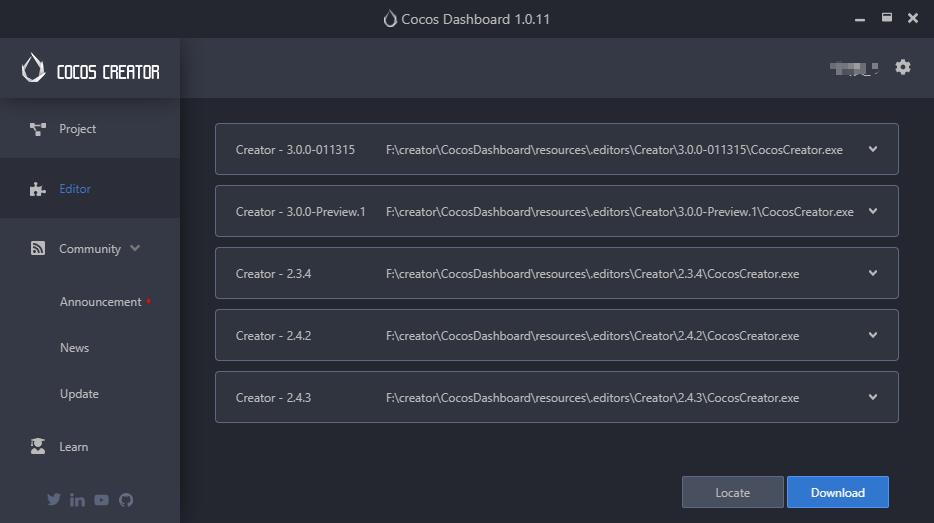

# 安装和启动

Cocos Creator 从 v2.3.2 开始接入了全新的 Dashboard 系统，能够同时对多版本引擎和项目进行统一升级和管理！Cocos Dashboard 将做为 Creator 各引擎统一的下载器和启动入口，方便大家升级和管理多个版本的 Creator。此外还集成了统一的项目管理及创建面板，方便大家同时使用不同版本的引擎开发项目



## 下载 Dashboard

您可以通过访问 [Cocos Creator 产品首页](https://www.cocos.com/creator) 上的下载链接获得 Dashboard 的安装包。

下载完成后双击安装包。

### Windows 安装说明

Windows 版的安装程序是一个 `.exe` 可执行文件，通常命名会是 **CocosDashboard-vX.X.X-win32-20XXXXXX.exe**，其中 **vX.X.X** 是 Cocos Dashboard 的版本号，如 v1.0.11，后面的一串数字是版本日期编号。

> **注意**：
> 1. 如果当前 PC 上已安装的版本号和安装包的版本号相同时，无法自动覆盖安装相同版本号的安装包，需要先卸载之前的版本才能继续安装。
>
>     应用的安装路径默认选择 C:\CocosDashboard，可以在安装过程中进行更改。
>
> 2. 如果出现 “不能安装需要的文件，因为 CAB 文件没有正确的数字签名。可能表明 CAB 文件损坏” 的弹窗警告，请尝试使用管理员权限进行安装。
>
> 3. 对于部分很老并且长期处于内网或者很久没有升级操作系统补丁的 Windows 系统，运行时可能会出现一些 dll 缺失引起的相关报错，可尝试安装该系统补丁解决：<https://support.microsoft.com/zh-cn/help/2999226/update-for-universal-c-runtime-in-windows>
>
> 4. 如果安装过程中出现 “拒绝访问” 的弹窗，请确保本机安装的操作系统是微软官方的正式版本，而不是经过定制或精简的第三方版本。

### Mac 安装说明

Mac 版 Cocos Dashboard 的安装程序是 dmg 镜像文件，双击 dmg 文件，然后将 **CocosDashboard.app** 拖拽到您的 **应用程序** 文件夹快捷方式，或任意其他位置。然后双击拖拽出来的 **CocosDashboard.app** 就可以开始使用了。

> **注意**：
> 1. 如果下载后无法打开，提示 dmg 或者 app 文件已损坏、来自身份不明的开发者或者包含恶意软件等。请在 Finder（访达）中右键点击 dmg 或 app 文件，选择 **打开**，接着在弹出对话框中再次点击 **打开** 即可。然后请进入 **系统偏好设置 -> 安全性与隐私**，点击 **仍要打开**，这样以后就可以正常启动了。
>
> 2. 在安装过程中如果出现“已损坏，无法打开”的提示，需要检查是否有类似 Xcode 的软件占用了 Dashboard 安装目录下的相关文件。如果有的话，请先退出，然后卸载 Dashboard 并重新安装。

### 操作系统要求

Cocos Dashboard 所支持的系统环境是：

Mac OS X 所支持的最低版本是 OS X 10.9。
Windows 所支持的最低版本是 Windows 7 64位。

## 运行 Cocos Dashboard

在 Windows 系统，双击解压后 `CocosDashboard` 文件夹中的 **CocosDashboard.exe** 文件即可启动 Cocos Dashboard。

在 Mac 系统，双击拖动出来的 **CocosDashboard.app** 应用图标即可启动 Cocos Dashboard。

您可以按照习惯为入口文件设置快速启动、Dock 或快捷方式，方便您随时运行使用。

### 检查显卡驱动

对于部分 Windows 操作系统和显卡型号，可能会遇到

```
This browser does not support WebGL...
```

的报错信息。这是由于编辑器依赖 GPU 渲染，而显卡驱动不支持导致的。如果出现这种情况，通常只要确保已成功安装显卡对应型号的官方驱动即可解决。

## 使用 Cocos 开发者帐号登录

Cocos Dashboard 启动后，会进入 Cocos 开发者帐号的登录界面。登录之后就可以享受我们为开发者提供的各种在线服务、产品更新通知和各种开发者福利。

如果之前没有 Cocos 开发者帐号，您可以使用登录界面中的 **注册** 按钮前往 **Cocos 开发者中心** 进行注册。或者直接进入下面的链接注册：

<https://auth.cocos.com/#/sign_up/register>

注册完成后就可以回到 Cocos Dashboard 登录界面完成登录了！验证身份后，我们就会进入 Dashboard 界面。除了手动登出或登录信息过期，其他情况下都会用本地 session 保存的信息自动登录。
