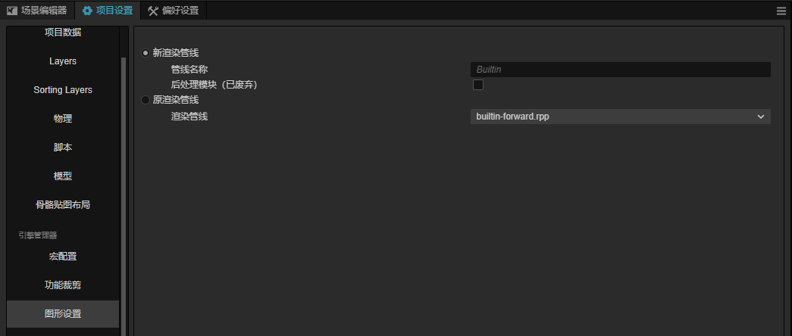

# 使用内置渲染管线

在项目菜单->项目设置->图形设置中选择**新渲染管线**。

默认的渲染管线为内置渲染管线**Builtin**。

## 内置渲染管线（Builtin）

内置渲染管线（Builtin）是基于可定制渲染管线（CRP - Customizable Render Pipeline）的一种实现，提供了跨平台的基础渲染功能，适用于所有平台。

目前内置渲染管线支持以下功能：

- 前向渲染
- 多重采样抗锯齿（MSAA）
- 实时阴影
- 后处理，包括（Bloom、Color Grading、FXAA、FSR等）

几乎可以满足所有的常规项目需求。

## 内置管线设置组件

场景中每个摄像机，根据排序依次进行渲染，输出到屏幕或者渲染纹理。

我们可以为每一个摄像机节点，添加 `BuiltinPipelineSettings` 组件，对该摄像机的渲染进行设置。

通过此组件，我们可以控制摄像机输出的行为和后期效果等。

>对于自定义的渲染管线，建议复制此组件源码到项目，并根据需要进行修改。

## 编辑器预览（实验）

勾选`Editor Preview (Experimental)`时，可以在场景编辑器中可以直接预览渲染效果。

由于场景渲染可能附带后期效果，因此在编辑器中预览时，可能会有性能影响，以及部分编辑器效果显示异常。

## 使用后期效果

关于后期效果的配置和使用，请看参考文档：[使用后期效果](./use-post-process.md)

## 代码位置

内置渲染管线的实现位于 `editor/assets/default_renderpipeline/builtin-pipeline.ts`。

其中`BuiltinPipelineBuilder`类实现了内置管线的主要功能。
