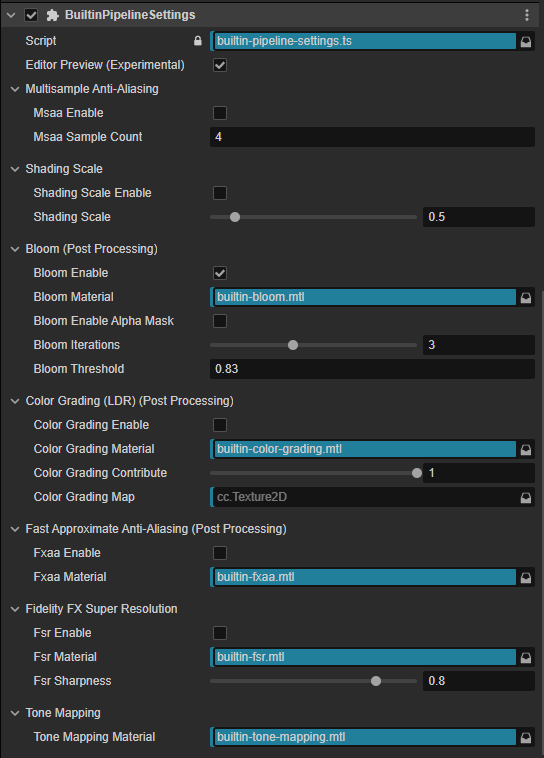
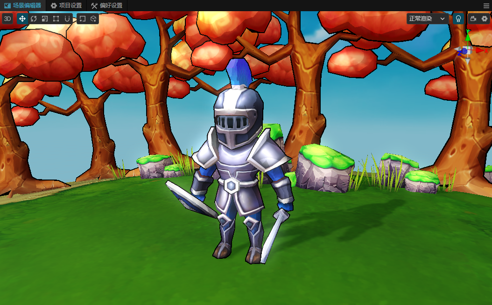

# 使用后期效果

> **注意**：本文档适用于 v3.8.4 及以上用户，v3.8.3 及以下用户，请参考文档： [全屏特效后处理流程](./post-process/index.md)。

## 添加组件

场景中每一个摄像机，都可以添加一个 `BuiltinPipelineSettings`，`BuiltinPipelineSettings` 用于进行当前摄像机的渲染设置，其中也包括后期效果。

开启对应的功能时，需要附上所需材质以及贴图，一般以 builtin 开头，如下图所示。

## 多重采样抗锯齿（MSAA）

多重采样抗锯齿（MSAA）是一种抗锯齿技术，光照阶段通过混合不同深度的采样，消除图像边缘锯齿现象。

目前支持2x、4x的多重采样，仅在原生平台上开启。

Web 平台上，目前使用`WebGL`的`antialias`功能，通过`ENABLE_WEBGL_ANTIALIAS`宏开启。

## 渲染缩放（Shading Scale）

`Shading Scale` 是一种渲染优化技术，通过降低渲染分辨率，减少渲染负担，提高渲染性能。

比如窗口大小为 1920x1080，`Shading Scale` 为 0.5 时，渲染分辨率为 960x540。

适用于渲染压力较大的场景，同时可以配合超分辨率技术，提高画面质量。

对于最后的UI渲染，会使用原始分辨率进行渲染。

`BuiltinPipelineSettings`组件上设置的`Shading Scale`属性，仅对当前相机生效。

## 泛光（Bloom）

泛光（Bloom）是一种后处理效果，通过提取图像中的高亮部分，模糊处理后叠加到原图上，增强画面的光亮效果。

`Bloom Iteraions` 为泛光迭代次数，`Bloom Threshold` 为泛光阈值。

## 色彩分级（Color Grading）

色彩分级（Color Grading）是一种后处理效果，通过分级贴图(Grading Map LUT)，调整画面的色彩效果。

## 快速近似抗锯齿（FXAA）

快速近似抗锯齿（FXAA）是一种抗锯齿技术，通过对图像进行平滑处理，消除图像边缘锯齿现象。

[builtin-fxaa](./image/builtin-fxaa.png)

## 超分辨率（FSR）

超分辨率是一种渲染技术，通过降低渲染分辨率，再通过算法提高画面质量。

目前使用的是`AMD FidelityFX Super Resolution`技术。

目前仅在`Shading Scale < 1`时生效。

## 色调映射（Tone Mapping）

色调映射（Tone Mapping）是一种后处理效果，通过调整图像的色调，提高画面的视觉效果。

目前色彩分级（Color Grading）整合了色调映射（Tone Mapping），如要自定义，需要协同修改。
