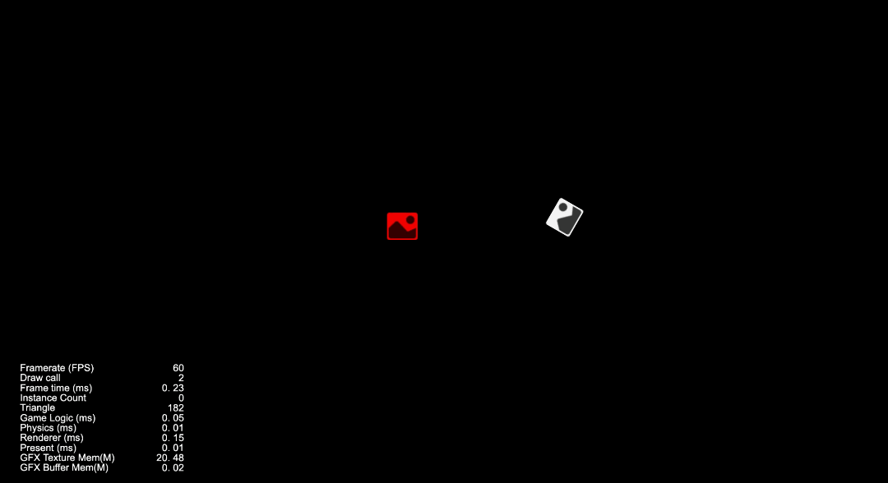

# 缓动示例

本文将主要介绍 Cosos Creator 缓动中常见的一些用法和接口。

## 构造缓动

通过 `tween` 方法或使用 `new Tween<T>(target: T)` 都可以构造缓动。

> **注意**：‘tween’ 是引擎提供的工具方法，并非 ‘Tween’ 的成员，请注意区分。关于这点可以参考接口说明： [缓动接口](tween-interface.md)。

## 链式 API

大部分和动作相关的接口都会返回 `this` 或者一个新的 `Tween` 对象，因此可以方便的使用链式调用来进行组合：

```ts
tween()
    .target(this.node)
    .to(1.0, { position: new Vec3(0, 10, 0) })
    .by(1.0, { position: new Vec3(0, -10, 0) })
    .delay(1.0)
    .by(1.0, { position: new Vec3(0, -10, 0) })
    .start()
```

## to，by

这里演示了如何使用一个 `to` 类型的缓动绑定节点的位置信息并将其位置沿 Y 轴偏移 10 个单位：

```ts
let tweenDuration : number = 1.0;                                    // 缓动的时长
tween(this.node.position)
    .to( tweenDuration, new Vec3(0, 10, 0), {                        // to 接口表示节点的绝对值
    onUpdate : (target:Vec3, ratio:number)=>{                        // 实现 ITweenOption 的 onUpdate 回调，接受当前缓动的进度
        this.node.position = target;                                 // 将缓动系统计算出的结果赋予 node 的位置        
    }
}).start();                                                          // 调用 start 方法，开启缓动
```

### 通过函数返回属性目标值

>  [!TIP]
>
> 从 v3.8.4 开始支持

```ts
tween(this.node).to(1, { angle: ()=>90 ).start();
```

以上代码等价于：

```ts
tween(this.node).to(1, { angle: 90 ).start();
```

### 自定义插值函数

>  [!TIP]
>
> 从 v3.8.4 开始支持

- 针对当前动作的某个属性

```ts
// 同时缓动 node 上的 angle 和 position 两个属性，但只给 angle 属性自定义插值函数
tween(this.node).to(1, {
        angle: { 
            value: 90,
            progress(start: number, end: number, current: number, ratio: number): number {
                return lerp(start, end, ratio);
            },
        },
        position: v3(90, 90, 90),
    }
).start();
```

- 针对当前动作的所有属性

要同时处理 to 动作关联 node 上的 angle 和 position 属性的自定义插值函数，可以考虑设置 opt.progress 参数。

```ts
tween(this.node).to(1, { angle: 90, position: v3(90, 90, 90) }, {
    progress(start: number, end: number, current: number, ratio: number): number {
        return lerp(start, end, ratio);
    },
}).start();
```

### 自定义缓动时间函数

>  [!TIP]
>
> 从 v3.8.4 开始支持

- 针对当前动作的某个属性

```ts
// 1. 使用内置缓动时间函数
tween(this.node).to(1, {
    angle: { 
        value: 90,
        easing: 'backIn',
    },
    position: v3(90, 90, 90),
}).start();

// 或者
// 2. 使用自定义缓动时间函数
tween(this.node).to(1, {
    angle: { 
        value: 90,
        easing: (k: number): number => { 
            if (k === 1) {
                return 1;
            }
            const s = 1.70158;
            return k * k * ((s + 1) * k - s);
        },
    },
    position: v3(90, 90, 90),
}).start();
```

- 针对当前动作的所有属性

要同时处理 to 动作关联 node 上的 angle 和 position 属性的自定义时间函数，可以考虑设置 opt.easing 参数。

```ts
// 1. 使用内置缓动时间函数
tween(this.node).to(1, { angle: 90, position: v3(90, 90, 90) }, {
    easing: 'backIn',
}).start();

// 或者
// 2. 使用自定义缓动时间函数
tween(this.node).to(1, { angle: 90, position: v3(90, 90, 90) }, {
    easing: (k: number): number => { 
        if (k === 1) {
            return 1;
        }
        const s = 1.70158;
        return k * k * ((s + 1) * k - s);
     },
}).start();
```

### 缓动字符串

> [!TIP]
>
> 从 v3.8.4 开始支持

假设定义一个类：

```ts
class StringTarget {
    string = '';
}
```

#### 用例一 (整型字符串)

使用 to 接口，在一秒之内，string 属性从 '0' 过度到 '100'

```ts
const t = new StringTarget();
t.string = '0';

// 这里 string 的值的类型可以是 number 或能转换为 number 的字符串
tween(t).to(1, { string: 100 }).start(); 
tween(t).to(1, { string: '100' }).start();
```

#### 用例二（浮点字符串）

```ts
const t = new StringTarget();
t.string = '10';

// 从 10 缓动到 110， 缓动过程中 t.string 的值始终保持小数点后两位有效数字
// 比如：'10.00' -> '43.33' -> '76.67' -> '110.00'
tween(t).to(1, { string: { value: 110, toFixed: 2 } }).start(); // 注意，这里使用 value 表示目标值，toFixed 表示要保留的小数位
```

#### 用例三（自定义处理多个字符串属性）

```ts
const o = { 
    gold: "¥0.00",
    exp: '1000/1000',
    lv: 'Lv.100',
    attack: '100 points',
    health: '10.00',
};

const tweenFormat = {
    currency(value: number): TTweenCustomProperty<string> {
        return {
            value: `¥${value}`,
            progress(start: number, end: number, current: string, ratio: number): string { // 自定义 progress 函数
                return `¥${lerp(start, end, ratio).toFixed(2)}`; // 保留小数点后 2 位有效数字
            },
            convert(v: string): number { // 提供自定义转换 string 为 number 的回调方法
                return Number(v.slice(1)); // 字符串开通的 ¥ 为前缀，不参与缓动，因此裁剪它，剩余数字部分转成 number
            },
        };
    },

    health(value: number): TTweenCustomProperty<string> {
        // health 为小数点后 2 位浮点，并且没有非数字的前缀与后缀，因此不需要指定自定义 progress 函数，直接使用内置的 progress 函数即可
        return {
            value: `${value}`,
            toFixed: 2, // 这里需要指定需要保留小数点后 2 位有效数字，若不指定，结果将被设置为整型字符串
        };
    },

    exp(value: number): TTweenCustomProperty<string> {
        return {
            value: () => `${value}/1000`,
            progress(start: number, end: number, current: string, ratio: number): string {
                return `${lerp(start, end, ratio).toFixed(0)}/1000`;
            },
            convert(v: string): number {
                return Number(v.slice(0, v.indexOf('/')));
            },
            // exp 为整型字符串，因此不需要指定 toFixed 参数
        };
    },

    lv(value: number): TTweenCustomProperty<string> {
        return {
            value: `Lv.${value}`,
            progress(start: number, end: number, current: string, ratio: number): string {
                return `Lv.${lerp(start, end, ratio).toFixed(0)}`;
            },
            convert(v: string): number {
                return Number(v.slice(v.indexOf('.') + 1));
            },
        };
    },
};

tween(o).to(1, { 
    gold: tweenFormat.currency(100),
    health: tweenFormat.health(1),
    exp: tweenFormat.exp(0),
    lv: tweenFormat.lv(0),
}).start();
```

### 自定义任意类型对象的缓动流程

```ts
class MyProp {
    constructor(x = 0, y = 0) {
        this.x = x;
        this.y = y;
    }

    public static lerp (a: MyProp, b: MyProp, out: MyProp, t: number): MyProp {
        const x = a.x;
        const y = a.y;
        out.x = x + t * (b.x - x);
        out.y = y + t * (b.y - y);
        return out;
    }

    public static add (a: MyProp, b: MyProp): MyProp {
        const out = new MyProp();
        out.x = a.x + b.x;
        out.y = a.y + b.y;
        return out;
    }

    public static sub (a: MyProp, b: MyProp): MyProp {
        const out = new MyProp();
        out.x = a.x - b.x;
        out.y = a.y - b.y;
        return out;
    }

    clone(): MyProp {
        return new MyProp(this.x, this.y);
    }

    equals (other: MyProp, epsilon = EPSILON): boolean {
        return (
            Math.abs(this.x - other.x) <= epsilon * Math.max(1.0, Math.abs(this.x), Math.abs(other.x))
	            && Math.abs(this.y - other.y) <= epsilon * Math.max(1.0, Math.abs(this.y), Math.abs(other.y))
        );
    }

    x = 0;
    y = 0;
}

class MyObject {
    angle = 0;
    str = '';
    private _myProp = new MyProp();

    set myProp(v) {
        this._myProp.x = v.x;
        this._myProp.y = v.y;
    }

    get myProp() {
        return this._myProp;
    }
}

const o = new MyObject();
o.myProp.x = 1;
o.myProp.y = 1;

tween(o)
    .by(1, { myProp: {
        value: new MyProp(100, 100), // 目标值
        progress: MyProp.lerp, // 提供自定义对象缓动过程
        clone: v => v.clone(), // 提供克隆函数
        add: MyProp.add, // 如果用 by 动作，则需要提供 add 方法
        sub: MyProp.sub, // 如果用 by 动作，并且有 reverse 操作，则除了 add 方法，还需要提供 sub 方法
        legacyProgress: false, // 设置为 false 表示使用新的基于对象参数类型的 progress 回调，即 MyProp.lerp 中的参数类型为 MyProp 对象自身，而不是默认的 number
    } }).id(123)
    .reverse(123) // 翻转
    .start();
```

## 绑定不同对象

开发中使用 `Node` 作为绑定目标的情景会更多一些，代码示例如下：

```ts
let  quat : Quat = new Quat();
Quat.fromEuler(quat, 0, 90, 0);
tween(this.node)
    .to(tweenDuration, { 
        position: new Vec3(0, 10, 0),                   // 位置缓动
        scale: new Vec3(1.2, 3, 1),                     // 缩放缓动
        rotation:quat }                                 // 旋转缓动
    )                                   
    .start();                                           // 调用 start 方法，开启缓动
```

实际上缓动可以绑定任意对象，代码示例如下：

```ts
class BindTarget{
    color : Color
}

let sprite : Sprite = this.node.getComponent(Sprite) ;
let bindTarget : BindTarget = new BindTarget();
bindTarget.color = Color.BLACK;
tween(bindTarget)
    .by( 1.0, { color: Color.RED }, {
        onUpdate(tar:BindTarget){
            sprite.color = tar.color;  // 设置精灵的为 BindTarget 内的颜色
        }
})
.start()
```

## 多个动作

通常来说，一个缓动可由一个或多个 **动作** 组成，`Tween` 维护了一个由多个 **动作** 组成的数据结构用于管理当前缓动内的所有动作。

下面代码演示了将物体的位置沿 Y 轴移动 10 个单位后，沿 -Y 轴移动 10 个单位。

```ts
let tweenDuration : number = 1.0;         
tween(this.node.position)
.to( tweenDuration, new Vec3(0, 10, 0), {  
    onUpdate : (target:Vec3, ratio:number)=>{ 
        this.node.position = target; 
    }
})
.to( tweenDuration, new Vec3(0, -10, 0), {  
    onUpdate : (target:Vec3, ratio:number)=>{ 
        this.node.position = target;
    }
}) // 此时 Tween 内的动作数量为 2
```

多个缓动也可使用 `union`、`sequence`、`parallel` 接口来组织。通过提前创建好一些固定的缓动，并使用 `union`、`sequence`、`parallel` 来组合它们从而减少代码的编写。

## 整合多个缓动

 `union` 方法会将当前所有的动作合并为一整个，代码示例如下：

```ts
let tweenDuration : number = 1.0;         
tween(this.node)
    .to(tweenDuration, { position:new Vec3(0, 10, 0) })  // 这里以 node 为缓动的目标
    .to(tweenDuration, { position:new Vec3(0, -10, 0) }) // 此时 Tween 内的动作数量为 2
    .union()                                             // 这里会将上述的两个缓动整合成一个，此时 Tween 内的动作数量为 1
    .start();                                            // 调用 start 方法，开启缓动
```

> [!TIP]
>
> 从 v3.8.4 开始支持：`union(fromId)` 

`union(fromId)` 方法会将从某个标识的的动作到当前的所有动作合并为一个顺序动作（Sequence），常与 `id`、`repeat` 和 `repeatForever` 配合使用，示例代码如下：

```ts
const node = new Node();

tween(node)
    .to(1, { scale: new Vec3(10, 10, 10) })
    .by(1, { position: new Vec3(200, 0, 0) }).id(123) // 将 by 动作标识为 123
    .delay(1)                                         // 延时一秒
    .reverse(123)                                     // 翻转标识为 123 的动作，即前面的 by 动作
    .union(123)                                       // 从标识为 123 的动作开始合并
    .repeat(3)                                        // 将前面 union 打包后的动作重复执行 3 次
    .start();
```

## 缓动队列

`sequence` 会将传入的缓动转化为队列形式并加入到当前的缓动内，代码示例如下：

```ts
let tweenDuration: number = 1.0;
let t1 = tween(this.node)
    .to(tweenDuration, { position: new Vec3(0, 10, 0) })

let t2 = tween(this.node)
    .to(tweenDuration, { position: new Vec3(0, -10, 0) })

tween(this.node).sequence(t1, t2).start(); // 将 t1 和 t2 两个缓动加入到新的缓动队列内
```

用 [then](#插入缓动) 接口也可以实现一样的效果：

```ts
let tweenDuration: number = 1.0;
let t1 = tween(this.node)
    .to(tweenDuration, { position: new Vec3(0, 10, 0) })

let t2 = tween(this.node)
    .to(tweenDuration, { position: new Vec3(0, -10, 0) })

tween(this.node).then(t1).then(t2).start(); // 先将 t1 缓动加入队列，再将 t2 缓动加入队列
```

## 同时执行多个缓动

`parallel` 会将传入的缓动转化为并行形式并加入到当前的缓动内，代码示例如下：

```ts
let tweenDuration: number = 1.0;
let t1 = tween(this.node)
    .to(tweenDuration, { position: new Vec3(0, 10, 0) })

let t2 = tween(this.node)
    .to(tweenDuration, { position: new Vec3(0, -10, 0) })

tween(this.node).parallel(t1, t2).start(); // 将 t1 和 t2 转化为并行的缓动并加入当前的缓动
```

## 插入缓动

`then` 接口允许传入新的缓动，并将该缓动整合后添加到当前缓动的动作内，代码示例如下：

```ts
let tweenAfter = tween(this.node)
    .to(1.0, { position: new Vec3(0, -10, 0) })

tween(this.node)
    .by(1.0, { position: new Vec3(0, 10, 0) })
    .then(tweenAfter)
    .start();
```

## 延迟执行

`delay` 会在 **当前** 的动作 **后** 添加一个延时。

注意在下列代码示例中，`delay` 位置不同会造成完全不同的结果：

- 延迟 1 秒后，开始进行运动，并连续运动两次。

    ```ts
    let tweenDuration: number = 1.0;
    tween(this.node)
        .delay(1.0)
        .to(tweenDuration, { position: new Vec3(0, 10, 0) })
        .to(tweenDuration, { position: new Vec3(0, -10, 0) })
        .start()  
    ```

- 在第一次运动后，会延迟 1 秒再做第二次运动。

    ```ts
    let tweenDuration: number = 1.0;
    tween(this.node)
        .to(tweenDuration, { position: new Vec3(0, 10, 0) })
        .delay(1.0)
        .to(tweenDuration, { position: new Vec3(0, -10, 0) })
        .start()
    ```

## 重复执行

接口 `repeat` 可以为缓动添加一个重复次数，若 `embedTween` 参数为空，则会使用当前缓动的最后一个动作作为参数。

这意味着，如果当前缓动由多个缓动组成，则只会重复 **最后一个**，请注意下面的示例：

```ts
let tweenDuration: number = 1.0;
tween(this.node)
    .to(tweenDuration, { position: new Vec3(0, 10, 0) })
    .by(tweenDuration, { position: new Vec3(0, -10, 0) })
    .repeat(3) // 注意这里会重复 by 这个缓动 3 次
    .start()  
```

若第二个参数 `embedTween` 不为空，则会重复嵌入的缓动，代码示例如下：

```ts
let tweenDuration: number = 1.0;
let embedTween = tween(this.node)
    .by(tweenDuration, { position: new Vec3(0, -10, 0) })

tween(this.node)
    .to(tweenDuration, { position: new Vec3(0, 10, 0) })
    .repeat(3, embedTween)  // 这里会重复 embedTween
    .start()  
```

`repeatForever` 接口和 `repeat` 类似，但是会变为永久重复。

## 动作标识

> [!TIP]
>
> 从 v3.8.4 开始支持

接口 `id` 用于给前一个动作添加一个 `number` 类型的标识，注意 **标识不要有重复** ，否则缓动系统内部搜索标识的时候将直接使用第一个表示的动作。

其经常与 union(fromId), reverse(id), reverse(tween, id) 配合使用。示例代码如下：

```ts
tween(this.node)
	.by(1, { position: new Vec3(100, 0, 0) }).id(123) // 给 by 动作添加标识，其值为 123
	.delay(1) // 延时一秒
	.reverse(123) // 翻转标识为 123 的动作，并将翻转后的动作添加进当前动作队列中，相当于 .by(1, { position: new Vec3(-100, 0, 0) })
	.start();
```

## 翻转动作

> [!TIP]
>
> 从 v3.8.4 开始支持

`reverse` 接口有 3 个重载实现，分别为：

```ts
// 返回「新创建」的缓动实例，其会翻转当前缓动中的所有动作。
reverse (): Tween<T>;

/**
 * 翻转当前缓动中特定标识的动作。
 * @param id 要翻转的当前缓动中的动作标识。
 * @return 返回该实例本身，以便于链式调用。
 */
reverse (id: number): Tween<T>;

/**
 * 翻转特定缓动中特定标识的动作
 * @param otherTween 根据标识在关联的缓动中查找动作
 * @param id 要翻转的动画标识
 * @return 返回该实例本身，以便于链式调用。
 */
reverse<U extends object = any> (otherTween: Tween<U>, id?: number): Tween<T>;
```

### reverse () 示例

翻转当前缓动中的所有动作，并返回 **新创建** 的缓动实例。

```ts
const t1 = tween(this.node)
	.by(1, { position: new Vec3(100, 0, 0) }) // 相对当前位置，节点 x 坐标 +100
	.by(1, { scale: new Vec3(2, 2, 2) });     // 相对当前缩放，节点整体缩放系数 +2 

const t2 = t1.reverse(); // 翻转整个 t1 缓动，并返回新的缓动实例 t2，其相当于先将节点缩放系数 -2，再将节点 x 坐标 -100
// 即上一行代码等价于：
// const t2 = tween(this.node)
//	.by(1, { scale: new Vec3(-2, -2, -2) })
//	.by(1, { position: new Vec3(-100, 0, 0) });

tween(this.node)
    .to(1, { position: new Vec3(200, 0, 0) }) 
    .then(t2)
    .start();
```

### reverse (id) 示例

翻转当前缓动中特定标识的动作。

```ts
tween(this.node)
    .to(1, { scale: new Vec3(10, 10, 10) })
    .by(1, { position: new Vec3(200, 0, 0) }).id(123) // 给 by 动作添加标识 123
    .delay(1)
    .reverse(123) // 翻转当前缓动中标识为 123 的动作，相当于 .by(1, { position: new Vec3(-200, 0, 0) })
    .start();
```

### reverse (otherTween, id?)

- 没有传递 id 时，可以翻转 otherTween 整个缓动，并将缓动的所有动作整合为一个 Sequence 动作，然后将此动作添加到当前缓动的动作队列中。可用如下代码实现 [reverse () 示例](#reverse--示例) 中一样的效果：

```ts
const t = tween(this.node)
	.by(1, { position: new Vec3(100, 0, 0) }) // 相对当前位置，节点 x 坐标 +100
	.by(1, { scale: new Vec3(2, 2, 2) });     // 相对当前缩放，节点整体缩放系数 +2 

tween(this.node)
    .to(1, { position: new Vec3(200, 0, 0) }) 
    .reverse(t) // 添加一个动作，此动作直接翻转整个缓动 t
    .start();
```

- 传递 id 时，用于翻转 otherTween 中某个标识的动作，并将此动作添加到当前缓动的动作队列中。

```ts
const t = tween(node)
    .parallel(
        tween(node).sequence(
            tween(node).by(1, { position: new Vec3(100, 0, 0) }).id(123), // 为此 .by 动作添加标识 123
            tween(node).to(1, { position: new Vec3(1000, 0, 0) }),
        ),
        tween(node).delay(1),
    );

tween(node)
    .to(1, { position: new Vec3(200, 0, 0) })
    .reverse(t, 123) // 只翻转缓动 t 中的标识为 123 的动作，即 t 中的 .by 动作
    .start();
```

## 节点相关的缓动

节点相关的方法只适用于 `target` 是 `Node` 的情况。

### 显示和隐藏节点

`show` 和 `hide` 接口可以控制绑定节点的显示和隐藏，下面示例中，节点会被隐藏并在延迟 1 秒后显示。

```ts
tween(this.node)        
    .hide()        
    .delay(1.0)
    .show()
    .start();
```

### 删除节点

该方法会产生一个 **删除节点的动作**，该动作会将传入的节点从场景树内删除。

在下面的示例中，节点会在延迟 1 秒后从场景内删除。

```ts
tween(this.node)        
    .delay(1.0)
    .removeSelf()        
    .start()   
```

## 添加回调动作

`call` 接口允许给缓动添加一个回调动作，该接口在处理某些异步逻辑时非常有用，示例如下：

```ts
tween(this.node)
    .to(1.0, { position: new Vec3(0, 10, 0)})       
    // to 动作完成后会调用该方法     
    .call( ()=>{
        console.log("call");
    })
    .start()
```

## 设置目标属性

通过 `set` 可以设置目标的属性。下面的示例会在延迟 1 秒后将节点设置在 [0, 100, 0] 的位置。

```ts
tween(this.node)
    .delay(1.0)
    .set({ position: new Vec3(0, 100, 0) })
    .start();
```

也可以同时设置多个不同的属性，代码示例如下：

```ts
tween(this.node)  
    // 同时设置节点的位置，缩放和旋转    
    .set({ position: new Vec3(0, 100, 0), scale: new Vec3(2, 2, 2), rotation: Quat.IDENTITY } )
    .start();
```

## 复制缓动

`clone` 方法可将当前的缓动复制到目标参数上，注意在复制时源缓动和目前缓动的绑定对象要类型一致，即 `new Tween<T>(target: T)` 中的 `T` 需要类型一致。代码示例如下：

```ts
const srcTween = tween(this.node).delay(1.0).by(1.0, { position: new Vec3(0, 10, 0) })
// 将 ‘srcTween’ 复制到名为 Cone 的节点上
srcTween.clone(find("Cone")).start();
```

> [!TIP]
>
> 从 v3.8.4 开始支持在 clone 的时候不传递 target 参数，即复制生成的新缓动直接使用原来的 target

示例如下：

```ts
const srcTween = tween(this.node).delay(1.0).by(1.0, { position: new Vec3(0, 10, 0) });
const clonedTween = srcTween.clone(); // clonedTween 的 target 也是 this.node 对象
```

## 为 sequence, parallel, then 接口指定不同目标对象的子缓动

>  [!TIP]
>
> 从 v3.8.4 开始支持

如果要在一个缓动链式调用中同时处理 position, contentSize, color 动作，它们的目标分别为：节点、节点上的 UITransform 组件、节点上的 Sprite 组件，可以通过如下代码实现：

```ts
tween(node)
    .parallel(
        tween(node).to(1, { position: new Vec3(100, 100, 0) }),
        tween(node.getComponent(UITransform) as UITransform).to(1, { contentSize: size(100, 100) }),
    	tween(node.getComponent(Sprite) as Sprite).to(1, { color: color(100, 100, 100, 100) }),
    )
    .start();
```

sequence 和 then 接口也同理。

## 停止缓动

### stop

实例方法，用于停止指定的缓动。

```ts
const t = tween(node)
    .by(1, { position: v3(90, 90, 90) });
    .start(); // 开始缓动

// ......

t.stop(); // 停止缓动
```

### stopAll

**静态方法**，停止所有缓动。

```ts
Tween.stopAll();
```

### stopAllByTag

**静态方法**，停止所有指定标签的缓动。

- 不带 target 参数

```ts
const MY_TWEEN_TAG = 123;
const node1 = new Node();
const node2 = new Node();

const t1 = tween(node1)
    .tag(MY_TWEEN_TAG)
    .by(1, { position: new Vec3(100, 0, 0) })
    .start();

const t2 = tween(node2)
    .tag(MY_TWEEN_TAG)
    .by(1, { scale: new Vec3(2, 2, 2) })
    .start();

Tween.stopAllByTag(MY_TWEEN_TAG); // t1 和 t2 的标签都是 MY_TWEEN_TAG，t1 和 t2 都将被停止
```

- 带 target 参数

```ts
const MY_TWEEN_TAG = 123;
const node1 = new Node();
const node2 = new Node();

const t1 = tween(node1)
    .tag(MY_TWEEN_TAG)
    .by(1, { position: new Vec3(100, 0, 0) })
    .start();

const t2 = tween(node2)
    .tag(MY_TWEEN_TAG)
    .by(1, { scale: new Vec3(2, 2, 2) })
    .start();

Tween.stopAllByTag(MY_TWEEN_TAG, node1); // t1 和 t2 的标签都是 MY_TWEEN_TAG，只有 t1 被停止，t2 的 target 为 node2，因此 t2 不会被停止
```

### stopAllByTarget

**静态方法**，停止指定对象的关联的所有缓动实例。

```ts
const node1 = new Node();
const node2 = new Node();

const t1 = tween(node1)
    .by(1, { position: new Vec3(100, 0, 0) })
    .start();

const t2 = tween(node2)
    .by(1, { scale: new Vec3(2, 2, 2) })
    .start();

const t3 = tween(node1)
    .by(1, { angle: 90 })
    .start();

Tween.stopAllByTarget(node1); // t1 和 t3 关联了 node1，因此它们将被停止，t2 继续运行
```

## 暂停/恢复缓动

> [!TIP]
>
> 从 v3.8.4 开始支持

手动暂停恢复：

```ts
const t = tween(this.node)
    .by(1, { position: new Vec3(90, 0, 0) }).id(123)
    .reverse(123)
    .union()
    .repeatForever()
    .start();  // 开始缓动

// ......
t.pause(); // 暂停缓动 t

// ......
t.resume(); // 恢复缓动 t
```

> [!IMPORTANT]
>
> 从 v3.8.4 开始，如果缓动目标是 Node 类型，那么缓动会根据 Node 的 active 状态自动暂停恢复。

## 缩放缓动时间

> [!TIP]
>
> 从 v3.8.4 开始支持

```ts
tween(this.node)
    .to(1, { position: new Vec3(100, 100, 100) })
    .timeScale(0.5)
    .start();
```

上面这个例子将 timeScale 设置为 0.5，to 动作的时间为 1，因此最终缓动执行的真实总时长将为 duration / timeScale = 1 / 0.5 = 2 秒。

## 获取缓动总时长

> [!TIP]
>
> 从 v3.8.4 开始支持

```ts
const t = tween(this.node)
    .to(1, { position: new Vec3(100, 100, 100) })
	.to(1, { scale: new Vec3(2, 2, 2) })
    .start();

console.log(t.duration); // 将输出 2
```

## 自定义动作（固定时长）

> [!TIP]
>
> 从 v3.8.4 开始支持

`update` 接口用于添加一个固定时长的自定义动作。

其接口声明如下：

```ts
export type TweenUpdateCallback<T extends object, Args extends any[]> = (target: T, ratio: number, ...args: Args) => void;

/**
 * 添加一个固定时长的自定义动作。
 * @param duration 缓动时间，单位为秒。
 * @param cb 动作回调函数。
 * @param args 传递给动作回调函数的参数。
 * @return 返回该实例本身，以便于链式调用。
 */
update<Args extends any[]> (duration: number, cb: TTweenUpdateCallback<T, Args>, ...args: Args): Tween<T> { ... }
```

示例代码：

```ts
let done = false;

tween(this.node)
    .delay(1)
    .by(1, { position: v3(90, 90, 90) })
    .update(1, (target: Node, ratio: number, a: number, b: boolean, c: string, d: { 'world': () => number }): void =>{
		// ......
		// target, a, b, c, d 都是透传给 update 回调的参数，可指定 n 个参数
		// target 为 this.node
		// a 为 123
		// b 为 true
		// c 为 'hello'
		// d 为 { 'world': (): number => 456 }
    }, 123, true, 'hello', { 'world': (): number => 456 })
    .repeat(2)
    .call(()=>{ done = true; })
    .start();
```

## 自定义动作（不确定时长）

>  [!TIP]
>
> 从 v3.8.4 开始支持

`updateUntil` 接口用于添加一个不确定时长的自定义动作。

其接口声明如下：

```ts
export type TweenUpdateUntilCallback<T extends object, Args extends any[]> = (target: T, dt: number, ...args: Args) => boolean;

/**
 * 添加一个不确定时长的自定义动作。如果回调函数返回 true，表示当前动作结束。
 * @param cb 动作回调函数。如果回调函数返回 true，表示当前动作结束。
 * @param args 传递给动作回调函数的参数。
 * @return 返回该实例本身，以便于链式调用。
 */
updateUntil<Args extends any[]> (cb: TweenUpdateUntilCallback<T, Args>, ...args: Args): Tween<T> { ... }
```

以下示例代码，用于追踪动态物体，当接近物体时候，放大并重置位置后重复执行。

```ts
import { _decorator, Component, Node, tween, v3, Vec3 } from 'cc';
const { ccclass, property } = _decorator;

const positionTmp = new Vec3();
const positionTmp2 = new Vec3();

@ccclass('TweenTest')
export class TweenTest extends Component {

    @property(Node)
    targetNode: Node | null = null;

    start() {
        tween(this.node)
            .updateUntil((curNode: Node, dt: number)=>{
                const d = Vec3.copy(positionTmp2, this.targetNode!.position).subtract(curNode.position);
                const length = d.length();
                if (length < 10) {
                    return true; // 当前节点与目标节点距离小于 10 的时候，返回 true 表示为当前 updateUntil 过程结束
                }
                
                const newPos = Vec3.copy(positionTmp, curNode.position).add(d.normalize().multiplyScalar(length / 10 * dt * 10));
                curNode.setPosition(newPos);
                return false; // 返回 false 表示 updateUntil 过程还需要继续执行
            })
            .by(0.25, { scale: v3(1, 1, 0) }, { easing: 'cubicInOut' }).id(1)
            .reverse(1)
            .call((curNode?: Node)=>{
                const newPos = v3((Math.random() - 0.5) * 400, (Math.random() - 0.5) * 400, 0);
                if (newPos.y < 100 && newPos.y > 0) newPos.y = 100;
                if (newPos.y > -100 && newPos.y < 0) newPos.y = -100;

                if (newPos.x < 100 && newPos.x > 0) newPos.x = 100;
                if (newPos.x > -100 && newPos.x < 0) newPos.x = -100;
                curNode?.setPosition(newPos);
            })
            .union()
            .repeatForever()
            .start();

        tween(this.node)
            .by(1, { angle: 360 })
            .repeatForever()
            .start();

    }
}
```

运行结果:



## 从某个时间开始缓动

> [!TIP]
>
> 从 v3.8.4 开始支持

`start` 接口可接收 startTime 参数，单位为秒，用于从某个时间开始缓动，此时间前的所有缓动将被立马执行完毕。

```ts
const t = tween(this.node)
    .to(1, { position: new Vec3(100, 100, 100) })
	.call(()=>{})
	.to(1, { scale: new Vec3(2, 2, 2) })
    .start(1); // 从第 1 秒开始
```

上面示例，创建了两个 to 动作，总时长为 2 秒，由于从第 1 秒开始播放缓动，因此 this.node 的位置将立马被设置到 (100, 100, 100)，call 的回调也会被立马调用。接下来再经过 1 秒的时间做 scale 放大到 2 的动画。

## 销毁

### 自动销毁

>  [!TIP]
>
> 从 v3.8.4 开始支持

当缓动目标为 `Node` 时，将会监听其销毁事件进行缓动的自动销毁，调用 `target` 方法也会自动更新监听。

### 手动销毁

大部分缓动在最后一个动作完毕后，都会对自身进行销毁，但是对于未能正确销毁的缓动， 如 `repeatForever` 在切换场景后，会一直驻留在内存中。需要手动调用销毁接口进行销毁。

如果要停止并销毁缓动，有下列的方法：

- 成员 `stop` 接口，销毁该缓动，代码示例如下：

    ```ts
    let t = tween(this.node.position)        
    .to( 1.0, new Vec3(0, 10, 0), {
        onUpdate : (target:Vec3, ratio:number)=>{
            this.node.position = target;
        }
    })              
    t.stop();        
    ```

- 使用静态接口 `stopAll`、`stopAllByTag` 和 `stopAllByTarget` 销毁所有或特定缓动，代码示例如下：

    ```ts
    Tween.stopAll() // 销毁所有缓动
    
    Tween.stopAllByTag(0); // 销毁所有以 0 为标签的缓动
    
    Tween.stopAllByTarget(this.node); // 销毁该节点上的所有缓动
    ```

> **注意**：在 v3.8.4 之前的版本，切换场景时记得停止相应的缓动。v3.8.4 及之后的版本，引擎会自动处理。
