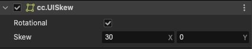
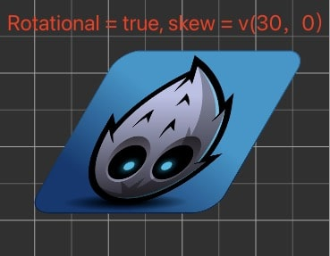
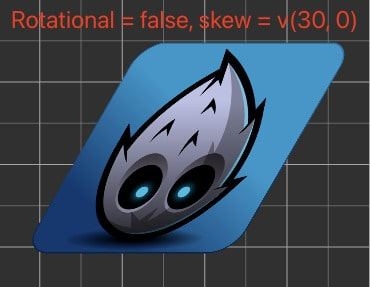

# UISkew (斜切)组件参考

UI Skew 组件用于控制 UI 元素的斜切变换，可以通过设置水平和垂直方向的斜切角度来实现不同的视觉效果。

点击 **属性检查器** 下面的 **添加组件** 按钮，然后选择 **UI/UISkew** 即可添加 UISkew 组件到节点上。

UISkew 脚本接口请参考 [UISkew API](%__APIDOC__%/zh/class/UISkew)。

## UISkew 属性介绍

| 属性 |   功能说明
| :-------------- | :----------- |
| rotational | 是否使用旋转类型的斜切算法 (默认关闭，此时效果兼容 2.x 版本)
| skew | 水平与垂直方向的斜切角度（类型: Vec2，x、y 值分别设置 X、Y 轴斜切角度）

---

## UISkew 组件示例







### 通过脚本代码修改斜切角度

```ts
import { _decorator, Component, Node, UISkew } from 'cc';
const { ccclass, property } = _decorator;

@ccclass('Example')
export class Example extends Component {

    start () {
        const uiSkew = this.getComponent(UISkew);
        if (uiSkew) {
            // 方法一
            uiSkew.setSkew(new Vec2(30, 15));

            // 方法二
            uiSkew.x = 30;
            uiSkew.y = 15;
        }
    }
}
```

### 注意事项

1. 节点的斜切变换会影响子节点的渲染，但不会改变节点的尺寸属性
2. 节点进行倾斜变换时会发送 `'transform-changed'` 事件，可用于监听节点变换
3. 斜切变换的过程需要进行多次三角函数运算，频繁执行斜切变换会增加游戏运行开销