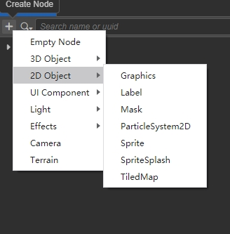

# 2D 渲染组件说明

引擎中所有不拥有的 model 的渲染对象都为 2D 渲染对象。与 3D 对象不同，2D 对象本身不拥有 model 信息，其顶点信息是由 UITransform 组件的 Rect 信息持有并由引擎创建的，且本身没有厚度。由于引擎的设计要求，2D 渲染对象需要为 RenderRoot 节点（带有 RenderRoot2D 组件的节点）的子节点才能完成数据的收集操作。

所以 2D 渲染对象的渲染要求有两点：
1. 需要有 UITransform 组件
2. 需要为 RenderRoot 节点的子节点

## 2D 渲染对象可见性说明

由于 2D 渲染对象在 Camera 的可见性判断上和 3D 渲染节点并无区别，所以用户需要自己控制节点的 layer 属性并设置 Camera 的 Visibility 来配合进行分组渲染，如果场景中出现多个相机的情况，错误的 layer 设置导致节点重复渲染或不渲染。

**这里请 3D 1.2 版本升级的用户注意，我们纠正了之前的 Canvas 只会渲染其子节点的行为，目前需要用户自己管理节点的 layer 和相机的 Visibility，之前使用了多 Canvas 渲染的用户可能会需要对项目做出调整以达到更合理的场景结构。**

## 2D 渲染组件

本身拥有渲染能力的组件我们称为 2D 渲染组件，包括：

- [Sprite 组件参考](../../ui-system/components/editor/sprite.md)
- [Label 组件参考](../../ui-system/components/editor/label.md)
- [Mask 组件参考](../../ui-system/components/editor/mask.md)
- [Graphics 组件参考](../../ui-system/components/editor/graphics.md)
- [RichText 组件参考](../../ui-system/components/editor/richtext.md)
- [UIStaticBatch 组件参考](../../ui-system/components/editor/ui-static.md)
- [TiledMap 组件参考](../../editor/components/tiledmap.md)
- [TiledTile 组件参考](../../editor/components/tiledtile.md)
- [Spine（骨骼动画）Skeleton 组件参考](../../editor/components/spine.md)
- [DragonBones（龙骨）ArmatureDisplay 组件参考](../../editor/components/dragonbones.md)

## 2D 渲染组件的添加方式

我们在编辑器内置了一些 2D 渲染组件，在创建了 RenderRoot 节点之后，即可在此节点下创建带有 2D 渲染组件的节点：

也可以通过在节点上添加组件的方式来添加 2D 渲染组件，组件菜单中的 2D 菜单下的节点均为 2D 渲染组件：

> **注意**：每个节点上只能添加一个渲染组件，重复添加会导致报错。

## 2D 渲染组件规则介绍

- [渲染排序规则](../../ui-system/components/engine/priority.md)
- [UI 合批规则说明](../../ui-system/components/engine/ui-batch.md)
- [UI 材质说明](../../ui-system/components/engine/ui-material.md)
