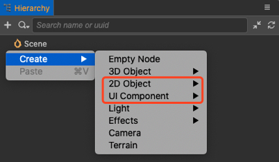
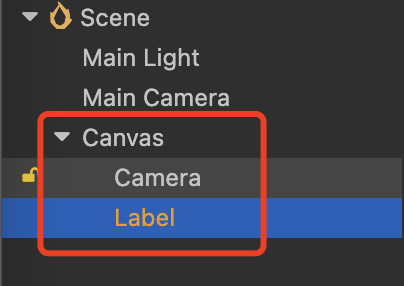

# 创建 2D 对象

## 创建 2D 节点

Cocos Creator 内置了一些常用的 2D 渲染节点和 UI 节点方便开发者直接使用。点击 **层级管理器** 面板左上方的 **+** 按钮，或者直接在面板中点击右键并选择 **创建**，然后在 **2D 对象** 和 **UI 组件** 的节点分类中选择所需的节点，即可创建节点。



因为 2D 节点需要根节点为 RenderRoot 节点（带有 RenderRoot2D 组件的节点）或者 Canvas 节点（带有 Canvas 组件的节点），所以在创建 2D 节点时若不满足要求，Creator 会自动创建一个 Canvas 节点作为其父节点。例如下图创建一个 Label 节点：



## 添加 2D 组件

添加 2D 组件有两种方式，一种是通过编辑器添加，另一种是通过脚本添加。

### 通过编辑器添加

在 **层级管理器** 中选中要添加 2D 组件的节点，然后点击 **属性检查器** 面板下方的 **添加组件 -> 2D/UI**，根据需要选择要添加的组件即可。需要注意的是不是所有的 2D 组件都在 UI 分类下，例如 2D 粒子组件是在 **Effects** 分类下。


### 通过脚本添加

在 **资源管理器** 中创建一个脚本并编写脚本（下方代码以添加 Label 组件为例）。然后回到编辑器，在 **层级管理器** 中选中要添加 2D 组件的节点，将脚本从 **资源管理器** 拖拽到 **属性检查器** 中即可。需要注意的是该节点也必须满足创建 2D 节点时的规则。

```ts
import { _decorator, Component, Node, Layers, Label } from 'cc';
    const { ccclass, property } = _decorator;
    @ccclass('Typescript')
    export class Typescript extends Component {
        start () {
            // 设置节点的 Layer 为 UI_2D，才能被相机看见
            this.node.layer = Layers.Enum.UI_2D;
            // 添加 Label 组件
            const label2D = this.node.addComponent(Label);
            // 设置 Label 显示的文字为 example
            label2D.string = 'example';
        }
    }
}
```
