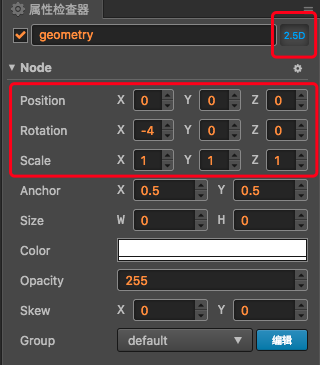

# 3D Node

> 文：youyou

## Node Api 升级

由于 Cocos Creator 在 v2.1 支持了 3D 的特性，所以相应节点的 api 也需要由 2D 升级到支持 3D 的使用。

影响比较大的改动是 rotation 的类型将在之后的版本中从 `Number` 改为 `cc.Quat`，如果要像之前那样在 2D 空间方便旋转节点，那么可以使用 `angle` 属性。相应的 `setRotation` 和 `getRotation` 也会改为使用 `cc.Quat`。

具体的升级请参考下表：

API | v2.0.3 | v2.1 - 2.x | v3.x
------------ | ------------- | --------- | --------
rotationX, rotationY | KEEP `Number` | DEPRECATE，<br>USE `eulerAngles` | DEPRECATE
rotation | KEEP `Number` | DEPRECATE，<br>USE `angle` | GET `cc.Quat`
angle | ADD，= `-rotation` | `-rotation` | `-rotation`
scale | KEEP `Number` | KEEP `Number` | KEEP `Number`
getRotation() | KEEP `Number` | DEPRECATE，<br>USE `angle` | GET `cc.Quat`
getRotation(cc.Quat) | GET `cc.Quat` |  | 
setRotation | KEEP `Number` | DEPRECATE SET `Number`，<br>USE `angle` | SET `cc.Quat`
setRotation | SET `cc.Quat` | |
getScale() | KEEP `Number` | DEPRECATE，<br>USE `scale` | GET `cc.Vec2` / `cc.Vec3`
getScale(cc.Vec2/cc.Vec3) | GET `cc.Vec2` / `cc.Vec3` |  |
setScale | KEEP `Number` | KEEP `Number` | KEEP `Number`
position | KEEP `cc.Vec2` | GET `cc.Vec3` | GET `cc.Vec3`

## 开启 3D 节点

Cocos Creator 2.1 加入了 3D 支持后，节点会分为 2D 节点和 3D 节点，它们的区别在于 2D 节点在做矩阵计算或者一些属性设置的时候只会在 2D 空间下进行考虑，这样能节省很大一部分运行开销。

默认新创建出来的节点都是 2D 节点，有以下两种方式可以设置该节点为 3D 节点：

- 点击 **属性检查器** 右上方的 **3D** 按钮进行切换：

  

  可以看到，当节点切换为 3D 节点后，旋转、位移、缩放等参数中，可以设置的值都从两个变成了三个，增加了 Z 轴坐标。这样在 **属性检查器** 中我们就可以很方便的编辑节点的 3D 属性了。

- 在代码中切换

  ```js
  node.is3DNode = true;
  ```

**注意**：3D 节点的颜色和透明度设置，在部分渲染组件上可能不会生效。
