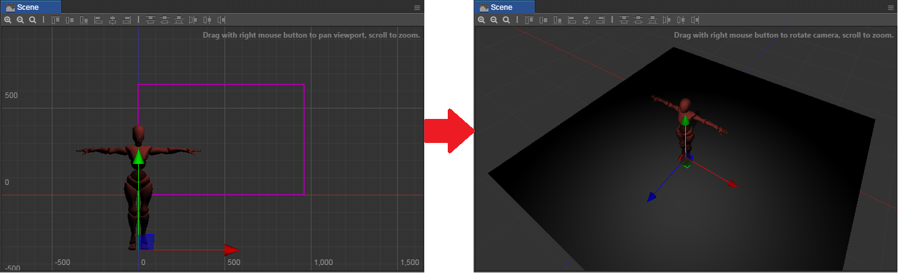

# 3D 场景

从 v2.1.1 开始，Creator 支持一键将场景切换为 3D 编辑模式，方便对 3D 对象、摄像机、光照等进行编辑。同时还新增了独立的 **游戏预览** 面板，能够在场景编辑的过程中直观地预览摄像机看到的画面。

## 3D 场景编辑

点击编辑器左上方的 **3D** 按钮：

即可将 **场景编辑器** 切换为 3D 编辑模式。可使用鼠标右键旋转场景视角，使用滚轮缩放场景视图。

**注意**：在做 3D 项目的时候，通常我们会为 UI 和场景分配多个 Camera。在这种情况下需要正确设置 Camera 的 depth 属性，否则可能导致遮挡顺序不对。具体的内容可参考 [摄像机属性](../render/camera.md#%E6%91%84%E5%83%8F%E6%9C%BA%E5%B1%9E%E6%80%A7)。

## 场景渲染配置面板

在 **场景编辑器** 的场景渲染配置面板中提供了一些参数来帮助调试场景中 3D 物体的渲染效果。

- Wire Frame

  按照线条的方式勾勒出模型的三角面

  

- Normal
    
  绘制模型的顶点法线信息

  

## 游戏预览面板

用户可以通过点击 **主菜单 -> 面板 -> 游戏预览** 来打开 **游戏预览** 面板。

**游戏预览** 面板可置于独立窗口，也可直接拖进编辑器主窗口。调整场景中的摄像机即可在 **游戏预览** 面板直观地预览摄像机看到的画面。
