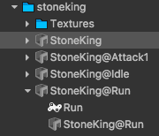
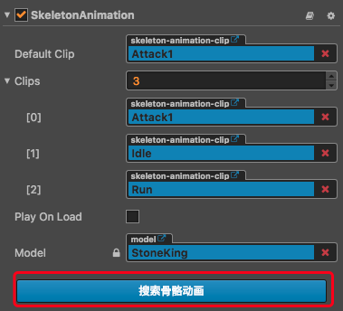
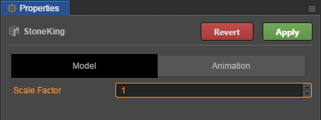

# 导入模型

> 文：youyou

目前 Cocos Creator 支持导入的 3D 模型格式为使用非常广泛的 **.fbx**，基本上 3D 建模软件都支持导出这种格式。

导入的流程很简单，只需要将 **.fbx** 模型资源拖入到 **资源管理器**，等待片刻即可完成导入工作。导入完成后，在 **资源管理器** 中看到导入后的模型资源是一个可以展开的文件夹，导入模型的时候编辑器会自动解析模型的内容，并生成 **Prefab**、**网格**、**骨骼动画** 等资源。

- **1** 是模型资源文件
- **2** 是网格资源文件
- **3** 是 Prefab 资源文件 
    **注意**：导入的时候那些自动生成的 Prefab 资源是不能修改的，如果需要修改，可以将这个自动生成的 prefab 拖拽到 **场景编辑器** 中进行编辑。编辑完成后，将其拖拽到资源管理器的任意文件夹中生成新的 Prefab，用这个新的 Prefab 作为自己的 Prefab 来使用。
- **4** 是骨骼动画资源文件

## 关联贴图资源

大部分模型都会有贴图资源，在导入模型的时候，需要将这些贴图资源放到指定的位置，才会被导入系统找到并关联到 Mesh Renderer 中。导入系统会先从模型文件夹下开始查找对应的贴图，如果没有找到，则会再去模型文件夹下的 **textures** 或者 **Textures** 查找。

**注意**：贴图需要在导入模型之前导入，或者和模型同时导入才能被正确搜索到。

## 关联骨骼动画资源

骨骼动画剪辑可以和网格资源一起放在模型中，也可以单独放到另外一个模型中，并以 **模型名字@动画名字** 的命名方式命名这个模型。单独存放的骨骼动画剪辑在导入时会以指定的命名来命名这个剪辑。

如果模型中有骨骼动画的话，导入系统会自动给模型的 Prefab 添加一个 [骨骼动画组件](skeleton-animation.md)。

当点击组件中的 **搜索骨骼动画** 按钮时，组件会搜索当前的模型和当前模型文件夹下以 **模型名字@动画名字** 格式命名的模型，并且关联其中的骨骼动画剪辑。

## 配置模型参数

导入模型后，在 **资源管理器** 中选中模型，就可以在 **属性检查器** 中设置模型导入参数。

### 模型参数

**缩放**：设置导入的预制根节点大小。导入模型时为根节点设置的缩放值。默认值为 **1**。

### 动画

- **预先计算骨骼矩阵**

  在加载骨骼动画数据时，会预先计算出每根骨骼在每一个时间点的矩阵，节省了动态计算骨骼矩阵的步骤，可以大幅提高效率。默认为 **不勾选**。

  **注意：开启此选项的模型要与 SkeletonAnimation 组件上的模型一致才可以**

- **动画帧率**

  调整动画预先计算生成的动画剪辑的帧率，减少帧率可以降低内存的消耗。仅在勾选了 **预先计算骨骼矩阵** 选项后才生效。默认值为 **30 FPS**。
