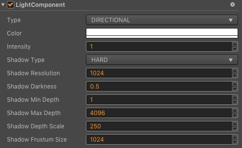

# 光源组件参考

光源组件定义了光源的类型，颜色，强度以及产生的阴影类型，在场景中加入光源能使模型渲染得更加立体。具体可参考 [光照](lighting.md) 章节。

点击 **属性检查器** 下面的 **添加组件** 按钮，然后从 **渲染组件** 中选择 **Light**，即可添加 Light 组件到节点上。

## Light 属性

| 属性 |   功能说明
| -------------- | ----------- |
| Type                | 支持的光源类型，包括 **DIRECTIONAL**（平行光）、**POINT**（点光源）、**SPOT**（聚光灯）和 **AMBIENT** 四种。不同的类型表现会有些差别，具体可参考 [光照](lighting.md) 章节。
| Color               | 光源的颜色。
| Intensity           | 光照强度，值越大光照越亮。
| Range               | 光源照射的半径范围。仅在 Type 设为 **POINT** 和 **SPOT** 时才生效。
| Spot Angle          | 光源照射的角度范围。仅在 Type 设为 **SPOT** 时才生效。
| Spot Exp            | 值越大，光源照射的边缘越柔和。仅在 Type 设为 **SPOT** 时才生效。
| Shadow Type         | 光源照射产生的阴影类型，包括 **NONE**（不产生阴影）和 **HARD**（产生硬边缘阴影）两种。
| Shadow Resolution   | 阴影分辨率，值越大阴影越清晰。在 Shadow Type 不设为 **NONE** 时生效。
| Shadow Darkness     | 阴影暗度，值越大阴影越暗。在 Shadow Type 不设为 **NONE** 时生效。
| Shadow Min Depth    | 光源产生阴影的最小距离，如果物体跟光源的距离小于最小距离则不会产生阴影。在 Shadow Type 不设为 **NONE** 时生效。
| Shadow Max Depth    | 光源产生阴影的最大距离，如果物体跟光源的距离大于最大距离则不会产生阴影。在 Shadow Type 不设为 **NONE** 时生效。
| Shadow Depth Scale  | 光源深度缩放值，值越大阴影越暗。在 Shadow Type 不设为 **NONE** 时生效。
| Shadow Frustum Size | 平行光中视锥体的大小，决定平行光产生阴影的范围。仅在 Shadow Type 不设为 **NONE**，Type 设为 **DIRECTIONAL** 时生效。
