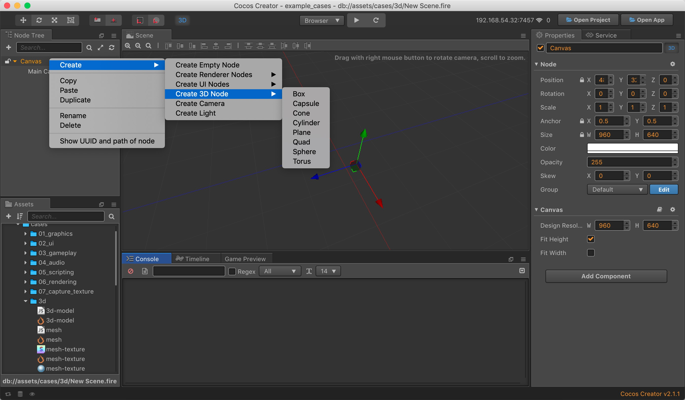
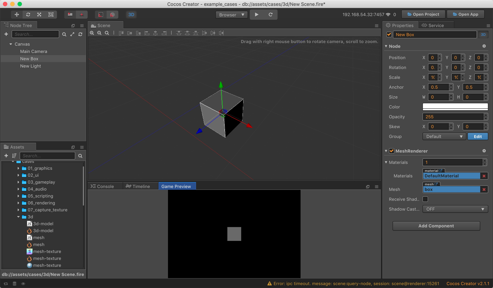
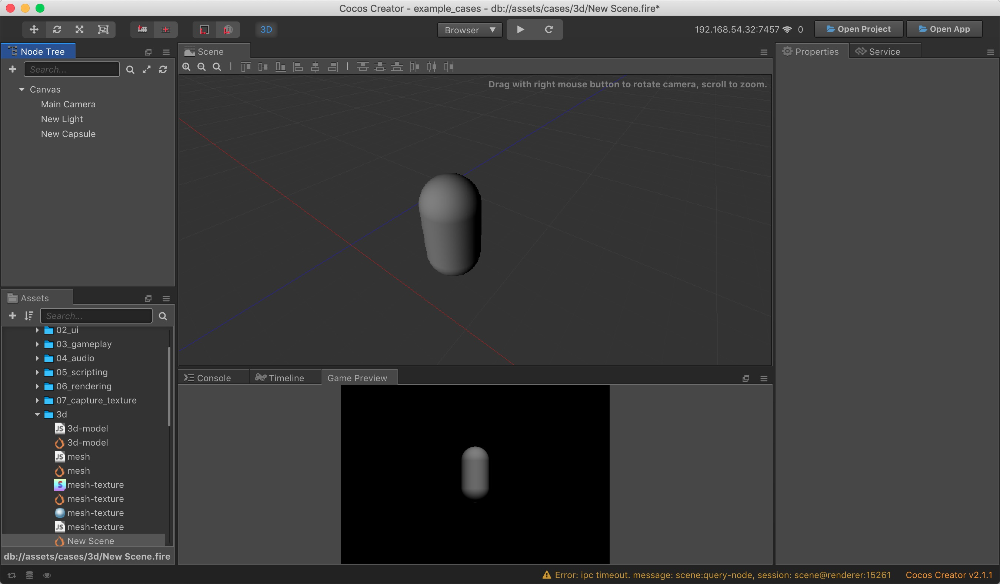
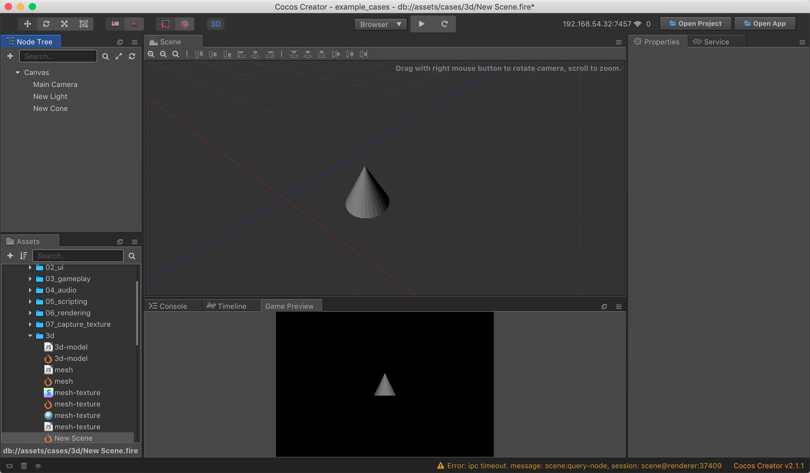
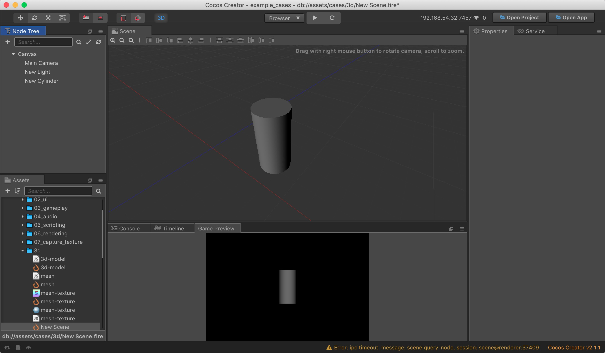
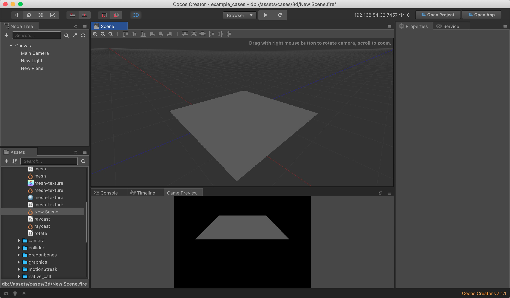
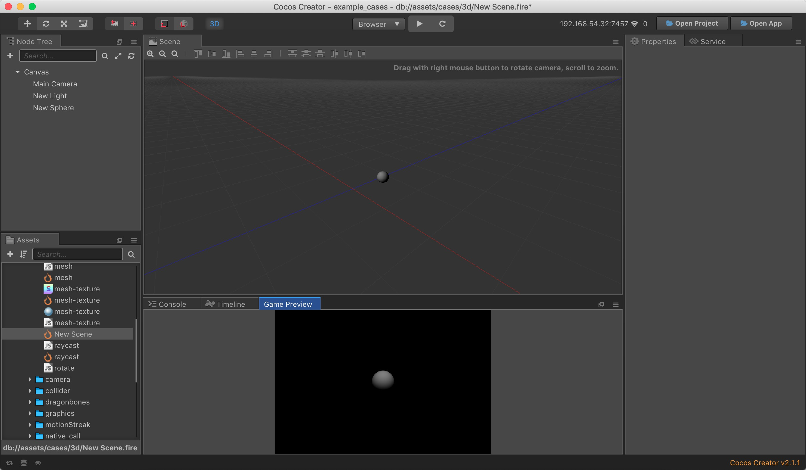
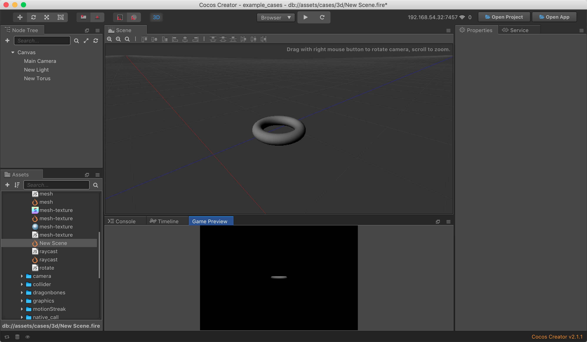

# 基础 3D 物体

Cocos Creator 可以导入大部分模型制作软件生成的模型文件，然而你也可以直接在 Cocos Creator 中创建出一些基础 3D 物体来使用，比如 长方体，胶囊体，球体，圆柱体等比较常见的基础 3D 物体。Cocos Creator 提供了两种方式来创建基础 3D 节点，通过脚本创建或者直接使用编辑器内建基础 3D 物体。

## 脚本创建基础 3D 物体

Cocos Creator 提供了 `cc.primitive` 这个脚本接口来创建基础 3D 模型的顶点数据，然后根据这些顶点数据创建出对应的 mesh 给 [Mesh Renderer组件](./mesh-renderer) 使用。

```js
function createMesh (data, color) {
    let gfx = cc.gfx;
    let vfmt = new gfx.VertexFormat([
        { name: gfx.ATTR_POSITION, type: gfx.ATTR_TYPE_FLOAT32, num: 3 },
        { name: gfx.ATTR_NORMAL, type: gfx.ATTR_TYPE_FLOAT32, num: 3 },
        { name: gfx.ATTR_COLOR, type: gfx.ATTR_TYPE_UINT8, num: 4, normalize: true },
    ]);

    let colors = [];
    for (let i = 0; i < data.positions.length; i++) {
        colors.push(color);
    }

    let mesh = new cc.Mesh();
    mesh.init(vfmt, data.positions.length);
    mesh.setVertices(gfx.ATTR_POSITION, data.positions);
    mesh.setVertices(gfx.ATTR_NORMAL, data.normals);
    mesh.setVertices(gfx.ATTR_COLOR, colors);
    mesh.setIndices(data.indices);
    mesh.setBoundingBox(data.minPos, data.maxPos);

    return mesh;
}

// 创建长方体顶点数据
let data = cc.primitive.box(100, 100, 100);
// 根据顶点数据创建网格
let mesh = createMesh(data, cc.color(100, 100, 100));
// 将创建的网格设置到 Mesh Renderer 上
let renderer = this.getComponent(cc.MeshRenderer);
renderer.mesh = mesh;
```

更多 `cc.primitive` 的使用请查看 [api 文档](https://docs.cocos2d-x.org/creator/2.1/api/en/modules/cc.html?q=primitive)

你也可以通过以下 [TheAviator Demo](https://github.com/2youyou2/TheAviator) 学习 `cc.primitive` 的使用。

## 编辑器内建基础 3D 物体

在编辑器内创建 3D 基础物体非常简单，可以通过在层级管理器中 **右键->创建->创建 3D 节点** 来创建这些基础 3D 物体：



### 长方体



### 胶囊体



### 圆锥体



### 圆柱体



### 平面



### 球体



### 圆环



### 面片


