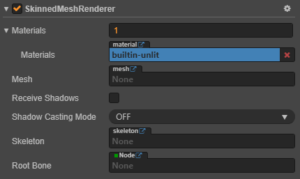

# Skinned Mesh Renderer 组件参考

> 文：youyou、Xunyi

Skinned Mesh Renderer 组件继承自 Mesh Renderer，所以 Skinned Mesh Renderer 组件也可以指定 `Mesh` 和 `Materials` 属性。

Cocos Creator 使用 Skinned Mesh Renderer 组件来渲染骨骼动画，骨骼动画会将网格中的顶点关联到骨架（即一组节点）上，然后骨骼动画会在预先编辑好的动画中驱动这个骨架使网格变形以达到动画的效果。

Skinned Mesh Renderer 组件会在模型导入的过程中根据模型是否存在骨骼动画自动添加到生成的 Prefab 中。

在导入模型时，如果模型中有骨骼动画，则编辑器会自动添加 Skinned Mesh Renderer 组件到生成的 Prefab 中。

## 属性

| 属性 | 功能说明 |
| :-- | :------ |
| Materials            | 网格资源允许使用多个材质资源，所有材质资源都存在 `materials` 数组中。 如果网格资源中有多个子网格，那么 Mesh Renderer 会从 `materials` 数组中获取对应的材质来渲染此子网格。 |
| Mesh                 | 指定渲染所用的网格资源 |
| Receive Shadows      | 指定当前模型是否会接收并显示其它物体产生的阴影效果  |
| Shadows Casting Mode | 指定当前模型是否会投射阴影  |
| Skeleton             | 指定渲染的骨骼动画资源 |
| Root Bone            | 骨骼根节点 |
