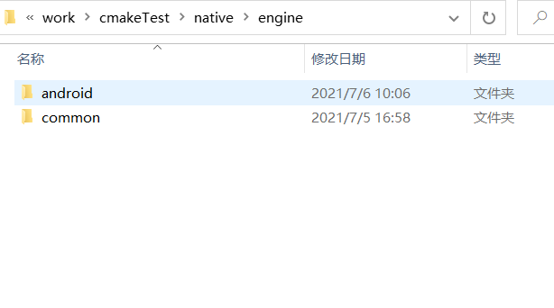

# CMake 使用简介

## 前言

CMake 是一个跨平台的构建工具，可根据需要输出各种各样的 Makefile 或者 Project 文件。CMake 使用 `CMakeLists.txt` 来配置工程文件，开发者可以在这里集成 SDK 或者引用用于编译原生平台的库和配置，详情可参考 [二次开发](../editor/publish/native-options.md#%E4%BA%8C%E6%AC%A1%E5%BC%80%E5%8F%91)。

从 v3.0 开始，Creator 已经集成了 CMake 的输出过程和基础编写，本篇文档主要介绍原生平台上 `CMakeLists.txt` 的使用规则以及一些简单的示例。

## CMakeLists 的生成和使用

当选择某个原生平台进行构建时，项目目录 `native\engine` 目录下会生成 `当前构建的平台名称` 文件夹（例如 `android`），以及 `common` 文件夹。CMake 在第一次运行时将会在这两个目录下分别生成 `CMakeLists.txt` 文件，作用各不相同：

- `当前构建的平台名称` 文件夹：`CMakeLists.txt` 主要用于配置对应的构建平台。以 Android 平台为例：

    

- `common` 文件夹：`CMakeLists.txt` 主要用于配置整个项目。

    



打开当前构建的平台名称的文件夹和 `common` 文件夹都可以找到对应的 CMakeLists.txt 文件。当前构建的平台名称的文件夹下的 `CMakeLists.txt` 文件，是用来配置对应的构建平台。这里采用 **安卓平台** 做个示例。


而 `common` 文件夹下 `CMakeLists.txt` 是用来配置项目通用配置的。


`CMakeLists.txt` 的语法比较简单，由命令、注释和空格组成。其中命令是不区分大小写的,参数和变量是大小写相关的。

怎样利用 CMake 来将项目编译成动态库提供给其他项目 **使用**。简单的来说 CMake 就是我们把编译信息录入，cmake命令根据CMakeLists.txt 生成编译需要的 Makefile 文件。在这里，我们用新建的一个空包构建安卓版本产生的 `CMakeLists.txt` 来看看具体的编写。

```CMake

#设置CMake所需的最低版本。如果使用的CMake版本低于该版本，会提醒用户升级到该版本之后再执行cmake。
cmake_minimum_required(VERSION 3.8)
#声明了项目的名称
option(APP_NAME "Project Name" "cmakeTest")
#声明了项目的名称和支持的编程语言(CXX代表C++)，如不指定默认支持所有语言。支持的编程语言包括 C、 C++ 和 JAVA
project(${APP_NAME} CXX)
#include 从文件或模块加载和运行 CMake 代码
include(${CMAKE_CURRENT_LIST_DIR}/../common/CMakeLists.txt)
	
#定义了一个新变量LIB_NAME  并设置为cocos
set(LIB_NAME cocos)
#定义了一个变量PROJ_SOURCES
set(PROJ_SOURCES
    ${CMAKE_CURRENT_LIST_DIR}/../common/Classes/Game.h
    ${CMAKE_CURRENT_LIST_DIR}/../common/Classes/Game.cpp
    ${CMAKE_CURRENT_LIST_DIR}/jni/main.cpp
)
#如果在该路径下不存在jsb_module_register.cpp，则复制这个路径下的jsb_module_register.cpp文件链接到一个目标文件夹中
if(NOT EXISTS ${CMAKE_CURRENT_LIST_DIR}/../common/Classes/jsb_module_register.cpp，则负责)
    file(COPY "${COCOS_X_PATH}/cocos/bindings/manual/jsb_module_register.cpp文件到"
        DESTINATION ${CMAKE_CURRENT_LIST_DIR}/../common/Classes/)
endif()
#添加新element到list中
list(APPEND PROJ_SOURCES
    ${CMAKE_CURRENT_LIST_DIR}/../common/Classes/jsb_module_register.cpp
)
#动态库PROJ_SOURCES生成链接文件 到LIB_NAME中
add_library(${LIB_NAME} SHARED ${PROJ_SOURCES})
#将目标文件LIB_NAME与库文件cocos2d_jni进行链接
target_link_libraries(${LIB_NAME}
    "-Wl,--whole-archive" cocos2d_jni "-Wl,--no-whole-archive"
    cocos2d
)
#将包含目录添加到目标。
target_include_directories(${LIB_NAME} PRIVATE
    ${CMAKE_CURRENT_LIST_DIR}/../common/Classes
)

```

在 `common` 文件夹下的 `CMakeLists.txt` 文件下的用法也是一致的，但是会多一些基础的配置。例如：

```CMake
option(USE_SPINE                "Enable Spine"                      ON)
```

但是需要注意的是，在 `common` 文件夹下的 `CMakeLists.txt` 文件下中的这些基础配置是 **默认选项**，在 `build/构建的版本（例如: Android）/proj`  下的 cfg.cmake 文件会 **修改** 到这些基础配置，是因为 `CMakeLists.txt` 中有对 `cfg.cmake` 文件进行引入。

```CMake
include(${RES_DIR}/proj/cfg.CMake)
```

而 `cfg.make` 是在引擎点击构建的时候会根据构建的渠道版本 **对应生成**。例如开发者在引擎的项目设置的功能裁剪中取消勾选 Spine 动画功能。


再点击构建，重新生成的 `cfg.make` 中就会出现改变。


在经过编译之后，CMake 会根据配置生成 **CMakeCache.txt** 文件。这里面拥有开发者构建一个项目 **需要依赖的各种输入参数**。


## CMakeLists 的常用示例

下面将会介绍一些在 `CMakeLists.txt` 文件中的常用编译指令和使用示例。

### 常用编译指令：

#### 找到编译头文件

让 CMake 找到我的头文件,指定编译给定目标时要使用的包含目录或目标

```CMake
target_include_directories(<target> [SYSTEM] [BEFORE]
  <INTERFACE|PUBLIC|PRIVATE> [items1...]
  [<INTERFACE|PUBLIC|PRIVATE> [items2...] ...])
```

一般引用库路径使用这个命令，作为外部依赖项引入进来，target 是自己项目生成的 `lib`。例如：

```CMake
target_include_directories(${LIB_NAME} PRIVATE
    ${CMAKE_CURRENT_LIST_DIR}/../common/Classes
)
```

我们将 `Classes` 头文件库路径添加到了 `LIB_NAME` 项目。

#### 生成 target（执行文件）

上述指令中的 `<target>` 是指通过 `library`、`executable`、`自定义 command` 指令生成的执行文件。
```CMake
add_library(<name> [STATIC | SHARED | MODULE]
            [EXCLUDE_FROM_ALL]
            source1 [source2 ...])
```

该指令的主要作用就是将指定的源文件生成链接文件，然后添加到工程中去。添加名为 `name` 的库，库的源文件可指定，也可用 `target_sources()` 后续指定。`source1`、`source2` 分别表示各个源文件。
库的类型是 `STATIC(静态库)`/`SHARED(动态库)`/`MODULE(模块库)` 之一。

```CMake
add_library(${LIB_NAME} SHARED ${PROJ_SOURCES})
```

还有一个指令就是：

```CMake
add_executable(<name> [WIN32] [MACOSX_BUNDLE]
               [EXCLUDE_FROM_ALL]
               source1 [source2 ...])
```

该指令的主要作用就是使用指定的源文件向项目添加可执行文件。

```CMake
add_executable(hello-world hello-world.cpp)
```
自定义 command 指令的主要作用是添加定制命令来生成文件。

```CMake
	add_custom_command(TARGET target
                   PRE_BUILD | PRE_LINK | POST_BUILD
                   COMMAND command1 [ARGS] [args1...]
                   [COMMAND command2 [ARGS] [args2...] ...]
                   [WORKING_DIRECTORY dir]
                   [COMMENT comment] [VERBATIM])
```

该命令成为目标的一部分，并且仅在构建目标本身时才会执行。如果目标已经构建，则该命令将不会执行。示例如下：

```CMake
add_custom_command(OUTPUT COPY_RES
            COMMAND ${CMAKE_COMMAND} -E copy_if_different ${abs} $<TARGET_FILE_DIR:${LIB_NAME}>/${filename}
        )
```

**add_custom_command** 有两个限制:

- 只有在相同的 `CMakeLists.txt` 中，指定了所有依赖于其输出的目标时才有效。

- 对于不同的独立目标，使用 `add_custom_command` 的输出可以重新执行定制命令。这可能会导致冲突，应该避免这种情况的发生。

#### 链接库文件

`target_link_libraries` 里库文件的顺序符合 `gcc` 链接顺序的规则，即被依赖的库放在依赖它的库的后面。

```CMake
target_link_libraries(<target> [item1] [item2] [...]
                      [[debug|optimized|general] <item>] ...)
```

`item` 表示库文件没有后缀的名字。默认情况下，库依赖项是传递的。当这个目标链接到另一个目标时，链接到这个目标的库也会出现在另一个目标的连接线上。例如：

```CMake
target_link_libraries(${LIB_NAME}   
    "-Wl,--whole-archive" cocos2d_jni "-Wl,--no-whole-archive"
    cocos2d
)
```

#### 其他命令

 打印调试日志消息:

```CMake
message(STATUS “my custom debug info”)
```

操作文件命令：

```CMake
  file(COPY "${COCOS_X_PATH}/cocos/bindings/manual/jsb_module_register.cpp"
        DESTINATION ${CMAKE_CURRENT_LIST_DIR}/../common/Classes/)
```

COPY 表示复制文件，目录以及符号链接到一个目标文件夹中。输入路径将视为相对于当前源码目录的路径。目标路径则是相对于当前的构建目录。

从文件或模块加载和运行 CMake 代码：

```CMake
include(${CMAKE_CURRENT_LIST_DIR}/../common/CMakeLists.txt)
```

### 使用示例

**Android.mk**  是 Android 源码编译系统的 Makefile，用于编译系统中的 C++ 的动态库、静态库、可执行文件和 apk 等。在这里我们采用一个腾讯云的多媒体引擎 SDK 里的一个 Android.mk 来改写成  `CMakeLists.txt` 做一个简单的示例：

```
LOCAL_PATH := $(call my-dir)

include $(CLEAR_VARS)
LOCAL_MODULE := Pre_GMESDK
LOCAL_SRC_FILES := ./$(TARGET_ARCH_ABI)/libgmesdk.so
include $(PREBUILT_SHARED_LIBRARY)

include $(CLEAR_VARS)
LOCAL_MODULE := Pre_TRAE
LOCAL_SRC_FILES := ./$(TARGET_ARCH_ABI)/libtraeimp.so
include $(PREBUILT_SHARED_LIBRARY)	

include $(CLEAR_VARS)
LOCAL_MODULE := Pre_PTT
LOCAL_SRC_FILES := ./$(TARGET_ARCH_ABI)/libsilk.so
include $(PREBUILT_SHARED_LIBRARY)

include $(CLEAR_VARS)
LOCAL_MODULE := Pre_MP3
LOCAL_SRC_FILES := ./$(TARGET_ARCH_ABI)/libgmecodec.so
include $(PREBUILT_SHARED_LIBRARY)
```

在  Android.mk 中：

```
LOCAL_PATH := $(call my-dir)
```

此变量表示源文件在开发树中的位置。在上述命令中，构建系统提供的宏函数 `my-dir`  将返回当前目录（`Android.mk`  文件本身所在的目录）的路径。

在对应 CMakeLists.txt:

```
set(LOCAL_PATH ${CMAKE_CURRENT_SOURCE_DIR}/..)
```

在 Android.mk 中：

```
include $(CLEAR_VARS)
LOCAL_MODULE := Pre_GMESDK
LOCAL_SRC_FILES := ./$(TARGET_ARCH_ABI)/libgmesdk.so
include $(PREBUILT_SHARED_LIBRARY)
```

在对应 CMakeLists.txt:

```CMake
	add_library(Pre_GMESDK SHARED IMPORTED GLObal)
	set_target_properties(Pre_GMESDK PROPERTIES
  IMPORTED_LOCATION ./${ANDROID_ABI}/libgmesdk.so
)
```

## 结语

CMake 的指令和用法还有很多，欢迎大家去探寻和学习，这里只是做了简单的示例。未来 Cocos Creator 将用 CMake 将更多的功能集成到编辑器的构建页面，也鼓励开发者针对自身的实际情况，对自己的工作流进行定制。

对于 CMake 的语法和接口还有问题的开发者可以学习参考 CMake 官方 [文档](https://cmake.org/cmake/help/v3.16/guide/tutorial/index.html)。
