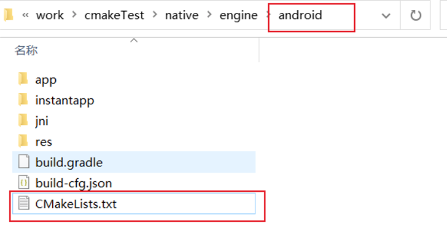
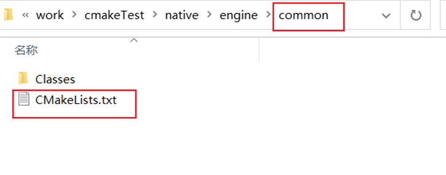
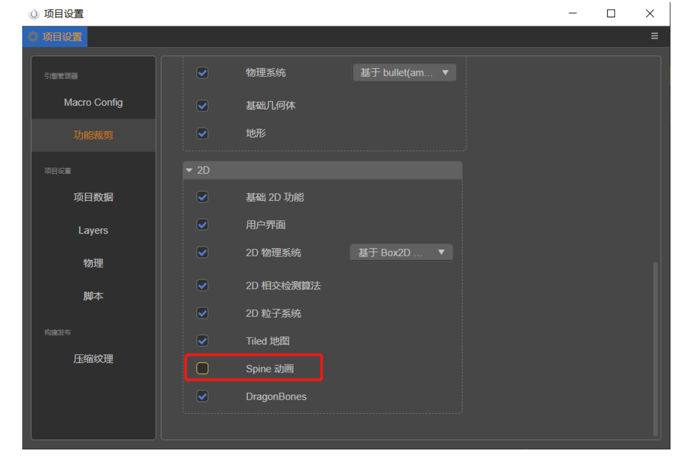
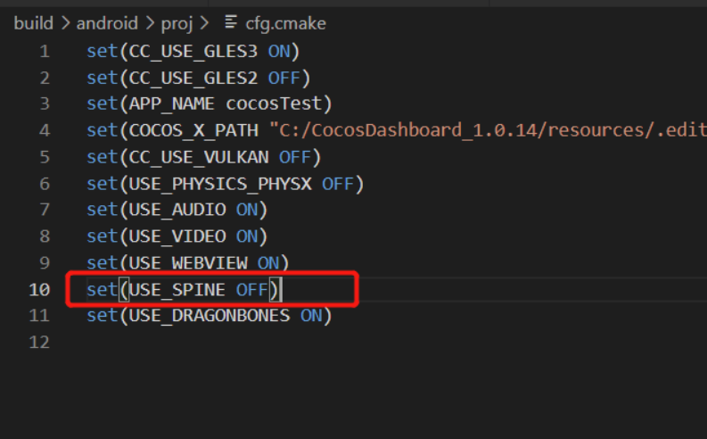
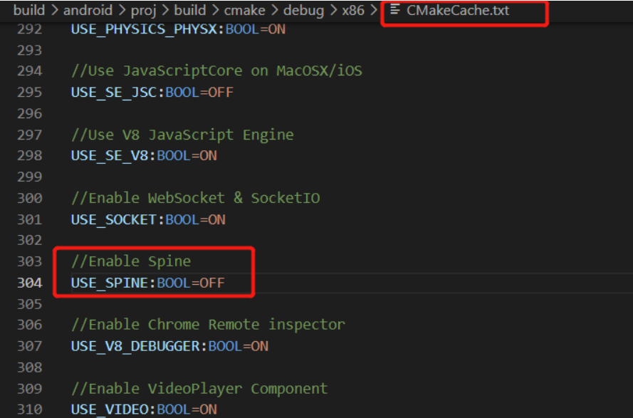

# CMake 使用简介


## CMake 介绍

CMake 是一个非常强大的构建工具，可以大大简化软件的编译过程，提高开发效率。Cocos Creator 在各个原生平台都使用了 CMake。以下是一些快速了解 CMake 的优点：

- 使用 CMakeLists.txt 文件描述整个项目的构建过程，而不是像其他构建工具一样使用脚本文件。
- 是跨平台的，可以在 Windows、Linux、macOS 等操作系统上运行。
- 可以自动生成 Makefile、Visual Studio 等 IDE 的工程文件，从而简化了软件的编译过程。
- 可以轻松的管理依赖库，将代码组织成模块等。
- 支持多种编程语言，包括 C、C++、Fortran、Java、Python 等。

虽然 CMake 是一个非常强大的构建工具，但是它也有一些缺点，比如语法比较复杂，需要一定的学习成本。

开发者可以学习 CMake 的语法并添加自己的模块，以便在构建过程中执行特定的任务。例如，他们可以定义自己的预处理器宏或编译器选项，以便在构建期间执行自定义操作。另外，他们还可以编写脚本来修改工程文件，以便在不同的平台上进行不同的配置。详情可参考 [二次开发](../editor/publish/native-options.md#%E4%BA%8C%E6%AC%A1%E5%BC%80%E5%8F%91)。

如果您想深入学习 CMake，可以阅读本教程的其他章节，了解如何安装 CMake、创建 CMakeLists.txt 文件、指定编译器、添加源文件、添加依赖库和构建项目等。由于篇幅限制，本文无法对其进行详细介绍，例如如何使用 FindPackage、如何设置构建类型、如何安装和测试等内容。为了更好地掌握它，开发者需要查阅其他文档并进行更多的实践。

## 安装

为方便开发者，Cocos Creator 内部集成了 cmake 程序，构建流程会使用它来完成。因此，一般情况下开发者不需要手动安装 cmake。

如果开发者希望编辑器使用设备上的 cmake，则可以通过编辑相关的配置完成。

如果开发者想要在命令行中使用 cmake，可以前往[官网下载](https://cmake.org/download/)。在 Mac 平台上，也可以使用 Homebrew 进行安装，执行以下命令进行安装：

```bash
brew install cmake

```

## 快速开始

`CMakeLists.txt` 文件是 CMake 的核心文件，用于描述整个项目的构建过程。使用该文件可以方便地管理项目的构建和编译过程。其中包含了一系列命令和变量，用于指定项目名称、版本号、源文件、依赖库等信息，以及指定编译器、编译选项等参数。

下面是一个简单的 CMake helloworld工程的例子。

首先，创建一个名为 `CMakeLists.txt` 的文件。在此文件中，添加以下内容：

```
# CMake 版本
cmake_minimum_required(VERSION 3.10)

# 项目名称, 指定语言为 C++
project(helloworld CXX)

# 可执行文件
add_executable(helloworld main.cpp)

```

然后，在项目的根目录下创建一个名为 `main.cpp` 的文件，并添加以下内容：

```
#include <iostream>

int main() {
    std::cout << "Hello, world!" << std::endl;
    return 0;
}

```

最后，在项目的根目录下创建一个名为 `build` 的目录，并在其中执行以下命令：

```bash
# 在 build 目录下生成默认的工程文件。如果已经安装了 Visual Studio，则默认为 Visual Studio 工程；在 Mac 下默认为 Makefile 工程。通过指定 -G 可以设置工程文件的类型, 比如 -GXcode。
cmake -B build -S . 
# 生成可执行文件
cmake --build build
```

执行完这些命令后，将在 `build` 目录中生成可执行文件 `helloworld`。运行该文件，将输出 "Hello, world!"。

这里用到的两个命令 project 和 add_executable

`project` 是 CMake 中的一个命令，用于指定项目名称、版本号、语言等信息，其语法如下：

```
project(project_name [version] [LANGUAGES languages...])

```

其中，`project_name` 用于指定项目的名称，`version` 用于指定项目的版本号，`languages` 用于指定项目所使用的编程语言。如果不指定 `version` 或 `languages` 参数，则可以省略它们。例如：

```
project(MyProject)

```

这个命令将设置项目名称为 `MyProject`，不指定版本号和编程语言。

`add_executable` 用于添加可执行文件的构建规则，其语法如下：

```
add_executable(executable_name [source1] [source2] ...)

```

其中，`executable_name` 用于指定可执行文件的名称，`source1`、`source2` 等参数用于指定源文件的名称。例如：

```
add_executable(MyProject main.cpp)

```

这个命令将设置可执行文件名称为 `MyProject`，并将 `main.cpp` 文件作为源文件添加到项目中。

### 其他常用 CMake 命令

### `message`

`message()` 命令用于在 CMake 运行时向用户显示消息。它接受一个或多个参数，作为要显示的消息。例如：

```cmake
message("Hello, world!")

```

这个命令将在 CMake 运行时向用户显示 "Hello, world!" 消息。

你也可以在 `message()` 命令中使用变量和表达式。例如：

```cmake
set(SRC_FILES main.cpp)
message("Source files: ${SRC_FILES}")

```

这个命令将在 CMake 运行时向用户显示 "Source files: main.cpp" 消息。

`message()` 命令还可以用于输出调试信息。例如：

```cmake
if (DEBUG)
  message("Debug mode enabled")
endif ()

```

这个命令将在 CMake 运行时检查变量 `DEBUG` 是否为真，如果为真，则向用户输出 "Debug mode enabled" 消息。

#### `message` 命令还有其他用途，例如：

- 输出警告信息：`message(WARNING "This is a warning message")`
- 输出错误信息：`message(FATAL_ERROR "This is an error message")`
- 输出调试信息：`message(STATUS "This is a status message")`

### `set`

 `set()` 命令主要用于创建或修改变量。该命令至少接受两个参数：变量名和值。例如，你可以使用 `set(SRC_FILES main.cpp)` 来设置变量 `SRC_FILES` 的值为 `main.cpp`。如果你想要为变量设置多个值（比如列表），你可以在命令中添加更多参数，如 `set(SRC_FILES main.cpp util.cpp)`。如果你想要读取变量的值，可以使用 `${}` 语法，如 `message(${SRC_FILES})`。

可以使用 `set` 命令向列表变量中添加元素。具体来说，可以使用 `set(SRC_FILES ${SRC_FILES} util.cpp)` 命令将 `util.cpp` 添加到 `SRC_FILES` 列表的末尾。其中，`${SRC_FILES}` 表示取出 `SRC_FILES` 变量的当前值。这个命令还可以使用其他的 `set` 命令选项，如 `CACHE` 和 `APPEND` 等。

### `list`

`list()` 命令用于处理列表类型的变量。它可以接受多种子命令，如 `APPEND`（在列表尾部添加元素）、`INSERT`（在指定位置插入元素）、`REMOVE_ITEM`（删除指定的元素）等。例如，`list(APPEND SRC_FILES util.cpp)` 命令会将 `util.cpp` 添加到 `SRC_FILES` 列表的末尾。

### `add_library`

`add_library` 命令用于定义一个库目标。它至少需要两个参数：库的名称和源文件。如果你只提供了一个源文件，那么 CMake 将创建一个由这个源文件构建的库。例如，`add_library(MyLib main.cpp)`。如果你有多个源文件，你可以将它们全部放到 `add_library()` 命令中，例如 `add_library(MyLib main.cpp util.cpp)`。

CMake支持创建静态库和动态库。默认情况下，`add_library()` 命令会创建一个静态库。如果你想要创建一个动态库，你需要在命令中添加 `SHARED` 参数，例如：`add_library(MyLib SHARED main.cpp)`。

如果你想要同时创建静态库和动态库，你可以将它们都列出来，例如：`add_library(MyLibStatic STATIC main.cpp)` 和 `add_library(MyLibShared SHARED main.cpp)`。

静态库是指在编译时链接到可执行文件中的库，而动态库是指在运行时加载的库。静态库通常只包含可执行文件所需的代码，因此它们比较小。动态库通常包含更多的代码和数据，因为它们需要在运行时执行。动态库的优点是可以在不重新编译可执行文件的情况下更新库。它们也可以在多个可执行文件之间共享，从而节省磁盘空间。

使用 `add_library()` 命令时，你可以指定库的名称和类型（静态库或动态库），以及要包含的源文件和头文件。例如，`add_library(MyLib STATIC main.cpp)` 命令将 `main.cpp` 源文件添加到名为 `MyLib` 的静态库中。

### `find_library`

命令用于查找并定位系统上的库文件。你需要提供一个变量名（用于存储找到的库的路径）和库的名称。例如，`find_library(MY_LIB NAMES MyLib)`。在这个例子中，CMake 会在系统的库路径中搜索名为 `MyLib` 的库。如果找到了，`MY_LIB` 变量的值将会被设置为该库的全路径。 

可以使用 `find_library` 命令来查找系统上的库文件。你需要提供一个变量名（用于存储找到的库的路径）和库的名称。

例如，假设你想要查找名为 `libexample` 的库，它在 `/usr/local/lib` 目录中。 这里的绝对路径可以使用`${CMAKE_CURRENT_LIST_DIR}`等变量转化为相对路径。你可以在 `CMakeLists.txt` 文件中添加以下命令：

```
find_library(EXAMPLE_LIB libexample /usr/local/lib)

```

这个命令会将 `libexample` 库的路径保存到变量 `EXAMPLE_LIB` 中。如果找不到该库，`EXAMPLE_LIB` 变量的值将会是空的。

在使用 `find_library` 命令时，你可以指定库的名称、路径、版本和语言。例如，`find_library(EXAMPLE_LIB NAMES example PATHS /usr/local/lib VERSION 1.0 LANGUAGES CXX)` 命令将查找名为 `example`、版本为 `1.0`、语言为 `C++` 的库，并将其路径保存到 `EXAMPLE_LIB` 变量中。

如果你想要查找多个库，可以在命令中添加多个库名称。例如，`find_library(LIB1 NAMES lib1 lib1.a PATHS /usr/local/lib)` 命令将查找名为 `lib1` 或 `lib1.a` 的库，并将其路径保存到 `LIB1` 变量中。

注意，在使用 `find_library` 命令时，你需要确保库文件的名称、路径、版本和语言与你的项目相匹配。否则，你的项目可能无法正确地链接到库文件。

### `target_link_libraries`

 `target_link_libraries()` 命令用于将指定的库链接到目标。这个命令至少需要两个参数：目标名称和库名称。例如，`target_link_libraries(MyApp MyLib)`。这个命令将 `MyLib` 库链接到 `MyApp` 目标。这意味着 `MyApp` 在构建时会使用 `MyLib`。

### `target_include_directories`

`target_include_directories()` 命令用于为指定的目标添加包含目录。这个命令需要至少两个参数：目标名称和要添加的目录。例如，`target_include_directories(MyApp PRIVATE include/)`。这个命令将 `include/` 目录添加到 `MyApp` 目标的包含目录中。这意味着编译 `MyApp` 时，编译器会在 `include/` 目录中查找头文件。

### `target_compile_options`

`target_compile_options()` 命令用于为指定的目标设置编译选项。这个命令至少需要两个参数：目标名称和编译选项。例如，`target_compile_options(MyApp PRIVATE -Wall)`。这个命令将 `-Wall` 选项添加到 `MyApp` 的编译选项中。这意味着 `MyApp` 在编译时会启用所有的警告（这是 `-Wall` 选项的作用）。

## 常见的任务

### 添加源文件

可以使用以下命令添加源文件：

```
add_executable(MyProject main.cpp math/vec3.cpp math/vec4.cpp)
```

在这个示例中，`MyProject` 的源文件包括 **`main.cpp`**、 `math/vec3.cpp` 和 `math/vec4.cpp` . 如果有更多的源文件,只需要往这个列表添加它们. 

### 添加依赖库

可以使用以下命令添加依赖库：

```
target_link_libraries(MyProject MyLibrary)
```

下面的例子中, `find_library()` 命令将在 `libs` 目录下查找名为 `libexample` 的静态库, 并将其路径保存到变量 `LIBS` 中. `target_link_libraries()` 命令将这个库链接到 `MyProject` 目标.

```
find_library(LIBS libexample libs PATHS ${CMAKE_CURRENT_LIST_DIR}/libs/android/${ANDROID_ABI})

add_executable(MyProject main.cpp)
target_link_libraries(MyProject ${LIBS})

# 添加头文件的搜索路径
target_include_directories(MyProject  PUBLIC ${CMAKE_CURRENT_LIST_DIR}/libs/include)
```

### CMake变量

CMake内置了一些以CMAKE_开头的变量，方便与环境交互。这些变量的使用可以使你的CMakeLists.txt文件更加简洁、易于维护。比如，`CMAKE_CURRENT_LIST_DIR` 变量用于存储当前处理的CMakeLists.txt文件所在的目录的路径。在CMakeLists.txt文件中使用此变量的示例如下：

```
add_library(MyLibrary STATIC ${CMAKE_CURRENT_LIST_DIR}/src/my_library.cpp)

```

上述示例中，我们使用CMAKE_CURRENT_LIST_DIR变量指定源文件的路径。同样，CMAKE_BINARY_DIR变量用于存储二进制文件的根目录的路径。在CMakeLists.txt文件中使用此变量的示例如下：

```
set(EXECUTABLE_OUTPUT_PATH ${CMAKE_BINARY_DIR}/bin)

```

这里，CMAKE_BINARY_DIR变量用于指定可执行文件输出的根目录。在编译项目时，可执行文件将被输出到${CMAKE_BINARY_DIR}/bin目录中。

请注意，${CMAKE_BINARY_DIR}和${CMAKE_CURRENT_BINARY_DIR}变量之间的区别。${CMAKE_BINARY_DIR}是指二进制文件的根目录，而${CMAKE_CURRENT_BINARY_DIR}是指当前处理的CMakeLists.txt文件的二进制目录。

此外，其他常用的变量包括但不限于：

- CMAKE_SOURCE_DIR: CMakeLists.txt文件所在的目录
- CMAKE_CURRENT_SOURCE_DIR: 当前处理的CMakeLists.txt所在的目录
- CMAKE_BINARY_DIR: 二进制文件的根目录
- CMAKE_CURRENT_BINARY_DIR: 当前处理的CMakeLists.txt的二进制目录
- CMAKE_INSTALL_PREFIX: 安装目录的根目录
- CMAKE_MODULE_PATH: CMake模块的根目录
- CMAKE_BUILD_TYPE: 编译类型
- CMAKE_CXX_FLAGS: C++编译器选项

## 在 Cocos 中使用 CMake

Android 在编译 C++ 代码使用了 cmake，这是原生支持的. 我们会通过 gradle 去配置参数和调用 cmake 命名生成/编译/打包 C++ 代码。对于其他的原生平台，我们会通过构建插件调用对于的 cmake 命令去生成工程文件。在Windows 上的 Visual Studio 工程，Mac 上的 Xcode 工程. 后续的开发就只需通过 IDE 去完成.

由于 CMake 的特性，可能会因为不同的开发环境和配置而产生差异，因此不建议共享生成的工程文件。另外，对生成工程的修改很容易被后续生成的工程覆盖。相反，应该将 CMakeLists.txt 文件包含在项目中，并在每个开发环境中使用 CMake 来生成相应的工程文件。所有对工程的修改都应该以 CMake 指令的方式写入到 CMakeLists.txt 中。

在使用 CMake 和 Xcode cocoapods 时，可能会出现一些问题。主要的问题是，CMake 生成的 Xcode 工程文件与 cocoapods 集成不兼容。这是因为 cocoapods 使用了自己的方式来管理 Xcode 项目文件，而 CMake 生成的工程文件没有考虑这一点。这可能会导致一些问题，如编译错误、链接错误, 修改被覆盖等等。

为了解决这个问题，我们可以在构建 Mac/iOS 平台时勾选 “跳过 Xcode 工程更新” 选项。这样做的意思是，后续引擎或工程的 CMake 配置更新不会同步到 Xcode 工程。勾选该选项后，就可以与 CocoaPods 协作，以普通的 Xcode 工程形式进行构建。

### 共享生成的 Xcode 工程文件

CMake 生成的 Xcode 工程记录了依赖路径，这些路径来自于以下几个方面：

- Xcode 的安装路径
- Cocos Creator 版本和安装路径
- 工程的版本和安装路径
- 工程文件所在的路径

通过在不同设备上使用相同的目录结构，Xcode 可以实现不同设备间的共享。

另一个做法是修改 Xcode 工程文件内部引用的路径，这个方法比较 hack，这里不做详细介绍。

和 Xcode 不同，Android Studio 使用 CMake 是直接将 CMakeLists.txt 作为配置文件进行编译，而不是生成工程文件。因此，CMake 生成的 Android 平台的 native 库在不同设备上的表现应该是一致的。此外，Android Studio 的 Gradle 插件会自动处理依赖关系，因此不需要像 Xcode 那样手动管理依赖目录。


### 目录结构

当选择某个原生平台进行构建时，项目目录 `native\engine` 目录下会生成 `当前构建的平台名称` 文件夹（例如 `android`），以及 `common` 文件夹。CMake 在第一次运行时将会在这两个目录下分别生成 `CMakeLists.txt` 文件，作用各不相同：

- `当前构建的平台名称` 文件夹：`CMakeLists.txt` 主要用于配置对应的构建平台。以 Android 平台为例：

    

- `common` 文件夹：`CMakeLists.txt` 主要用于配置整个项目。

    

`CMakeLists.txt` 的语法比较简单，由 **命令**、**注释** 和 **空格** 组成。其中命令是不区分大小写的，但命令中的参数和变量则是大小写敏感的。

### CMakeLists.txt 文件介绍

那如何利用 CMake 将项目编译成动态库提供给其他项目使用呢？简单来说就是先录入编译信息，然后 CMake 命令再根据 `CMakeLists.txt` 中的配置生成编译所需的 Makefile 文件。

下面我们以 Android 平台为例，具体看一下如何配置项目目录 `native/engine/android` 目录下的 `CMakeLists.txt`。

```cmake
cmake
# 要求 CMake 版本在 3.8 或更高
cmake_minimum_required(VERSION 3.8)  

# 设置项目名称选项
option(APP_NAME "项目名称" "NewProject")

# 设置项目名并启用 C++ 
project(${APP_NAME} CXX)  

# 设置库名称
set(CC_LIB_NAME cocos)

# 设置项目目录 
set(CC_PROJECT_DIR ${CMAKE_CURRENT_LIST_DIR})

# 设置项目源文件
set(CC_PROJ_SOURCES)  

# 设置常用源文件
set(CC_COMMON_SOURCES)

# 设置所有的源文件 
set(CC_ALL_SOURCES)

# 包含常用 CMake 函数
include(${CC_PROJECT_DIR}/../common/CMakeLists.txt) 

# 如果需要添加源码可以在这里修改  CC_PROJ_SOURCES

# 调用 Android 预构建步骤
cc_android_before_target(${CC_LIB_NAME})  

# 添加库
add_library(${CC_LIB_NAME} SHARED ${CC_ALL_SOURCES})  

# 调用 Android 后构建步骤
cc_android_after_target(${CC_LIB_NAME}) 
```


项目目录 `native/engine/common` 目录下的 `CMakeLists.txt` 文件的配置方法也是一致的，但是会多一些基础的配置。例如：

```CMake
option(USE_SPINE                "Enable Spine"                      ON)
```

构建后生成的发布包目录（例如 `build/android`）下有一个 `proj/cfg.cmake` 文件，用于存放当前项目的一些配置。因为 `CMakeLists.txt` 中有对 `cfg.cmake` 文件进行引入，所以当 `cfg.cmake` 文件中的配置做了修改，便会同步到 `CMakeLists.txt` 中；若是相同的配置，则直接覆盖，以 `cfg.cmake` 文件中的为准。

从 3.6.2 开始，开发者可以在 `native/engine/common/localCfg.cmake` 中覆盖 `cfg.cmake` 中设置的选项，而且 `localCfg.cmake` 会从 GIT 中忽略。

```CMake
CMakeLists.txt

# 引入 cfg.cmake
include(${RES_DIR}/proj/cfg.CMake)
```

例如将编辑器主菜单 **项目 -> 项目设置 -> 功能裁剪** 中的 **Spine 动画** 去掉勾选：



则在再次构建时重新生成的 `cfg.make` 中就会将 `USE_SPINE` 设置为 `OFF`：



然后在编译时，CMake 便会根据配置（例如 `CMakeLists.txt` 以及 `CMakeLists.txt` 中引入的 `cfg.make` 等配置文件）生成 **CMakeCache.txt** 文件，该文件中包含了项目构建时 **需要依赖的各种输入参数**。




## **进一步学习**

你可以查阅以下资料来进一步学习 [CMake 官方文档](https://cmake.org/documentation/)
