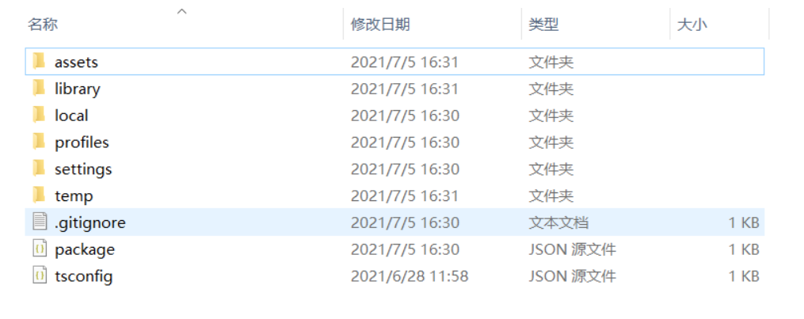

# CMake 使用简介

## 前言

CMake（Cross-Make）是一个跨平台的构建工具，CMake 本身并 **不参与** 工程的构建和编译，CMake 使用简单的语法描述项目构建的细节，根据用户所需，输出各种各样的 Makefile 或者 Project 文件。同一个 CMake 编译规则可以在 **不同系统平台** 构建出不同的可执行构建文件。开发者可以在这里用 CMake 集成 SDK 或者引用要编译原生的库和配置。删除构建后生成的发布包目录（例如： `build/windows`）**不会影响** 已经集成的 SDK。通常存放CMake工程描述细节的文件名是 `CMakeLists.txt`。

CMake 的输出过程和基础编写已经被集成在  v3.0 之后的版本当中，因此本篇文档将基于 v3.2 的版本主要介绍 `CMakeLists.txt` 的使用规则和一些简单的例子。

## CMakeLists 的生成和使用

CMake 第一次运行时将生成 `CMakeCache.txt` 文件，而在新建的项目中，因为从未构建过，所以调用 CMake,因此是不会有 `engine` 文件夹的。



当你选择一个平台进行构建之后，就会在项目目录下产生 `native/engine/当前构建的平台名称`、`native/engine/common`  文件夹。


打开当前构建的平台名称的文件夹和 `common` 文件夹都可以找到对应的 CMakeLists.txt 文件。其中 `common` 文件夹下 `CMakeLists.txt` 是用来配置项目通用配置的，而当前构建的平台名称的文件夹下的 `CMakeLists.txt` 文件，则是用来配置对应的构建平台。这里采用 **安卓平台** 做个示例。

`CMakeLists.txt` 的语法比较简单，由命令、注释和空格组成，其中命令是不区分大小写的。指令是大小写无关的,参数和变量是大小写相关的。但推荐全部使用大写指令。符号 # 后面的内容被认为是注释。命令由命令名称、小括号和参数组成，参数之间使用空格进行间隔。

在这里，我们用用新建的一个空包构建安卓版本产生的 `CMakeLists.txt` 来大概了解一下 `CMakeLists.txt` 的语法和用法。

```CMake

#设置CMake所需的最低版本。如果使用的CMake版本低于该版本，则会发出致命错误。
cmake_minimum_required(VERSION 3.8)
#声明了项目的名称
option(APP_NAME "Project Name" "cmakeTest")
#声明了项目的名称和支持的编程语言(CXX代表C++)：
project(${APP_NAME} CXX)
#include 命令告诉预处理器将指定头文件的内容插入到预处理器命令的相应位置。
include(${CMAKE_CURRENT_LIST_DIR}/../common/CMakeLists.txt)
	
#定义了一个新变量LIB_NAME  并设置为cocos
set(LIB_NAME cocos)
#定义了一个变量PROJ_SOURCES
set(PROJ_SOURCES
    ${CMAKE_CURRENT_LIST_DIR}/../common/Classes/Game.h
    ${CMAKE_CURRENT_LIST_DIR}/../common/Classes/Game.cpp
    ${CMAKE_CURRENT_LIST_DIR}/jni/main.cpp
)
#如果在该路径下不存在jsb_module_register.cpp，则复制这个路径下的jsb_module_register.cpp文件链接到一个目标文件夹中
if(NOT EXISTS ${CMAKE_CURRENT_LIST_DIR}/../common/Classes/jsb_module_register.cpp，则负责)
    file(COPY "${COCOS_X_PATH}/cocos/bindings/manual/jsb_module_register.cpp文件到"
        DESTINATION ${CMAKE_CURRENT_LIST_DIR}/../common/Classes/)
endif()
#添加新element到list中
list(APPEND PROJ_SOURCES
    ${CMAKE_CURRENT_LIST_DIR}/../common/Classes/jsb_module_register.cpp
)
#动态库PROJ_SOURCES生成链接文件 到LIB_NAME中
add_library(${LIB_NAME} SHARED ${PROJ_SOURCES})
#将目标文件LIB_NAME与库文件cocos2d_jni进行链接
target_link_libraries(${LIB_NAME}
    "-Wl,--whole-archive" cocos2d_jni "-Wl,--no-whole-archive"
    cocos2d
)
#将包含目录添加到目标。
target_include_directories(${LIB_NAME} PRIVATE
    ${CMAKE_CURRENT_LIST_DIR}/../common/Classes
)

```

在 `common` 文件夹下的 `CMakeLists.txt` 文件下的用法也是一致的，但是会多一些基础的配置。例如：

```CMake
option(USE_SPINE                "Enable Spine"                      ON)
```

但是需要注意的是，在 `common` 文件夹下的 `CMakeLists.txt` 文件下中的这些基础配置是 **默认选项**，在 `build/构建的版本（例如: Android）/proj`  下的 cfg.cmake 文件会 **修改** 到这些基础配置，是因为 `CMakeLists.txt` 中有对 `cfg.cmake` 文件进行引入。

```CMake
include(${RES_DIR}/proj/cfg.CMake)
```

而 `cfg.make` 是在引擎点击构建的时候会根据构建的渠道版本 **对应生成**。例如开发者在引擎的项目设置的功能裁剪中取消勾选 Spine 动画功能。


再点击构建，重新生成的 `cfg.make` 中就会出现改变。


在经过编译之后，CMake 会根据配置生成 CMakeCache.txt 文件。这里面拥有开发者构建一个项目 **需要依赖的各种输入参数**。


## CMakeLists 的常用示例

下面将会介绍一些在 `CMakeLists.txt` 文件中的常用编译指令和使用示例。

### 常用编译指令：

#### 找到编译头文件

让 CMake 找到我的头文件,指定编译给定目标时要使用的包含目录或目标

```CMake
target_include_directories(<target> [SYSTEM] [BEFORE]
  <INTERFACE|PUBLIC|PRIVATE> [items1...]
  [<INTERFACE|PUBLIC|PRIVATE> [items2...] ...])
```

一般引用库路径使用这个命令，作为外部依赖项引入进来，target 是自己项目生成的 `lib`。例如：

```CMake
target_include_directories(${LIB_NAME} PRIVATE
    ${CMAKE_CURRENT_LIST_DIR}/../common/Classes
)
```

我们将 `Classes` 头文件库路径添加到了 `LIB_NAME` 项目。

#### 链接库文件

`target_link_libraries` 里库文件的顺序符合 `gcc` 链接顺序的规则，即被依赖的库放在依赖它的库的后面。

```CMake
target_link_libraries(<target> [item1] [item2] [...]
                      [[debug|optimized|general] <item>] ...)
```

上述指令中的 `<target>` 是指通过 `add_executable()` 和 `add_library()` 指令生成已经创建的目标文件。而 `item` 表示库文件没有后缀的名字。默认情况下，库依赖项是传递的。当这个目标链接到另一个目标时，链接到这个目标的库也会出现在另一个目标的连接线上。例如：

```CMake
target_link_libraries(${LIB_NAME}   
    "-Wl,--whole-archive" cocos2d_jni "-Wl,--no-whole-archive"
    cocos2d
)
```

#### 生成target

Target包括3种:`executable`、 `library`、`自定义 command` 指令分别为：

```CMake
add_custom_command(TARGET target
                   PRE_BUILD | PRE_LINK | POST_BUILD
                   COMMAND command1 [ARGS] [args1...]
                   [COMMAND command2 [ARGS] [args2...] ...]
                   [WORKING_DIRECTORY dir]
                   [COMMENT comment] [VERBATIM])
```

该指令的主要作用就是向目标（例如库或可执行文件）添加自定义命令。这对于在构建目标之前或之后执行操作非常有用。该命令成为目标的一部分，并且仅在构建目标本身时才会执行。如果目标已经构建，则该命令将不会执行。

```CMake
add_custom_command(TARGET ${LIB_NAME} POST_BUILD
            COMMAND ${CMAKE_COMMAND} -E copy_if_different ${abs} $<TARGET_FILE_DIR:${LIB_NAME}>/${filename}
        )
```

**add_custom_command** 有两个限制:

- 只有在相同的 `CMakeLists.txt` 中，指定了所有依赖于其输出的目标时才有效。

- 对于不同的独立目标，使用 `add_custom_command` 的输出可以重新执行定制命令。这可能会导致冲突，应该避免这种情况的发生。

```CMake
add_library(<name> [STATIC | SHARED | MODULE]
            [EXCLUDE_FROM_ALL]
            source1 [source2 ...])
```

该指令的主要作用就是将指定的源文件生成链接文件，然后添加到工程中去。添加名为 `name` 的库，库的源文件可指定，也可用 `target_sources()` 后续指定。`source1`、`source2` 分别表示各个源文件。
库的类型是 `STATIC(静态库)`/`SHARED(动态库)`/`MODULE(模块库)` 之一。

```CMake
add_library(${LIB_NAME} SHARED ${PROJ_SOURCES})
```

还有一个指令就是：

```CMake
add_executable(<name> [WIN32] [MACOSX_BUNDLE]
               [EXCLUDE_FROM_ALL]
               source1 [source2 ...])
```

该指令的主要作用就是使用指定的源文件向项目添加可执行文件。

```CMake
add_executable(hello-world hello-world.cpp)
```

#### 其他命令

 打印调试日志消息:

```CMake
message(STATUS “my custom debug info”)
```

操作文件命令：

```CMake
  file(COPY "${COCOS_X_PATH}/cocos/bindings/manual/jsb_module_register.cpp"
        DESTINATION ${CMAKE_CURRENT_LIST_DIR}/../common/Classes/)
```

### 使用示例

**Android.mk**  是 Android 源码编译系统的 Makefile，用于编译系统中的 C++ 的动态库、静态库、可执行文件和 apk 等。在这里我们采用一个腾讯云的多媒体引擎 SDK 里的一个 Android.mk 来改写成  `CMakeLists.txt` 做一个简单的示例：

```
LOCAL_PATH := $(call my-dir)

include $(CLEAR_VARS)
LOCAL_MODULE := Pre_GMESDK
LOCAL_SRC_FILES := ./$(TARGET_ARCH_ABI)/libgmesdk.so
include $(PREBUILT_SHARED_LIBRARY)

include $(CLEAR_VARS)
LOCAL_MODULE := Pre_TRAE
LOCAL_SRC_FILES := ./$(TARGET_ARCH_ABI)/libtraeimp.so
include $(PREBUILT_SHARED_LIBRARY)	

include $(CLEAR_VARS)
LOCAL_MODULE := Pre_PTT
LOCAL_SRC_FILES := ./$(TARGET_ARCH_ABI)/libsilk.so
include $(PREBUILT_SHARED_LIBRARY)

include $(CLEAR_VARS)
LOCAL_MODULE := Pre_MP3
LOCAL_SRC_FILES := ./$(TARGET_ARCH_ABI)/libgmecodec.so
include $(PREBUILT_SHARED_LIBRARY)
```

​在  Android.mk 中：

```
LOCAL_PATH := $(call my-dir)
```

此变量表示源文件在开发树中的位置。在上述命令中，构建系统提供的宏函数 `my-dir`  将返回当前目录（`Android.mk`  文件本身所在的目录）的路径。

在对应 CMakeLists.txt:

```
set(LOCAL_PATH ${CMAKE_CURRENT_SOURCE_DIR}/..)
```

在 Android.mk 中：

```
include $(CLEAR_VARS)
LOCAL_MODULE := Pre_GMESDK
LOCAL_SRC_FILES := ./$(TARGET_ARCH_ABI)/libgmesdk.so
include $(PREBUILT_SHARED_LIBRARY)
```

在对应 CMakeLists.txt:

```CMake
	add_library(Pre_GMESDK SHARED IMPORTED GLObal)
	set_target_properties(Pre_GMESDK PROPERTIES
  IMPORTED_LOCATION ./${ANDROID_ABI}/libgmesdk.so
)
```

## 结语

CMake 的指令和用法还有很多，欢迎大家去探寻和学习，这里只是做了简单的示例。CMake 是一个跨平台的构建工具，本身并不参与工程的构建和编译，可以用一种方式实现对多个平台的配置,由于从 v3.0 开始 Cocos Creator 对配置进行了分离。因此开发者可以在这里对 `CMakeLists.txt` 进行第三方库的引入，进行工程配置,再也不用担心重新构建导致配置丢失。CMake 的用法广泛且正确，未来 Cocos Creator 将用 CMake 将更多的功能集成到编辑器的构建页面，也鼓励开发者针对自身的实际情况，对自己的工作流进行定制。如果有问题和交流也欢迎反馈到 [论坛](https://forum.cocos.org/c/Creator/58)。

## 参考链接

对于 CMake 的语法和接口还有问题的开发者可以学习参考 CMake [文档](https://CMake.org/CMake/help/v3.8/index.html)。
