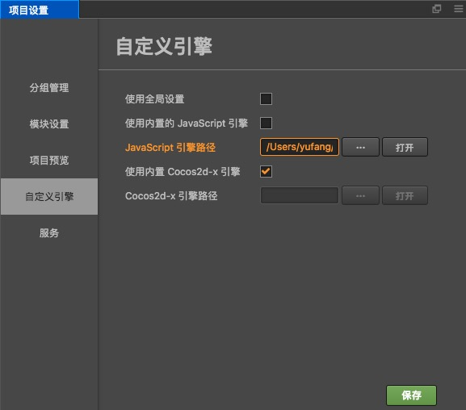
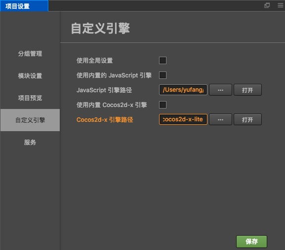

# 引擎定制工作流程

Cocos Creator 的引擎部分包括 JavaScript、Cocos2d-x 和 adapter 三个部分。全部都在 GitHub 上开源。地址在：

- **JavaScript 引擎**：[GitHub](https://github.com/cocos/cocos-engine) | [Gitee](https://gitee.com/mirrors_cocos-creator/engine)
- **Cocos2d-x 引擎**：[GitHub](https://github.com/cocos/engine-native) | [Gitee](https://gitee.com/mirrors_cocos-creator/engine-native)

Adapter 地址分别在：

- `jsb-adapter`：[GitHub](https://github.com/cocos-creator-packages/jsb-adapter) | [Gitee](https://gitee.com/mirrors_cocos-creator/jsb-adapter)
- `weapp-adapter`：[GitHub](https://github.com/cocos-creator-packages/weapp-adapter)
- `qqplay-adapter`：[GitHub](https://github.com/cocos-creator-packages/qqplay-adapter)

建议你通过 GitHub 的 fork 工作流程来维护自己定制的代码，以便在将来引擎升级时，可以方便地将定制的部分更新上去，具体操作方式请阅读 [Fork a repo](https://help.github.com/articles/fork-a-repo)。如果你愿意帮助 Cocos 越做越好，欢迎在 GitHub 提交你的修改，请参考 [如何向 Cocos 提交代码](../submit-pr/submit-pr.md)。关于更多 GitHub 相关工作流程请参考 [GitHub Help](https://help.github.com)。

另外，根据不同的 Creator 版本，还需要切换不同的引擎分支，例如：

- **master/develop** 分支：当前最新版本所用分支
- **vX.Y-release** 分支：对应 X.Y 版本所用分支
- **vX.Y** 分支：和 vX.Y-release 分支相同，主要用于范例工程
- **next** 分支：大型重构所用分支，如果是文档和 API 仓库，则用于 2.0 分支

通常建议使用和所用 Creator 相同版本的 vX.Y-release 分支，如果找不到的话，则使用 master 分支。

## 1 定制 JavaScript 引擎

如果您只需要定制 Web 版游戏的引擎功能，或只需要修改纯 JavaScript 层逻辑（如 UI 系统，动画系统），那么您只要按照下面的流程修改 JS 引擎就可以了。

### 1.1 获取 JS 引擎

如果您仅需基于当前的版本做一些调整，那么在 Cocos Creator 内置的引擎基础上修改就可以了。点击 Creator 编辑器右上方的 **打开程序安装路径**，然后将内置的 **engine** 目录拷贝到本地其他路径。


如果您想获得官方正在开发中的最新版本，首先您需要从 GitHub 上 fork 或者克隆 JavaScript 引擎的原始版本（地址见上文）。JavaScript 引擎在使用前请根据 Creator 版本切换相对应的分支。下载完成后存放到任意本地路径。


### 1.2 安装编译依赖

```bash
# 在命令行中进入引擎路径
cd /Users/yufang/engine
# 安装 gulp 构建工具
npm install -g gulp
# 安装依赖的模块
npm install
```

### 1.3 进行修改然后编译

接下来您可以定制引擎修改了，修改之后请在命令行中继续执行：

```bash
gulp build
```

该命令会在引擎目录下生成一个 `bin` 文件夹，并将引擎源码编译到 `bin` 目录下。


**注意**：如果在编译过程中出现 `JavaScript heap out of memory` 的报错，可执行以下命令解决：

```js
gulp build --max-old-space-size=8192
```

### 1.4 在 Cocos Creator 中使用定制版引擎

通过 **项目 -> 项目设置** 面板的 **自定义引擎** 选项卡，设置本地定制后的 JavaScript 引擎路径。



## 2 定制 Cocos2d-x 引擎

如果您需要定制和原生平台相关的引擎功能，在修改 JS 引擎的基础上，可能还需要同步修改 Cocos2d-x 引擎。

### 2.1 获取 Cocos2d-x 引擎

如果您仅需要基于当前的版本做一些调整，那么在 Cocos Creator 内置的 Cocos2d-x 引擎基础上修改就可以了。操作步骤和获取 JS 引擎一致：点击 Creator 编辑器右上方的 **打开程序安装路径**，然后将内置的 **cocos2d-x** 目录拷贝到本地其他路径。

如果您想取得官方正在开发中的最新版本，需要从上文中指定的 GitHub 仓库下载或者克隆。和 JS 引擎类似，Cocos2d-x 引擎在使用前也请确认当前所在分支。

### 2.2 初始化

下载或者克隆好 Cocos2d-x 引擎仓库后，在命令行进入引擎路径然后执行：

```bash
# 在命令行进入 Cocos2d-x 引擎路径
cd /Users/yufang/cocos2d-x 
# 安装编译依赖
npm install
# 安装 gulp 构建工具
npm install -g gulp
# 初始化仓库
gulp init
```

- 如果遇到类似下方这样的报错，请手动下载该 zip 文件。出错原因是您的 python 自带的一个库版本太低，但是不太好升级，比较简单一些的方法是下载该 zip 文件，手动放到 Cocos2d-x 引擎仓库下并重命名为 `v3-deps-54.zip`（不需要解压该 zip 文件），再重新运行 `gulp init`。

    ```bash
    > ==> Ready to download 'v3-deps-54.zip' from
    > 'https://github.com/cocos/cocos-engine-external/archive/v3-deps-54.zip'
    > Traceback (most recent call last):
    > ...
    > URLError: <urlopen error [SSL: TLSV1_ALERT_PROTOCOL_VERSION] tlsv1 alert protocol version (_ssl.c:590)>
    ```

- 若遇到类似下方这样的报错，请手动下载该 zip 文件。手动放到 Cocos2d-x 引擎仓库 `tools/cocos2d-console` 目录下并重命名为 `creator-console-2.zip`（不需要解压该 zip 文件），再重新运行 `gulp init`。

    ```bash
    > ==> Ready to download 'creator-console-2.zip' from
    > 'https://github.com/cocos2d/console-binary/archive/creator-console-2.zip'
    > Traceback (most recent call last):
    > ...
    > URLError: <urlopen error [SSL: TLSV1_ALERT_PROTOCOL_VERSION] tlsv1 alert protocol version (_ssl.c:590)>
    ```

- 若遇到类似下方这样的报错，通常是因为该 Cocos2d-x 引擎仓库是直接从 GitHub 下载而不是克隆下来的。可以执行 `git init`，然后再重新运行 `gulp init` 即可。

    ```bash
    fatal: not a git repository (or any of the parent directories): .git
    ```

### 2.3 在 Cocos Creator 中配置定制版引擎

通过 `项目 -> 项目设置` 面板的 **自定义引擎** 选项卡，设置使用您本地定制后的 Cocos2d-x 引擎路径。



### 2.4 修改引擎

接下来可以对 Cocos2d-x 引擎进行定制修改了，由于只有在 **构建发布** 过程中才会编译代码，所以修改引擎后可以直接打开 **构建发布** 面板，选择 `default` 或者 `link` 模板进行构建和编译。

### 2.5 编译模拟器

要在模拟器中预览您的引擎修改，需要执行以下命令来重新编译模拟器

```bash
# 通过 cocos console 生成模拟器
gulp gen-simulator
gulp update-simulator-config
```

> **注意**：如果需要在 Mac 上通过 Safari 来调试模拟器中的 JavaScript 代码，则需要在生成自定义模拟器之前先在 Xcode 中随便设置一个签名。详见 [Build simulator](https://github.com/cocos/engine-native/blob/develop/README.md#git-user-attention)。


## 3 定制 Adapter

Cocos Creator 为了实现跨平台，在 JavaScript 层需要对不同平台做一些适配工作。
这些工作包括：

- 为不同平台适配 BOM 和 DOM 等运行环境
- 一些引擎层面的适配  

目前适配层包括三个部分：

- `jsb-adapter` 适配原生平台
- `weapp-adapter` 适配微信小游戏
- `qqplay-adapter` 适配 qq 玩一玩

### 3.1 获取 Adapter

如果您仅需要基于当前的版本做一些调整，那么在 Cocos Creator 内置的相对应平台的 adapter 引擎基础上修改就可以了。操作步骤和获取 JS 引擎一致：点击 Creator 编辑器右上方的 **打开程序安装路径**，在该目录下的 `resources/builtin` 内就可以找到 `jsb-adapter`、`weapp-adapter` 和 `qqplay-adapter` 目录。

如果您想取得官方正在开发中的最新版本，需要从上文中指定的 GitHub 仓库下载。然后替换到程序安装路径的 `resources/builtin` 目录下。和 JS 引擎类似，adapter 在使用前也请确认当前所在分支。

### 3.2 定制 jsb-adapter

在 `jsb-adapter` 目录下，主要包括以下两个目录结构：

- `builtin`：适配原生平台的 runtime
- `engine`：适配引擎层面的一些 api

`builtin` 部分除了适配 BOM 和 DOM 运行环境，还包括了一些相关的 jsb 接口，如 openGL, audioEngine 等。

jsb-adapter 的定制流程在不同的 Creator 版本中都做了一些调整和优化。请根据你当前使用的 Creator 版本，参考以下不同的定制指南。

#### 3.2.1 Creator v2.0.5 之前的定制流程

`engine` 部分的定制只要对代码进行修改就可以了。<br>
`builtin` 部分的定制需要先安装相关依赖，请在命令行中执行：

```bash
# 在命令行进入 jsb-adapter/builtin 路径
cd jsb-adapter/builtin
# 安装 gulp 构建工具
npm install -g gulp
# 安装依赖的模块
npm install
```

接下来就可以对 **builtin** 部分的代码进行定制修改了，修改完成之后请在命令行中继续执行：

```bash
# jsb-adapter/builtin 目录下
gulp
```

命令执行完成后，会在 `jsb-adapter/builtin/dist` 目录下生成新的 `jsb-builtin.js` 文件。

定制完 `jsb-adapter` 之后，在编辑器的 **构建面板** 中 **构建** 原生项目时，编辑器会将 `jsb-builtin.js` 文件和 `engine` 目录一起拷贝到对应项目工程里的 `jsb-adapter` 文件夹中。

#### 3.2.2 Creator v2.0.5 和 v2.0.6 的定制流程

定制前需要先安装相关依赖，请在命令行中执行：

```bash
# 在命令行进入 jsb-adapter 路径
cd jsb-adapter/
# 安装 gulp 构建工具
npm install -g gulp
# 安装依赖的模块
npm install
```

接下来就可以对 **jsb-adapter** 的代码进行定制修改了，修改完成之后请在命令行中继续执行：

```bash
# jsb-adapter 目录下
gulp
```

`gulp` 命令执行会将 **bultin** 部分的代码打包到 `jsb-builtin.js` 文件，并且将 **engine** 部分的代码从 ES6 转为 ES5。所有这些编译生成的文件会输出到 **dist** 目录下。

定制完 `jsb-adapter` 之后，在编辑器的 **构建面板** 中 **构建** 原生项目时，编辑器会将 **dist** 目录下的文件一起拷贝到对应项目工程里的 `jsb-adapter` 文件夹中。

#### 3.2.3 Creator v2.0.7 之后的定制流程（包括 v2.0.7）

在 v2.0.7 之后，jsb-adapter 废弃了繁琐的手动编译的操作。可以直接修改 **builtin** 和 **engine** 目录下的源码。修改完成后打开编辑器，编辑器会在启动时自动编译这部分源码。

### 3.3 定制 weapp-adapter 和 qqplay-adapter

**小游戏** 和 **玩一玩** 的适配层代码分别位于 `resources/builtin` 目录下的 `weapp-adapter` 和 `qqplay-adapter`。

- 这部分代码的定制，不需要任何编译操作。
- 引擎层面的适配工作，请在相应的 engine 目录下完成。

如果开发者想要了解更多小游戏 adapter 相关内容，可阅读 [小游戏文档](https://developers.weixin.qq.com/minigame/dev/guide/best-practice/adapter.html)。

## 4 JSB 绑定流程

如果您需要修改 Cocos2d-x 引擎提供的 JavaScript 接口，应该完成 JSB 绑定。

1.7 及 1.7 以上版本请参考

- [JSB 2.0 绑定教程](JSB2.0-learning.md)

1.6 及 1.6 以下版本请参考

- [Cocos 中的脚本绑定](https://zhuanlan.zhihu.com/p/20525026)
- [Cocos 中的自动绑定](https://zhuanlan.zhihu.com/p/20525109)
