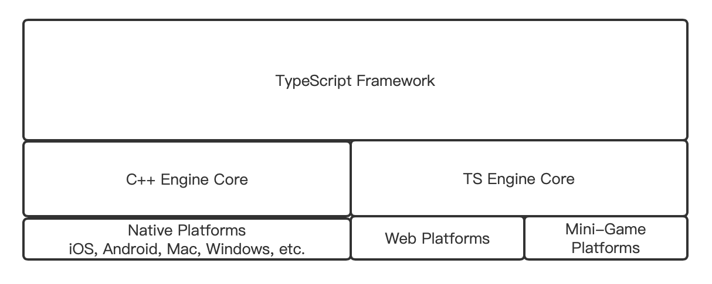
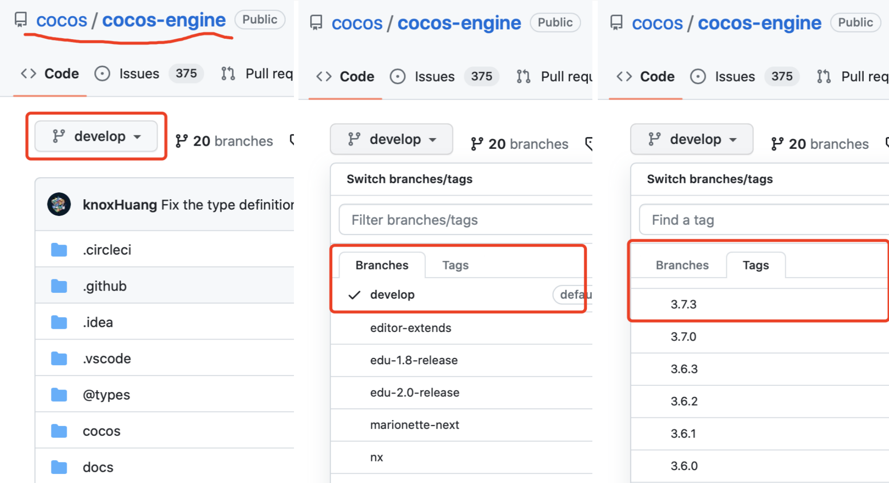
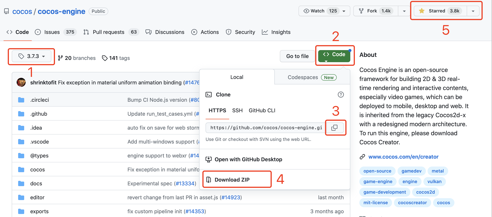
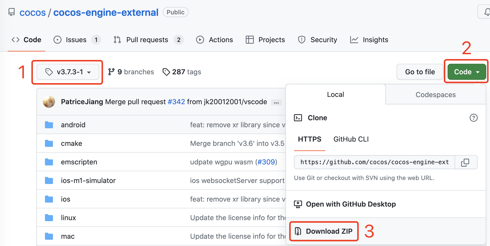
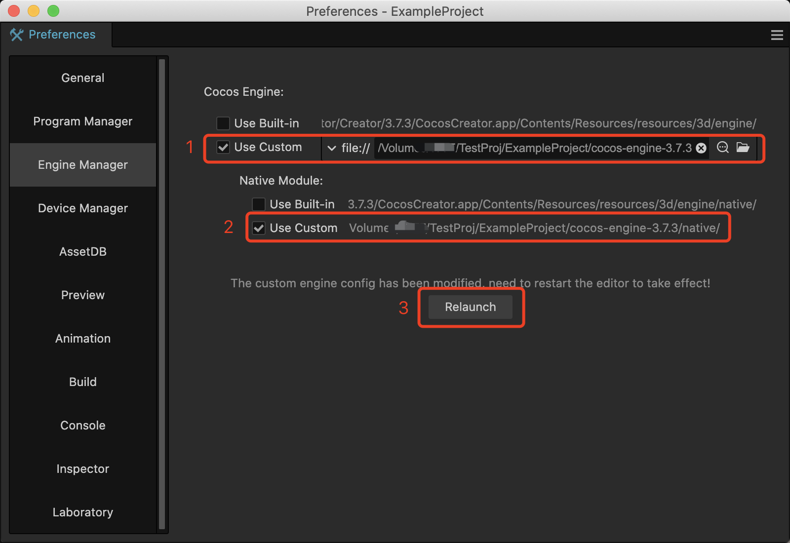
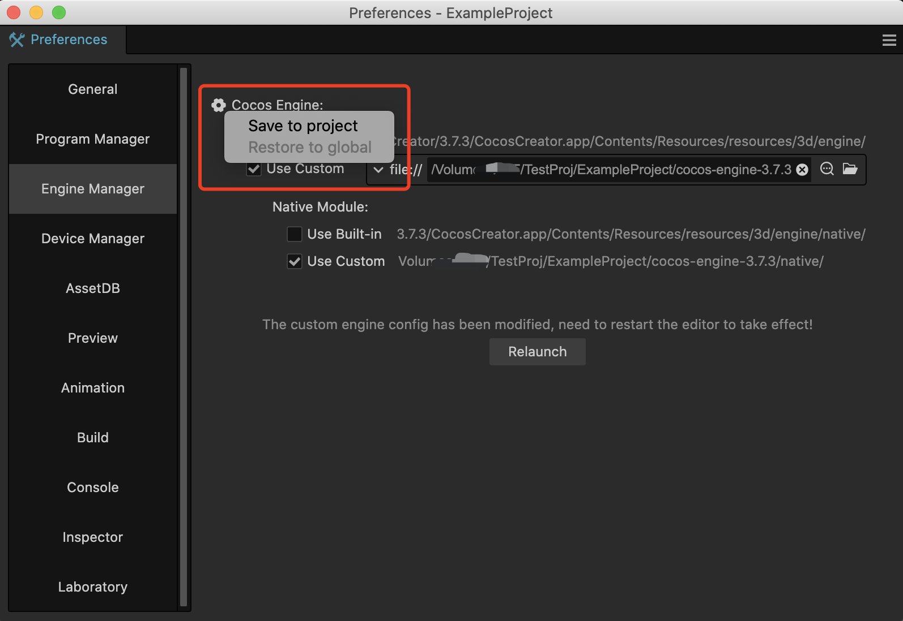
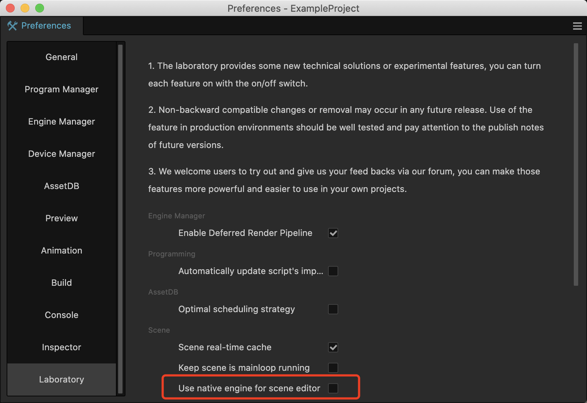
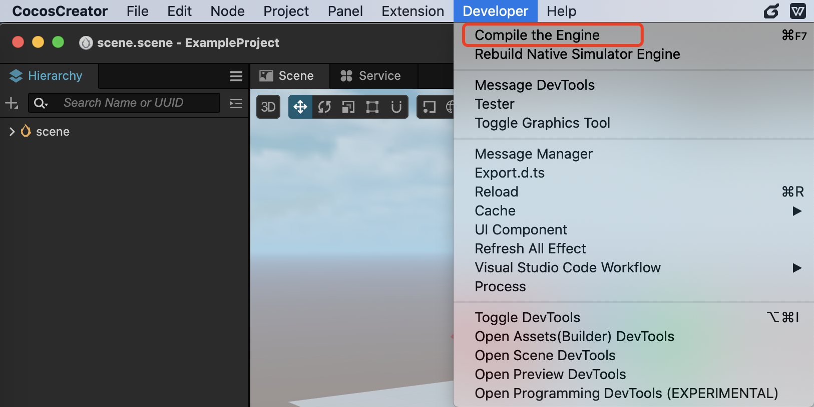
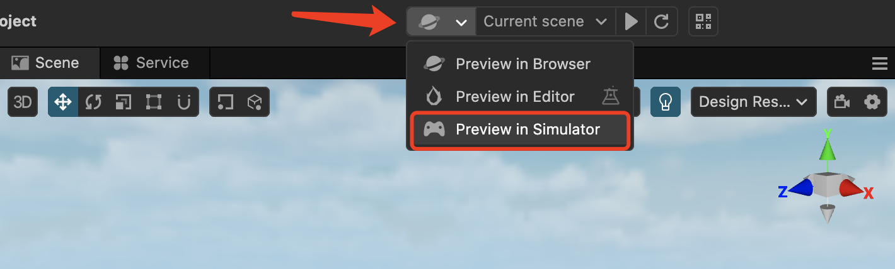

# 引擎定制工作流程

Cocos Creator 拥有两套引擎内核，C++ 内核 和 TypeScript 内核。C++ 内核用于原生平台，TypeScript 内核用于 Web 和小游戏平台。 在引擎内核之上，是用 TypeScript 编写的引擎框架层，用以统一两套内核的差异，让开发更便捷。



## 获取引擎源码



### 1. 进入 Cocos 引擎仓库

Cocos 是一个开源引擎，不同版本的引擎源码可以从 Cocos 引擎官方开源仓库中获取，地址如下：

- Cocos 引擎：[GitHub](https://github.com/cocos/cocos-engine/) | [GitEE](https://gitee.com/mirrors_cocos-creator/engine/)

打开仓库主页，可以看到上图中左侧子图所示的内容，根据需求自行决定使用哪一个版本即可。

### 2. 选择分支（Branch）

如果是要采用最新的分支，选择上图中间子图所示的 `develop` 分支即可。

> **注意**：此分支由于是开发中的最新分支，并不确保稳定性。

### 选择 Tag

如果要采用对应 Cocos Creator 版本的稳定分支，则按上图右侧子图所示，切换到 Tags 标签，并选择对应的版本号。 比如，你所用的 Cocos Creator 为 3.7.3 版本，那么你就选择 3.7.3 即可。

> **注意**：不同的 Cocos Creator 版本，需要对应不同的引擎分支，请确保二者版本匹配。

### 3. Clone 或者 下载



如上图所示，选择了对应的分支或者 Tag 后，就会切换到相应仓库（1）。

点击右边的 **代码**（2）按钮，会弹出代码下载面板。

你可以 **复制仓库链接**（3），然后使用 git 工具 clone 到本地，也可以选择 `Download ZIP`（4） 下载源码的 zip 包到本地并解压即可。

> 记得在页面右上角给 Cocos 引擎的开源仓库加个星（5），谢谢！

## 配置环境

### 1. 引擎源码放到指定目录

根据自身项目需求，从 Cocos 引擎的源码仓库获得引擎源码，放到适合的目录下。

- 如果自定义引擎仅为某一个项目使用，则建议放入对应的项目目录。
- 如果多个项目会共享一套自定义引擎，则根据项目管理方案，放到适合的公共目录。

### 2. 获取 external

Cocos 原生引擎的编译，需要依赖 `cocos-engine/native/external` 中的库。这些库有几百 MB 大小，所以源码包内默认是没有的，可以通过以下三种方式获取。

**第一种方式**：通过 git 命令行。

```ts
  cd cocos-engine/native
  git clone https://github.com/cocos/cocos-engine-external external
  cd external
  git checkout -b branch_name tag 
```

- branch_name：是新的分支名
- tag：是第三方库对应的 tag 名字，可以从 cocos-engine/native/external-config.json 里的 checkout 字段获取该值。

> 示例： 假如我们要使用 3.7.3-1 版本，则可以写成 `git checkout -b 3.7.3-1 3.7.3-1`

**第二种方式**：使用引擎自带的脚本下载。

该脚本只会下载某个 tag 对应的第三方库。

```ts
  cd cocos-engine/native
  npm install
  gulp init
```

> 只要使用的 tag 有变化，就需要重新下载。每次需要下载几百兆的内容。

**第三种方式**：下载 ZIP 包

如果某些原因不能通过 NodeJS 和 git 命令下载 `external` 源码包，则可以直接在 [cocos-engine-external](https://github.com/cocos/cocos-engine-external) 仓库页面，按照以下步骤下载。



1. 选择对应的分支，需要使用哪一个分支可以从 cocos-engine/native/external-config.json 中的 `checkout` 字段中查看。
2. 点击右边的 **源代码（Code）** 按钮，弹出源码下载页面。
3. 点击 **下载ZIP（Download ZIP）** 按钮，下载源码压缩包。
4. 解压，重命名为 `external`，并放到  `cocos-engine/native` 目录下。

> **注意**：external 与 cocos-engine 的版本号要一致，否则可能导致编译失败。

### 3. 安装编译依赖

编译依赖项需要使用 `NodeJS`，请确保电脑安装了 `NodeJS v12.0` 以上版本，如未安装，请前往 [https://nodejs.org/](https://nodejs.org/) 下载安装。

安装完成后，在自定义引擎根目录，执行以下命令。

```bash
# 安装 gulp 构建工具
npm install -g gulp
# 安装依赖的模块
npm install
# 编译一些数据，包括 debug infos 和 .d.ts
gulp init
```

### 4. 修改引擎路径

通过 **Cocos Creator/File -> 偏好设置** 的 **引擎管理器** 选项卡来设置需要使用的引擎源码路径。需要注意的是 **修改引擎路径后需要重启编辑器**。



#### 指定 TypeScript 引擎

默认情况下，`Use Built-in` 会处于选中状态，表示使用的是 Cocos Creator 内置的引擎。 为了使用自定义引擎，我们只需要将选项卡切换到 `Use Custom`， 并将路径指定为引擎源码根目录即可。

#### 指定原生（C++）引擎

如果需要定制和原生平台相关的引擎功能， 则还需要勾选 `Native Module` 下的 `Use Custom`。 会自动识别自定义引擎根目录下的 `native` 作为路径，不可更改。

#### 配置存储路径



默认情况下，自定义引擎的修改会保存为全局配置，将影响所有使用当前 Cocos Creator 版本的项目。

将鼠标移动到 `Cocos Engine` 文字上，文字前方会出现一个设置按钮，点击按钮可以选择存储位置。

#### 重启 Cocos Creator

自定义引擎路径修改完成后，需要重启 Cocos Creator 编辑器才能生效。 直接关闭 Cocos Creator 再次打开，或者点击界面上的 **重启（Relaunch）** 按钮。

> **注意**：自定义引擎生效后，Cocos Creator 中的场景编辑器也会采用自定义引擎进行渲染。默认情况下采用的是 TypeScript 内核运行，如果要让编辑器也使用原生引擎进行渲染，需要在 **偏号设置** -> **实验室** 面板下，开启 **启用原生引擎加载场景编辑器**。



## 修改 TypeScript 引擎

如果您只需要为 Web 和 小游戏平台的游戏定制引擎功能，或只需要修改 TypeScript 层的引擎相关代码（如 UI 系统，动画系统等），那么只需要在修改完成之后在 Cocos Creator 编辑器的菜单栏中点击 **开发者 -> 编译引擎** 进行编译即可。



该命令会在引擎目录下生成一个 `bin` 文件夹，并将引擎源码编译到这里。

## 修改原生（C++）引擎

如果需要定制和原生平台相关的引擎功能，除了修改 TypeScript 代码，可能还需要修改 C++ 代码。

为了使原生部分的代码能够正常被编译，需要确保 `Native Module` 中的 `Use Custom` 被选中。

### 在 Cocos Creator 中编译

引擎修改完成后，打开 **构建发布** 面板，点击**构建**，构建完成后，点击 **编译**。

### 在 IDE 中编译

第一次配置完自定义引擎路径后，需要 **在构建发布** 面板点击 **构建** 按钮，才会同步相关配置到 IDE（如 Xcode, Android Studio, Visual Studio 等）中。

此时的 IDE 中引用的 `Cocos Engine` 路径将会是自定义引擎的路径。修改完原生相关代码后，直接使用 IDE 的编译即可。

## 重新编译原生引擎模拟器

    ```bash
    cd cocos-engine/native
    git clone https://github.com/cocos/cocos-engine-external external --branch tag
    ```
    
    `branch_name` 是新的分支名；`tag` 是第三方库对应的 `tag` 名字，可以从 `cocos-engine/native/external-config.json` 里的 `checkout` 字段获取该值。
    
- 使用引擎自带的脚本下载。该脚本只会下载某个 `tag` 对应的第三方库。后续只要使用的 `tag` 有变化，就需要重新下载。每次需要下载几百兆的内容。

Cocos Creator 提供了基于原生引擎的模拟器预览功能：



### 自定义 TypeScript 引擎

若使用了自定义 TypeScript 引擎，则这个原生模拟器在启动时，会去加载自定义引擎路径下的`自定义引擎路径/native/simulator` 的 TS 引擎模块。

首次启动时，需要点击编辑器顶部菜单栏中的 **开发者 -> 编译原生模拟器引擎**，否则会无法成功加载 TS 引擎模块。

### 自定义原生引擎

若勾选了自定义原生引擎，在运行模拟器时，Cocos Creator 会启动 `自定义引擎路径/native/simulator/` 路径下的模拟器应用程序。

为了避免安装包过大，Cocos Creator 在发布时剔除了原生引擎模拟器相关工程，需要按以下步骤配置环境，重新编译生成，否则无法启动：

### CMake 安装与配置

> Cocos Creator 在构建、编译、发布应用时，使用的是自带的 CMake，并配置好了路径，不需要再做相关配置。

原生模拟器的编译不属于构建流程，因此需要自己配置 CMake 编译环境。

由于不同的系统平台和系统版本有差异，请参考 [CMake 官方文档](https://cmake.org/install/) 安装 CMake 并配置系统环境变量。

### 编译

`CMake` 配置完成后在 `自定义引擎路径/native` 目录下依次执行以下命令：

```bash
# 安装依赖的模块
npm install
# 生成原生模拟器相关文件
gulp gen-simulator
```

编译完成后，会在 `自定义引擎路径/native/simulator` 路径下生成一个模拟器工程和模拟器可执行文件，便可运行原生模拟器了。

模拟器编译成功后，若后续只改动了 **TypeScript** 部分，则只需要点击编辑器顶部菜单栏中的 **开发者 -> 编译原生模拟器引擎** 即可。
