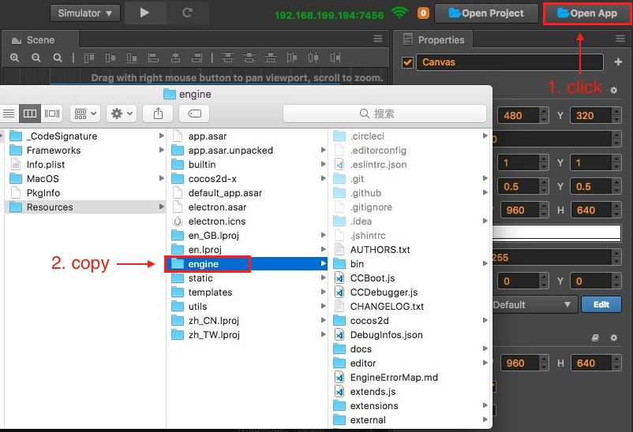
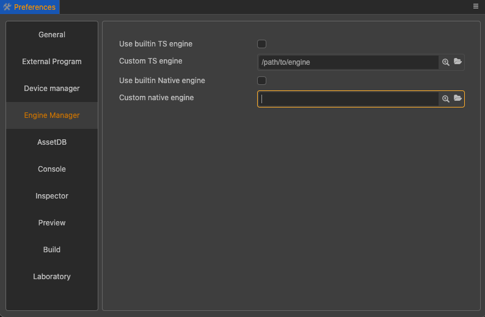
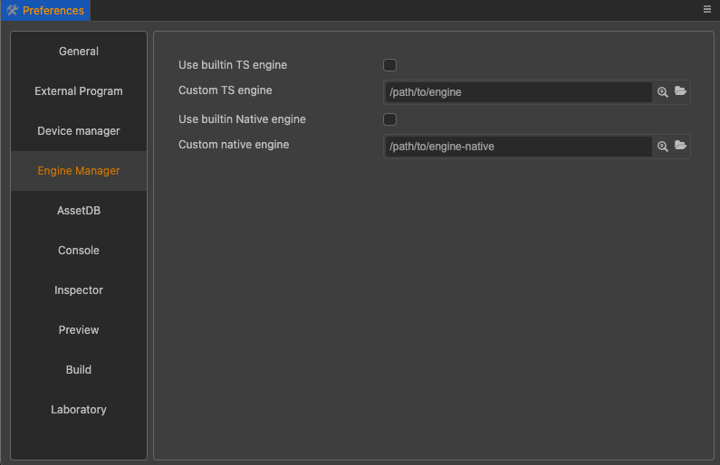

# 引擎定制工作流程

从 Cocos Creator v3.5.0 开始，TypeScript 和 engine-native 两个部分合并在一起了，在 GitHub 上开源。地址是：

- Cocos 引擎：[GitHub](https://github.com/cocos/cocos-engine/) | [Gitee](https://gitee.com/mirrors_cocos-creator/engine/)

engine-native 在 `cocos-engine/native` 目录下。


建议通过 GitHub 的 fork 工作流程来维护自己定制的代码，以便在将来引擎升级时，可以方便地将定制的部分更新上去，具体操作方式请阅读 [Fork a repo](https://help.github.com/articles/fork-a-repo)。如果你愿意帮助 Cocos 越做越好，欢迎在 GitHub 提交你的修改，请参考 [如何向 Cocos 提交代码](../submit-pr/submit-pr.md)。关于更多 GitHub 相关工作流程请参考 [GitHub Help](https://help.github.com)。

另外，根据不同的 Creator 版本，还需要切换不同的引擎分支。通常建议使用和所用 Creator 相同版本的分支。

## 1 定制 TypeScript 引擎

如果您只需要定制 Web 版游戏的引擎功能，或只需要修改纯 TypeScript 层逻辑（如 UI 系统，动画系统），那么您只要按照下面的流程修改 TypeScript 引擎就可以了。

### 1.1 获取 TypeScript 引擎

如果只需基于当前的版本做一些调整，那么在 Cocos Creator 3.x 内置的引擎基础上修改就可以了。点击 Creator 编辑器右上方的 **编辑器** 按钮，然后将内置的 **engine** 目录拷贝到本地其他路径。



如果想获得官方正在开发中的最新版本，首先需要从 GitHub 上 fork 或者克隆 TypeScript 引擎的原始版本（地址见上文）。TypeScript 引擎在使用前请根据 Creator 版本切换相对应的分支。下载完成后存放到任意本地路径。


### 1.2 修改 TypeScript 引擎路径

通过 **Cocos Creator -> 偏好设置** 的 **引擎管理器** 选项卡来设置需要定制的 TypeScript 引擎路径。需要注意的是 **修改引擎路径后需要重启编辑器**。



### 1.3 安装编译依赖

```bash
# 在命令行中进入引擎路径，例如：
cd E:/engine
# 安装 gulp 构建工具
npm install -g gulp
# 安装依赖的模块
npm install
# 编译一些数据，包括 debug infos 和 .d.ts
gulp build
```

> **注意**：生成 debug infos 需要 gulp 构建工具。

### 1.4 进行修改然后编译

接下来可以定制引擎修改了，修改完成之后在 Cocos Creator 编辑器的菜单栏中点击 **开发者 -> 编译引擎** 进行编译。


该命令会在引擎目录下生成一个 `bin` 文件夹，并将引擎源码编译到 `bin` 目录下。


## 2 定制 engine-native 引擎

如果需要定制和原生平台相关的引擎功能，在修改 TypeScript 引擎的基础上，可能还需要同步修改 engine-native 引擎。

### 2.1 获取 engine-native 引擎

如果只需要基于当前的版本做一些调整，那么在 Cocos Creator 3.x 内置的 cocos-engine 引擎基础上修改就可以了。操作步骤和获取 TypeScript 引擎一致，点击 Creator 编辑器右上方的 **编辑器** 按钮，然后将内置的 `cocos-engine` 目录拷贝到本地其他路径。engine-native 就在 `cocos-engine/native` 目录下。

如果想获得官方正在开发中的最新版本，需要从上文中指定的 GitHub 仓库下载或者克隆。因为引擎依赖的第三方库是在另外一个 [github 仓库](https://github.com/cocos/cocos-engine-external) 管理，因此还需要下载这些第三发库。有两种方式下载第三方库：
- 下载完整的仓库，并切换到对应的 tag。该方式方便持续同步第三方库，一般建议使用该方式。使用方式时：

    ```bash
    cd cocos-engine/native
    git clone https://github.com/cocos/cocos-engine-external external --branch tag
    ```
    
    `branch_name` 是新的分支名；`tag` 是第三方库对应的 `tag` 名字，可以从 `cocos-engine/native/external-config.json` 里的 `checkout` 字段获取该值。
    
- 使用引擎自带的脚本下载。该脚本只会下载某个 `tag` 对应的第三方库。后续只要使用的 `tag` 有变化，就需要重新下载。每次需要下载几百兆的内容。

    ```bash
    cd cocos-engine/native
    npm install
    gulp init
    ```

### 2.2 初始化

因为两个仓库合并在一起了，所以参考上面的 TypeScript 引擎定制。

### 2.3 在 Cocos Creator 3.x 中配置定制版原生引擎

通过 **Cocos Creator -> 偏好设置** 的 **Engine 管理器** 选项卡来设置需要定制的 engine-native 引擎路径。



### 2.4 修改引擎

接下来可以对 engine-native 引擎进行定制修改了，由于只有在 **构建发布** 过程中才会编译代码，所以修改引擎后可以直接打开 **构建发布** 面板，进行构建和编译。

### 2.5 定制原生引擎模拟器

为了防止包体过大，Creator 在发布时剔除了原生引擎模拟器相关工程，如果需要使用定制的原生模拟器可以通过以下步骤重新编译生成：

1. 参考 [CMake 官方文档](https://cmake.org/install/) 安装 CMake 并配置系统环境变量。

2. 编译原生模拟器引擎，可分为 TypeScript 和 C++ 两部分：

    - 若开发者定制的是 **TypeScript** 部分，定制完成后，点击编辑器顶部菜单栏中的 **开发者 -> 编译原生模拟器引擎** 即可。

    - 若开发者定制的是 **C++** 部分，定制完成后在 `cocos-engine/native` 目录下依次执行以下命令：

        ```bash
        # 安装依赖的模块
        npm install
        # 生成原生模拟器相关文件
        gulp gen-simulator
        ```

        执行完成后，会在 `cocos-engine/native/simulator` 路径下生成一个模拟器工程和模拟器可执行文件，便可运行原生模拟器了。
