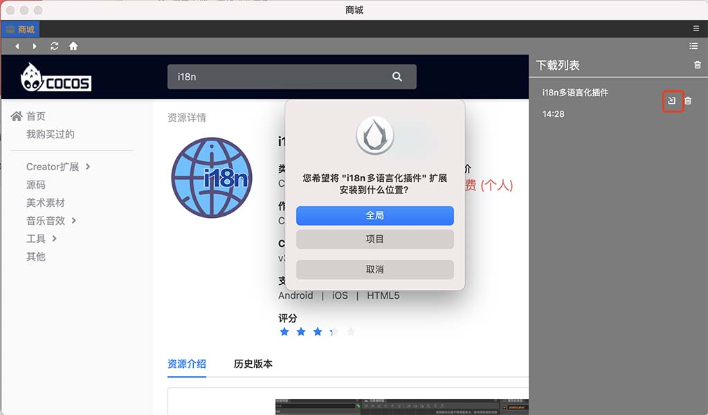
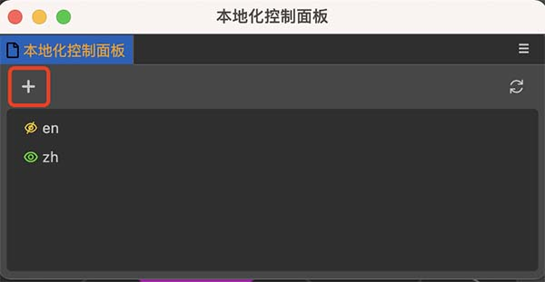
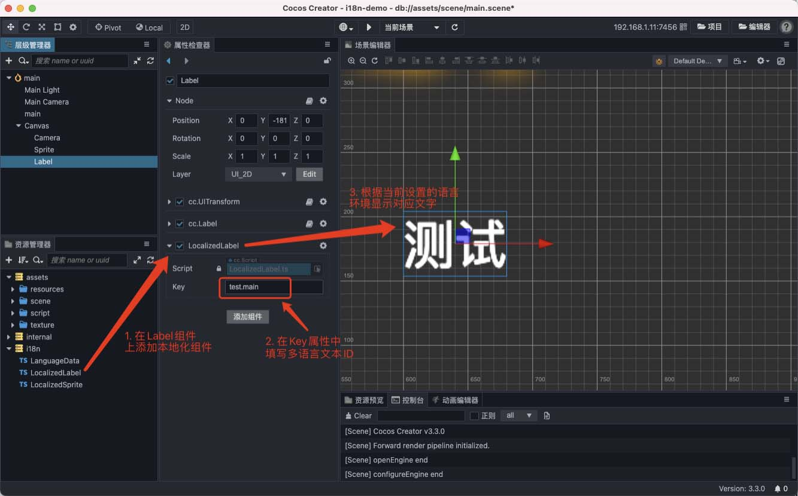
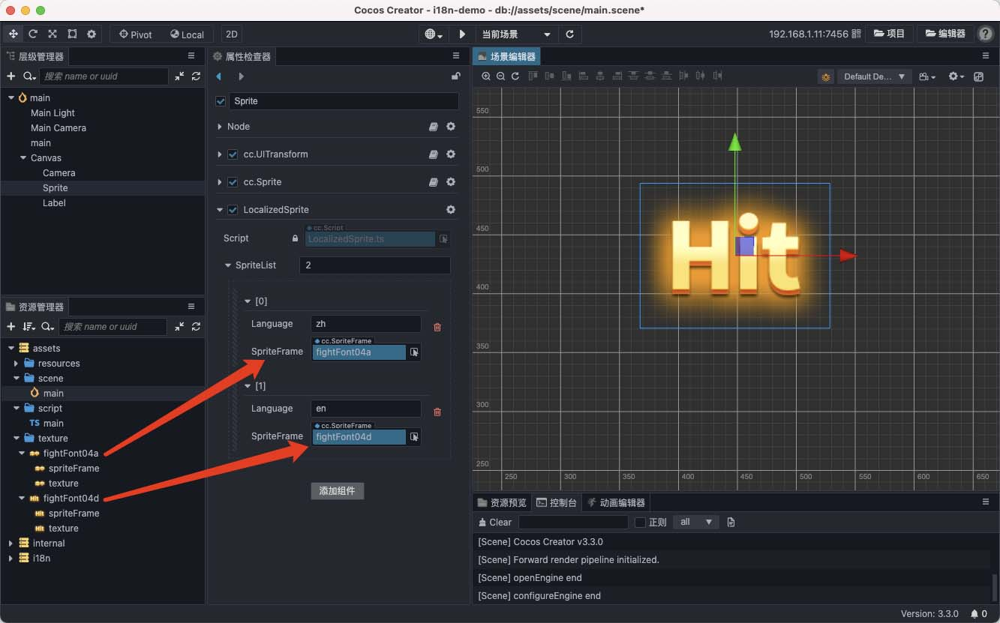
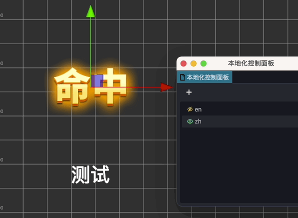

# i18n 游戏多语言支持

在开发者们的需求下，引擎组基于 Creator 3.x 版本，重新制作了官方版本的 i18n 插件，并上线到 Cocos Store。

## 什么是 i18n

i18n（其来源是英文单词 internationalization 的首末字符 i 和 n，18为中间的字符数）是“国际化”的简称。在资讯领域，国际化（i18n）指让产品无需做大的改变就能够适应不同的语言和地区的需要。对程序来说，在不修改内部代码的情况下，能根据不同语言及地区显示相应的界面。在全球化的时代，国际化尤为重要，因为产品的潜在用户可能来自世界的各个角落。通常与 i18n 相关的还有 L10n（“本地化”的简称）。

游戏多语言支持是通过 Cocos Creator 编辑器的扩展插件实现的，本插件实现了 Label 和 Sprite 组件的多语言国际化（i18n）。

注意，多语言国际化和本地化的区别是，国际化需要软件里包括多种语言的文本和图片数据，并根据用户所用设备的默认语言或菜单选择来进行实时切换。而本地化是在发布软件时针对某一特定语言的版本定制文本和图片内容。

本插件是多语言支持插件，因此不包括构建项目时去除一部分多语言数据的功能。

## 安装插件

通过主菜单的 **扩展 -> 商城** 打开 Cocos Store，搜索 [i18n多语言化插件](http://store.cocos.com/app/detail/1865) 并安装。



> 注意：
> - 插件首次安装，需重启引擎编辑器。
> - 插件资源包中的 `i18nDemo.zip` 为 Demo 演示工程。

## 插件使用

### 语言配置

插件安装后，通过主菜单的 **扩展 -> i18n Settings** 打开插件面板。



- 在面板中点击 `+` 按钮，然后在输入框里输入新增语言的 ID。

    > 注意：语言 ID 名称可以自定义，但不要使用符号，例如美国英语 `en-US`，请写作 `enUS`。

- 新增语言后，会在下方列表里增加一种语言，并且会在项目的 `resources/i18n` 目录下创建对应语言配置模板，如 `resources/i18n/zh.ts`。

- 在插件面板中，点击语言前方的小眼睛图标，选择编辑器中的预览语言，绿色为当前显示的语言。

### 本地化 Label 文本

我们先在语言配置模板中，配置需要翻译的文本。例如在 `resources/i18n/zh.ts` 中，添加一个 **Key** 为 **test.main** 的键值对。

```typescript
const win = window as any;

export const languages = {
   // 语言文本ID为 test.main
   "test": {
       "main": "测试",
       "hello": "你好",
   }
};

if (!win.languages) {
   win.languages = {};
}

win.languages.zh = languages;
```

然后在 Label 组件所在的节点上，点击 **添加组件**，选择 **自定义脚本 -> LocalizedLabel**，输入之前翻译文本中配置的 Key 的值，便可以根据当前设置的语言，来刷新 Label 的字符串显示。

> 注意: 运行时若需要修改 Label 渲染的文字，请对 `LocalizedLabel.Key` 进行赋值，不要直接修改 `Label.string`。



### 本地化 Sprite 图片

在 Sprite 组件所在的节点上，点击 **添加组件**，选择 **自定义脚本 -> LocalizedSprite**。

- 在 **SpriteList** 中设置数组的值，要与使用的语言数量相等。
- 在列表中填入对应语言的 ID 与对应使用的贴图。




### 预览效果

回到 **本地化控制面板** 中，点击对应语言前面的小眼睛图标，即可预览效果。



### 动态切换语言

在代码中，若需要动态切换语言，可以调用 `i18n.init(language)` 方法。

如果语言切换后，需要马上更新当前场景，可以调用 `i18n.updateSceneRenderer()` 方法。

例如：你可以使用下面方法在中/英文语言中来回切换

```typescript
changeLanguage() {
    if (i18n._language === 'en') {
        i18n.init('zh')
    } else {
        i18n.init('en')
    }
    i18n.updateSceneRenderers();
}
```

> 注意：运行时必须保证 `i18n.init(language)` 在包含有 LocalizedLabel 组件的场景加载前执行，否则将会因为组件上无法加载到数据而报错。
