# i18n 游戏多语言支持

Cocos Creator 从 3.1 版本起，提供了 i18n 游戏多语言扩展插件，目前支持 Label 和 Sprite 组件，可在 Cocos Store 中下载使用。

## 什么是 i18n

**i18n** 是 **国际化** 的简称，来源是英文单词 **internationalization** 的首末字符 **i** 和 **n**，18 为单词中间的字符数。在资讯领域，国际化（i18n）可以让产品无需做大的改变，就能够满足不同语言和地区的需要。对程序来说，在不修改内部代码的情况下，就能根据不同语言及地区切换相应的语言界面。如今全球化的时代，国际化尤为重要，因为产品的潜在用户可能来自世界的各个角落。

通常与 i18n 相关的还有 L10n（“本地化”的简称），多语言国际化和本地化的区别在于：

- **国际化** 需要软件里包括多种语言的文本和图片数据，并根据用户所用设备的默认语言或菜单选择进行实时切换。
- **本地化** 是在发布软件时针对某一特定语言的版本定制文本和图片内容。

本扩展插件不提供构建项目时的多语言资源管理，若面向不同地区发布项目，需要去除一部分多语言资源时，请手动处理。

## 安装

1. 点击 Creator 顶部菜单栏中的 **扩展 -> 商城** 进入 **Cocos Store**，查找 [i18n 多语言化扩展插件](http://store.cocos.com/app/detail/1865) 或者直接在上方搜索框中搜索：

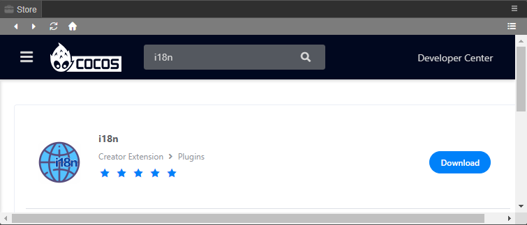

2. 单击进入详情页，可以看到 i18n 的基本信息、资源介绍和历史版本记录。然后点击 **下载** 按钮：

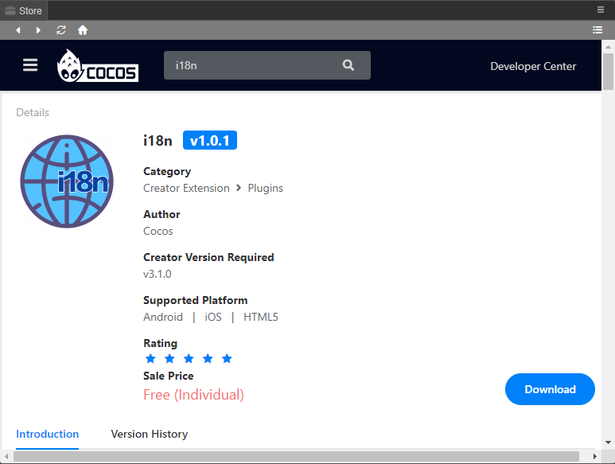

3. 下载完成后会显示在右侧自动打开的下载历史栏中，继续点击下图中的安装按钮，然后选择扩展插件安装位置（全局/项目）即可。

    > 注意：若是首次安装 i18n 多语言化扩展插件，可能会出现报错，需要重启 Creator。

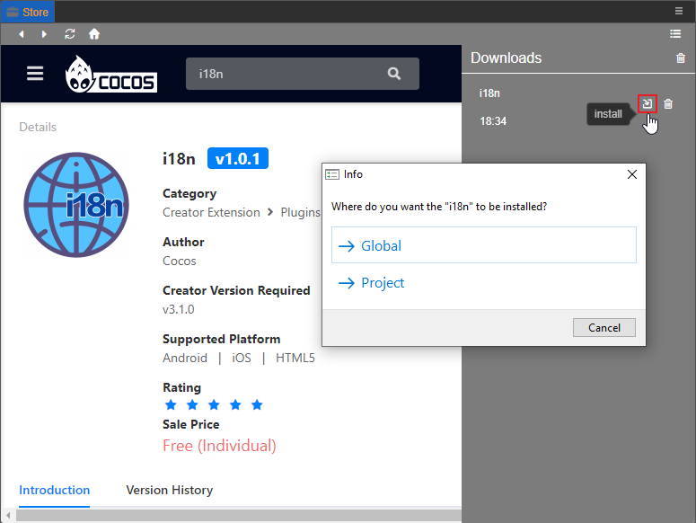

4. 安装完成后刷新 **资源管理器** 可以看到新增了 `i18n` 文件夹及几个脚本，用于后续使用扩展插件。

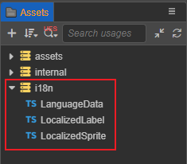

## 使用

### 多语言配置

i18n 扩展插件安装完成后，会在 Creator 顶部菜单栏的 **扩展** 中生成 **I18n Settings** 菜单，点击即可打开 **本地化控制面板**，进行多语言配置。

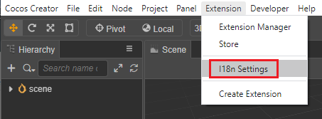

点击面板左上角的 `+` 按钮，在下方新增的输入框中输入需要新增的语言 ID。语言 ID 可自定义，但不支持使用符号，例如 `zh-CN` 请写为 `zhCN`。

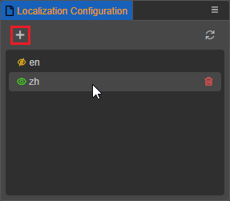

首个新增语言的左侧默认会有一个  按钮，表示作为预览项目时显示的语言；之后新增的语言则默认为 ，表示不作为在预览项目时显示的语言，点击按钮即可切换语言显示状态。

当鼠标悬浮在任意语言上时，对应语言右侧会出现一个删除按钮，用于删除当前选中的语言。

语言新增完成后，在项目的 `assets\resources\i18n` 目录下会生成相应的语言配置模板，用于配置需要多语言化的 Label，详情请参考下文介绍。

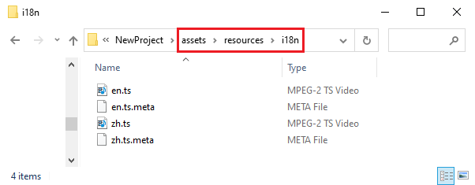

### 本地化 Label

打开语言配置模板，例如项目目录下的 `assets\resources\i18n\zh.ts`，添加 "test" 字段，并在其中定义 "main" 和 "hello"，用于后续在编辑器中调用当前语言下要显示的文本内容的 key：

```typescript
const win = window as any;

export const languages = {
   "test": {
       "main": "测试",
       "hello": "你好",
   }
};

if (!win.languages) {
   win.languages = {};
}

win.languages.zh = languages;
```
然后回到 Creator，在 **层级管理器** 选中 Label 节点，然后点击 **属性检查器** 下方的 **添加组件** 按钮，选择 **自定义脚本 -> LocalizedLabel**，将脚本挂载到节点上。

或者也可以直接将 `LocalizedLabel.ts` 从 **资源管理器** 拖拽到 **属性检查器**。

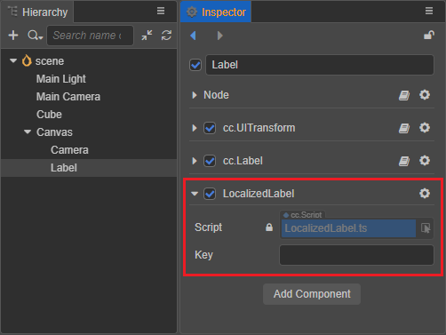

然后在 **LocalizedLabel** 脚本组件的 Key 属性框中输入刚刚在 `zh.ts` 中配置的 `test.main` 或者 `test.hello`：

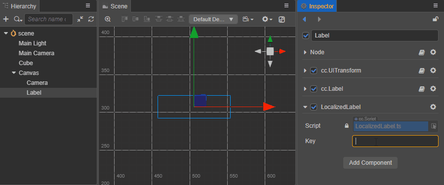

之后可参照 `zh.ts` 的配置对 `assets\resources\i18n\en.ts` 进行配置，配置完成后即可在 **本地化控制** 面板切换语言显示，如下所示：

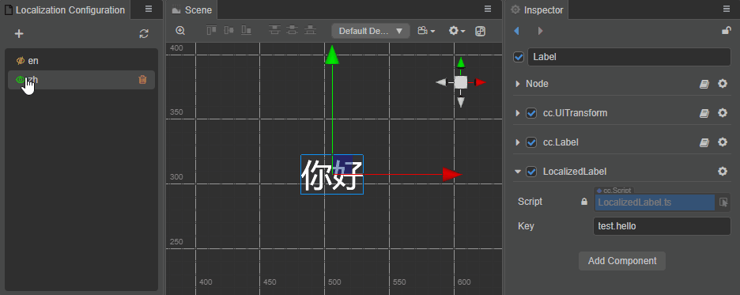

> 注意：若需要修改 Label 渲染的文字，请直接修改刚才配置的语言脚本的 key 值，不要直接在 Label 组件中修改 string 属性。

### 本地化 Sprite 图片

在 Creator 的 **层级管理器** 选中 Sprite 节点，然后点击 **属性检查器** 下方的 **添加组件** 按钮，选择 **自定义脚本 -> LocalizedSprite**

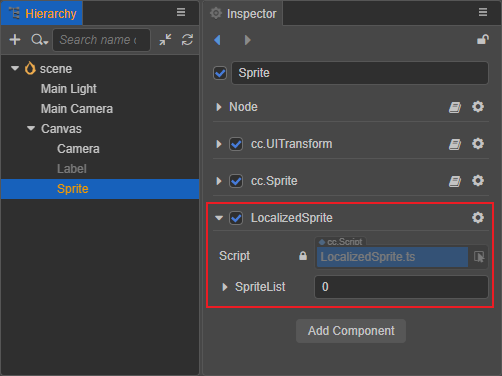

在 **SpriteList** 中设置语言数量，此处以在中/英文两种语言中切换为例，将该参数设置为 2。然后打开 **SpriteList** 下拉菜单，填写对应的 **语言 ID** 以及拖入对应的 **图片资源**。

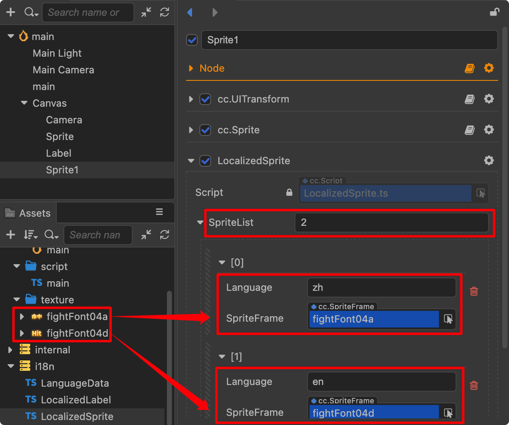

配置完成后即可在 **本地化控制** 面板中切换语言显示。

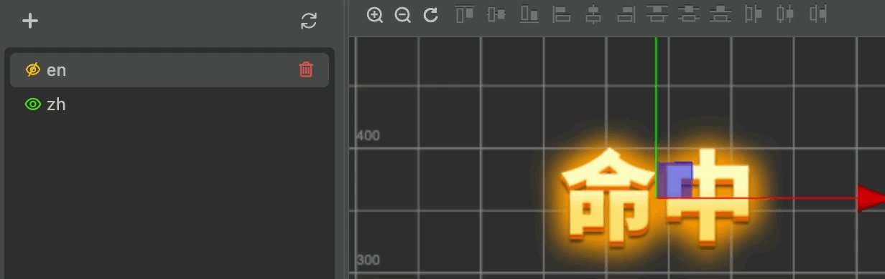

### 动态切换语言

在游戏运行时，若需要动态切换语言，可以调用 `i18n.init(language)` 方法。若语言切换后，需要马上更新当前场景，则需要再调用 `i18n.updateSceneRenderer()` 方法。

> 注意：运行时必须保证 `i18n.init(language)` 在包含有 LocalizedLabel 组件的场景加载后执行。

我们以在场景中添加按钮，在中/英文语言中切换为例，需添加以下代码。

```typescript
import * as i18n from 'db://i18n/LanguageData';

changeLang() {
    if (i18n._language === 'en') {
        i18n.init('zh')
    } else {
        i18n.init('en')
    }
    i18n.updateSceneRenderers();
}
```

将 `changeLang` 方法绑定在按钮点击事件中，点击按钮时效果如下图。

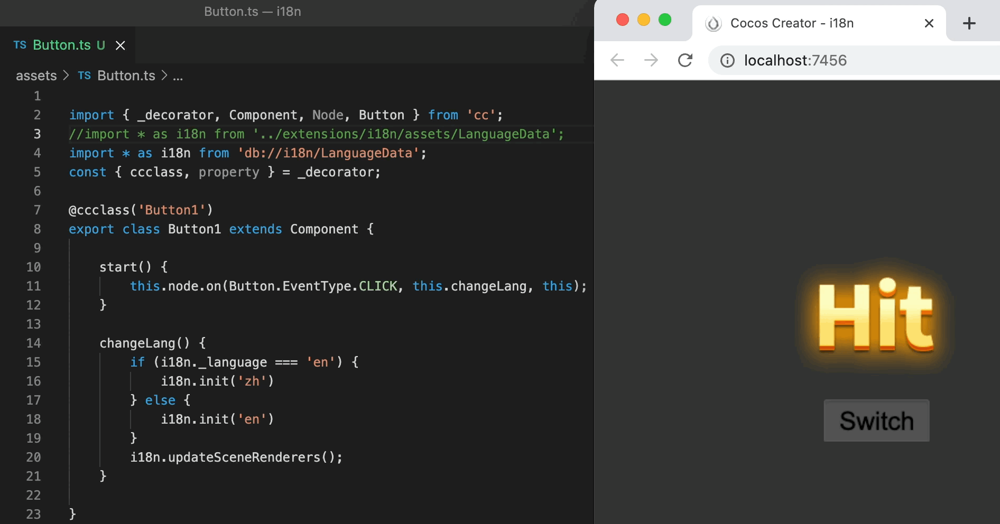
