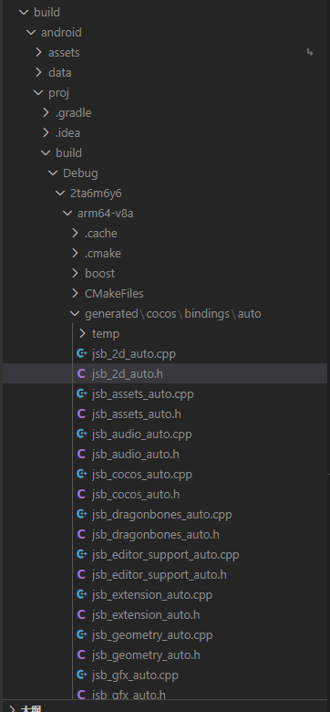
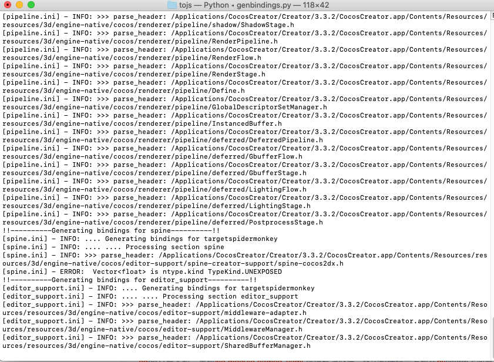
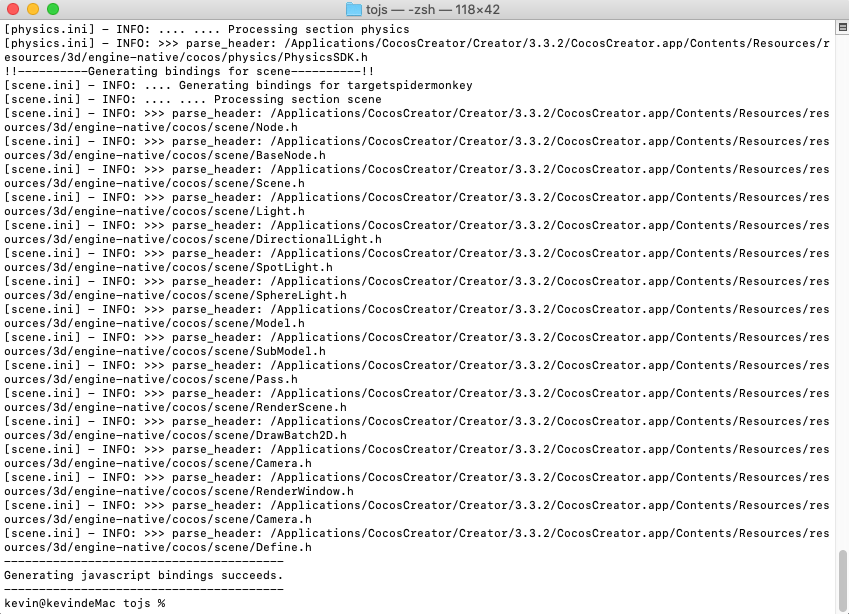
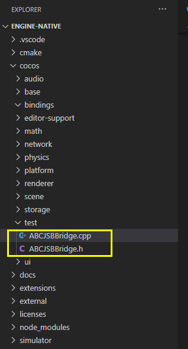
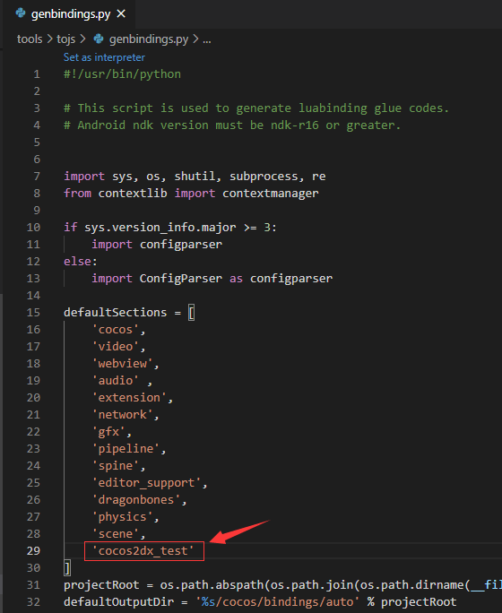
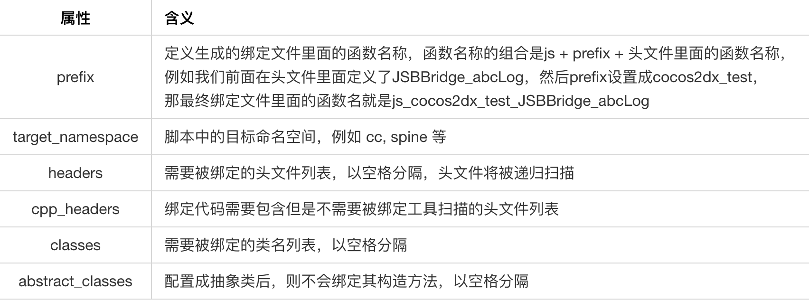
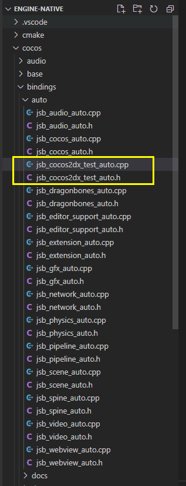
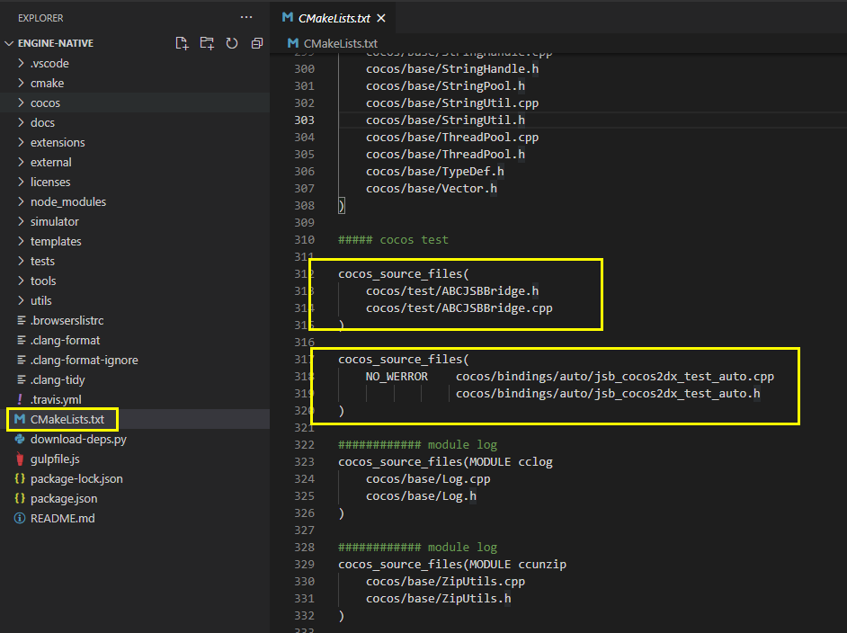
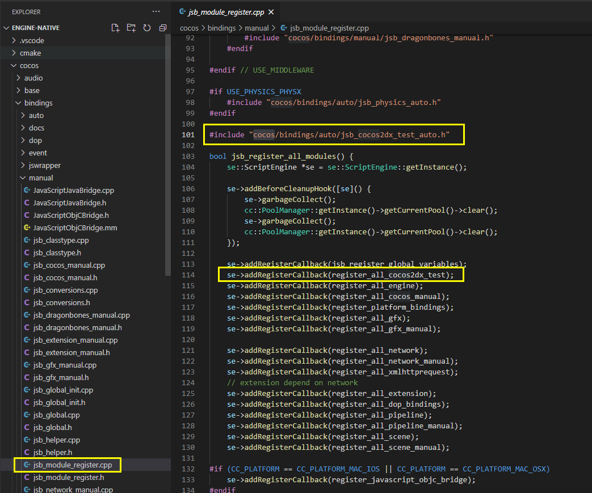

# 使用 JSB 自动绑定

> 本文转载自 [腾讯在线教育部技术博客](https://oedx.github.io/2019/07/03/cocos-creator-js-binding-auto/)<br>
> 作者：张鑫（kevinxzhang）

尽管 Creator 提供了 `native.reflection.callStaticMethod` 方式支持从 ts 端直接调用 Native 端（Android/iOS/Mac）的接口，但是经过大量实践发现此接口在大量频繁调用情况下性能很低下，尤其是在 Android 端，比如调用 Native 端实现的打印 log 的接口，而且会容易引起一些 native crash，例如 `local reference table overflow` 等问题。纵观 Cocos 原生代码的实现，基本所有的接口方法的实现都是基于 JSB 的方式来实现，所以此文主要讲解下 JSB 的自动绑定逻辑，帮助大家能快速实现 `callStaticMethod` 到 JSB 的改造过程。

## 背景

对于用过 Cocos Creator（为了方便后文直接简称 CC）的人来说，`jsb.reflection.callStaticMethod` 这个方法肯定不陌生，其提供了我们从 ts 端调用 Native 端的能力，例如我们要调用 Native 实现的 log 打印和持久化的接口，就可以很方便的在 JavaScript 中按照如下的操作调用即可：

```typescript

import {NATIVE} from 'cc/env';

if (NATIVE && sys.os == sys.OS.IOS) {
    msg = this.buffer_string + '\n[cclog][' + clock + '][' + tag + ']' + msg;
    native.reflection.callStaticMethod("ABCLogService", "log:module:level:", msg, 'cclog', level);
    return;
} else if (NATIVE && sys.os == sys.OS.ANDROID) {
    msg = this.buffer_string + '\n[cclog][' + clock + '][' + tag + ']' + msg;
    native.reflection.callStaticMethod("com/example/test/CommonUtils", "log", "(ILjava/lang/String;Ljava/lang/String;)V", level, 'cclog', msg);
    return;
}
```

尽管使用很简单，一行代码就能实现跨平台调用，稍微看下其实现就可以知道，在 C++ 层 Android 端是通过 jni 的方式实现的，IOS 端是通过运行时的方式动态调用，但是为了兼顾通用性和支持所有的方法，Android 端没有对 jni 相关对象做缓存机制，就会导致短时间大量调用时出现很严重的性能问题，之前我们遇到的比较多的情况就是在下载器中打印 log，某些应用场景短时间内触发大量的下载操作，就会出现 `local reference table overflow` 的 crash，甚至在低端机上导致界面卡顿无法加载出来的问题。

修复此问题就需要针对 log 调用进行 JSB 的改造，同时还要加上 jni 的相关缓存机制，优化性能。jSB 绑定说白了就是 C++ 和脚本层之间进行对象的转换，并转发脚本层函数调用到 C++ 层的过程。

JSB 绑定通常有 **手动绑定** 和 **自动绑定** 两种方式。手动绑定方式可以参考 [使用 JSB 手动绑定](jsb-manual-binding.md)。
- 手动绑定方式优点是灵活，可定制型强；缺点就是全部代码要自己书写，尤其是在 ts 类型跟 c++ 类型转换上，稍有不慎容易导致内存泄漏，某些指针或者对象没有释放。
- 自动绑定方式则会帮你省了很多麻烦，直接通过一个脚本一键生成相关的代码，后续如果有新增或者改动，也只需要重新执行一次脚本即可。所以自动绑定对于不需要进行强定制，需要快速完成JSB的情况来说就再适合不过了。下面就一步步说明下如何实现自动绑定 JSB。

## 环境配置和自动绑定展示

### 环境配置

自动绑定，说简单点，其实就只要执行一个 python 脚本即可自动生成对应的 `.cpp`、`.h` 文件。所以首先要保证电脑有 python 运行环境，这里以 Mac 上安装为例来讲解。

1. 安装 python 3.0 版本，从 python 官网下载安装包：

    https://www.python.org/downloads/release/python-398/

2. 通过 pip3 安装 python 的一些依赖库：

    ```shell
    sudo pip3 install pyyaml==5.4.1
    sudo pip3 install Cheetah3
    ```

3. 安装 NDK，涉及到 c++ 肯定这个是必不可少的，建议安装 [Android NDK r21e](https://developer.android.com/ndk/downloads/older_releases?hl=zh-cn) 版本，然后在 `~/.bash_profile` 中设置 `PYTHON_ROOT` 和 `NDK_ROOT` 这两个环境变量，因为在后面执行的 python 文件里面就会直接用到这两个环境变量：

    ```shell
    export NDK_ROOT=/Users/kevin/android-ndk-r21e
    export PYTHON_BIN=python3
    ```

Windows 下直接参考上面需要安装的模块直接安装就好了，最后也要记得配置环境变量。

### 自动绑定展示

这里演示的是 cocos 引擎下面也即 **generated/cocos/bindings/auto** 目录下的文件（如下图所示）是怎么自动生成的：



> **注意**：该目录会在构建时自动成成，未构建时并不会创建。

其实从这些文件名的开头也能看出，这些文件命名都是有某些特定规律的，那么这些文件是怎么生成的呢？首先打开终端，先 cd 到 **tools/tojs** 目录下，然后直接运行 `./genbindings.py`：



大概运行一分钟左右后，会出现如下的提示，说明已经顺利生成完了：



经过上面的步骤后，**cocos/bindings/auto** 下的文件就全部自动生成出来了，是不是非常方便。

下面再以 ts 层通过 jsb 调用 Native 层的 log 方法打印日志为例，详细的告知下如何实现通过自动绑定工具，依据自己写的 c++ 代码，生成对应的自动绑定文件。

## 编写 c++ 层的实现

C++ 作为连接 ts 层和 Native 层的桥梁，既然要实现 jsb 调用，那第一步肯定是要先把 C++ 层的头文件和实现准备好，这里我们在 cocos/⁩ 创建一个 test 文件夹用于存放相关文件：



这里先准备 `ABCJSBBridge.h`，里面主要是申明了一个 `abcLog` 的函数，此函数就是供 ts 层调用打 log 的，另外由于打 log 方法肯定在 ts 层很多地方都会使用，所以这里采用了一个单例模式，提供了 `getInstance()` 来获取当前类的实例。

```cpp
#pragma once

#include <string>

namespace abc
{
    class JSBBridge
    {
    public:
        void abcLog(const std::string& msg);
        /**
        * Returns a shared instance of the director.
        * @js _getInstance
        */
        static JSBBridge* getInstance();

        /** @private */
        JSBBridge();
        /** @private */
        ~JSBBridge();
        bool init();
    };
}
```

下面是对应的实现 `ABCJSBBridge.cpp`：

```cpp
#include <cocos/base/Log.h>
#include "ABCJSBBridge.h"

namespace abc
{
    // singleton stuff
    static JSBBridge *s_SharedJSBBridge = nullptr;

    JSBBridge::JSBBridge()
    {
        CC_LOG_ERROR("Construct JSBBridge %p", this);
        init();
    }

    JSBBridge::~JSBBridge()
    {
        CC_LOG_ERROR("Destruct JSBBridge %p", this);
        s_SharedJSBBridge = nullptr;
    }

    JSBBridge* JSBBridge::getInstance()
    {
        if (!s_SharedJSBBridge)
        {
            CC_LOG_ERROR("getInstance JSBBridge ");
            s_SharedJSBBridge = new (std::nothrow) JSBBridge();
            CCASSERT(s_SharedJSBBridge, "FATAL: Not enough memory for create JSBBridge");
        }

        return s_SharedJSBBridge;
    }

    bool JSBBridge::init(void)
    {
        CC_LOG_ERROR("init JSBBridge ");
        return true;
    }

    void JSBBridge::abcLog(const std::string& msg)
    {
        CC_LOG_ERROR("%s", msg.c_str());
    }
}
```

## JSB 配置脚本编写

我们在 **tools/tojs** 目录下找到 `genbindings.py` 脚本，复制并重命名为 `genbindings_test.py`，然后修改`genbindings_test.py` 模块配置，只保留 cocos2dx_test 模块。



接下来是在 **tools/tojs** 目录下添加自定义的配置文件 `cocos2dx_test.ini`，其实就跟 **tools/tojs** 下的其他 `.ini` 文件类似，主要让自动绑定工具知道哪些 API 要被绑定和以什么样的方式绑定，写法上直接参考 Cocos 已有的 ini 文件，这里展示下 `cocos2dx_test.ini` 的内容：

``` ini
[cocos2dx_test]
# the prefix to be added to the generated functions. You might or might not use this in your own
# templates
prefix = cocos2dx_test

# create a target namespace (in javascript, this would create some code like the equiv. to `ns = ns || {}`)
# all classes will be embedded in that namespace
target_namespace = abc

macro_judgement  =

android_headers =

android_flags =  -target armv7-none-linux-androideabi -D_LIBCPP_DISABLE_VISIBILITY_ANNOTATIONS -DANDROID -D__ANDROID_API__=14 -gcc-toolchain %(gcc_toolchain_dir)s --sysroot=%(androidndkdir)s/platforms/android-14/arch-arm  -idirafter %(androidndkdir)s/sources/android/support/include -idirafter %(androidndkdir)s/sysroot/usr/include -idirafter %(androidndkdir)s/sysroot/usr/include/arm-linux-androideabi -idirafter %(clangllvmdir)s/lib64/clang/5.0/include -I%(androidndkdir)s/sources/cxx-stl/llvm-libc++/include

clang_headers =
clang_flags = -nostdinc -x c++ -std=c++17 -fsigned-char -mfloat-abi=soft -U__SSE__

cocos_headers = -I%(cocosdir)s/cocos -I%(cocosdir)s/cocos/platform/android -I%(cocosdir)s/external/sources

cocos_flags = -DANDROID -DCC_PLATFORM=3 -DCC_PLATFORM_MAC_IOS=1 -DCC_PLATFORM_MAC_OSX=4 -DCC_PLATFORM_WINDOWS=2 -DCC_PLATFORM_ANDROID=3


cxxgenerator_headers =

# extra arguments for clang
extra_arguments = %(android_headers)s %(clang_headers)s %(cxxgenerator_headers)s %(cocos_headers)s %(android_flags)s %(clang_flags)s %(cocos_flags)s %(extra_flags)s

# what headers to parse
headers = %(cocosdir)s/cocos/test/ABCJSBBridge.h

# cpp_headers = network/js_network_manual.h

# what classes to produce code for. You can use regular expressions here. When testing the regular
# expression, it will be enclosed in "^$", like this: "^Menu*$".
classes = JSBBridge

# what should we skip? in the format ClassName::[function function]
# ClassName is a regular expression, but will be used like this: "^ClassName$" functions are also
# regular expressions, they will not be surrounded by "^$". If you want to skip a whole class, just
# add a single "*" as functions. See bellow for several examples. A special class name is "*", which
# will apply to all class names. This is a convenience wildcard to be able to skip similar named
# functions from all classes.
skip = JSBBridge::[init]

rename_functions = 

rename_classes =

# for all class names, should we remove something when registering in the target VM?
remove_prefix = 

# classes for which there will be no "parent" lookup
classes_have_no_parents = JSBBridge

# base classes which will be skipped when their sub-classes found them.
base_classes_to_skip = Clonable

# classes that create no constructor
# Set is special and we will use a hand-written constructor
abstract_classes = JSBBridge
```

其实从里面的注释也讲的非常详细，这里说几个主要的属性及含义：



以上的配置完成后，就可以 cd 到 **tools/tojs** 目录下，运行 `./genbindings_test.py` 自动生成绑定文件。然后就会看到在 **cocos/bindings/auto** 下面会多出了两个个绑定文件：



打开生成的 `jsb_cocos2dx_test_auto.cpp`：

```cpp
#include "cocos/bindings/auto/jsb_cocos2dx_test_auto.h"
#include "cocos/bindings/manual/jsb_conversions.h"
#include "cocos/bindings/manual/jsb_global.h"
#include "test/ABCJSBBridge.h"

#ifndef JSB_ALLOC
#define JSB_ALLOC(kls, ...) new (std::nothrow) kls(__VA_ARGS__)
#endif

#ifndef JSB_FREE
#define JSB_FREE(ptr) delete ptr
#endif
se::Object* __jsb_abc_JSBBridge_proto = nullptr;
se::Class* __jsb_abc_JSBBridge_class = nullptr;

static bool js_cocos2dx_test_JSBBridge_abcLog(se::State& s) // NOLINT(readability-identifier-naming)
{
    auto* cobj = SE_THIS_OBJECT<abc::JSBBridge>(s);
    SE_PRECONDITION2(cobj, false, "js_cocos2dx_test_JSBBridge_abcLog : Invalid Native Object");
    const auto& args = s.args();
    size_t argc = args.size();
    CC_UNUSED bool ok = true;
    if (argc == 1) {
        HolderType<std::string, true> arg0 = {};
        ok &= sevalue_to_native(args[0], &arg0, s.thisObject());
        SE_PRECONDITION2(ok, false, "js_cocos2dx_test_JSBBridge_abcLog : Error processing arguments");
        cobj->abcLog(arg0.value());
        return true;
    }
    SE_REPORT_ERROR("wrong number of arguments: %d, was expecting %d", (int)argc, 1);
    return false;
}
SE_BIND_FUNC(js_cocos2dx_test_JSBBridge_abcLog)

static bool js_cocos2dx_test_JSBBridge_getInstance(se::State& s) // NOLINT(readability-identifier-naming)
{
    const auto& args = s.args();
    size_t argc = args.size();
    CC_UNUSED bool ok = true;
    if (argc == 0) {
        abc::JSBBridge* result = abc::JSBBridge::getInstance();
        ok &= nativevalue_to_se(result, s.rval(), nullptr /*ctx*/);
        SE_PRECONDITION2(ok, false, "js_cocos2dx_test_JSBBridge_getInstance : Error processing arguments");
        SE_HOLD_RETURN_VALUE(result, s.thisObject(), s.rval());
        return true;
    }
    SE_REPORT_ERROR("wrong number of arguments: %d, was expecting %d", (int)argc, 0);
    return false;
}
SE_BIND_FUNC(js_cocos2dx_test_JSBBridge_getInstance)

bool js_register_cocos2dx_test_JSBBridge(se::Object* obj) // NOLINT(readability-identifier-naming)
{
    auto* cls = se::Class::create("JSBBridge", obj, nullptr, nullptr);

    cls->defineFunction("abcLog", _SE(js_cocos2dx_test_JSBBridge_abcLog));
    cls->defineStaticFunction("getInstance", _SE(js_cocos2dx_test_JSBBridge_getInstance));
    cls->install();
    JSBClassType::registerClass<abc::JSBBridge>(cls);

    __jsb_abc_JSBBridge_proto = cls->getProto();
    __jsb_abc_JSBBridge_class = cls;

    se::ScriptEngine::getInstance()->clearException();
    return true;
}
bool register_all_cocos2dx_test(se::Object* obj)
{
    // Get the ns
    se::Value nsVal;
    if (!obj->getProperty("abc", &nsVal))
    {
        se::HandleObject jsobj(se::Object::createPlainObject());
        nsVal.setObject(jsobj);
        obj->setProperty("abc", nsVal);
    }
    se::Object* ns = nsVal.toObject();

    js_register_cocos2dx_test_JSBBridge(ns);
    return true;
}
```

看到这里是不是感觉很熟悉，跟 Cocos 已有的那些 cpp 完全一样，甚至包括里面的注册函数和类的定义都给全部自动生成了。

## Cocos 编译配置

尽管经过上面一步后我们已经生成出来了绑定文件，但是 ts 层还是没法直接使用，因为还需要把生成的绑定文件，配置到 CMakeLists.txt 文件中，从而跟其他 c++ 文件一起编译才行，这部分主要就是最后的 CMakeLists.txt 编译配置。

1. 打开 `CMakeLists.txt` 文件，在其中加上最开始实现的 ABCJSBBridge.h 和 ABCJSBBridge.cpp，还有自动绑定生成的 jsb_cocos2dx_test_auto.h 和 jsb_cocos2dx_test_auto.cpp 文件：

    

2. 打开 `cocos/bindings/manual/jsb_module_register.cpp`，添加 cocos2dx_test 模块的注册代码：

    


经过上面这些配置后，最终就可以在 ts 层直接像下面这样来进行调用：

``` typescript
import { _decorator, Component, Node } from 'cc';
const { ccclass, property } = _decorator;

@ccclass('Test')
export class Test extends Component {
    start () {
        // @ts-ignore
        abc.JSBBridge.getInstance().abcLog("JSB 绑定测试成功")
    }
}
```

## 自动绑定的限制条件

自动绑定依赖于 Bindings Generator 工具，Cocos 官方还在 GitHub 上单独把这部分拎出来了：<https://github.com/cocos-creator/bindings-generator>。Bindings Generator 工具它可以将 C++ 类的公共方法和公共属性绑定到脚本层。自动绑定工具尽管非常强大，但是还是会有一些限制：
1. 只能够针对类生成绑定，不可以绑定结构体，独立函数等。
2. 不能够生成 `Delegate` 类型的 API，因为脚本中的对象是无法继承 C++ 中的 `Delegate` 类并重写其中的 `Delegate` 函数的。
3. 子类中重写了父类的 API 的同时，又重载了这个 API。
4. 部分 API 实现内容并没有完全体现在其 API 定义中。
5. 在运行时由 C++ 主动调用的 API。

> **注意**：从 3.6 开始自动绑定所涉及的参数及返回值的类型也需要绑定，或者提供转换方法 `sevalue_to_native`/`nativevalue_to_se`，否则会在编译期报错。在 3.5 之前为运行时报错。

## 总结

总的来说，自动绑定 JSB 只需要要求开发者编写相关的实现 C++ 实现类，一个配置文件，然后执行一条命令就能完整整个的绑定过程。如果没有什么特殊定制，相对于手动绑定来说，效率上还是提高了不少。实际工作做可以依据具体情况先用自动绑定功能，然后再去手动修改生成的绑定文件，达到事倍功半的效果。
