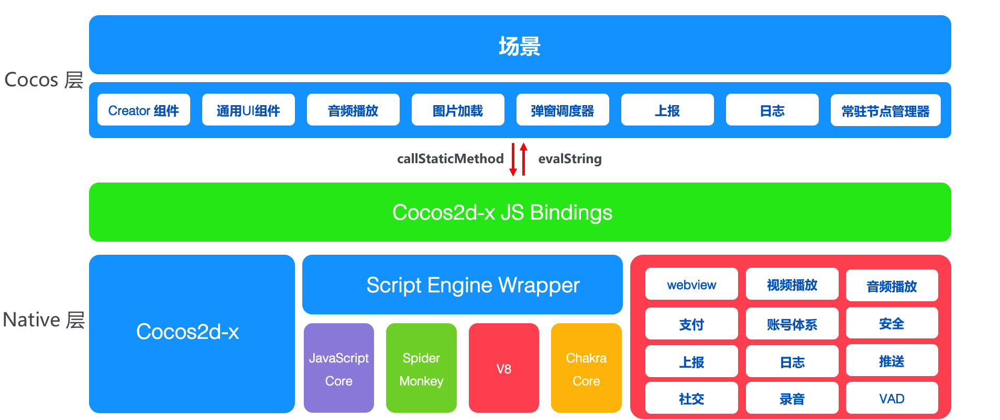
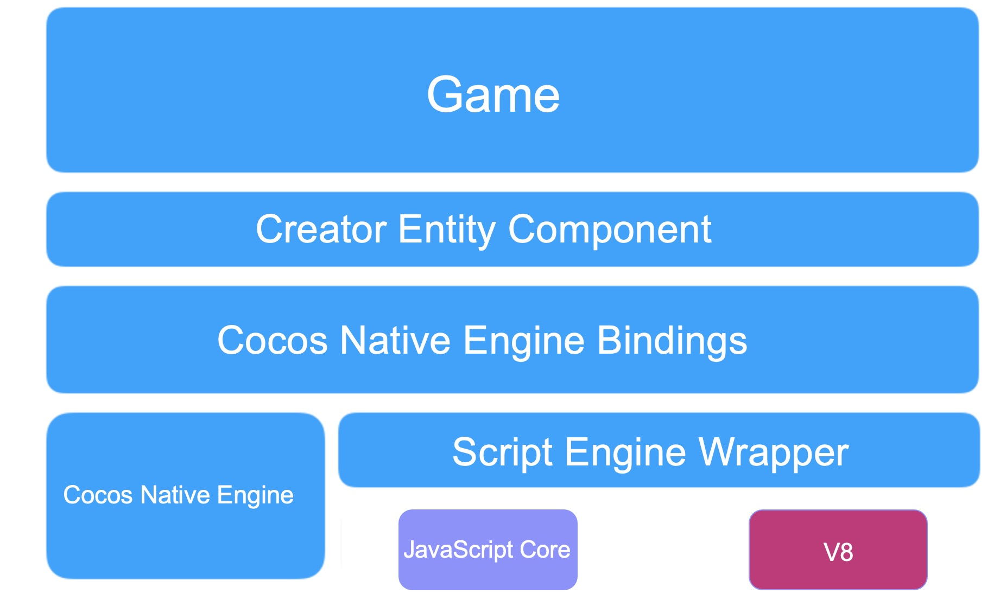

# 使用 JSB 手动绑定

> 本文转载自 [腾讯在线教育部技术博客](https://oedx.github.io/2019/05/29/cocos-creator-js-binding-manual/)<br>
> 作者：晋中望（xepherjin）
>
> 本文档基于 v2.x 编写，在 Cocos Creator 3.0 上可能略有变动，我们会尽快更新。

## 背景

一直以来，ABCmouse 项目中的整体 JS/Native 通信调用结构都是基于 `callStaticMethod <-> evalString` 的方式。通过 `callStaticMethod` 方法我们可以通过反射机制直接在 JavaScript 中调用 `Java/Objective-C` 的静态方法。而通过 `evalString` 方式，则可以执行 JS 代码，这样便可以进行双端通信。

<a href="jsb/infrastructure.png"></a>
<div style="text-align:center"><p>新版 ABCmouse 的应用架构：基于 callStaticMethod 与 evalString 进行通信</p></div>

虽然基于这个方式上层封装接口后，新增业务逻辑会比较方便。但是过度依赖 evalString，往往也会带来一些隐患。举个 Android 侧的例子：

```js
CocosJavascriptJavaBridge.evalString("window.sample.testEval('" + param + "',JSON.stringify(" + jsonObj + "))");
```

对于常见的参数结构，这样运行是没有问题的，然而基于实际场景的种种情况，我们会发现针对 **引号** 的控制格外重要。如代码所示，为了保证 JS 代码能够被正确执行，我们在拼接字符串时必须明确 `'` 与 `"` 的使用，稍有不慎就会出现 `evalString` 失败的情况。在 Cocos 的官方论坛上，从大量的反馈中我们也能了解这里的确是一个十分容易踩坑的地方。而另一方面，对于我们项目本身而言，过度依赖 `evalString` 所产生的种种不确定因素也往往很难掌控，我们又不能一味地通过 `try/catch` 去解决。所幸的是，经过全局业务排查，目前项目中在绝大多数因此，在查阅官方文档后，我们决定绕过 `evalString`，直接基于 JSB 绑定的方式进行通信。

这里以下载器的接入为例。在我们的项目中，下载器是在 Android 与 iOS 侧分别各自实现。在改造之前的版本中，下载器的调用与回调基于 `callStaticMethod <-> evalString` 的方式。

每次调用下载都需要这样执行：

```js
if(sys.isNative && sys.os == sys.OS.IOS) {
    jsb.reflection.callStaticMethod('ABCFileDownloader', 'downloadFileWithUrl:cookie:savePath:', url, cookies, savePath);
} else if(sys.isNative && sys.os == sys.OS.ANDROID) {
    jsb.reflection.callStaticMethod("com/tencent/abcmouse/downloader/ABCFileDownloader", "downloadFileWithUrl", "(Ljava/lang/String;Ljava/lang/String;Ljava/lang/String;)V", url, cookies, savePath);
}
```

下载成功抑或是失败都需要通过拼接出类似如下的语句执行 JS：

```java
StringBuilder sb = new StringBuilder(JS_STRING_ON_DOWNLOAD_FINISH + "(");
sb.append("'" + success + "',");
sb.append("'" + url + "',");
sb.append("'" + savePath + "',");
sb.append("'" + msg + "',");
sb.append("'" +code + "')");
Cocos2dxJavascriptJavaBridge.evalString(sb.toString());
```

无论是调用抑或是回调都拼接繁琐又容易出错，全部数据不得不转化为字符串 ~~（emmmm也不美观）~~，而且还要考虑到 `evalString` 的执行效率问题。如果只是仅有的少数业务场景在使用尚勉强接受，但是当业务日趋复杂庞大，如果都要这样写，同时又没有详细的文档去规范约束，其后期维护成本可想而知。

而当使用 JSB 改造后，我们调用只需如下寥寥几行代码且无需区分平台，更不必担心上述拼接隐患，相比之下逻辑要清晰许多：

```js
jsb.fileDownloader.requestDownload(url, savePath, cookies, options, (success, url, savePath, msg, code) => {
    // do whatever you want
});
```

那么接下来就以一个最简单的下载器的绑定流程为例，我来带大家学习下 JSB 手动绑定的大致流程。<br>
**（虽然 Cocos 很人性化提供了自动绑定的配置文件，可以通过一些配置直接生成目标文件，减少了很多工作量。但是亲手来完成一次手动绑定的流程会帮助更为全面地了解整个绑定的实现流程，有助于加深理解。另一方面，当存在特殊需要自动绑定无法满足时，手动绑定也往往会更为灵活）**

## 前置

在开始之前，我们需要需要知道有关 ScriptEngine 抽象层、相关 API 等相关知识，这部分内容如果已从 Cocos 文档了解可跳过，直接进行 **实践** 部分。

### 抽象层



首先先来看一下上图 Cocos 官方提供的一张抽象层架构，在 1.7 版本中，抽象层被设计为一个与引擎没有关系的独立模块，对 JS 引擎的管理从 `ScriptingCore` 被移动到了 `se::ScriptEngine` 类中，`ScriptingCore` 被保留下来是希望通过它把引擎的一些事件传递给封装层，充当适配器的角色。在这个抽象层提供了对 JavaScriptCore、SpiderMonkey、V8、ChakraCore 等多种可选的 JS 执行引擎的封装。JSB 的大部分工作其实就是设定 JS 相关操作的 C++ 回调，在回调函数中关联 C++ 对象。它其实主要包含如下两种类型：

- 注册 JS 函数（包含全局函数，类构造函数、类析构函数、类成员函数，类静态成员函数），绑定一个 C++ 回调
- 注册 JS 对象的属性读写访问器，分别绑定读与写的 C++ 回调

考虑到不同多种 JS 引擎的关键方法的定义各不相同，Cocos 团队使用 **宏** 来抹平这种回调函数定义与参数类型的差异，这里就不展开，详细可阅读文末 Cocos Creator 的相关文档。<br>
**值得一提的是，ScriptEngine 这层设计之初 Cocos 团队就将其定义为一个独立模块，完全不依赖 Cocos 引擎。** 我们开发者完全可以把 **cocos/scripting/js-bindings/jswrapper** 下的所有抽象层源码移植到其他项目中直接使用。

### SE 类型

C++ 抽象层所有的类型都在 `se` 命名空间下，其为 ScriptEngine 的缩写。

- **se::ScriptEngine**

  它是 JS 引擎的管理员，掌管 JS 引擎初始化、销毁、重启、Native 模块注册、加载脚本、强制垃圾回收、JS 异常清理、是否启用调试器。它是一个单例，可通过 `se::ScriptEngine::getInstance()` 得到对应的实例。

- **se::Value**

  可以被理解为 JS 变量在 C++ 层的引用。JS 变量有 `object`、`number`、`string`、`boolean`、`null`、`undefined` 六种类型，因此 `se::Value` 使用 union 包含 `object`、`number`、`string`、`boolean` 4 种有值类型，无值类型: `null`、`undefined` 可由私有变量 `_type` 直接表示。

  如果 `se::Value` 中保存基础数据类型，比如 `number`、`string`、`boolean`，其内部是直接存储一份值副本。`object` 的存储比较特殊，是通过 `se::Object*` 对 JS 对象的弱引用。

- **se::Object**

  继承于 `se::RefCounter` 引用计数管理类，它保存了对 JS 对象的弱引用。我们在绑定回调中如果需要用到当前对象对应的 `se::Object`，只需要通过 `s.thisObject()` 即可获取。其中 s 为 `se::State` 类型。

- **se::Class**

  用于暴露 C++ 类到 JS 中，它会在 JS 中创建一个对应名称的构造函数。Class 类型创建后，不需要手动释放内存，它会被封装层自动处理。`se::Class` 提供了一些 API 用于定义 Class 的创建、静态/动态成员函数、属性读写等等，后面在实践时用到会做介绍。完整内容可查阅 Cocos 文档。

- **se::State**

  它是绑定回调中的一个环境，我们通过 `se::State` 可以取得当前的 C++ 指针、`se::Object` 对象指针、参数列表、返回值引用。

### 宏

前面有提到，抽象层使用宏来抹平不同 JS 引擎关键函数定义与参数类型的不同，不管底层是使用什么引擎，开发者统一使用一种函数的定义。

例如，抽象层所有的 JS 到 C++ 的回调函数的定义为：

```cpp
bool foo(se::State& s)
{
    ...
    ...
}
SE_BIND_FUNC(foo) // 此处以回调函数的定义为例
```

我们在编写完回调函数后，需要记住使用 `SE_BIND_XXX` 系列的宏对回调函数进行包装。目前全部的 `SE_BIND_XXX` 宏如下所示：

- `SE_BIND_PROP_GET`：包装一个 JS 对象属性读取的回调函数
- `SE_BIND_PROP_SET`：包装一个 JS 对象属性写入的回调函数
- `SE_BIND_FUNC`：包装一个 JS 函数，可用于全局函数、类成员函数、类静态函数
- `SE_DECLARE_FUNC`：声明一个 JS 函数，一般在 `.h` 头文件中使用
- `SE_BIND_CTOR`：包装一个 JS 构造函数
- `SE_BIND_SUB_CLS_CTOR`：包装一个 JS 子类的构造函数，此子类使用 `cc.Class.extend` 继承 Native 绑定类
- `SE_BIND_FINALIZE_FUNC`：包装一个 JS 对象被 GC 回收后的回调函数
- `SE_DECLARE_FINALIZE_FUNC`：声明一个 JS 对象被 GC 回收后的回调函数
- `_SE`：包装回调函数的名称，转义为每个 JS 引擎能够识别的回调函数的定义，注意，第一个字符为下划线，类似 Windows 下用的 _T("xxx") 来包装 Unicode 或者 MultiBytes 字符串

在我们的简化版例子中，只需要用到 `SE_DECLARE_FUNC`、`SE_BIND_FUNC` 即可。

### 类型转换辅助函数

类型转换辅助函数位于 **cocos/scripting/js-bindings/manual/jsb_conversions.hpp/.cpp** 中，包含了多种 `se::Value` 与 C++ 类型相互转化的方法。

- `bool std_string_to_seval(const std::string& v, se::Value* ret);`
- `bool seval_to_std_string(const se::Value& v, std::string* ret);`
- `bool boolean_to_seval(bool v, se::Value* ret);`
- `bool seval_to_boolean(const se::Value& v, bool* ret);`
... ...

## 实践

在开始之前，我们需要明确一下流程。JSB 绑定简单来讲就是在 C++ 层实现一些类库，然后经过一些特定处理可以在 JS 端进行对应方法调用的过程。因为采用 JS 为主要业务编写语言，使得我们在做一些 Native 的功能时会比较受限，例如文件、网络等等相关操作。

以 Cocos2d-js 文档中 `cc.Sprite` 为例，在 JSB 中 如果使用 `new` 操作符来调用 `cc.Sprite` 的构造函数，实际上在 C++ 层会调用 `js_cocos2dx_Sprite_constructor` 函数。在这个 C++ 函数中，会为这个精灵对象分配内存，并把它添加到自动回收池，然后调用 JS 层的 `_ctor` 函数来完成初始化。在 `_ctor` 函数中会根据参数类型和数量调用不同的 init 函数，这些 init 函数也是 C++ 函数的绑定：

```cpp
#define SE_BIND_CTOR(funcName, cls, finalizeCb) \
    void funcName##Registry(const v8::FunctionCallbackInfo<v8::Value>& _v8args) \
    { \
        v8::Isolate* _isolate = _v8args.GetIsolate(); \
        v8::HandleScope _hs(_isolate); \
        bool ret = true; \
        se::ValueArray args; \
        se::internal::jsToSeArgs(_v8args, &args); \
        se::Object* thisObject = se::Object::_createJSObject(cls, _v8args.This()); \
        thisObject->_setFinalizeCallback(_SE(finalizeCb)); \
        se::State state(thisObject, args); \
        ret = funcName(state); \
        if (!ret) { \
            SE_LOGE("[ERROR] Failed to invoke %s, location: %s:%d\n", #funcName, __FILE__, __LINE__); \
        } \
        se::Value _property; \
        bool _found = false; \
        _found = thisObject->getProperty("_ctor", &_property); \
        if (_found) _property.toObject()->call(args, thisObject); \
    }
```

三层的方法对应关系如下：

| Javascript |  JSB  | Cocos2d-x    |
| :--------- | :-----| :----------- |
| cc.Sprite.initWithSpriteFrameName | js_cocos2dx_Sprite_initWithSpriteFrameName | cocos2d::Sprite::initWithSpriteFrameName |
| cc.Sprite.initWithSpriteFrame     | js_cocos2dx_Sprite_initWithSpriteFrame     | cocos2d::Sprite::initWithSpriteFrame     |
| cc.Sprite.initWithFile            | js_cocos2dx_Sprite_initWithFile            | cocos2d::Sprite::initWithFile            |
| cc.Sprite.initWithTexture         | js_cocos2dx_Sprite_initWithTexture         | cocos2d::Sprite::initWithTexture         |

这个调用过程的时序如下：

<a href="jsb/jsb_process.png"></a>
<div style="text-align:center"><p>调用时序图（引自 Cocos2d-js 文档）</p></div>

和上面的过程类似。首先，我们需要确定接口和字段，我们随便拟定一个最简单的下载器 `FileDownloader`，它所具备的是 `download(url, path, callback)` 接口，而在 `callback` 中我们需要拿到的则是 `code`，`msg`。并且为了方便使用，我们将它挂载在 `jsb` 对象下，这样我们便可以使用如下代码进行简单地调用:

```js
jsb.fileDownloader.download(url, path, (msg, code) => {
    // do whatever you want
});
```

确定接口后，我们可以开始着手码 C++ 部分了。首先来一发 `FileDownloader.h`，作为公共头文件供 Android/iOS 使用。接着 Android/iOS 分别实现各自的具体下载实现即可（此处略过），`reqCtx` 则用于存储回调对应关系：

```cpp
class FileDownloader {
    public:
        typedef std::function<void(const std::string& msg, const int code)> ResultCallback;
        static FileDownloader* getInstance();
        static void destroyInstance();
        void download(const std::string& url,
                                        const std::string& savePath,
                                        const ResultCallback& callback);
        void onDownloadResult(const std::string msg, const int code);
        ... ...
    protected:
        static FileDownloader* s_sharedFileDownloader;
        std::unordered_map<std::string, ResultCallback> reqCtx;
};
```

接下来我们进行最关键的绑定部分。<br>
因为下载器就功能上分类属于 network 模块，我们可以选择将我们的 `FileDownloader` 的绑定实现在 Cocos 源码中现有的 `jsb_cocos2dx_network_auto` 中。在 `jsb_cocos2dx_network_auto.hpp` 中声明 JS 函数：

```cpp
SE_DECLARE_FUNC(js_cocos2dx_network_FileDownloader_download); // 声明成员函数，下载调用
SE_DECLARE_FUNC(js_cocos2dx_network_FileDownloader_getInstance); // 声明静态函数，获取单例
```

随后在 `jsb_cocos2dx_network_auto.cpp` 中来注册 `FileDownloader` 和新声明的这两个函数到 JS 虚拟机中。首先先写好对应的两个方法实现留空，等注册逻辑完成后再来补全：

```cpp
static bool js_cocos2dx_network_FileDownloader_download(se::State &s) { // 方法名与声明时一致
    // TODO
}

SE_BIND_FUNC(js_cocos2dx_network_FileDownloader_download); // 包装该方法

static bool js_cocos2dx_network_FileDownloader_getInstance(se::State& s) { // 方法名与声明时一致
    // TODO
}

SE_BIND_FUNC(js_cocos2dx_network_FileDownloader_getInstance); // 包装该方法
```

现在我们开始编写注册逻辑，新增一个注册方法用于收归 `FileDownloader` 的全部注册逻辑：

```cpp
bool js_register_cocos2dx_network_FileDownloader(se::Object* obj) {
    auto cls = se::Class::create("FileDownloader", obj, nullptr, nullptr);
    cls->defineFunction("download", _SE(js_cocos2dx_network_FileDownloader_download));
    cls->defineStaticFunction("getInstance", _SE(js_cocos2dx_network_FileDownloader_getInstance));
    cls->install();
    JSBClassType::registerClass<cocos2d::network::FileDownloader>(cls);
    se::ScriptEngine::getInstance()->clearException();
    return true;
}
```

我们来看看这个方法里做了些什么重要的事情：

1. 调用 `se::Class::create(className, obj, parentProto, ctor)` 方法，创建了一个名为 `FileDownloader` 的 Class，注册成功后，在 JS 层中可以通过 `let xxx = new FileDownloader();`的方式创建实例。
2. 调用 `defineFunction(name, func)` 方法，定义了一个成员函数 `download`，并将其实现绑定到包装后的 `js_cocos2dx_network_FileDownloader_download` 上。
3. 调用 `defineStaticFunction(name, func)` 方法，定义了一个静态成员函数 `getInstance`，并将其实现绑定到包装后的 `js_cocos2dx_network_FileDownloader_getInstance` 上。
4. 调用 `install()` 方法，将自己注册到 JS 虚拟机中。
5. 调用 `JSBClassType::registerClass` 方法，将生成的 Class 与 C++ 层的类对应起来（内部通过 `std::unordered_map<std::string, se::Class*>` 实现）。

通过以上这几步，我们完成了关键的注册部分，当然不要忘记在 `network` 模块的注册入口添加 `js_register_cocos2dx_network_FileDownloader` 的调用：

```cpp 
bool register_all_cocos2dx_network(se::Object* obj)
{
    // Get the ns
    se::Value nsVal;
    if (!obj->getProperty("jsb", &nsVal))
    {
        se::HandleObject jsobj(se::Object::createPlainObject());
        nsVal.setObject(jsobj);
        obj->setProperty("jsb", nsVal);
    }
    se::Object* ns = nsVal.toObject();

    ... ...
    // 将前面生成的 Class 注册 设置为 jsb 的一个属性，这样我们便能通过
    // let downloader = new jsb.FileDownloader();
    // 获取实例
    js_register_cocos2dx_network_FileDownloader(ns);
    return true;
}
```

完成这一步，我们的 Class 已经成功绑定，现在回来继续完善刚才留空的方法。

首先是 `getInstance()`：

```cpp
static bool js_cocos2dx_network_FileDownloader_getInstance(se::State& s)
{
    const auto& args = s.args();
    size_t argc = args.size();
    CC_UNUSED bool ok = true;
    if (argc == 0) {
        cocos2d::network::FileDownloader* result = cocos2d::network::FileDownloader::getInstance(); // C++ 单例
        ok &= native_ptr_to_seval<cocos2d::network::FileDownloader>((cocos2d::network::FileDownloader*)result, &s.rval());
        SE_PRECONDITION2(ok, false, "js_cocos2dx_network_FileDownloader_getInstance : Error processing arguments");
        return true;
    }
    SE_REPORT_ERROR("wrong number of arguments: %d, was expecting %d", (int)argc, 0);
    return false;
}
```

前面提到，我们可以通过 `se::State` 获取到 C++ 指针、`se::Object` 对象指针、参数列表、返回值引用。梳理逻辑如下：

1. `args()` 获取 JS 带过来的全部参数（`se::Value` 的 vector）；
2. 参数个数判断，因为这里的 `getInstance()` 并不需要额外参数，因此参数为 0；
3. `native_ptr_to_seval()` 用于在绑定层根据一个 C++ 对象指针获取一个 `se::Value`，并赋返回值给 `rval()` 至 JS 层；

到这里，`getInstance()` 的绑定层逻辑已全部完成，我们已经可以通过 `let downloader = jsb.FileDownloader.getInstance()` 获取实例了。

接着是 `download()`：

```cpp
static bool js_cocos2dx_network_FileDownloader_download(se::State &s) {
    cocos2d::network::FileDownloader *cobj = (cocos2d::network::FileDownloader *) s.nativeThisObject();
    SE_PRECONDITION2(cobj, false,
                     "js_cocos2dx_network_FileDownloader_download : Invalid Native Object");
    const auto &args = s.args();
    size_t argc = args.size();
    CC_UNUSED bool ok = true;
    if (argc == 3) {
        std::string url;
        std::string path;
        ok &= seval_to_std_string(args[0], &url); // 转化为std::string url
        ok &= seval_to_std_string(args[1], &path); // 转化为std::string path
        std::function<void(const std::string& msg,
                           const int code)> callback;
        do {
            if (args[2].isObject() && args[2].toObject()->isFunction())
            {
                se::Value jsThis(s.thisObject());
                // 获取 JS 回调
                se::Value jsFunc(args[2]);
                // 如果目标类是一个单例则不能用 se::Object::attachObject 去关联
                // 必须使用 se::Object::root，无需关心 unroot，unroot 的操作会随着 lambda 的销毁触发 jsFunc 的析构，在 se::Object 的析构函数中进行 unroot 操作。
                // 如果使用 s.thisObject->attachObject(jsFunc.toObject);会导致对应的 func 和 target 永远无法被释放，引发内存泄露。
                jsFunc.toObject()->root(); 
                auto lambda = [=](const std::string& msg,
                                  const int code) -> void {
                    se::ScriptEngine::getInstance()->clearException();
                    se::AutoHandleScope hs;
                    CC_UNUSED bool ok = true;
                    se::ValueArray args;
                    args.resize(2);
                    ok &= std_string_to_seval(msg, &args[0]);
                    ok &= int32_to_seval(code, &args[1]);
                    se::Value rval;
                    se::Object* thisObj = jsThis.isObject() ? jsThis.toObject() : nullptr;
                    se::Object* funcObj = jsFunc.toObject();
                    // 执行 JS 方法回调
                    bool succeed = funcObj->call(args, thisObj, &rval);
                    if (!succeed) {
                        se::ScriptEngine::getInstance()->clearException();
                    }
                };
                callback = lambda;
            }
            else
            {
                callback = nullptr;
            }
        } while(false);
        SE_PRECONDITION2(ok, false, "js_cocos2dx_network_FileDownloader_download : Error processing arguments");
        cobj->download(url, path, callback);
        return true;
    }
    SE_REPORT_ERROR("wrong number of arguments: %d, was expecting %d", (int) argc, 3);
    return false;
}
```

1. 通过 `seval_to_std_string` 方法获取转化 C++ 后的 url、path 参数和原始 jsFunc。
2. 手动构造回调 function，将 msg 和 code 转化为 `se::Value`。
3. 通过 `funcObj->call` 执行 JS 方法进行回调。

以上即为一次普通调用的回调的执行过程的绑定。现在我们还剩下一些收尾工作，我们需要将 `FileDownloader` 真正成为单例，在 JS 层无需手动实例化即可使用。
因为下载器属于通用组件，所以我们需要尽早将其实例化并成功挂载，因此我们需要修改 `jsb_boot.js`，这个文件会在 Cocos 引擎初始化时调用，我们在其中补充如下代码：

```js
// FileDownloader
jsb.fileDownloader = jsb.FileDownloader.getInstance();
delete jsb.FileDownloader;
```

最后，考虑到内存释放的风险，我们还需要在 `CCDirector.cpp` 中的 `reset()` 方法中进行相关回收：

```cpp
network::FileDownloader::destroyInstance();
```

================================================

以上就是全部的绑定流程，在分别编译到 Android/iOS 环境后，我们就能够通过 `jsb.fileDownloader.download()` 进行下载调用了。<br>
（PS：一定切记在使用前进行 `CC_JSB` 的宏判断，因为非 JSB 环境下是无法使用的）

## 总结

我们现在来总结一下手动绑定改造的详细流程。一般而言，常用的 JSB 的改造流程大致如下：
- 确定方法接口与 JS/Native 公共字段
- 声明头文件，并分别实现 Android JNI 与 OC 具体业务代码
- 编写抽象层代码，将必要的类与对应方法注册到 JS 虚拟机中
- 将绑定的类挂载在 JS 中的指定对象（类似命名空间）中

> 本文所有内容遵循 [Creative Commons Attribution 4.0 International License](https://creativecommons.org/licenses/by/4.0/) 协议发布。
