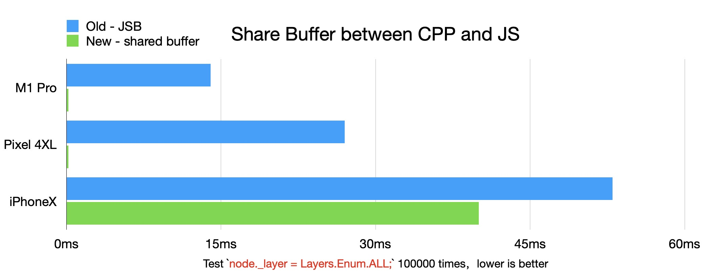
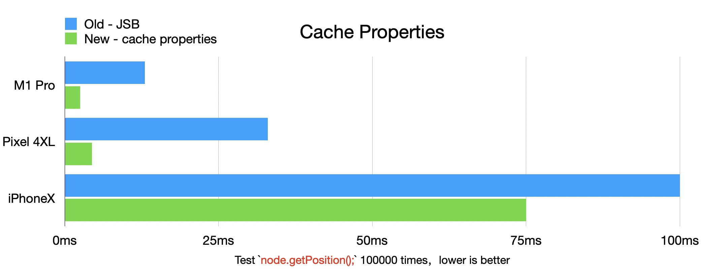
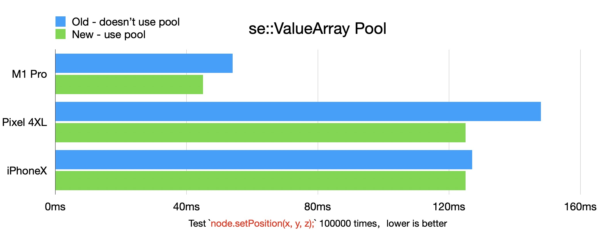

# 原生引擎跨语言调用优化

## 前言

在 Cocos Creator 3.6.0 版本的原生实现上，我们提高了原生（CPP）层级，主要体现在节点树（Scene、Node）、资产（Asset 及其子类）、材质系统（Material、Pass、ProgramLib）、3D 渲染器 （包含 Model、SubModel）、2D 渲染器（Batch2D、RenderEntity）都在 CPP 中实现，并通过绑定技术暴露给 JS 层使用。

众所周知，在 Cocos Creator 3.x 中，开发者只能使用 TS 脚本开发游戏业务逻辑。尽管我们将更多的引擎代码在 CPP 中实现，但是开发者并无法直接使用 CPP 语言进行游戏业务逻辑的开发，因此我们通过`脚本引擎封装层(Script Engine Wrapper)的 API，简称 SE API`，将这些 CPP 层实现的类型绑定并暴露给 JS 中，暴露到 JS 中的接口保持跟 Web 环境中一致。

原生层级的上移最直接的好处就是：在原生平台上引擎代码的执行性能得到提升，特别是不支持 JIT 的平台（比如：iOS）尤为明显。但在 3.6.0 正式版发布前，我们也面临了一系列由于`原生层级提升`带来的副作用，最主要的方面就是 JSB 调用（JS <-> CPP 语言之间的交互）次数比之前版本多了不少，而这直接导致`原生层级提升`带来的收益被抵消甚至性能相比之前版本（ 3.5 ）变得更差。本文将介绍一些降低 `JSB 调用 `的优化方式，若开发者自己的 CPP 代码中也存在类似的 JSB 调用过多的问题，希望本文也能提供一些优化思路。

## 共享内存

对 Node 中需要频繁同步的属性，我们使用 CPP 与 JS 共享内存的方式，避免 JSB 调用。为了更方便地共享 CPP 的内存到 JS 中，我们封装了 bindings::NativeMemorySharedToScriptActor 辅助类。

bindings/utils/BindingUtils.h

```c++
namespace cc::bindings {

class NativeMemorySharedToScriptActor final {
public:
    NativeMemorySharedToScriptActor() = default;
    ~NativeMemorySharedToScriptActor();

    void initialize(void *ptr, uint32_t byteLength);
    void destroy();

    inline se::Object *getSharedArrayBufferObject() const { return _sharedArrayBufferObject; }

private:
    se::Object *_sharedArrayBufferObject{nullptr};

    CC_DISALLOW_COPY_MOVE_ASSIGN(NativeMemorySharedToScriptActor)
};

} // namespace cc::bindings
```

bindings/utils/BindingUtils.h

```c++
#include "bindings/utils/BindingUtils.h"
#include "bindings/jswrapper/SeApi.h"

namespace cc::bindings {

NativeMemorySharedToScriptActor::~NativeMemorySharedToScriptActor() {
    destroy();
}

void NativeMemorySharedToScriptActor::initialize(void* ptr, uint32_t byteLength) {
    CC_ASSERT_NULL(_sharedArrayBufferObject);
    // The callback of freeing buffer is empty since the memory is managed in native,
    // the external array buffer just holds a reference to the memory.
    _sharedArrayBufferObject = se::Object::createExternalArrayBufferObject(ptr, byteLength, [](void* /*contents*/, size_t /*byteLength*/, void* /*userData*/) {});
    // Root 此对象，防止对象被 GC，当 Actor 对象销毁的时候会调用 destroy 函数，其内部会 unroot ArrayBuffer 对象
    _sharedArrayBufferObject->root();
}

void NativeMemorySharedToScriptActor::destroy() {
    if (_sharedArrayBufferObject != nullptr) {
        _sharedArrayBufferObject->unroot();
        _sharedArrayBufferObject->decRef();
        _sharedArrayBufferObject = nullptr;
    }
}

} // namespace cc::bindings
```

bindings/jswrapper/v8/Object.h

```c++
using BufferContentsFreeFunc = void (*)(void *contents, size_t byteLength, void *userData);
static Object *createExternalArrayBufferObject(void *contents, size_t byteLength, BufferContentsFreeFunc freeFunc, void *freeUserData = nullptr);
```

bindings/jswrapper/v8/Object.cpp

```c++
/* static */
Object *Object::createExternalArrayBufferObject(void *contents, size_t byteLength, BufferContentsFreeFunc freeFunc, void *freeUserData /* = nullptr*/) {
    Object *obj = nullptr;
    std::shared_ptr<v8::BackingStore> backingStore = v8::ArrayBuffer::NewBackingStore(contents, byteLength, freeFunc, freeUserData);
    v8::Local<v8::ArrayBuffer> jsobj = v8::ArrayBuffer::New(__isolate, backingStore);

    if (!jsobj.IsEmpty()) {
        obj = Object::_createJSObject(nullptr, jsobj);
    }
    return obj;
}
```

分析以上代码可知，其实 NativeMemorySharedToScriptActor 最终是调用 v8::ArrayBuffer::NewBackingStore 和 v8::ArrayBuffer::New 函数创建了一个 External 类型的 ArrayBuffer，取名为 External 的原因是其内存不在 V8 内部分配和管理，即其内存完全交由 V8 的上层管理，当 ArrayBuffer 对象被 GC 的后，freeFunc 回调函数会被触发。由于在 Node 中需要共享的内存是 Node 中的若干连续属性，内存的创建和释放完全交由 Node 自己维护，而 CPP Node 实例的销毁也是由 GC 控制的，因此 NativeMemorySharedToScriptActor::initialize 内部调用 se::Object::createExternalArrayBufferObject 的时候，传递了一个**空实现**的回调函数。

Node.h

```c++
class Node : public CCObject {
    ......
    inline se::Object *_getSharedArrayBufferObject() const { return _sharedMemoryActor.getSharedArrayBufferObject(); } // NOLINT
    ......
    bindings::NativeMemorySharedToScriptActor _sharedMemoryActor;
    ......
		// Shared memory with JS
    // NOTE: TypeArray created in node.jsb.ts _ctor should have the same memory layout
    uint32_t _eventMask{0};                                             // Uint32: 0
    uint32_t _layer{static_cast<uint32_t>(Layers::LayerList::DEFAULT)}; // Uint32: 1
    uint32_t _transformFlags{0};                                        // Uint32: 2
    index_t _siblingIndex{0};                                           // Int32: 0
    uint8_t _activeInHierarchy{0};                                      // Uint8: 0
    uint8_t _active{1};                                                 // Uint8: 1
    uint8_t _isStatic{0};                                               // Uint8: 2
    uint8_t _padding{0};                                                // Uint8: 3
    ......
};
```

Node.cpp

```c++
Node::Node(const ccstd::string &name) {
#define NODE_SHARED_MEMORY_BYTE_LENGTH (20)
    static_assert(offsetof(Node, _padding) + sizeof(_padding) - offsetof(Node, _eventMask) == NODE_SHARED_MEMORY_BYTE_LENGTH, "Wrong shared memory size");
    _sharedMemoryActor.initialize(&_eventMask, NODE_SHARED_MEMORY_BYTE_LENGTH);
#undef NODE_SHARED_MEMORY_BYTE_LENGTH

    _id = idGenerator.getNewId();
    if (name.empty()) {
        _name.append("New Node");
    } else {
        _name = name;
    }
}
```

Node 构造函数中调用 `_sharedMemoryActor.initialize(&_eventMask, NODE_SHARED_MEMORY_BYTE_LENGTH);` 将 _eventMask 属性开始的 20 字节设置为共享内存。

node.jsb.ts

> **注意**：所有的 .jsb.ts 结尾的文件最终在打包的时候会替换对应不带 .jsb 的文件，比如这里 node.jsb.ts 会替换掉 node.ts，具体可以查看引擎根目录下的 cc.config.json 文件，有对应的 overrides 字段：*"cocos/scene-graph/node.ts"*: "cocos/scene-graph/node.jsb.ts",

```ts
// JS 的 _ctor 回调函数会在 JS 的 var node = new Node(); 流程的最后阶段被触发，即 CPP Node 对象创建之后，因此 _getSharedArrayBufferObject 绑定函数返回的 ArrayBuffer 一定存在。
nodeProto._ctor = function (name?: string) {
    ......
    // 通过 _getSharedArrayBufferObject 绑定方法，取得 CPP 共享给 JS 的 ArrayBuffer 对象
    const sharedArrayBuffer = this._getSharedArrayBufferObject();
    // Uint32Array with 3 elements, offset from the start: eventMask, layer, dirtyFlags
    this._sharedUint32Arr = new Uint32Array(sharedArrayBuffer, 0, 3);
    // Int32Array with 1 element, offset from 12th bytes: siblingIndex
    this._sharedInt32Arr = new Int32Array(sharedArrayBuffer, 12, 1);
    // Uint8Array with 3 elements, offset from 16th bytes: activeInHierarchy, active, static
    this._sharedUint8Arr = new Uint8Array(sharedArrayBuffer, 16, 3);
    //
  
    this._sharedUint32Arr[1] = Layers.Enum.DEFAULT; // this._sharedUint32Arr[1] is layer
    ......
};
```

采用共享内存的方式，也意味着我们无法通过 JSB 绑定函数的方式把要设置的值从 JS 传递到 CPP 中。因此我们需要在 .jsb.ts 中定义对应的 getter / setter 函数，其内部通过直接操作 TypedArray 的方式修改共享内存。

```ts
Object.defineProperty(nodeProto, 'activeInHierarchy', {
    configurable: true,
    enumerable: true,
    get (): Readonly<Boolean> {
        return this._sharedUint8Arr[0] != 0; // Uint8, 0: activeInHierarchy
    },
    set (v) {
        this._sharedUint8Arr[0] = (v ? 1 : 0); // Uint8, 0: activeInHierarchy
    },
});

Object.defineProperty(nodeProto, '_activeInHierarchy', {
    configurable: true,
    enumerable: true,
    get (): Readonly<Boolean> {
        return this._sharedUint8Arr[0] != 0; // Uint8, 0: activeInHierarchy
    },
    set (v) {
        this._sharedUint8Arr[0] = (v ? 1 : 0); // Uint8, 0: activeInHierarchy
    },
});

Object.defineProperty(nodeProto, 'layer', {
    configurable: true,
    enumerable: true,
    get () {
        return this._sharedUint32Arr[1]; // Uint32, 1: layer
    },
    set (v) {
        this._sharedUint32Arr[1] = v; // Uint32, 1: layer
        if (this._uiProps && this._uiProps.uiComp) {
            this._uiProps.uiComp.setNodeDirty();
            this._uiProps.uiComp.markForUpdateRenderData();
        }
        this.emit(NodeEventType.LAYER_CHANGED, v);
    },
});

Object.defineProperty(nodeProto, '_layer', {
    configurable: true,
    enumerable: true,
    get () {
        return this._sharedUint32Arr[1]; // Uint32, 1: layer
    },
    set (v) {
        this._sharedUint32Arr[1] = v; // Uint32, 1: layer
    },
});

Object.defineProperty(nodeProto, '_eventMask', {
    configurable: true,
    enumerable: true,
    get () {
        return this._sharedUint32Arr[0]; // Uint32, 0: eventMask
    },
    set (v) {
        this._sharedUint32Arr[0] = v; // Uint32, 0: eventMask
    },
});

Object.defineProperty(nodeProto, '_siblingIndex', {
    configurable: true,
    enumerable: true,
    get () {
        return this._sharedInt32Arr[0]; // Int32, 0: siblingIndex
    },
    set (v) {
        this._sharedInt32Arr[0] = v; // Int32, 0: siblingIndex
    },
});

nodeProto.getSiblingIndex = function getSiblingIndex() {
    return this._sharedInt32Arr[0]; // Int32, 0: siblingIndex
};

Object.defineProperty(nodeProto, '_transformFlags', {
    configurable: true,
    enumerable: true,
    get () {
        return this._sharedUint32Arr[2]; // Uint32, 2: _transformFlags
    },
    set (v) {
        this._sharedUint32Arr[2] = v; // Uint32, 2: _transformFlags
    },
});

Object.defineProperty(nodeProto, '_active', {
    configurable: true,
    enumerable: true,
    get (): Readonly<Boolean> {
        return this._sharedUint8Arr[1] != 0; // Uint8, 1: active
    },
    set (v) {
        this._sharedUint8Arr[1] = (v ? 1 : 0); // Uint8, 1: active
    },
});

Object.defineProperty(nodeProto, 'active', {
    configurable: true,
    enumerable: true,
    get (): Readonly<Boolean> {
        return this._sharedUint8Arr[1] != 0; // Uint8, 1: active
    },
    set (v) {
        this.setActive(!!v);
    },
});

Object.defineProperty(nodeProto, '_static', {
    configurable: true,
    enumerable: true,
    get (): Readonly<Boolean> {
        return this._sharedUint8Arr[2] != 0;
    },
    set (v) {
        this._sharedUint8Arr[2] = (v ? 1 : 0);
    },
});
```

### 性能对比



## 避免接口传参

如果 JSB 函数调用中包含参数，V8 内部需要对参数的合理性做校验，这些校验工作也会影响调用性能。针对 Node 中可能会高频调用的 JSB 函数，我们通过复用一个全局的 Float32Array 来避免浮点类型的参数传递。

scene-graph/utils.jsb.ts

```ts
import { IMat4Like, Mat4 } from '../core/math';

declare const jsb: any;

// For optimize getPosition, getRotation, getScale
export const _tempFloatArray = new Float32Array(jsb.createExternalArrayBuffer(20 * 4));

export const fillMat4WithTempFloatArray = function fillMat4WithTempFloatArray (out: IMat4Like) {
    Mat4.set(out,
        _tempFloatArray[0], _tempFloatArray[1], _tempFloatArray[2], _tempFloatArray[3],
        _tempFloatArray[4], _tempFloatArray[5], _tempFloatArray[6], _tempFloatArray[7],
        _tempFloatArray[8], _tempFloatArray[9], _tempFloatArray[10], _tempFloatArray[11],
        _tempFloatArray[12], _tempFloatArray[13], _tempFloatArray[14], _tempFloatArray[15]
    );
};
//
```

以上定义了一个全局的 `_tempFloatArray` ，用于存储 number 或者 number 的复合类型（Vec3/Vec4/Mat4等）参数。

node.jsb.ts

```ts
// ......
// 将 FloatArray 设置给 CPP 层
Node._setTempFloatArray(_tempFloatArray.buffer); 
// ......
// 在 JS 中重新实现带有参数 setPosition 函数
nodeProto.setPosition = function setPosition (val: Readonly<Vec3> | number, y?: number, z?: number) {
    if (y === undefined && z === undefined) {
        // 当 y 和 z 都是 undefined 的时候，表示第一个参数为 Vec3 类型的对象，_tempFloatArray 的第一个元素表示参数个数
        _tempFloatArray[0] = 3;
        const pos = val as Vec3;
        // 将新的 pos 赋值到 FloatArray 数组和 this._lpos 缓存中
        this._lpos.x = _tempFloatArray[1] = pos.x;
        this._lpos.y = _tempFloatArray[2] = pos.y;
        this._lpos.z = _tempFloatArray[3] = pos.z;
    } else if (z === undefined) {
        // 如果 z 为 undefined，那么只有 x 与 y 2 个参数
        _tempFloatArray[0] = 2;
        this._lpos.x = _tempFloatArray[1] = val as number;
        this._lpos.y = _tempFloatArray[2] = y as number;
    } else {
        _tempFloatArray[0] = 3;
        this._lpos.x = _tempFloatArray[1] = val as number;
        this._lpos.y = _tempFloatArray[2] = y as number;
        this._lpos.z = _tempFloatArray[3] = z as number;
    }
    this._setPosition(); // 此为原生绑定出来的无参的函数
};
```

jsb_scene_manual.cpp

```c++
namespace {

/**
 * 对共享的全局 FloatArray 操作的辅助类
 */
class TempFloatArray final {
public:
    TempFloatArray() = default;
    ~TempFloatArray() = default;

    inline void setData(float *data) { _data = data; }

    ......

    inline const float &operator[](size_t index) const { return _data[index]; }
    inline float &operator[](size_t index) { return _data[index]; }

private:
    float *_data{nullptr};

    CC_DISALLOW_ASSIGN(TempFloatArray)
};

TempFloatArray tempFloatArray;

} // namespace
```

```c++
static bool js_scene_Node_setTempFloatArray(se::State &s) // NOLINT(readability-identifier-naming)
{
    const auto &args = s.args();
    size_t argc = args.size();
    CC_UNUSED bool ok = true;
    if (argc == 1) {
        uint8_t *buffer = nullptr;
        args[0].toObject()->getArrayBufferData(&buffer, nullptr);
        // 初始化 TempFloatArray 关联的数据
        tempFloatArray.setData(reinterpret_cast<float *>(buffer));
        return true;
    }
    SE_REPORT_ERROR("wrong number of arguments: %d, was expecting %d", (int)argc, 1);
    return false;
}
SE_BIND_FUNC(js_scene_Node_setTempFloatArray)
```


```c++
bool register_all_scene_manual(se::Object *obj) // NOLINT(readability-identifier-naming)
{
    ......
    __jsb_cc_Node_proto->defineFunction("_setPosition", _SE(js_scene_Node_setPosition));
    __jsb_cc_Node_proto->defineFunction("_setScale", _SE(js_scene_Node_setScale));
    __jsb_cc_Node_proto->defineFunction("_setRotation", _SE(js_scene_Node_setRotation));
    __jsb_cc_Node_proto->defineFunction("_setRotationFromEuler", _SE(js_scene_Node_setRotationFromEuler));
    __jsb_cc_Node_proto->defineFunction("_rotateForJS", _SE(js_scene_Node_rotateForJS));
    ......
}
```

```c++
// 无参的 node._setPosition() 绑定
static bool js_scene_Node_setPosition(void *s) // NOLINT(readability-identifier-naming)
{
    auto *cobj = reinterpret_cast<cc::Node *>(s);
    auto argc = static_cast<size_t>(tempFloatArray[0]);
    if (argc == 2) {
        // 从 tempFloatArray 中获取参数
        cobj->setPositionInternal(tempFloatArray[1], tempFloatArray[2], true);
    } else {
        cobj->setPositionInternal(tempFloatArray[1], tempFloatArray[2], tempFloatArray[3], true);
    }
    return true;
}
SE_BIND_FUNC_FAST(js_scene_Node_setPosition) // 注意，这里使用了新的 SE_BIND_FUNC_FAST 宏
```

Node.h

```c++
    inline void setPositionInternal(float x, float y, bool calledFromJS) { setPositionInternal(x, y, _localPosition.z, calledFromJS); }
    void setPositionInternal(float x, float y, float z, bool calledFromJS);
```

bindings/jswrapper/v8/HelperMacros.h

```c++
#define SE_BIND_FUNC(funcName)                                                    \
    void funcName##Registry(const v8::FunctionCallbackInfo<v8::Value> &_v8args) { \
        JsbInvokeScope(#funcName);                                                \
        jsbFunctionWrapper(_v8args, funcName, #funcName);                         \
    }

#define SE_BIND_FUNC_FAST(funcName) \
    void funcName##Registry(const v8::FunctionCallbackInfo<v8::Value> &_v8args) { \
        auto *thisObject = static_cast<se::Object *>(_v8args.This()->GetAlignedPointerFromInternalField(0)); \
        auto *nativeObject = thisObject != nullptr ? thisObject->getPrivateData() : nullptr; \
        funcName(nativeObject); \
    }
```

bindings/jswrapper/v8/HelperMacros.cpp


```c++
// SE_BIND_FUNC 宏会调用 jsbFunctionWrapper 函数，其内部做了更多的事情
SE_HOT void jsbFunctionWrapper(const v8::FunctionCallbackInfo<v8::Value> &v8args, se_function_ptr func, const char *funcName) {
    bool ret = false;
    v8::Isolate *isolate = v8args.GetIsolate();
    v8::HandleScope scope(isolate);
    bool needDeleteValueArray{false};
    se::ValueArray &args = se::gValueArrayPool.get(v8args.Length(), needDeleteValueArray);
    se::CallbackDepthGuard depthGuard{args, se::gValueArrayPool._depth, needDeleteValueArray};
    se::internal::jsToSeArgs(v8args, args);
    se::Object *thisObject = se::internal::getPrivate(isolate, v8args.This());
    se::State state(thisObject, args);
    ret = func(state);
    if (!ret) {
        SE_LOGE("[ERROR] Failed to invoke %s\n", funcName);
    }
    se::internal::setReturnValue(state.rval(), v8args);
}
```

SE_BIND_FUNC_FAST 宏的内部实现非常快，因为其内部非常简单，拿到 private data 后立马出发回调函数，没有任何 se 相关的 API 调用。这避免了 se::Value 与 jsvalue 之间的转换，也避免了 V8 内部对参数进行校验。大家可以对比一下标准的 SE_BIND_FUNC 宏的内部实现。

另外，你可能会好奇，为什么直接不通过「共享内存」章节的方式来共享 position、rotation、scale 信息，而要通过 `_setPosition()`，`_setRotation()`，`_setScale()`  这种**无参**的 JSB 方法调用。原因是，这里的这个 JSB 调用无法被优化掉，我们来看 Node::setPosition 的实现：

```c++
class Node : public CCObject {
    ......
    inline void setPosition(const Vec3 &pos) { setPosition(pos.x, pos.y, pos.z); }
    inline void setPosition(float x, float y) { setPosition(x, y, _localPosition.z); }
    inline void setPosition(float x, float y, float z) { setPositionInternal(x, y, z, false); }
    inline void setPositionInternal(float x, float y, bool calledFromJS) { setPositionInternal(x, y, _localPosition.z, calledFromJS); }
    void setPositionInternal(float x, float y, float z, bool calledFromJS);
  
    ......
    inline uint32_t getChangedFlags() const {
        return _hasChangedFlagsVersion == globalFlagChangeVersion ? _hasChangedFlags : 0;
    }
    inline void setChangedFlags(uint32_t value) {
        _hasChangedFlagsVersion = globalFlagChangeVersion;
        _hasChangedFlags = value;
    }
    ......
};
```

```c++
void Node::setPositionInternal(float x, float y, float z, bool calledFromJS) {
    _localPosition.set(x, y, z);
    invalidateChildren(TransformBit::POSITION);

    if (_eventMask & TRANSFORM_ON) {
        emit<TransformChanged>(TransformBit::POSITION);
    }

    if (!calledFromJS) {
        notifyLocalPositionUpdated();
    }
}
```

setPosition 不止对 _localPostion 赋值，其还需要触发 invalidateChildren 函数的调用，invalidateChildren 是个递归函数，其内部还会遍历所有子节点，进而修改一些其它属性，比如 _transformFlags, _hasChangedFlagsVersion, _hasChangedFlags。因此，我们无法通过第一章节中「共享内存」的方式来优化 setPosition。

### 性能对比


## 缓存属性

在 JS 层中缓存属性，避免 getter 访问 c++ 接口，也能减少 JSB 调用。

node.jsb.ts

```ts
Object.defineProperty(nodeProto, 'position', {
    configurable: true,
    enumerable: true,
    get (): Readonly<Vec3> {
        return this._lpos;
    },
    set (v: Readonly<Vec3>) {
        this.setPosition(v as Vec3);
    },
});

nodeProto.getPosition = function getPosition (out?: Vec3): Vec3 {
    if (out) {
        return Vec3.set(out, this._lpos.x, this._lpos.y, this._lpos.z);
    }
    return Vec3.copy(new Vec3(), this._lpos);
};

nodeProto._ctor = function (name?: string) {
    ......
    this._lpos = new Vec3();
    this._lrot = new Quat();
    this._lscale = new Vec3(1, 1, 1);
    this._euler = new Vec3();
    .......
};
```

### 性能对比



## 节点同步

用户的逻辑代码中，也经常会这样使用：

```ts
const children = node.children;
for (let i = 0; i < children.length; ++i) {
  const child = children[i];
	// do something with child
}
```

`.children` getter 可能会被频繁调用，这也导致 JSB 调用过多。children 的 getter 绑定比较特殊，因为它是一个 JS array，在 CPP 中，它对应的是 `ccstd::vector<Node*> _children;`类型，因此 JS Array 与 CPP 的 std::vector 并没有很好的方式进行数据同步。如果每次调用 `.children` getter 都是 JSB 的方式返回的话，那么每次调用都会通过 `se::Object::createArrayObject` 生成一个临时的 JS Array ，并通过 `nativevalue_to_se` 依次转换 CPP 的 child 为 JS 的 child 并赋值到 JS Array 中，这算是比较重度的转换开销，而且会生成需要被 GC 的临时数组，给 GC 造成一定的额外压力。

为了解决此问题，我们在 JS 层中缓存了 _children 属性，当 CPP 层中有更改 _children 时候，通过监听 ChildAdded, ChildRemoved 事件的方式通知 JS 层中的 _children 更新内容。

以下以 `node.addChild(child);`  为例阐述：

```c++
class Node : public CCObject {
    ......
    inline void addChild(Node *node) { node->setParent(this); }

    inline void removeChild(Node *node) const {
        auto idx = getIdxOfChild(_children, node);
        if (idx != -1) {
            node->setParent(nullptr);
        }
    }
    inline void removeFromParent() {
        if (_parent) {
            _parent->removeChild(this);
        }
    }
    void removeAllChildren();
    ......
};
```

```c++
void Node::setParent(Node *parent, bool isKeepWorld /* = false */) {
    ......
    onSetParent(oldParent, isKeepWorld);
    emit<ParentChanged>(oldParent);
    if (oldParent) {
        if (!(oldParent->_objFlags & Flags::DESTROYING)) {
            index_t removeAt = getIdxOfChild(oldParent->_children, this);
            if (removeAt < 0) {
                return;
            }
            // 将 child 从旧的父节点中移除
            oldParent->_children.erase(oldParent->_children.begin() + removeAt);
            oldParent->updateSiblingIndex();
            oldParent->emit<ChildRemoved>(this);
        }
    }
    if (newParent) {
        ......
        // 将 child 添加到新的父节点中
        newParent->_children.emplace_back(this);
        _siblingIndex = static_cast<index_t>(newParent->_children.size() - 1);
        newParent->emit<ChildAdded>(this);
    }
    onHierarchyChanged(oldParent);
}
```

调用完 addChild 后，CPP 层中的 Node::_children 被修改后，会触发 `emit<ChildAdded>` 事件，Node 初始化的时候会设置监听此事件，见 jsb_scene_manual.cpp 中的代码：

```c++
// jsb_scene_manual.cpp
static void registerOnChildAdded(cc::Node *node, se::Object *jsObject) {
    node->on<cc::Node::ChildAdded>(
        [jsObject](cc::Node * /*emitter*/, cc::Node *child) {
            se::AutoHandleScope hs;
            se::Value arg0;
            nativevalue_to_se(child, arg0);
            // 调用 JS 的私有函数 _onChildAdded
            se::ScriptEngine::getInstance()->callFunction(jsObject, "_onChildAdded", 1, &arg0);
        });
}

static bool js_scene_Node_registerOnChildAdded(se::State &s) // NOLINT(readability-identifier-naming)
{
    auto *cobj = SE_THIS_OBJECT<cc::Node>(s);
    SE_PRECONDITION2(cobj, false, "Invalid Native Object");

    auto *jsObject = s.thisObject();

    registerOnChildAdded(cobj, jsObject);
    return true;
}
SE_BIND_FUNC(js_scene_Node_registerOnChildAdded) // NOLINT(readability-identifier-naming)
  
bool register_all_scene_manual(se::Object *obj) // NOLINT(readability-identifier-naming)
{
    ......
    __jsb_cc_Node_proto->defineFunction("_registerOnChildAdded", _SE(js_scene_Node_registerOnChildAdded));
    ......
}
```

node.jsb.ts

```ts
Object.defineProperty(nodeProto, 'children', {
    configurable: true,
    enumerable: true,
    get () {
        return this._children;
    },
    set (v) {
        this._children = v;
    },
});

nodeProto._onChildRemoved = function (child) {
    this.emit(NodeEventType.CHILD_REMOVED, child);
};

// 此函数会被 CPP 层 registerOnChildAdded 函数中调用
nodeProto._onChildAdded = function (child) {
    this.emit(NodeEventType.CHILD_ADDED, child);
};

nodeProto.on = function (type, callback, target, useCapture: any = false) {
    switch (type) {
        ......
        case NodeEventType.CHILD_ADDED:
            if (!(this._registeredNodeEventTypeMask & REGISTERED_EVENT_MASK_CHILD_ADDED_CHANGED)) {
                this._registerOnChildAdded(); // 调用 JSB 方法注册监听
                this._registeredNodeEventTypeMask |= REGISTERED_EVENT_MASK_CHILD_ADDED_CHANGED;
            }
            break;
        ......
        default:
            break;
    }
    this._eventProcessor.on(type, callback, target, useCapture);
};

nodeProto._ctor = function (name?: string) {
    ......
    this._children = [];

  	// 使用 on 接口监听 CHILD_ADDED 和 CHILD_REMOVED 事件
    this.on(NodeEventType.CHILD_ADDED, (child) => {
        // 同步 JS 层中的 this._children 数组
        this._children.push(child);
    });

    this.on(NodeEventType.CHILD_REMOVED, (child) => {
        const removeAt = this._children.indexOf(child);
        if (removeAt < 0) {
            errorID(1633);
            return;
        }
        this._children.splice(removeAt, 1);
    });

    ......
};
```

### 性能对比


## 参数数组对象池

截止 3.6.0，Cocos Creator 引擎还未实现高效的内存池，而引擎内部使用 se （ Script Engine Wrapper ）在做 JS -> CPP 交互的时候，都需要生成临时的 `se::ValueArray args(argCount);`，se::ValueArray 类型是 `ccstd::vector<se::Value>` 的 `typedef`, 因此会有大量临时内存的申请、释放，极大影响性能。在 3.6.0 之前的版本并没有暴露出此问题是因为原来的原生层级比较低，JSB 调用次数比较低，而 3.6.0 版本中，随着原生层级提升，JSB 调用变多，此问题变得愈发严重。

我们想到的解决方案是：使用对象池的方式复用 se::ValueArray。对象池（se::ValueArrayPool）的实现也比较简单，具体如下：

bindings/jswrapper/ValueArrayPool.h

```c++
// 调用深度警卫类，用于使用完 se::ValueArray 后对其中的 se::Value 进行复位的操作
// 如果 se::ValueArray 是 new 出来的，将会处理 delete 流程
class CallbackDepthGuard final {
public:
    CallbackDepthGuard(ValueArray &arr, uint32_t &depth, bool needDelete)
    : _arr(arr), _depth(depth), _needDelete(needDelete) {
        ++_depth;
    }

    ~CallbackDepthGuard() {
        --_depth;
        for (auto &e : _arr) {
            e.setUndefined();
        }
        if (_needDelete) {
            delete &_arr;
        }
    }

private:
    ValueArray &_arr;
    uint32_t &_depth;
    const bool _needDelete{false};
};

class ValueArrayPool final {
public:
    // 绑定函数的参数个数的上限为 20，如果有参数大于 20 个的情况，需要考虑重构函数参数
    static const uint32_t MAX_ARGS = 20;

    ValueArrayPool();

    ValueArray &get(uint32_t argc, bool &outNeedDelete);

    uint32_t _depth{0};

private:
    void initPool(uint32_t index);
    ccstd::vector<ccstd::array<ValueArray, MAX_ARGS + 1>> _pools;
};

extern ValueArrayPool gValueArrayPool;
```

bindings/jswrapper/ValueArrayPool.cpp

```c++
ValueArrayPool gValueArrayPool;

// 定义最大深度为 5，如果超过此深度，则不使用对象池
#define SE_DEFAULT_MAX_DEPTH (5)

ValueArrayPool::ValueArrayPool() {
    _pools.resize(SE_DEFAULT_MAX_DEPTH);
    for (uint32_t i = 0; i < SE_DEFAULT_MAX_DEPTH; ++i) {
        initPool(i);
    }
}

ValueArray &ValueArrayPool::get(uint32_t argc, bool &outNeedDelete) {
    // 如果深度大于对象池的大小，直接 new ValueArray
    if (SE_UNLIKELY(_depth >= _pools.size())) {
        outNeedDelete = true;
        auto *ret = ccnew ValueArray();
        ret->resize(argc);
        return *ret;
    }

    outNeedDelete = false;
    CC_ASSERT_LE(argc, MAX_ARGS);
    // 从对象池中取出 ValueArray 对象
    auto &ret = _pools[_depth][argc];
    CC_ASSERT(ret.size() == argc);
    return ret;
}

// 初始化对象池
void ValueArrayPool::initPool(uint32_t index) {
    auto &pool = _pools[index];
    uint32_t i = 0;
    for (auto &arr : pool) {
        arr.resize(i);
        ++i;
    }
}
```

我们回头再来看下 jsbFunctionWrapper 的实现：

```c++
SE_HOT void jsbFunctionWrapper(const v8::FunctionCallbackInfo<v8::Value> &v8args, se_function_ptr func, const char *funcName) {
    bool ret = false;
    v8::Isolate *isolate = v8args.GetIsolate();
    v8::HandleScope scope(isolate);
  
    /* 原来的代码
    se::ValueArray args;
    args.reserve(10);
    */

    // 新实现的优化代码------ 开始 -------
    bool needDeleteValueArray{false};
    // 从全局的 se::ValueArray 对象池中取出 se::ValueArray，注意：needDeleteValueArray 是输出参数
    se::ValueArray &args = se::gValueArrayPool.get(v8args.Length(), needDeleteValueArray);
    // 定义「调用深度警卫」变量 depthGuard，当此变量销毁的时候，会自动清理对象池
    se::CallbackDepthGuard depthGuard{args, se::gValueArrayPool._depth, needDeleteValueArray};
    // 新实现的优化代码------ 结束 -------
  
    se::internal::jsToSeArgs(v8args, args);
    se::Object *thisObject = se::internal::getPrivate(isolate, v8args.This());
    se::State state(thisObject, args);
    ret = func(state);
    if (!ret) {
        SE_LOGE("[ERROR] Failed to invoke %s\n", funcName);
    }
    se::internal::setReturnValue(state.rval(), v8args);
}
```

### 性能对比



## 总结

在 Cocos Creator 3.6.0 版本中，我们通过以下主要优化手段改进了原生引擎的性能：

1. 在原生层（C++层）中实现引擎的核心模块，充分利用 C++ 代码的执行性能。
2. 尽可能减少跨语言的交互（JS <-> CPP）频率，我们采用了以下五种方法进行优化：
   - 共享内存：通过减少内存拷贝的方式提高性能。
   - 避免接口传参：使用成员变量替代频繁的参数传递。
   - 缓存属性：将频繁访问的属性缓存起来，避免重复获取。
   - 节点同步：在节点操作时，通过事件监听机制同步节点的变化。
   - 参数数组对象池：使用对象池复用参数数组对象，减少内存分配和释放的开销。

通过这些优化措施，我们改进了 Cocos Creator 引擎的性能表现。这些优化技术可以显著降低跨语言交互的开销，提高了引擎的整体性能和响应速度。
