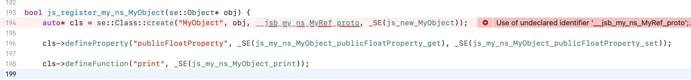
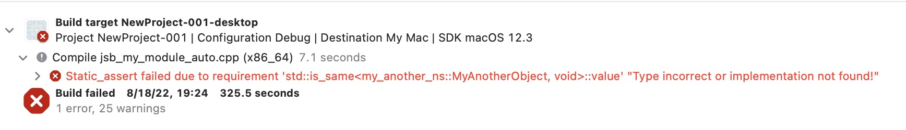

# 在 Cocos Creator 中的 Swig 工作流教程

## 如何为引擎内的新模块添加绑定

### 添加一个新模块的接口文件

- 添加一个新模块的接口文件到 `native/tools/swig-config` 目录, 例如： `new-engine-module.i`

- 拷贝 [swig-interface-template.i](https://github.com/cocos/cocos-engine/blob/1f928364f4cad22681e7830c53dc7da71a87d11f/native/tools/swig-config/swig-interface-template.i) 文件中的内容到 new-engine-module.i

- 添加必要的配置，可以参考 `native/tools/swig-config`  目录下现有的 .i 文件配置，或者参考[下面的章节内容](#如何为开发者的项目绑定一个新模块)。

### 修改 `engine/native/cocos/CMakeLists.txt`

```cmake
######## auto
cocos_source_files(
    NO_WERROR   NO_UBUILD   ${SWIG_OUTPUT}/jsb_cocos_auto.cpp # 添加此行
                            ${SWIG_OUTPUT}/jsb_cocos-auto.h # 添加此行
    NO_WERROR   NO_UBUILD   ${SWIG_OUTPUT}/jsb_cocos_auto.cpp
                            ${SWIG_OUTPUT}/jsb_cocos_auto.h
    ......
```

### 为脚本引擎注册新的模块

打开 `jsb_module_register.cpp` ，做如下修改

```c++
......
#if CC_USE_PHYSICS_PHYSX
    #include "cocos/bindings/auto/jsb_physics_auto.h"
#endif
#include "cocos/bindings/auto/jsb_new_engine_module_auto.h" // 添加此行

bool jsb_register_all_modules() {
    se::ScriptEngine *se = se::ScriptEngine::getInstance();
    ......
    se->addRegisterCallback(register_all_my_new_engine_module); // 添加此行

    se->addAfterCleanupHook([]() {
        cc::DeferredReleasePool::clear();
        JSBClassType::cleanup();
    });
    return true;   
}
```

## 如何为开发者的项目绑定一个新模块

假定我们已经有一个 Cocos Creator 的工程，其位于 `/Users/james/NewProject` 目录下。

打开 Cocos Creator 的构建面板，构建出一个原生平台的工程，会生成 `/Users/james/NewProject/native` 目录。

### 绑定一个简单的类

#### 创建一个简单类

创建一个头文件，其位于 `/Users/james/NewProject/native/engine/Classes/MyObject.h` , 其内容为：

```c++
// MyObject.h
#pragma once
#include "cocos/cocos.h"
namespace my_ns {
class MyObject {
public:
    MyObject() = default;
    MyObject(int a, bool b) {}
    virtual ~MyObject() = default;
    void print() {
        CC_LOG_DEBUG("==> a: %d, b: %d\n", _a, (int)_b);
    }

    float publicFloatProperty{1.23F};
private:
    int _a{100};
    bool _b{true};
};
} // namespace my_ns {
```

#### 编写一个 Swig 接口文件

创建一个名称为 `my-module.i` 的接口文件，其位于 `/Users/james/NewProject/tools/swig-config`目录下。

```c++
// my-module.i
%module(target_namespace="my_ns") my_module

// %insert(header_file) %{ ... }%} 代码块中的内容最终会被原封不动地插入到生成的头文件(.h)开头的地方
%insert(header_file) %{
#pragma once
#include "bindings/jswrapper/SeApi.h"
#include "bindings/manual/jsb_conversions.h"

#include "MyObject.h" // 添加这行，%include 指令表示让 swig 解析此文件，并且为此文件中的类生成绑定代码。
%}

// %{ ... %} 代码块中的内容最终会被原封不动地插入到生成的源文件(.cpp)开头的地方
%{
#include "bindings/auto/jsb_my_module_auto.h"
%}

%include "MyObject.h"
```

#### 编写一个 Swig 配置文件（swig-config.js）

创建一个名为 swig-config.js 的文件，例如： `/Users/james/NewProject/tools/swig-config`目录下。

```js
// swig-config.js
'use strict';
const path = require('path');
const configList = [
    [ 'my-module.i', 'jsb_my_module_auto.cpp' ],
];

const projectRoot = path.resolve(path.join(__dirname, '..', '..'));
const interfacesDir = path.join(projectRoot, 'tools', 'swig-config');
const bindingsOutDir = path.join(projectRoot, 'native', 'engine', 'common', 'bindings', 'auto');
// includeDirs 意思是 swig 执行时候使用的头文件搜索路径
const includeDirs = [
    path.join(projectRoot, 'native', 'engine', 'common', 'Classes'),
];

module.exports = {
    interfacesDir,
    bindingsOutDir,
    includeDirs,
    configList
};
```

#### 为项目生成自动绑定文件

```bash
cd /Users/james/NewProject/tools/swig-config
node < 引擎根目录 >/native/tools/swig-config/genbindings.js -c swig-config.js
```

如果成功，包含自动绑定代码的 `jsb_my_module_auto.cpp/.h` 两个文件将被创建到 `/Users/james/NewProject/native/engine/bindings/auto` 目录下。

#### 修改项目的 CMakeLists.txt 文件

- 打开 `/Users/james/NewProject/native/engine/common/CMakeLists.txt`, 添加 `MyObject.h` 和自动绑定代码文件

  ```cmake
  include(${COCOS_X_PATH}/CMakeLists.txt)
  
  list(APPEND CC_COMMON_SOURCES
      ${CMAKE_CURRENT_LIST_DIR}/Classes/Game.h
      ${CMAKE_CURRENT_LIST_DIR}/Classes/Game.cpp
      ############### 添加下面几行 ##############
      ${CMAKE_CURRENT_LIST_DIR}/Classes/MyObject.h 
      ${CMAKE_CURRENT_LIST_DIR}/bindings/auto/jsb_my_module_auto.h
      ${CMAKE_CURRENT_LIST_DIR}/bindings/auto/jsb_my_module_auto.cpp
      ########################################################
  )
  ```

- 修改 `/Users/james/NewProject/native/engine/mac/CMakeLists.txt`

  ```cmake
  cmake_minimum_required(VERSION 3.8)
  # ......
  cc_mac_before_target(${EXECUTABLE_NAME})
  add_executable(${EXECUTABLE_NAME} ${CC_ALL_SOURCES})
  ############### 添加下面几行 ##############
  target_include_directories(${EXECUTABLE_NAME} PRIVATE
      ${CC_PROJECT_DIR}/../common
  )
  ########################################################
  cc_mac_after_target(${EXECUTABLE_NAME})
  ```

#### 打开项目工程

macOS: `/Users/james/NewProject/build/mac/proj/NewProject.xcodeproj`

Windows: `< 一个存放项目的目录 >/NewProject/build/win64/proj/NewProject.sln`

#### 为脚本引擎注册新的模块

修改 `Game.cpp`

```c++
#include "Game.h"
#include "bindings/auto/jsb_my_module_auto.h" // 添加此行
//......
int Game::init() {
  // ......
  se::ScriptEngine::getInstance()->addRegisterCallback(register_all_my_module); // 添加此行
  BaseGame::init();
  return 0;
}
// ......
```

#### 测试绑定

- 在项目的根目录下添加一个 `my-module.d.ts` 文件，使 TS 编译器识别我们的绑定类型

  ```ts
  // my-module.d.ts
  declare namespace my_ns {
  class MyObject {
      constructor();
      constructor(a: number, b: number);
  
      publicFloatProperty : number;
      print() : void;
  }
  }
  ```

- 修改 `/Users/james/NewProject/temp/tsconfig.cocos.json` 文件

  ```js
  {
    "$schema": "https://json.schemastore.org/tsconfig",
    "compilerOptions": {
      "target": "ES2015",
      "module": "ES2015",
      "strict": true,
      "types": [
        "./temp/declarations/cc.custom-macro",
        "./temp/declarations/jsb",
        "./temp/declarations/cc",
        "./temp/declarations/cc.env",
        "./my-module" // 添加这行
      ],
      // ......
      "forceConsistentCasingInFileNames": true
    }
  }
  ```

- 在 Cocos Creator 中打开 NewProject 项目, 在场景中添加一个立方体，并且添加一个脚本组件到这个立方体上，脚本的内容是：

  ```ts
  import { _decorator, Component } from 'cc';
  const { ccclass } = _decorator;
  
  @ccclass('MyComponent')
  export class MyComponent extends Component {
      start() {
          const myObj = new my_ns.MyObject();
          myObj.print(); // 调用原生的 print 方法
          console.log(`==> myObj.publicFloatProperty: ${myObj.publicFloatProperty}`); // 获取原生中定义的属性值
      }
  }
  ```

- 在 Xcode 或者 Visual Studio 中运行项目, 如果成功，可以看到如下日志输出

  ```
  17:31:44 [DEBUG]: ==> a: 100, b: 1
  17:31:44 [DEBUG]: D/ JS: ==> myObj.publicFloatProperty: 1.2300000190734863
  ```

#### 本节总结

在此节中，我们学会了如何使用 Swig 工具绑定一个简单的 C++ 类，并把它的公有方法与属性导出到 JS 中。从下一节开始，我们将更多地关注如何使用 Swig 的一些特性来满足各式各样的 JS 绑定需求，例如：

- 如何使用 %import 指令导入头文件依赖？
- 如何忽略绑定某些特殊的类、方法或属性？
- 如何重命名类、方法或属性？
- 如何将 C++ 的 getter 和 setter 函数绑定为 JS 属性？
- 如何配置 C++ 模块宏

### 导入头文件依赖

假定我们让 MyObject 类继承于 MyRef 类。但是我们并不想绑定 MyRef 类型。

```c++
// MyRef.h
#pragma once
namespace my_ns {
class MyRef  {
public:
    MyRef() = default;
    virtual ~MyRef() = default;
    void addRef() { _ref++; }
    void release() { --_ref; }
private:
    unsigned int _ref{0};
};
} // namespace my_ns {
```

```c++
// MyObject.h
#pragma once
#include "cocos/cocos.h"
#include "MyRef.h"
namespace my_ns {
// MyObject 继承于 MyRef
class MyObject : public MyRef {
public:
    MyObject() = default;
    MyObject(int a, bool b) {}
    virtual ~MyObject() = default;
    void print() {
        CC_LOG_DEBUG("==> a: %d, b: %d\n", _a, (int)_b);
    }

    float publicFloatProperty{1.23F};
private:
    int _a{100};
    bool _b{true};
};
} // namespace my_ns {
```

当 Swig 解析 MyObject.h 的时候,  它并不知道 `MyRef` 是什么,  因此它会在终端输出一个警告信息。

```bash
.../Classes/MyObject.h:7: Warning 401: Nothing known about base class 'MyRef'. Ignored.
```

要解决此警告也容易，我们只需要使用 `%import` 指令让 Swig 知道 MyRef 类的存在即可。

```c++
// ......
// Insert code at the beginning of generated source file (.cpp)
%{
#include "bindings/auto/jsb_my_module_auto.h"
%}

%import "MyRef.h" // 添加此行
%include "MyObject.h"
```

尽管 Swig 不再报错了，但是生成的代码却无法编译通过，会出现如下报错：



我们将在下一节中使用  `%ignore` 指令来修复此问题。

### 忽略某些类、方法或属性

#### 忽略某些类

在上一节中，我们在 `js_register_my_ns_MyObject` 函数中碰到了一个编译错误。这是因为 `MyRef` 类型并不应该被绑定，我们可以用 `%ignore` 指令来忽略它。

```c++
// my-module.i
// ......
%ignore my_ns::MyRef; // 添加此行
%import "MyRef.h"
%include "MyObject.h"
```

重新生成绑定，现在应该可以编译通过了。

```c++
// jsb_my_module_auto.cpp
bool js_register_my_ns_MyObject(se::Object* obj) {
    auto* cls = se::Class::create("MyObject", obj, nullptr, _SE(js_new_MyObject)); // parentProto will be set to nullptr
    cls->defineProperty("publicFloatProperty", _SE(js_my_ns_MyObject_publicFloatProperty_get), _SE(js_my_ns_MyObject_publicFloatProperty_set)); 
    cls->defineFunction("print", _SE(js_my_ns_MyObject_print)); 
  // ......
}
```

#### 忽略某些方法和属性

我们为 `MyObject` 类添加一个名为 `methodToBeIgnored` 的方法，再添加一个名为 `propertyToBeIgnored` 的属性。

```c++
// MyObject.h
#pragma once
#include "cocos/cocos.h"
#include "MyRef.h"
namespace my_ns {
// MyObject 继承于 MyRef
class MyObject : public MyRef {
public:
// .....
    void methodToBeIgnored() {} // 添加此行
    float propertyToBeIgnored{345.123F}; // 添加此行
// ......
    float publicFloatProperty{1.23F};
private:
    int _a{100};
    bool _b{true};
};
} // namespace my_ns {

```

重新生成绑定, 我们可以发现 `methodToBeIgnored` 和 `propertyToBeIgnored` 的绑定代码已经被自动生成。

```c++
// jsb_my_module_auto.cpp
bool js_register_my_ns_MyObject(se::Object* obj) {
    auto* cls = se::Class::create("MyObject", obj, nullptr, _SE(js_new_MyObject)); 
    cls->defineProperty("propertyToBeIgnored", _SE(js_my_ns_MyObject_propertyToBeIgnored_get), _SE(js_my_ns_MyObject_propertyToBeIgnored_set)); // this property should not be bound
    cls->defineProperty("publicFloatProperty", _SE(js_my_ns_MyObject_publicFloatProperty_get), _SE(js_my_ns_MyObject_publicFloatProperty_set)); 
    cls->defineFunction("print", _SE(js_my_ns_MyObject_print)); 
    cls->defineFunction("methodToBeIgnored", _SE(js_my_ns_MyObject_methodToBeIgnored)); // this method should not be bound
    // ......
}
```

修改 `my-module.i`以忽略绑定这个方法与属性。

```c++
// my-module.i
// ......

%ignore my_ns::MyRef;
%ignore my_ns::MyObject::methodToBeIgnored; // 添加此行
%ignore my_ns::MyObject::propertyToBeIgnored; // 添加此行

%import "MyRef.h"
%include "MyObject.h"
```

重新生成绑定，它们将被忽略。

```c++
// jsb_my_module_auto.cpp
bool js_register_my_ns_MyObject(se::Object* obj) {
    auto* cls = se::Class::create("MyObject", obj, nullptr, _SE(js_new_MyObject)); 
    cls->defineProperty("publicFloatProperty", _SE(js_my_ns_MyObject_publicFloatProperty_get), _SE(js_my_ns_MyObject_publicFloatProperty_set)); 
    cls->defineFunction("print", _SE(js_my_ns_MyObject_print)); 
// ......
}
```

### 重命名类、方法或属性

Swig 定义了一个名为 `%rename` 指令用于重命名类、方法或者属性。我们继续使用 `MyObject` 类来展示。

```c++
// MyObject.h
#pragma once
#include "cocos/cocos.h"
#include "MyRef.h"
namespace my_ns {
// MyObject 继承于 MyRef
class MyObject : public MyRef {
public:
// ......
    void methodToBeRenamed() { // 添加此方法
        CC_LOG_DEBUG("==> hello MyObject::methodToBeRenamed");
    }
    int propertyToBeRenamed{1234}; // 添加此属性

    float publicFloatProperty{1.23F};
private:
    int _a{100};
    bool _b{true};
};
} // namespace my_ns {
```

重新生成绑定，我们发现 `methodToBeRenamed` 与 `propertyToBeRenamed` 的绑定代码已经被生成：

```c++
// jsb_my_module_auto.cpp
bool js_register_my_ns_MyObject(se::Object* obj) {
    auto* cls = se::Class::create("MyObject", obj, nullptr, _SE(js_new_MyObject)); 
    cls->defineProperty("propertyToBeRenamed", _SE(js_my_ns_MyObject_propertyToBeRenamed_get), _SE(js_my_ns_MyObject_propertyToBeRenamed_set)); 
    cls->defineProperty("publicFloatProperty", _SE(js_my_ns_MyObject_publicFloatProperty_get), _SE(js_my_ns_MyObject_publicFloatProperty_set)); 
    
    cls->defineFunction("print", _SE(js_my_ns_MyObject_print)); 
    cls->defineFunction("methodToBeRenamed", _SE(js_my_ns_MyObject_methodToBeRenamed)); 
```

如果我们要重命名 `propertyToBeRenamed` 为 `coolProperty` ，重命名 `methodToBeRenamed` 为 `coolMethod`，那么按照下面的方式修改 `my-module.i` ：

```c++
// my-module.i
// ......
%ignore my_ns::MyRef;
%ignore my_ns::MyObject::methodToBeIgnored;
%ignore my_ns::MyObject::propertyToBeIgnored;
%rename(coolProperty) my_ns::MyObject::propertyToBeRenamed; // 添加此行
%rename(coolMethod) my_ns::MyObject::methodToBeRenamed; // 添加此行

%import "MyRef.h"
%include "MyObject.h"
```

如果我们还想把  `MyObject` 类重命名为 `MyCoolObject`，我猜想你已经知道如何做了吧。没错，只要添加这行：

```c++
%rename(MyCoolObject) my_ns::MyObject;
```

重新生成绑定代码，所有需要被重命名的类、方法与属性都按照我们的意愿被重命名了。

```c++
// jsb_my_module_auto.cpp
// MyCoolObject, coolProperty, coolMethod are all what we want now.
bool js_register_my_ns_MyObject(se::Object* obj) {
    auto* cls = se::Class::create("MyCoolObject", obj, nullptr, _SE(js_new_MyCoolObject));
    cls->defineProperty("coolProperty", _SE(js_my_ns_MyCoolObject_coolProperty_get), _SE(js_my_ns_MyCoolObject_coolProperty_set)); 
    cls->defineProperty("publicFloatProperty", _SE(js_my_ns_MyCoolObject_publicFloatProperty_get), _SE(js_my_ns_MyCoolObject_publicFloatProperty_set)); 
    cls->defineFunction("print", _SE(js_my_ns_MyCoolObject_print)); 
    cls->defineFunction("coolMethod", _SE(js_my_ns_MyCoolObject_coolMethod)); 
    // ......
}
```

现在测试一下吧，更新如下文件 `my-module.d.ts` and `MyComponent.ts`

```c++
// my-module.d.ts
declare namespace my_ns {
class MyCoolObject {
    constructor();
    constructor(a: number, b: number);

    publicFloatProperty : number;
    print() : void;
    coolProperty: number;
    coolMethod() : void;
}
}
```

```ts
// MyComponent.ts
import { _decorator, Component } from 'cc';
const { ccclass } = _decorator;

@ccclass('MyComponent')
export class MyComponent extends Component {
    start() {
        const myObj = new my_ns.MyCoolObject(); // 这里改为 MyCoolObject，因为我们在前面重命名了
        myObj.print();
        console.log(`==> myObj.publicFloatProperty: ${myObj.publicFloatProperty}`);
        // Add the follow lines
        console.log(`==> old: myObj.coolProperty: ${myObj.coolProperty}`); 
        myObj.coolProperty = 666;
        console.log(`==> new: myObj.coolProperty: ${myObj.coolProperty}`);
        myObj.coolMethod();
    }
}
```

在 Xcode 或者 Visual Studio 中运行项目，将得到如下日志：

```
17:53:28 [DEBUG]: ==> a: 100, b: 1
17:53:28 [DEBUG]: D/ JS: ==> myObj.publicFloatProperty: 1.2300000190734863
17:53:28 [DEBUG]: D/ JS: ==> old: myObj.coolProperty: 1234
17:53:28 [DEBUG]: D/ JS: ==> new: myObj.coolProperty: 666
17:53:28 [DEBUG]: ==> hello MyObject::methodToBeRenamed
```

### 定义一个 attribute

`%attribute` 指令用于把 C++ 的 `getter` 和 `setter` 函数绑定为一个 JS 属性。

> **注意**：如果 C++ 属性是公有的，那么理论上无需再配置 attribute 了，Swig 会自动绑定类的公有属性。

#### 用法

1. 定义一个没有 `setter` 函数的 JS 属性，即只读的 JS 属性。

   ```c++
   %attribute(your_namespace::your_class_name, cpp_member_variable_type, js_property_name, cpp_getter_function_name)
   ```

2. 定义一个有 `getter` 和 `setter` 函数的 JS 属性，即可读可写的 JS 属性。

   ```c++
   %attribute(your_namespace::your_class_name, cpp_member_variable_type, js_property_name, cpp_getter_function_name, cpp_setter_function_name)
   ```

3. 定义一个没有 `getter` 的 JS 属性，即可写不可读的 JS 属性。

   ```c++
   %attribute_writeonly(your_namespace::your_class_name, cpp_member_variable_type, js_property_name, cpp_setter_function_name)
   ```

#### 示例

为了方便演示，我们为 `MyObject` 添加两个新方法：`setType` 和 `getType`。

```c++
// MyObject.h
#pragma once
#include "cocos/cocos.h"
#include "MyRef.h"
namespace my_ns {
// MyObject 继承于 MyRef
class MyObject : public MyRef {
public:
// ......
    void setType(int v) { _type = v; CC_LOG_DEBUG("==> setType: v: %d", v); } // 添加此行
    int getType() const { return _type; } // 添加此行

    float publicFloatProperty{1.23F};
private:
    int _a{100};
    bool _b{true};
    int _type{333};
};
} // namespace my_ns {
```

```c++
// my-module.i
// ......
%attribute(my_ns::MyObject, int, type, getType, setType); // 添加此行

%import "MyRef.h"
%include "MyObject.h"
```

```c++
// jsb_my_module_auto.cpp
bool js_register_my_ns_MyObject(se::Object* obj) {
// ......
    cls->defineProperty("type", _SE(js_my_ns_MyCoolObject_type_get), _SE(js_my_ns_MyCoolObject_type_set)); 
// ......
}
```

```ts
// MyComponent.ts
import { _decorator, Component } from 'cc';
const { ccclass } = _decorator;

@ccclass('MyComponent')
export class MyComponent extends Component {
    start() {
        const myObj = new my_ns.MyCoolObject();
        myObj.print();
        console.log(`==> myObj.publicFloatProperty: ${myObj.publicFloatProperty}`);
        console.log(`==> old: myObj.coolProperty: ${myObj.coolProperty}`);
        myObj.coolProperty = 666;
        console.log(`==> new: myObj.coolProperty: ${myObj.coolProperty}`);
        myObj.coolMethod();
        console.log(`==> old: myObj.type: ${myObj.type}`);
        myObj.type = 888;
        console.log(`==> new: myObj.type: ${myObj.type}`);
    }
}
```

在 Xcode 或者 Visual Studio 中运行项目：

```
18:09:53 [DEBUG]: ==> a: 100, b: 1
18:09:53 [DEBUG]: D/ JS: ==> myObj.publicFloatProperty: 1.2300000190734863
18:09:53 [DEBUG]: D/ JS: ==> old: myObj.coolProperty: 1234
18:09:53 [DEBUG]: D/ JS: ==> new: myObj.coolProperty: 666
18:09:53 [DEBUG]: ==> hello MyObject::methodToBeRenamed
18:09:53 [DEBUG]: D/ JS: ==> old: myObj.type: 333
18:09:53 [DEBUG]: ==> setType: v: 888 // Cool, C++ setType is invoked
18:09:53 [DEBUG]: D/ JS: ==> new: myObj.type: 888 // Cool, C++ getType is invoked, 888 is return from C++
```

#### %attribute_writeonly 指令

`%attribute_writeonly` 指令是我们为 swig `Cocos` 后端添加的一个扩展指令，它用于 C++ 只有 `setter` 函数没有 `getter` 函数的情况。

例如在 `native/tools/swig-config/cocos.i` 中有如下定义：

```c++
%attribute_writeonly(cc::ICanvasRenderingContext2D, float, width, setWidth);
%attribute_writeonly(cc::ICanvasRenderingContext2D, float, height, setHeight);
%attribute_writeonly(cc::ICanvasRenderingContext2D, float, lineWidth, setLineWidth);
%attribute_writeonly(cc::ICanvasRenderingContext2D, ccstd::string&, fillStyle, setFillStyle);
%attribute_writeonly(cc::ICanvasRenderingContext2D, ccstd::string&, font, setFont);
```

它的作用类似于 JS 中如下代码：

```javascript
Object.defineProperty(MyNewClass.prototype, 'width', {
  configurable: true,
  enumerable: true,
  set(v) {
    this._width = v;
  },
 // No get() for property
});
```

#### 关于引用类型

如果 C++ 的 `get` 函数返回的是一个引用数据类型或者  `set` 函数接受一个引用数据类型，别忘记在 %attribute 或 %attribute_writeonly 指令的编写中添加 `&` 后缀。以下 `ccstd::string&` 是一个例子：

```c++
%attribute_writeonly(cc::ICanvasRenderingContext2D, ccstd::string&, fillStyle, setFillStyle);
```

如果 `&` 没有被添加，当绑定函数被调用的时候，一个临时的 `ccstd::string` 实例将被创建。这种临时对象的创建与销毁是不划算的且是可以完全避免的。

#### %arg() 指令

有时候 C++ 变量的类型是用模版的方式来修饰的，例如：

```c++
class MyNewClass {
  public:
  const std::map<std::string, std::string>& getConfig() const { return _config; }
   void setConfig(const std::map<std::string, std::string> &config) { _config = config; }
  private:
   std::map<std::string, std::string> _config;
};
```

我们可能会在 `.i` 中写一个这样的 `%attribute` 指令：

```c++
%attribute(MyNewClass, std::map<std::string, std::string>&, config, getConfig, setConfig);
```

但当你执行 `node genbindings.js`的时候，你将得到如下错误：

```
Error: Macro '%attribute_custom' expects 7 arguments
```

这是因为 `swig` 看到 `std::map<std::string, std::string>&` 的时候并不知道如何处理逗号 (`,`) ，它将其分割为两部分，即：

1. std::map<std::string
2. std::string>&

因此， %attribute 指令这行将被解析为 6 个参数，而不是正确的 5 个参数。

为了避免这种情况出现，我们需要使用 `%arg` 指令来告诉 `swig` `std::map<std::string, std::string>&` 是一个整体。

```c++
%attribute(MyNewClass, %arg(std::map<std::string, std::string>&), config, getConfig, setConfig);
```

重新执行 `node genbindings.js`，之前的错误即消失了。

#### 不要添加 `const`

在上一示例中，我们在 %attribute 指令中使用 `%arg(std::map<std::string, std::string>&)`。你可能会考虑在 `std::map` 前面添加一个 `const` 前缀，比如：`%arg(const std::map<std::string, std::string>&)`。如果你这样做了，你将添加一个 **只读的**、只绑定 `MyNewClass::getConfig` 的 `config` 属性。这明显不是我们所期望的。如果我们需要属性是只读的，只需要不配置 `setter` 函数即可。

```c++
// 不配置 setConfig 意味着属性是只读的
%attribute(MyNewClass, %arg(std::map<std::string, std::string>&), config, getConfig); 
```

因此，为了让事情简单化，我们只要记得，**永远不要在定义 %attribute 的时候为 C++ 变量类型使用 const 前缀**。

### 配置 C++ 模块宏（用于 C++ 模块裁剪）

有时候是否需要让一个类参与编译依赖于某个宏是否启用。比如，我们在 `MyObject.h` 文件中添加一个 `MyFeatureObject` 类：

```c++
// MyObject.h
#pragma once
#include "cocos/cocos.h"
#include "MyRef.h"

#ifndef USE_MY_FEATURE
#define USE_MY_FEATURE 1 // Enable USE_MY_FEATURE
#endif

namespace my_ns {

#if USE_MY_FEATURE
class MyFeatureObject {
public:
    void foo() {
        CC_LOG_DEBUG("==> MyFeatureObject::foo");
    }
};
#else
class MyFeatureObject;
#endif

// MyObject 继承于 MyRef
class MyObject : public MyRef {
public:
//......
    MyFeatureObject* getFeatureObject() {
#if USE_MY_FEATURE // getFeatureObject 只在宏 USE_MY_FEATURE 启用的情况下返回有效值
        if (_featureObject == nullptr) {
            _featureObject = new MyFeatureObject();
        }
#endif
        return _featureObject;
    }
private:
    int _a{100};
    bool _b{true};
    int _type{333};
    MyFeatureObject* _featureObject{nullptr}; // 添加此行
};
} // namespace my_ns {
```

```c++
// my-module.i
// ......
%rename(MyCoolObject) my_ns::MyObject;

%attribute(my_ns::MyObject, int, type, getType, setType);

%module_macro(USE_MY_FEATURE) my_ns::MyFeatureObject; // 添加此行，用于让 Swig 知道生成出来的 MyFeatureObject 类的绑定代码需要被包在 USE_MY_FEATURE 下
%module_macro(USE_MY_FEATURE) my_ns::MyObject::getFeatureObject; // 添加此行，用于让 Swig 知道生成出来的 MyObject::getFeatureObject 方法的绑定代码需要被包在 USE_MY_FEATURE 下

#define USE_MY_FEATURE 1 // 这里定义为 1 是骗过 Swig，让它帮我们生成绑定代码。注意，这行必须在 %module_macro 之后

%import "MyRef.h"
%include "MyObject.h"
```

```c++
// my-module.d.ts
declare namespace my_ns {
class MyFeatureObject {
    foo() : void;
}

class MyCoolObject {
    constructor();
    constructor(a: number, b: number);

    publicFloatProperty : number;
    print() : void;
    coolProperty: number;
    coolMethod() : void;
    type: number;
    getFeatureObject() : MyFeatureObject;
}
}
```

```ts
// MyComponent.ts
import { _decorator, Component } from 'cc';
const { ccclass } = _decorator;

@ccclass('MyComponent')
export class MyComponent extends Component {
    start() {
        const myObj = new my_ns.MyCoolObject();
        myObj.print();
        console.log(`==> myObj.publicFloatProperty: ${myObj.publicFloatProperty}`);
        console.log(`==> old: myObj.coolProperty: ${myObj.coolProperty}`);
        myObj.coolProperty = 666;
        console.log(`==> new: myObj.coolProperty: ${myObj.coolProperty}`);
        myObj.coolMethod();
        console.log(`==> old: myObj.type: ${myObj.type}`);
        myObj.type = 888;
        console.log(`==> new: myObj.type: ${myObj.type}`);
        const featureObj = myObj.getFeatureObject();
        console.log(`==> featureObj: ${featureObj}`);
        if (featureObj) {
            featureObj.foo();
        }
    }
}
```

重新生成绑定代码，自动绑定代码如下：

```c++
#if USE_MY_FEATURE // 注意，现在所有 MyFeatureObject 相关的绑定代码都被包在 USE_MY_FEATURE 宏下面了。

se::Class* __jsb_my_ns_MyFeatureObject_class = nullptr;
se::Object* __jsb_my_ns_MyFeatureObject_proto = nullptr;
SE_DECLARE_FINALIZE_FUNC(js_delete_my_ns_MyFeatureObject) 

static bool js_my_ns_MyFeatureObject_foo(se::State& s)
{
// ......
}
// ......
bool js_register_my_ns_MyFeatureObject(se::Object* obj) {
    auto* cls = se::Class::create("MyFeatureObject", obj, nullptr, _SE(js_new_my_ns_MyFeatureObject)); 
// ......
}

#endif // USE_MY_FEATURE

// ......
static bool js_my_ns_MyCoolObject_getFeatureObject(se::State& s)
{
#if USE_MY_FEATURE // getFeatureObject 函数的绑定代码也被包在 USE_MY_FEATURE 宏下面了。
// ......
    ok &= nativevalue_to_se(result, s.rval(), s.thisObject() /*ctx*/);
    SE_PRECONDITION2(ok, false, "MyCoolObject_getFeatureObject, Error processing arguments");
    SE_HOLD_RETURN_VALUE(result, s.thisObject(), s.rval()); 
#endif // USE_MY_FEATURE
    return true;
}
SE_BIND_FUNC(js_my_ns_MyCoolObject_getFeatureObject) 

// ......
bool register_all_my_module(se::Object* obj) {
    // Get the ns
    se::Value nsVal;
    if (!obj->getProperty("my_ns", &nsVal, true))
    {
        se::HandleObject jsobj(se::Object::createPlainObject());
        nsVal.setObject(jsobj);
        obj->setProperty("my_ns", nsVal);
    }
    se::Object* ns = nsVal.toObject();
    /* Register classes */
#if USE_MY_FEATURE
    js_register_my_ns_MyFeatureObject(ns); // js_register_my_ns_MyFeatureObject 也被包在 USE_MY_FEATURE 宏下面了。
#endif // USE_MY_FEATURE
    js_register_my_ns_MyObject(ns); 
    return true;
}
```

在 Xcode 或者 Visual Studio 中运行项目，会得到如下输出：

```
18:32:20 [DEBUG]: D/ JS: ==> featureObj: [object Object] // 在 USE_MY_FEATURE 启用的情况下，featureObj 是个有效值
18:32:20 [DEBUG]: ==> MyFeatureObject::foo // 调用 C++ foo 方法 
```

当我们不需要 `MyFeatureObject` 类的时候，把宏设置为 0 即可，代码示例如下：

```c++
// MyObject.h
#pragma once
#include "cocos/cocos.h"
#include "MyRef.h"

#ifndef USE_MY_FEATURE
#define USE_MY_FEATURE 0 // Disable USE_MY_FEATURE
#endif
```

在 Xcode 或者 Visual Studio 中运行项目：

```
18:54:00 [DEBUG]: D/ JS: ==> featureObj: undefined // getFeatureObject returns undefined if USE_MY_FEATURE is disabled.
```

### 多个 Swig 模块的配置

我们创建另外一个头文件，名为 `MyAnotherObject.h`。

```c++
// MyAnotherObject.h
#pragma once
namespace my_another_ns {
struct MyAnotherObject {
    float a{135.246};
    int b{999};
};
} // namespace my_another_ns {
```

更新 MyObject.h

```c++
// MyObject.h
//......
class MyObject : public MyRef {
public:
// ......
    void helloWithAnotherObject(const my_another_ns::MyAnotherObject &obj) {
        CC_LOG_DEBUG("==> helloWithAnotherObject, a: %f, b: %d", obj.a, obj.b);
    }
// ......
};
} // namespace my_ns {
```

创建 `/Users/james/NewProject/tools/swig-config/another-module.i`

```c++
// another-module.i
%module(target_namespace="another_ns") another_module

// %insert(header_file) %{ ... }%} 代码块中的内容最终会被原封不动地插入到生成的头文件(.h)开头的地方
%insert(header_file) %{
#pragma once
#include "bindings/jswrapper/SeApi.h"
#include "bindings/manual/jsb_conversions.h"

#include "MyAnotherObject.h" // 添加此行
%}

// %{ ... %} 代码块中的内容最终会被原封不动地插入到生成的源文件(.cpp)开头的地方
%{
#include "bindings/auto/jsb_another_module_auto.h"
%}

%include "MyAnotherObject.h"
```

修改 `/Users/james/NewProject/tools/swig-config/swig-config.js`

```c++
'use strict';

const path = require('path');

const configList = [
    [ 'my-module.i', 'jsb_my_module_auto.cpp' ],
    [ 'another-module.i', 'jsb_another_module_auto.cpp' ], // 添加此行
];

const projectRoot = path.resolve(path.join(__dirname, '..', '..'));
const interfacesDir = path.join(projectRoot, 'tools', 'swig-config');
const bindingsOutDir = path.join(projectRoot, 'native', 'engine', 'common', 'bindings', 'auto');
const includeDirs = [
    path.join(projectRoot, 'native', 'engine', 'common', 'Classes'),
];

module.exports = {
    interfacesDir,
    bindingsOutDir,
    includeDirs,
    configList
};
```

修改 `/Users/james/NewProject/native/engine/common/CMakeLists.txt`

```cmake
# /Users/james/NewProject/native/engine/common/CMakeLists.txt
list(APPEND CC_COMMON_SOURCES
    ${CMAKE_CURRENT_LIST_DIR}/Classes/Game.h
    ${CMAKE_CURRENT_LIST_DIR}/Classes/Game.cpp
    ${CMAKE_CURRENT_LIST_DIR}/Classes/MyObject.h
    ${CMAKE_CURRENT_LIST_DIR}/Classes/MyAnotherObject.h # Add this line
    ${CMAKE_CURRENT_LIST_DIR}/bindings/auto/jsb_my_module_auto.h
    ${CMAKE_CURRENT_LIST_DIR}/bindings/auto/jsb_my_module_auto.cpp
    ${CMAKE_CURRENT_LIST_DIR}/bindings/auto/jsb_another_module_auto.h # Add this line
    ${CMAKE_CURRENT_LIST_DIR}/bindings/auto/jsb_another_module_auto.cpp # Add this line
)
```

重新生成绑定。

更新 Game.cpp：

```c++
#include "Game.h"
#include "bindings/auto/jsb_my_module_auto.h"
#include "bindings/auto/jsb_another_module_auto.h" // Add this line
//......

int Game::init() {
//......
    se::ScriptEngine::getInstance()->addRegisterCallback(register_all_my_module);
    se::ScriptEngine::getInstance()->addRegisterCallback(register_all_another_module); // Add this line
//
  BaseGame::init();
  return 0;
}
```

在 Xcode 或者 Visual Studio 中编译，但是得到如下错误：



因为 MyObject 类依赖了 MyAnotherObject 类，而 MyAnotherObject 类是被定义在另外一个模块中的。我们需要修改 `my-module.i` 并添加 `#include "bindings/auto/jsb_another_module_auto.h"`。

```c++
// my-module.i
%module(target_namespace="my_ns") my_module

// %insert(header_file) %{ ... }%} 代码块中的内容最终会被原封不动地插入到生成的头文件(.h)开头的地方
%insert(header_file) %{
#pragma once
#include "bindings/jswrapper/SeApi.h"
#include "bindings/manual/jsb_conversions.h"

#include "MyObject.h"
%}

// %{ ... %} 代码块中的内容最终会被原封不动地插入到生成的源文件(.cpp)开头的地方
%{
#include "bindings/auto/jsb_my_module_auto.h"
#include "bindings/auto/jsb_another_module_auto.h" // Add this line
%}

// ......
```

在 Xcode 或者 Visual Studio 中编译项目，现在应该可以正常编译了。

下一步，我们需要更新 .d.ts 文件：

```ts
// my-module.d.ts
declare namespace my_ns {
class MyFeatureObject {
    foo() : void;
}

class MyCoolObject {
    constructor();
    constructor(a: number, b: number);

    publicFloatProperty : number;
    print() : void;
    coolProperty: number;
    coolMethod() : void;
    type: number;
    getFeatureObject() : MyFeatureObject;
    helloWithAnotherObject(obj: another_ns.MyAnotherObject) : void; // 添加这行
}
}

// 添加以下行
declare namespace another_ns {
class MyAnotherObject {
    a: number;
    b: number;
}
}
```

添加更多的用于读取  `MyAnotherObject` 类属性的测试代码：

```ts
// MyComponent.ts
import { _decorator, Component } from 'cc';
const { ccclass } = _decorator;

@ccclass('MyComponent')
export class MyComponent extends Component {
    start() {
        const myObj = new my_ns.MyCoolObject();
        // ......
        const anotherObj = new another_ns.MyAnotherObject(); // 添加此行
        myObj.helloWithAnotherObject(anotherObj); // 添加此行
    }
}
```

在 Xcode 或者 Visual Studio 中编译项目，得到如下输出：

```
15:05:36 [DEBUG]: ==> helloWithAnotherObject, a: 135.246002, b: 999
```
