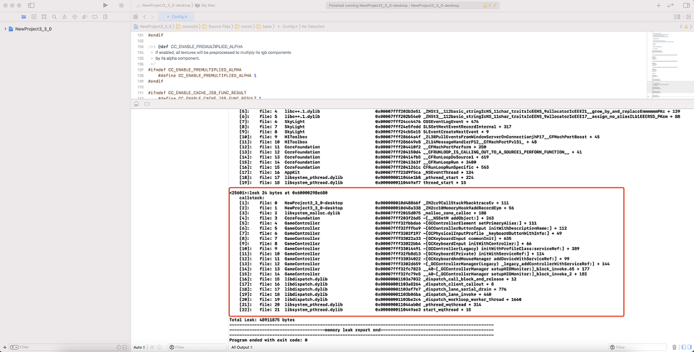

# 原生引擎内存泄漏检测系统

原生引擎使用 C++语言开发，内存泄漏问题不可避免，为了方便游戏和引擎开发者快速查找内存泄漏，Creator 从 v3.4 开始提供了 **内存泄漏检测系统**。

相对其他内存泄漏查找工具，Cocos Creator 内置的内存泄漏检测工具有以下优点：

- **跨平台**：支持 Windows/Android/Mac/iOS 平台。
- **易用性**：无需下载额外的工具以及进行复杂的配置。支持输出内存泄漏处的堆栈信息，方便快速定位泄漏。
- **一致性**：各平台的使用流程几乎一致，都是从原生平台对应的 IDE 中启动游戏 -> 运行一段时间 -> 关闭游戏 -> 查看 IDE 输出日志。
- **实时性**：查找泄露过程中的游戏帧率虽有下降，但仍然保持实时运行帧率。
- **精确性**：理论上零漏报，零误报。

## 使用步骤

1. 内存泄漏检测系统默认是关闭的。若要开启，需要将编辑器目录 `resources\3d\engine-native\cocos\base\Config.h` 文件中的宏 `USE_MEMORY_LEAK_DETECTOR` 的值修改为 `1`。

    ```c++
    #ifndef USE_MEMORY_LEAK_DETECTOR
        #define USE_MEMORY_LEAK_DETECTOR 1
    #endif
    ```

2. 由于实现机制的不同，Android 平台上需要额外执行以下两个步骤：
    - 在项目目录 `native/engine/android/CMakeLists.txt` 中添加 `set(CMAKE_CXX_FLAGS "${CMAKE_CXX_FLAGS} -finstrument-functions")`，如下所示：
        ```
        set(PROJ_SOURCES
            ${CMAKE_CURRENT_LIST_DIR}/../common/Classes/Game.h
            ${CMAKE_CURRENT_LIST_DIR}/../common/Classes/Game.cpp
            ${CMAKE_CURRENT_LIST_DIR}/jni/main.cpp
        )
        set(CMAKE_CXX_FLAGS "${CMAKE_CXX_FLAGS} -finstrument-functions")
        ```

    - **构建发布** 面板中的 **任务调度系统** 项需要设置为 **None** 或者 **TaskFlow**。不能设置为 **TBB**，否则会与目前 Android 平台上的内存捕获实现机制相冲突。

        

3. 从原生平台对应的 IDE（如 Visual Studio、Android Studio、Xcode）启动游戏，运行一段时间后关闭游戏，若存在内存泄漏，则此时会在 IDE 的输出窗口中输出内存泄漏的详细信息。
    - Windows 平台

      

      若项目构建编译的是 Release 版本，如果需要更友好的堆栈信息，可在 Visual Studio 中右键点击左侧的可执行项目，选择 **属性**，打开项目属性页，进行如下设置：

        - 链接器 -> 调试 -> 生成调试信息：生成调试信息（/DEBUG）
        - C/C++ -> 优化 -> 优化：已禁用（/Od）
        - C/C++ -> 优化 -> 内联函数扩展：已禁用（/Ob0）
        
    - Android 平台

      

    - Mac/iOS 平台
    
      

4. 根据原生平台 IDE 输出的信息修复泄漏，如此反复，直到没有泄漏为止。
