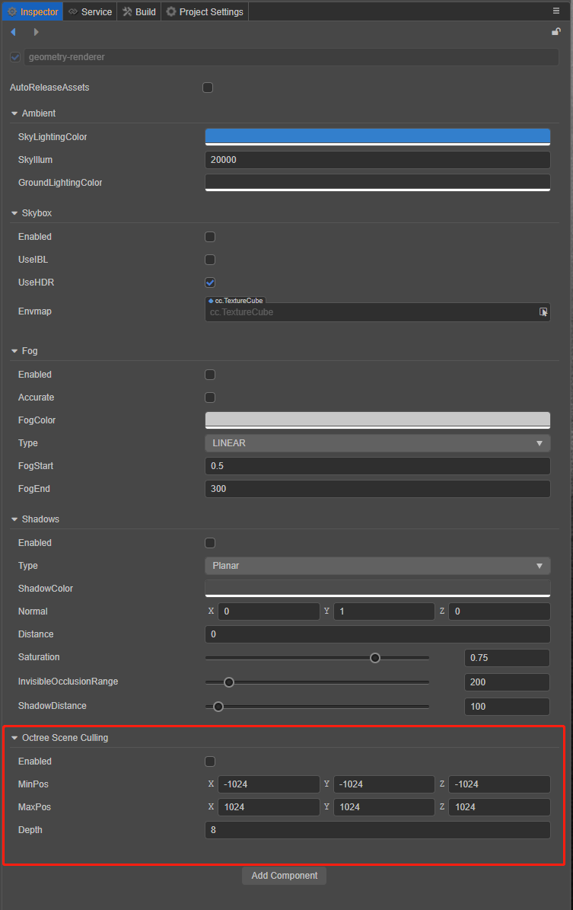

# 原生引擎场景剔除系统

1. 八叉树视锥剔除

    此功能默认关闭，关闭时引擎会逐个检测model包围盒，剔除不在视锥内的model。如果开启八叉树剔除，则通过八叉树快速剔除不在视锥内的model，为此需要做如下设置，在Hierarchy面板选中场景节点，此时Inspector面板显示如下：
        
    - Enabled：是否开启八叉树剔除
    - MinPos：场景世界包围盒最小坐标（超出世界包围盒的物体不渲染）
    - MaxPos：场景世界包围盒最大坐标（超出世界包围盒的物体不渲染）
    - Depth：八叉树深度

        

2. 遮挡查询剔除

    此功能默认关闭，如果开启，则GFX后端会通过图形API进行遮挡查询，若物体被遮挡，则只使用简化的包围盒及材质来渲染该物体，以提升性能（GLES 2.0不支持此功能，某些GLES 3.0设备如果没有 `GL_EXT_occlusion_query_boolean` 扩展也不支持）。此功能的开关接口为 `director.root.pipeline.setOcclusionQueryEnabled` 。

3. 性能优化建议：

    - 如果场景中的大部分物体都可见，建议关闭以上两项功能。
    - 不同设备可能表现略有差异，可通过性能测试对比后，决定是否开启对应的剔除功能。