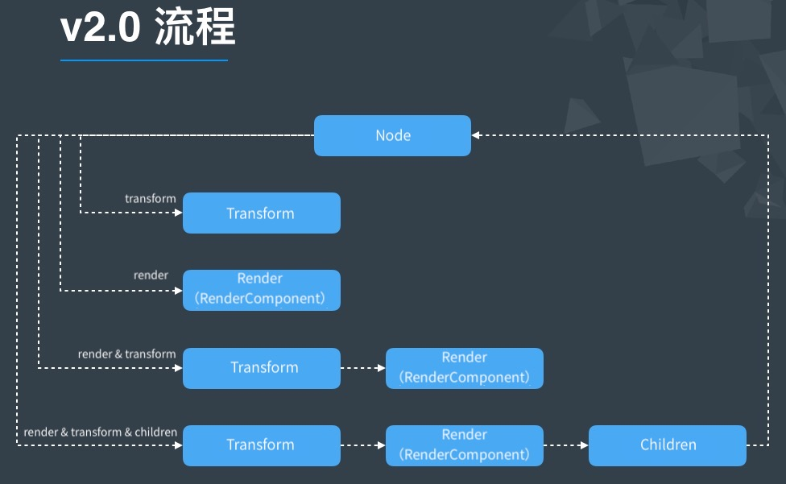

# 渲染流

渲染流（RenderFlow）是 v2.0 新加的流程，它的作用是可以剔除无用的渲染分支，只进入预先创建好的渲染分支，这样可以有效减少非常多的动态判断。

## v1.x 渲染流程

在 v1.x 中，每次渲染都会进行很多动态判断，首先要遍历所有子节点，在遍历到的子节点中去判断是否需要更新矩阵，是否需要进行渲染。如果状态多了的话，就会多出很多无用的分支判断。例如使用一个空节点作为父节点是不需要进行渲染的，但是是在渲染的过程中做出该判断，这样就多消耗了一些性能。

## v2.x 渲染流程

在 v2.x 中，RenderFlow 会根据渲染过程中调用的频繁度划分出多个渲染状态，比如 Transform，Render，Children 等，而每个渲染状态都对应了一个函数。在 RenderFlow 的初始化过程中，会预先根据这些状态创建好对应的渲染分支，这些分支会把对应的状态依次链接在一起。

例如如果一个节点在当前帧需要更新矩阵，以及需要渲染自己，那么这个节点会更新它的 flag 为：

`node._renderFlag = RenderFlow.FLAG_TRANSFORM | RenderFlow.FLAG_RENDER`。

RenderFlow 在渲染这个节点的时候就会根据节点的 `node._renderFlag` 状态进入到 **transform => render** 分支，而不需要再进行多余的状态判断。

## 参考链接

[自定义渲染 Assembler](https://forum.cocos.org/t/demo/95087)
