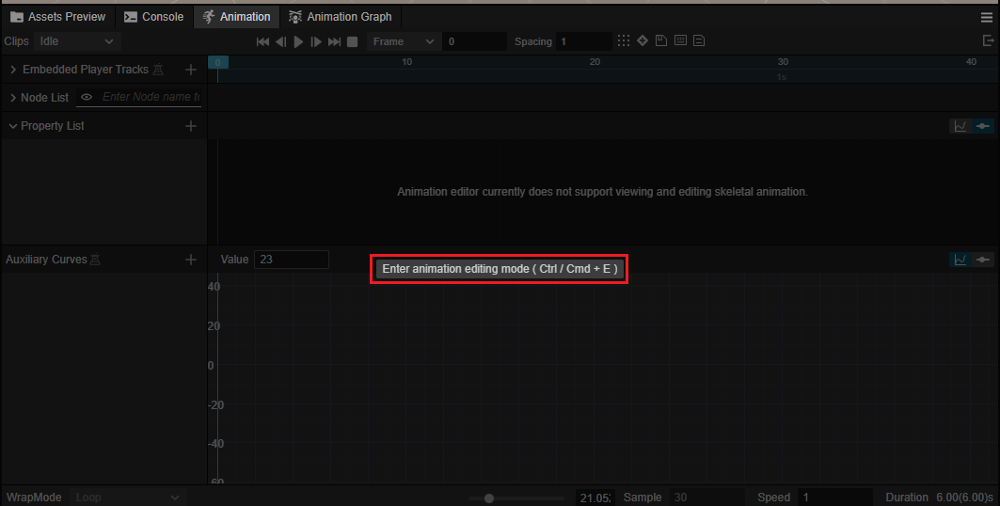
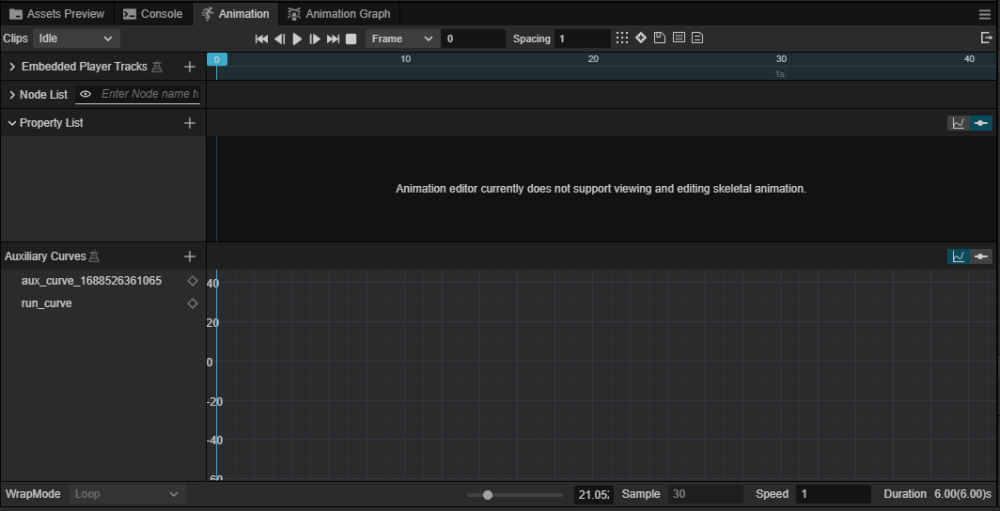
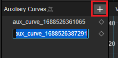
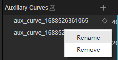
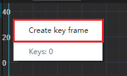
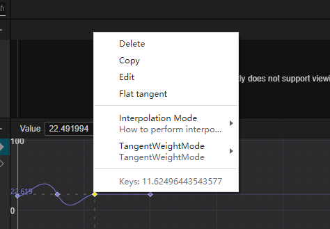
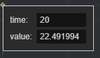
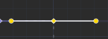

# 辅助曲线编辑视图

辅助曲线是 Cocos Creator v3.8 新增的动画辅助功能，您可以阅读 [辅助曲线](./marionette/procedural-animation/auxiliary-curve/index.md) 来了解辅助曲线的基础概念。

本节将主要介绍如何在动画编辑器中使用辅助曲线。辅助曲线编辑器是曲线编辑器的一种，曲线编辑器的基础操作可参考 [曲线编辑器](./curve-editor.md)

选中带有动画组件（Animation、SkeletalAnimation 或 AnimationController） 的节点。点击下图中的按钮进入编辑模式。

下图中的 Auxiliary Curves 部分则为辅助曲线

## 添加和删除曲线

在动画编辑器中点击辅助曲线上的 “+” 号按钮，会在当前动画中添加一条辅助曲线。

添加后辅助曲线的名称可以修改。也可以在之后通过鼠标右键点击该辅助曲线，通过弹出菜单内的重命名菜单修改。

在弹出菜单中，点击移除菜单可以删除（Remove）当前选中的辅助曲线或者重命名曲线（Rename）。

## 新建关键帧

在辅助曲线编辑器的右侧点击鼠标右键，可以添加关键帧。

创建好关键帧后，在关键帧上点击右键的弹出菜单可以调整关键帧或插值的信息。

| 菜单 | 说明 |
| :--- | :-- |
| 删除 | 删除该关键帧 |
| 复制 | 辅助关键帧，复制后在点击其他关键帧或空白处可以粘贴该关键帧的信息 |
| 粘贴 | 将之前复制的关键帧复制到鼠标点击的位置或者替换选中的关键帧的信息 |
| 编辑 | 点击后弹出框内可以修改当前关键帧所在的时间和值    
| 切线设置为水平 | 点击后，曲线在该处的切线将切换为水平模式   
| 插值模式 | 请参考 [线性插值模式](./curve-editor.md#线性插值模式) |
| 切线权重模式 | 请参考 [切线权重模式](./curve-editor.md#切线权重模式) |
