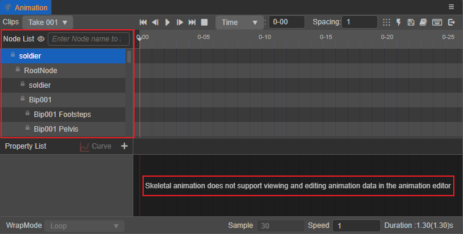

# 动画剪辑

动画剪辑（Animation Clip）是一份动画的声明数据，即包含动画数据的资源，是动画系统的核心之一。将动画剪辑挂载到 [动画组件](animation-component.md) 上，就能够将这份动画数据应用到动画组件所在的节点上。

目前 Creator 支持从外部导入动画，或者直接在 Creator 内部创建一个全新的动画剪辑。

## Creator 内部创建的动画

通过 **动画编辑器** 可以直接创建全新的动画剪辑，并进行编辑和预览，详情请参考 [使用动画编辑器](animation.md)。

也可以通过脚本创建，详情请参考 [程序化编辑动画剪辑](use-animation-curve.md)。

## 外来动画

外来动画（`.FBX` 或 `glTF`）通过 **资源管理器** 导入 Creator，这些资源中的动画数据并不由轨道表示，而是以另一种形式存储在动画剪辑中，并在运行时产生动画效果。外来动画可以让 Creator 更高效地存储、计算一些复杂的动画。

外来动画大概包括以下几种：

1. 第三方美术工具生产的骨骼动画。

2. 模型导入后附带的骨骼动画

    带动画的模型导入后，会同时导入模型中包含的动画。这个动画和内部新建资源的使用方式是一样的，骨骼动画的裁剪可以参考 [模型资源的动画模块介绍](../asset/model/mesh.md)。

更多关于骨骼动画的设置等，详情请参考 [骨骼动画](skeletal-animation.md)。

> **注意**：外来动画不支持在 **动画编辑器** 中进行编辑，各节点也是锁住状态，只能在外部美术工具中进行编辑。
>
> 
